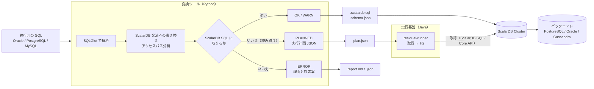
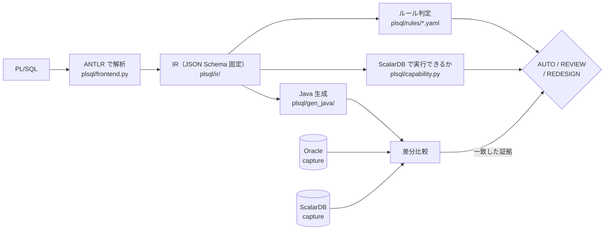

# SQL → ScalarDB SQL 移行ツール（PoC）

Oracle / PostgreSQL / MySQL の SQL を [SQLGlot](https://github.com/tobymao/sqlglot) で構文木に解析し、[ScalarDB SQL](https://scalardb.scalar-labs.com/docs/latest/scalardb-sql/grammar/) に移行するための調査用ツールです。

- ScalarDB SQL に収まる文は**変換**し、収まらない文は**理由と対応案を付けて報告**します
- ScalarDB SQL では実行できない読み取り文は、ScalarDB から行を取得してメモリ上の H2 で元の SQL を実行する**実行計画**に分解します
- 変換結果が正しいかを、移行元 DB と ScalarDB Cluster で実際に実行して**突き合わせ、性能も測ります**

**はじめての方は [はじめに](docs/guide/getting-started.md) から。** 文書の全体は [docs/README.md](docs/README.md)（読む順・用語・一覧）、
仕組みの詳細は [docs/design/architecture.md](docs/design/architecture.md)（Mermaid の図つき）にあります。

---

## 全体像



| 構成要素 | 場所 | 役割 |
|---|---|---|
| 変換ツール | `scalardb_migrate/` | 文ごとの変換、スキーマ変換、アクセスパス分析、実行計画への分解、アプリ側に移す処理の分析 |
| **PL/SQL 変換** | **`plsql/`** | **PL/SQL の解析・判定・Java 生成（下記）** |
| 実行基盤 | `runtime-java/` | 実行計画の実行（ScalarDB から取得 → H2 で元の SQL）、生成コードの実行時ヘルパ、ベンチマーク |
| **migrate-flow スキル** | `skills/migrate-flow/` | **PL/SQL / SQL の移行を、決まった順で最後まで進める Claude Code スキル**: 現行の仕様（Markdown + Mermaid）→ 承認 → 変換と人の判断 → 承認 → 変換後の仕様と「何がどう変わったか」→ 承認 → テスト。承認した人・日付・承認したときの中身の指紋を控え、そろうまでテストに進めない |
| plsql-spec スキル | `skills/plsql-spec/` | 既存の PL/SQL を調べ、いまの動作を Markdown の仕様書にまとめる Claude Code スキル。引数・表・SQL・エラーコード・trigger などの事実は IR から出し、動作と業務ルールは原文の位置つきで書き、`check` で突き合わせる |
| plsql-migrate スキル | `skills/plsql-migrate/` | PL/SQL を Java に変換し、生成コードの外で決めること（運用・呼び出し側・業務ロジックとの整合）を確認して記録する Claude Code スキル。利用者に判断を求めるときは、推奨・理由・選択肢ごとの影響・決めないとどうなるかを示してから聞く。最後に、変換後のコードの文書（アーキテクチャ・仕様・使い方・制限・どのように移行したか）を `<out>/docs/` にまとめる |
| sql-transpile スキル | `skills/sql-transpile/` | 任意の SQLGlot 方言どうし、または ScalarDB SQL への変換を行う Claude Code スキル（`scalardb_migrate/` を import せず、同梱コピーで動く） |
| 検証基盤 | `difftest/` | Docker Compose の DB 群と、差分テスト・ベンチマーク・スキルの実行検証のハーネス |

---

## できること

### SQL 文の変換（`scalardb_migrate/`）

文ごとに **OK / WARN / PLANNED / ERROR** を判定します。ScalarDB SQL にできない読み取り文（PLANNED）は、ScalarDB から行を取得して
メモリ上の H2 で元の SQL を実行する実行計画に分解し、`residual-runner` で動かします。→ [SQL の変換と実行計画](docs/guide/sql-conversion.md)

### PL/SQL → Java 変換（`plsql/`）

SQL 文単位の変換に加えて、**PL/SQL の package / procedure / trigger を Java + ScalarDB へ移す**系統が
あります。SQL 部分は上の変換ツールをそのまま使い、制御構造・例外・型を Java へ落とします。

**この系統の中心は「変換できること」ではなく「変換してよいか」の判定です。** routine ごとに
AUTO / REVIEW / REDESIGN を出し、**AUTO は「無人で生成してよい」という意味**なので、そう言えるだけの
証拠が揃ったものにしか付きません。証拠とは、**実 Oracle と実 ScalarDB で同じシナリオを走らせて結果が
一致したこと**です。



合成 corpus（29 unit / 67 routine）で、parse 率・型解決率・compile 率は 100%、AUTO 対象の意味的同等性は 100%（実 Oracle と一致）です。
プロジェクトの決定を適用した判定は AUTO 40 / REVIEW 0 / REDESIGN 27 で、REDESIGN の 27 件はすべて再設計を決定済み・実 DB で一致しています。
**数値は合成 corpus 上のものであり、実案件耐性の証拠ではありません。** コマンド、出力、現在地の詳細は → [PL/SQL → Java 変換](docs/guide/plsql-conversion.md)

### 移行の前の調査（`plsql/explorer/`）

どの PL/SQL と SQL が、どのテーブルを触り、そのテーブルが何とつながっていて、どれくらいの量があるのかを、**読むだけの 1 つの HTML** にまとめます。routine のコード（行ごとに、触るテーブル・ロック・例外・診断の印つき）、判定の中身、索引と統計、DB で動いているコードと渡された原文の食い違いも、同じ画面で見られます。
原文から分かることは解析結果から、DB にしかないこと（制約・外部キー・trigger・view・行数・統計）は、実 DB で 1 回だけ流す SELECT だけの収集スクリプトの
snapshot ファイルから読みます。誰も取っていない値は「未取得」、静的に追えない SQL は「見えていない」と出し、0 や空欄にはしません。→ [Migration Explorer](docs/guide/explorer.md)

### スキル（`skills/`、Claude Code / Codex）

仕様の調査 → 承認 → 変換と人の判断 → 承認 → 変換後の仕様 → 承認 → テストの順に移行を進める `migrate-flow` と、その各段階を受け持つ
`plsql-spec` / `plsql-migrate` / `sql-transpile` があります。Claude Code と Codex のどちらからも使え、**marketplace から入れられます**（`/plugin marketplace add wfukatsu/sql-migration` → `/plugin install sql-migration@sql-migration`、Codex は `codex plugin marketplace add wfukatsu/sql-migration` → `codex plugin add sql-migration@sql-migration`）。→ [スキル](docs/guide/skills.md)

---

## クイックスタート

```bash
python3 -m venv .venv
.venv/bin/pip install -r requirements.txt          # sqlglot / pytest / duckdb

# SQL を変換する（DB 不要）
.venv/bin/python -m scalardb_migrate.cli samples/oracle.sql --source oracle --out-dir out --plan-dir out/plans

# PL/SQL を解析して判定を見る（DB 不要）
.venv/bin/python -m plsql.cli fixtures/plsql-external/create_order/src --out-dir out/plsql-first

# テスト
.venv/bin/python -m pytest -q
```

出力の読み方、実行計画の確認（Java 17）、Java のテストは [はじめに](docs/guide/getting-started.md)、実 DB での突き合わせ（Docker と ScalarDB Cluster の
トライアルライセンス）は [検証環境](docs/guide/verification.md) にあります。

---

## ドキュメント

| 目的 | 文書 |
|---|---|
| まず動かす | [はじめに](docs/guide/getting-started.md)、[チュートリアル](docs/guide/tutorial.md)（サンプルの SQL と PL/SQL をスキルで移し、実 DB で確かめるまで） |
| SQL 文を移す | [SQL の変換と実行計画](docs/guide/sql-conversion.md)、[変換ルールと指摘コード](skills/sql-transpile/references/scalardb-grammar.md)、[方言ごとの注意](skills/sql-transpile/references/dialect-notes.md) |
| PL/SQL を移す | [PL/SQL → Java 変換](docs/guide/plsql-conversion.md)、[人が決めること（cursor / トランザクション / trigger / 生成コードの外）](docs/README.md#plsql-の移行で人が決めることplsql-migration) |
| Claude Code / Codex から進める | [スキル](docs/guide/skills.md) |
| 実 DB で確かめる | [検証環境](docs/guide/verification.md) |
| 仕組みを知る | [アーキテクチャと仕組み](docs/design/architecture.md)、[KPI・AUTO 禁止条件・確信度](docs/design/plsql-kpi.md)、[設計と決定の記録](docs/README.md#仕組みと設計design) |
| 移行の例を見る | [個別の SQL の移行例](docs/README.md#個別の-sql-の移行例examples)、[現行の仕様の例](skills/plsql-spec/examples/create_order/README.md)、[変換後の文書の例](skills/plsql-migrate/examples/create_order/README.md) |
| 測った結果を見る | [検証レポートの一覧](docs/README.md#検証レポート) |

---

## 主な検証結果

| 検証 | 結果 | 詳細 |
|---|---|---|
| 差分テスト（PostgreSQL 15 文 / Oracle 17 文） | ScalarDB SQL 経路ですべて一致（15/15、17/17） | [test-report](docs/reports/test-report.md) |
| DML テスト SQL（3 方言 × 51 文） | ScalarDB で実行できるのは 31〜32 文。書き込み 3〜6 ms（COMMIT 込み）、キーの読み取り 4〜6 ms、実行計画の読み取り 0.6 秒前後 | [dml-benchmark-report](docs/reports/dml-benchmark-report.md) |
| H2 の索引（`--h2-indexes`） | 3 表結合（2 万注文・5 万明細）が 26〜28 秒 → 1.7〜1.9 秒 | [dml-benchmark-report](docs/reports/dml-benchmark-report.md) 3.4 |
| 並列取得 | 表の並列取得は 1.2〜1.3 倍、`scan_fetch_size` 10 → 1000 で 1.5〜2.4 倍 | [dml-followup-research](docs/reports/dml-followup-research.md) |
| バックエンドの比較 | PostgreSQL と Oracle は同じ互換性。Cassandra はパーティションをまたぐ走査の制約で読める文が減る | [scalardb-backend-comparison](docs/reports/scalardb-backend-comparison.md) |

---

## リポジトリ構成

```text
scalardb_migrate/          変換ツール
  cli.py                     CLI とレポート出力
  converter.py               文ごとの解析・書き換え・アクセスパス分析・判定
  dialect.py                 ScalarDB SQL の SQLGlot 方言（文法に無い構文を出さない厳格な生成側）
  types.py                   型の対応
  schema.py                  表定義のレジストリ（DDL / Schema Loader JSON）
  decomposer.py              実行計画への分解（取得 + H2 で実行する SQL + 索引の列）
  appside.py                 アプリ側に移す処理の分析（構文の列挙・意味の注意・設計の提案・コスト）
plsql/                     PL/SQL → Java 変換
  frontend.py                ANTLR での解析（SLL → LL の 2 段構え）
  symbols.py                 シンボル表、%TYPE / %ROWTYPE の解決
  ir/                        IR の定義・JSON Schema・入出力
  lower.py                   構文木 → IR
  sqlbridge.py               IR の SQL を scalardb_migrate へ渡す（式の持ち上げ、bind の列への帰属）
  dynamic.py                 動的 SQL が実行しうる文の列挙（上限つき）
  capability.py              ScalarDB で実行できるかの検査
  rules/                     判定ルール（YAML）と確信度エンジン
  gen_java/                  Java 生成（型・DTO・例外・Service・Repository）
  review.py / kpi.py         判定レポート・トレーサビリティ・KPI 計測
  remediate.py / propose.py  モデルの助言とルール候補（どちらも自分では効力を持たない）
  limits.py                  走査行数の上限
  corpus.py                  corpus の manifest をグループとして読む（出自、証拠の独立性）。KPI がこれで数字を分ける
  anonymize/                 実案件の PL/SQL を corpus に入れるための匿名化と、匿名化の前後で解析の結論が変わらないことの確認
  explorer/                  移行の前の調査の画面（snapshot の読み込み、アプリ側 SQL、データの組み立て、1 つの HTML）
runtime-java/              実行基盤（Java 17、Gradle）
  .../runtime/               Runner・Fetcher（Core / JDBC）・Residual（H2）・Bench
  .../appside/               アプリ側で Oracle の動きを再現する補助クラス（階層、ウィンドウ関数、数値、並び順、日付）
  .../plsql/                 生成コードの実行時ヘルパ（Oracle の式の意味論）と差分ハーネス
  .../examples/              アプリ側実装の例（エリア別売上分析）
.claude-plugin/            Claude Code のプラグインと marketplace のマニフェスト（プラグイン = このリポジトリのルート）
.codex-plugin/ .agents/    Codex のプラグインのマニフェスト、marketplace（.agents/plugins/）、skills/ へのリンク（.agents/skills）
bin/python                 スキル用の Python の起動スクリプト（どの作業ディレクトリからでも動く。無ければ仮想環境を作る）
skills/                    Claude Code / Codex のスキル（どれも SKILL.md、scripts/、references/、examples/ の形）
  migrate-flow/              移行の流れ。scripts/flow.py が段階の状態・承認（人・日付・指紋）・テストの関門を持つ
  plsql-spec/                現行の PL/SQL の仕様。scripts/spec_facts.py が IR から事実の欄と Mermaid の図を出し、check で突き合わせる
  plsql-migrate/             PL/SQL の変換。scripts/decision_items.py（生成コードの外で決めることの確認・記録）、
                             scripts/migration_doc.py（変換後のコードの文書。何がどう変わったかの分類と図）
  sql-transpile/             SQL の方言変換（scalardb_migrate/ の同梱コピーで動く）
difftest/                  検証基盤（docker-compose.yml、conf/、cases/、ハーネス、experiments/）
  plsql_run.py               Oracle 側の capture
  plsql_capture.py           ScalarDB 側の capture（金額の 2 規約）
  plsql_compare.py           2 つの capture の突き合わせ
  plsql_semantics.py         実機 Oracle から式の意味論を記録する
  catalog_snapshot.py        Oracle の 1 スキーマのカタログを SELECT だけで書き出す（単一ファイル。Migration Explorer が読む）
fixtures/plsql/            PL/SQL の corpus、シナリオ、golden、判定の期待値、記録した意味論
fixtures/explorer/         Migration Explorer の fixture（FK・view・trigger を持つ小さなスキーマと、実 DB で取った 3 つの snapshot）
fixtures/plsql-external/   corpus の外から受け取った routine（KPI には入れない）。実 DB のハーネスを `--project` で向ける
samples/                   変換の入力例。tutorial/ はチュートリアルのサンプル（Oracle の SQL と PL/SQL）と、通した結果（result/）。
                           oracle-samples/ は Oracle の構文カタログ（SQL 4 本 + PL/SQL 3 本、約 1,700 行）を SQL 変換・PL/SQL 変換・実 DB 比較に通した記録（2026-09-24、README.md）
                           oracle-plsql-docs/ は Oracle PL/SQL 言語リファレンス 12c R1 の例 420 を PL/SQL 変換・実 DB 比較に通した記録（2026-09-26、README.md）
spikes/                    残りの処理を H2 / SQLite / DuckDB で実行する初期の検証
tests/                     変換ツールとスキルのテスト
docs/                      文書。入口は docs/README.md（guide/ 使い方、design/ 設計、plsql-migration/ 人が決めること、
                           examples/ 移行例、reports/ 検証レポート、slides/ 説明資料の生成元、diagrams/ draw.io の図（SQL 変換と PL/SQL 変換の構成））
```

---

## 前提と制約

- **ScalarDB SQL は ScalarDB Cluster の機能で、ライセンスが要ります。** 変換、`validate`、Core API 経路（`--fetcher core`）はライセンス無しで動きます。トライアルライセンスは `difftest/license.properties`（git 管理外）に置き、再配布しません
- **ScalarDB のバックエンド DB には直接接続しません。** 取得も書き込みも、ScalarDB（SQL / JDBC または Core API）を通します
- **パーティションをまたぐ走査は RDBMS のバックエンドでだけ使います。** Cassandra ではキーで取得し、残りはアプリ側で処理します
- 調査用の PoC です。性能の数値は Apple M3 Pro 上の Docker（1 ノードの ScalarDB Cluster、単一クライアント）での計測です
- **スキルが書く仕様書と文書は、事実の欄（IR・生成物から機械的に出す）と文章（モデルが原文と生成物を読んで書く）に分かれます。** `check` が確かめるのは文章が事実から離れていないことまでで、文章が正しいことは確かめません。承認は人が行い、`migrate-flow` は承認の無いままテストに進みません。SQL 文だけの移行には事実の欄を作る仕組みがまだ無く、検査は未記入・図の有無・変換できなかった文の記録までです。図の描画の確認には `mmdc`（mermaid-cli）を使います（無くても動きます）
- **PL/SQL 変換の KPI は合成 corpus 上の値です。** 実案件のコードでの達成を示すものではありません（実装計画 §9 の決定）。また **移行工数は測っていません**（KPI-6 を計測しないと決めたため）——AUTO 率が上がったときに移行が速くなるかは、この数値からは分かりません

---

## ライセンス

[MIT License](LICENSE)（Copyright (c) 2026 Wataru Fukatsu）

依存するソフトウェアは、それぞれのライセンスに従います。リポジトリには含めず、pip と Gradle が取得します。

| ソフトウェア | ライセンス | 用途 |
|---|---|---|
| [SQLGlot](https://github.com/tobymao/sqlglot)、DuckDB、pytest | MIT | 変換ツール・テスト |
| ScalarDB（Core）、Gson | Apache-2.0 | 実行基盤（Core API 経路） |
| ScalarDB SQL JDBC、ScalarDB Cluster Java Client SDK | Scalar Commercial License | 実行基盤の ScalarDB SQL 経路。**ScalarDB Cluster のライセンスが要ります** |
| H2 Database | MPL 2.0 / EPL 1.0 | 実行計画の残りの処理 |
| PostgreSQL JDBC | BSD-2-Clause | 検証基盤 |
| MySQL Connector/J | GPLv2 with Universal FOSS Exception | DML ベンチマークの移行元 |
| Oracle JDBC（ojdbc11） | Oracle Free Use Terms and Conditions | ベンチマークの移行元 |
| JUnit | EPL 2.0 | テスト |
