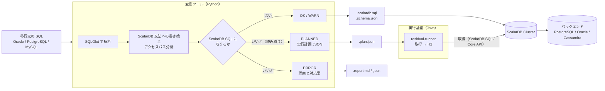
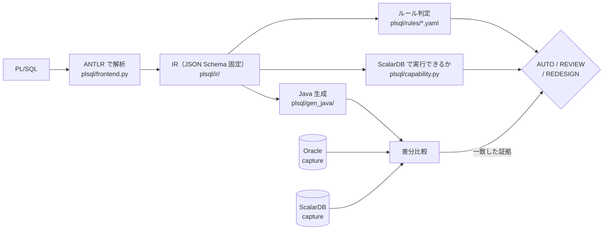
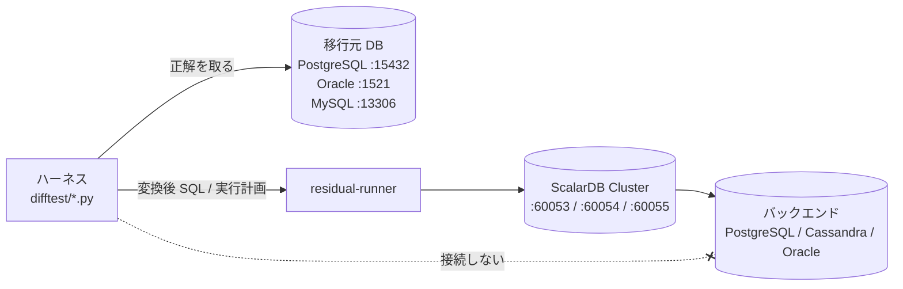

# SQL → ScalarDB SQL 移行ツール（PoC）

Oracle / PostgreSQL / MySQL の SQL を [SQLGlot](https://github.com/tobymao/sqlglot) で構文木に解析し、[ScalarDB SQL](https://scalardb.scalar-labs.com/docs/latest/scalardb-sql/grammar/) に移行するための調査用ツールです。

- ScalarDB SQL に収まる文は**変換**し、収まらない文は**理由と対応案を付けて報告**します
- ScalarDB SQL では実行できない読み取り文は、ScalarDB から行を取得してメモリ上の H2 で元の SQL を実行する**実行計画**に分解します
- 変換結果が正しいかを、移行元 DB と ScalarDB Cluster で実際に実行して**突き合わせ、性能も測ります**

仕組みの詳細は **[docs/architecture.md](docs/architecture.md)**（Mermaid の図つき）を参照してください。

---

## 全体像



| 構成要素 | 場所 | 役割 |
|---|---|---|
| 変換ツール | `scalardb_migrate/` | 文ごとの変換、スキーマ変換、アクセスパス分析、実行計画への分解、アプリ側に移す処理の分析 |
| **PL/SQL 変換** | **`plsql/`** | **PL/SQL の解析・判定・Java 生成（下記）** |
| 実行基盤 | `runtime-java/` | 実行計画の実行（ScalarDB から取得 → H2 で元の SQL）、生成コードの実行時ヘルパ、ベンチマーク |
| sql-transpile スキル | `skills/sql-transpile/` | 任意の SQLGlot 方言どうし、または ScalarDB SQL への変換を行う Claude Code スキル（`scalardb_migrate/` を import せず、同梱コピーで動く） |
| plsql-migrate スキル | `skills/plsql-migrate/` | PL/SQL を Java に変換し、生成コードの外で決めること（運用・呼び出し側・業務ロジックとの整合）を確認して記録する Claude Code スキル |
| 検証基盤 | `difftest/` | Docker Compose の DB 群と、差分テスト・ベンチマーク・スキルの実行検証のハーネス |

---

## PL/SQL → Java 変換（`plsql/`）

SQL 文単位の変換に加えて、**PL/SQL の package / procedure / trigger を Java + ScalarDB へ移す**系統が
あります。SQL 部分は上の変換ツールをそのまま使い、制御構造・例外・型を Java へ落とします。

**この系統の中心は「変換できること」ではなく「変換してよいか」の判定です。** routine ごとに
AUTO / REVIEW / REDESIGN を出し、**AUTO は「無人で生成してよい」という意味**なので、そう言えるだけの
証拠が揃ったものにしか付きません。証拠とは、**実 Oracle と実 ScalarDB で同じシナリオを走らせて結果が
一致したこと**です。



### 使い方

```bash
# 判定・レポート・トレーサビリティ
python -m plsql.cli fixtures/plsql/src --out-dir out/plsql     --evidence difftest/work/plsql-diff.json --generated generated

# Java を生成する（--limits でプロジェクトの決定を渡す。--handover は引き渡し版の見出しに替える。
# 決まると生成コードが変わるもの（REVIEW、未決定の REDESIGN）が残っていれば、--handover は何も書かずに拒否する）
python -m plsql.generate fixtures/plsql/src --out-dir generated --limits fixtures/plsql/limits.yaml

# 生成物が javac を通ることまで確かめる（JVM と Gradle が要る。落ちた routine を名指しして 1 を返す）
python -m plsql.generate fixtures/plsql/src --out-dir generated --verify-compile

# ルールが行数上限の確認を求めているのに誰も決めていない routine を挙げて止める
python -m plsql.generate fixtures/plsql/src --out-dir generated --limits fixtures/plsql/limits.yaml --limits-strict

# 差分比較（Oracle と ScalarDB の両方が要る）
python difftest/plsql_capture.py --variant scaled
python difftest/plsql_diff.py --full --json difftest/work/plsql-diff.json

# レビュー用の報告（decisions.json / unresolved.md）。--limits でプロジェクトの決定を適用し、REDESIGN の状態も出す
python -m plsql.cli fixtures/plsql/src --evidence difftest/work/plsql-diff.json --variant scaled \
    --generated generated --limits fixtures/plsql/limits.yaml --out-dir out/plsql-report

# KPI
python -m plsql.kpi --evidence difftest/work/plsql-diff.json --generated generated
```

比較結果（`--evidence`）は、**いまのソースと生成器で測ったものだけ**が数えられます。capture の時点で PL/SQL の
ソースとツールチェーン（生成器・SQL 変換器・実行時ヘルパ）のハッシュを記録し、判定のときに照らします
（`plsql/fingerprint.py`、[KPI](docs/plsql-kpi.md) の「確信度」）。ソースか生成器を変えたら、その分は
「古い証拠」として REVIEW に戻り、`decisions.json` の `staleEvidence` に理由が出ます。`plsql_capture.py` から取り直してください。

### 出力

| ファイル | 中身 |
|---|---|
| `decisions.json` | routine ごとの判定・確信度 5 因子・**どのルールがどのファイルで判定したか**・代替案・`whyNotAuto` |
| `unresolved.md` | REVIEW / REDESIGN を REDESIGN 先頭で並べ、根拠と受け入れに必要なテストを付ける |
| `traceability.csv` | 生成 Java の member → 元 PL/SQL の `file:line`（**生成ツリーと突き合わせ済み**） |
| `generated/` | Java。`Do not edit`（引き渡し後は `--handover` で文言が変わる） |

### 文書

| 文書 | 内容 |
|---|---|
| [実装計画](docs/plsql-conversion-implementation-plan.md) | フェーズとタスク、**決定事項と未決事項（§9）** |
| [KPI](docs/plsql-kpi.md) | 7 指標の定義、AUTO のしきい値、計測コマンド |
| [Phase 3 完了報告](docs/plsql-phase3-completion.md) | AUTO 対象の意味的同等性 100% 達成 |
| [Phase 4 中間報告](docs/plsql-phase4-interim.md) | 現在地。**完了条件は未達**で、残りは設計判断待ち |
| [cursor の移行パターン](docs/plsql-cursor-patterns.md) | 6 つの形と、それぞれ人が決めること |
| [トランザクションと行ロック](docs/plsql-transaction-patterns.md) | 7 つの形。**P3-4 の実測から始まる** |
| [trigger と外部副作用](docs/plsql-trigger-patterns.md) | 5 つの形。**書込経路の網羅性が先** |

### 現在地

合成 corpus（29 unit / 67 routine）に対して:

| | |
|---|---|
| parse 率・型解決率・compile 率 | **100%** |
| 判定一致 | **95.5%**（64/67。食い違う 3 件は holdout2 の期待値で、2026-09-20 の方針変更によるもの。期待値は書き換えていない） |
| **意味的同等性（AUTO 対象）** | **100%**（金額の 2 規約とも AUTO 49/49 が実 Oracle と一致） |
| 判定（2026-09-20 の実測。金額の 2 規約とも同じ） | AUTO 35 / REVIEW 5 / REDESIGN 27。プロジェクトの決定（`--limits fixtures/plsql/limits.yaml`）を適用すると AUTO 40 / REVIEW 0 / REDESIGN 27 |
| REDESIGN 27 件の状態（決定の適用後） | **27 件すべて、再設計を決定済みで実 DB でも一致** / 未決定 0。DB Link の `prc_remote_sync` は、失敗時の例外の種類の差 1 点を「受け入れた差」として記録してある（2026-09-20。比較の報告には理由つきで出る）。判定は REDESIGN のまま動かさない（AUTO 禁止条件） |

**数値は合成 corpus 上のものであり、実案件耐性の証拠ではありません。** 非 AUTO の 27 件（決定の適用後。すべて REDESIGN で、全件が再設計を決定済み・実 DB で一致）を塞いでいるのは
変換できない構文ではなく、**人が決めるべきこと**です（走査行数の上限、採番方式、トランザクション境界など。
[Phase 4 中間報告](docs/plsql-phase4-interim.md) §1）。

---

## クイックスタート

### 準備

```bash
python3 -m venv .venv
.venv/bin/pip install -r requirements.txt          # sqlglot / pytest / duckdb
.venv/bin/pip install -r requirements-difftest.txt # DB ドライバ。difftest/ のハーネスを動かすときだけ
(cd runtime-java && ./gradlew installDist)          # Java 17。実行計画を動かすときだけ
```

### SQL を変換する（DB 不要）

```bash
.venv/bin/python -m scalardb_migrate.cli samples/oracle.sql --source oracle --out-dir out --plan-dir out/plans
```

```text
[  3] OK    CREATE       CREATE INDEX idx_emp_deptno ON emp (deptno)
        INFO  INDEX: index name 'idx_emp_deptno' dropped: ScalarDB identifies indexes by table + column
        => CREATE INDEX ON emp (deptno)
[  4] ERROR CREATE       CREATE SEQUENCE emp_seq START WITH 1
        ERROR DDL: CREATE SEQUENCE is not supported (no views, sequences, triggers, procedures in ScalarDB)
[  8] PLANNED SELECT       SELECT e.ename, NVL(e.sal, 0) AS sal FROM emp e WHERE e.deptno IN (10,
        ERROR PROJECTION: main query: expressions in the select list (NVL(e.sal, 0)) -- compute them in the application
        INFO  PLAN_FETCH: CROSS_PARTITION: SELECT empno, ename, sal, deptno FROM emp WHERE (deptno = 10 OR deptno = 20 OR deptno = 30)
        INFO  PLAN_RESIDUAL: H2 Oracle mode runs the original SQL (pattern P1, H2 indexes off)
        WARN  PLAN_CROSS_PARTITION: a fetch needs a cross-partition scan
```

### 実行計画をオフラインで確かめる（DB 不要）

```bash
runtime-java/build/install/residual-runner/bin/residual-runner validate --plan out/plans/oracle.8.plan.json
```

### テスト

DB の要らないテストは CI でも回ります（`.github/workflows/ci.yml` と `.gitlab-ci.yml`、同じ内容）: pytest、同梱コピーの
一致（`vendor_sync.py --check`）、Java の単体テスト。DB の要る検証（`difftest/`）は手で回します。

```bash
.venv/bin/python -m pytest -q          # 変換ツール・PL/SQL 変換・スキル
# 実行基盤。Java のテストは生成した Java を一緒にコンパイルするので、generated/（git 管理外）が先に要る
.venv/bin/python -m plsql.generate fixtures/plsql/src --scalardb-schema fixtures/plsql/scalardb-schema.json \
    --limits fixtures/plsql/limits.yaml --out-dir generated
(cd runtime-java && ./gradlew test)
```

`runtime-java/` の依存は `gradle.lockfile` で固定しています（更新は `./gradlew dependencies --write-locks`）。ScalarDB SQL の JDBC ドライバと Cluster のクライアント SDK（商用ライセンス）、MySQL のドライバ（GPL）、Oracle のドライバ（OTN）は実行時にだけ要るので、持ち込めない環境では `./gradlew -PcoreOnly test installDist` で外せます（`gradle-core.lockfile`。Core API の取得・ローダ・残りの SQL の実行は動き、`--fetcher jdbc` と Bench は動きません）。ScalarDB Core 自身が推移的に持つドライバ（ojdbc8 など）は残ります。

---

## 使い方

### 変換ツール（`scalardb_migrate.cli`）

```bash
.venv/bin/python -m scalardb_migrate.cli <file.sql> --source oracle|postgres|mysql [options]
```

| オプション | 意味 |
|---|---|
| `--source`（`--dialect`） | 移行元の方言 |
| `--out-dir DIR` | 変換後 SQL・レポート・スキーマを書き出す |
| `--plan-dir DIR` | 読み取りの ERROR 文を実行計画に分解し、`<name>.<n>.plan.json` を書く |
| `--no-plan` | 実行計画に分解しない |
| `--schema FILE` | 既存の表定義（ScalarDB Schema Loader の JSON）。アクセスパス分析に使う |
| `--keys t=p1,p2/c1` | 表のパーティションキー / クラスタリングキーを指定する |
| `--storage jdbc\|cassandra` | ScalarDB のバックエンド。`cassandra` ではパーティションをまたぐ `ORDER BY` などを実行計画に回す |
| `--expected-rows t=N[:K]` | 表の行数（とキーあたりの行数）。取得コストの見積もりに使う |
| `--isolation` | 見積もりの前提にする分離レベル（既定 `SERIALIZABLE`） |
| `--row-limit N` | 実行計画が 1 表から取得する行数の上限（既定 10,000） |
| `--h2-indexes` | 実行計画に「H2 に索引を作る」指定を入れる（既定オフ。大きな表を結合するバッチ処理向け） |
| `--session-time-zone ZONE` | 移行元のセッションのタイムゾーン（`Asia/Tokyo`、`+09:00`）。ゾーンの無いリテラルを TIMESTAMPTZ 列に書くとき、そのゾーンの時刻として読んで UTC に直す（指定しないと UTC と仮定し、`TZ_ASSUMED_UTC` を出す） |

出力（`--out-dir`）:

| ファイル | 内容 |
|---|---|
| `<name>.scalardb.sql` | 変換後の SQL。変換できない文は `-- [NOT CONVERTED #n]` のコメントで残す |
| `<name>.report.md` / `.json` | 文ごとの判定、変換結果、指摘（重要度・コード・メッセージ）、アプリ側に移す処理 |
| `<name>.schema.json` | `CREATE TABLE` / `CREATE INDEX` から作った Schema Loader 形式のスキーマ |
| `<plan-dir>/<name>.<n>.plan.json` | 実行計画（取得の SQL、H2 で実行する SQL、ガードレール、推奨設定） |

判定:

| 判定 | 意味 | 次にやること |
|---|---|---|
| **OK** | ScalarDB SQL に変換できた | そのまま使う |
| **WARN** | 変換できたが、意味や性能に注意がある（クロスパーティション走査、精度の損失など） | 指摘を確認する |
| **PLANNED** | ScalarDB SQL にはできないが、実行計画（取得 → H2）で動かせる | 行数と応答時間を確認する |
| **ERROR** | 自動では移行できない | レポートの対応案に沿ってアプリ側で実装する |

### 実行計画を動かす（`residual-runner`）

```bash
runtime-java/build/install/residual-runner/bin/residual-runner run --plan out/plans/oracle.8.plan.json \
    --properties difftest/conf/scalardb-sql-jdbc.properties --fetcher jdbc [--h2-indexes] [--param name=value]
```

| サブコマンド | 役割 |
|---|---|
| `run` | 計画を実行し、結果を JSON で出す。`--fetcher core`（ScalarDB Core API、ライセンス不要）/ `jdbc`（ScalarDB SQL、Cluster とライセンスが要る） |
| `validate` | H2 で元の SQL をコンパイルするだけ（DB 不要） |
| `load` | JSON の行を ScalarDB Core 経由で表に入れる |
| `sql` | ScalarDB SQL を 1 文実行する |
| `bench` | 移行元 DB と ScalarDB の応答時間を同じ JVM から測る |

結果は標準出力に JSON で、ログ（ScalarDB のログを含む）は標準エラーに WARN 以上だけ出ます。詳しいログが要るときは `RESIDUAL_RUNNER_OPTS=-Dorg.slf4j.simpleLogger.defaultLogLevel=info` を付けて実行します。

### sql-transpile スキル

任意の方言どうし（SQLGlot の 32 方言）または ScalarDB SQL に変換します。素の `sqlglot.transpile()` が黙って通してしまう構文（`ROWNUM`、Oracle の外部結合 `(+)`、`CONNECT BY`、`NEXTVAL` など）を直すか、理由付きで報告します。

```bash
.venv/bin/python skills/sql-transpile/scripts/transpile.py samples/oracle.sql --source oracle --target postgres --out-dir out/transpile
.venv/bin/python skills/sql-transpile/scripts/transpile.py samples/oracle.sql --source oracle --target scalardb --out-dir out/transpile
ln -s "$PWD/skills/sql-transpile" ~/.claude/skills/sql-transpile      # Claude Code から使う
```

スキルは `scalardb_migrate/` のコピーを `scripts/_scalardb/` に同梱しています。本体を変えたら同期してください。

```bash
.venv/bin/python skills/sql-transpile/scripts/vendor_sync.py --check    # 差分があれば終了コード 1
.venv/bin/python skills/sql-transpile/scripts/vendor_sync.py --update
```

### plsql-migrate スキル

PL/SQL を `plsql.generate` で Java に変換し（コンパイルと行数上限の決定漏れまで確かめる）、生成器が決めずに
残した問い——[生成コードの外で決めること](docs/plsql-decisions-outside-generator.md) の OPS / CALL / BIZ 項目——を
生成物から拾って、利用者に確認し、決めた人と日付つきで記録します。BIZ 項目は routine ごとに「移行で何が変わるか」を
業務の言葉にし、業務文書と照らして整合を確かめます。リポジトリの中で動きます（`plsql/` を使う）。

```bash
.venv/bin/python skills/plsql-migrate/scripts/decision_items.py scan --generated out/plsql \
  --limits fixtures/plsql/limits.yaml --scalardb-schema fixtures/plsql/scalardb-schema.json \
  --record fixtures/plsql/decisions-outside-generator.yaml --write --out out/plsql/decision-items.md
ln -s "$PWD/skills/plsql-migrate" ~/.claude/skills/plsql-migrate      # Claude Code から使う
```

---

## 検証環境（`difftest/`）



ハーネスだけが移行元 DB に接続し、ScalarDB のバックエンド DB には ScalarDB 以外は接続しません。

結果集合の比較は、どのハーネスも `difftest/rowcompare.py` で行います。値はペアで比べます: 整数は桁数によらず厳密に、小数は有効 15 桁で（ScalarDB に DECIMAL が無く、`NUMBER(10,2)` は double を通って返るため）、文字列を日付として読むのは相手が日付型のときだけ、日時はミリ秒まで、真偽値は真偽値とだけ一致し、NULL は空文字と一致しません。`ORDER BY` の有無は構文木で見ます。`run.py` は、比較できた文が 1 つも無い回を終了コード 2、移行元 DB がケースを拒否した回（`CASE_ERROR`）を 1 で終えます。両側が 0 行の一致は PASS ですが、`EMPTY` として件数を出します。

移行元 DB の接続情報は、値ではなく**環境変数の名前**を書いたプロファイル（`difftest/conf/sources/<方言>-local.json`、`difftest/sources.py`）で受け取ります。既定のプロファイルは Docker Compose のコンテナを指すので、そのままで動きます。ほかの DB を使うときは `--profile oracle=path.json` か環境変数 `DIFFTEST_PROFILE_ORACLE` で指定します。プロファイルの `environment` は必須で、表の作成とデータ投入を行うハーネスは `local` / `dev` / `test` / `ci` 以外を拒否します。`environment` は人が書いたラベルにすぎないので、**解決したホストと一致することも確かめます**: `local` は localhost / 127.0.0.1 / ::1 だけ（`SRC_ORACLE_HOST` などでほかのホストを指すと拒否）、`dev` / `test` / `ci` に書き込むには、プロファイルの `hosts`（`"*.ci.example.internal"` のようなパターンの一覧）にそのホストが要ります。メッセージには接続先のホストとポートを出します（ユーザーとパスワードは出しません）。本番の移行元から正解データを一度だけ取るときは、`golden.py capture --no-setup --allow-production`（読み取り専用トランザクション）を使います。

```bash
.venv/bin/python difftest/sources.py oracle --profile oracle=my-profile.json     # 接続せずに、使われるプロファイルと可否を確認
```

```bash
# 移行元 PostgreSQL + ScalarDB のバックエンド（ライセンス不要の Core API 経路）
cd difftest && docker compose up -d source-postgres backend-postgres && cd ..
.venv/bin/python difftest/run.py difftest/cases/postgres.sql --dialect postgres --fetcher core

# ScalarDB Cluster（ScalarDB SQL 経路）。トライアルライセンスの 2 行を difftest/license.properties（git 管理外）に置く
cd difftest && ./make-cluster-conf.sh && docker compose --profile cluster --profile oracle up -d && cd ..
.venv/bin/python difftest/run.py difftest/cases/oracle.sql --dialect oracle --fetcher jdbc --restart-cluster
```

`--restart-cluster` は、表を作り直したあとに ScalarDB Cluster のノードを再起動します。直前の回が同じ表を別の型で作っていると、ノードから PostgreSQL への接続に残った prepared plan が `cached plan must not change result type` で落ちるためです（ケースを続けて回すときに付けます）。

| ハーネス | 何を確かめるか | 結果 |
|---|---|---|
| `difftest/run.py` | 移行元 DB と ScalarDB（変換後 SQL / 実行計画）の結果集合の差分 | `docs/test-report.md` |
| `difftest/bench.py` | Oracle 直接実行と ScalarDB の互換性・応答時間 | `docs/bench-report.md` |
| `difftest/bench_dml.py` | DML テスト SQL（3 方言 × 51 文）の変換と、移行元 DB 直接 vs ScalarDB Cluster | `docs/dml-benchmark-report.md` |
| `difftest/transpile_verify.py` | スキルの判定（OK / WARN / ERROR）が実際の DB での動作と合うか | `out/transpile-verify/report.md` |
| `difftest/backend_compare.sh` | ScalarDB のバックエンドを PostgreSQL / Oracle / Cassandra にしたときの互換性と性能 | `docs/scalardb-backend-comparison.md` |
| `difftest/golden.py` | アプリ側（Java）で書き直した問合せを、Oracle で一度取った正解と DB なしで比べる | — |
| `difftest/experiments/run.sh` | 並列取得・H2 の索引・書き込み計画のコスト | `docs/dml-followup-research.md` |

<details>
<summary>各ハーネスの実行例</summary>

```bash
# Oracle 直接実行との互換性・性能比較
.venv/bin/python difftest/bench.py --rows 20000 --iterations 15 --fetcher jdbc --out out/bench-jdbc

# DML テスト SQL の変換とベンチマーク（MySQL は使い捨てコンテナ）
docker run -d --name transpile-verify-mysql -e MYSQL_ROOT_PASSWORD=verify -e MYSQL_DATABASE=verify -p 13306:3306 mysql:8.4
for d in oracle postgres mysql; do
  .venv/bin/python difftest/bench_dml.py --dialect $d --restart-cluster --orders 20000 --h2-indexes --out out/dml-bench
done
.venv/bin/python difftest/bench_dml_report.py out/dml-bench

# スキルの実行検証
.venv/bin/pip install pymysql
.venv/bin/python difftest/transpile_verify.py                                   # 9 ペア
.venv/bin/python difftest/transpile_verify.py --examples-dir skills/sql-transpile/examples/dml --out-dir out/transpile-verify-dml

# バックエンドを Cassandra / Oracle にした比較
cd difftest && docker compose stop scalardb-cluster && docker compose --profile cassandra up -d && cd ..
difftest/backend_compare.sh cassandra out/cassandra-verify/after
difftest/oracle-backend-init.sh
cd difftest && docker compose --profile oracle --profile oracle-backend up -d scalardb-cluster-oracle && cd ..
difftest/backend_compare.sh oracle out/cassandra-verify/oracle-backend

# アプリ側実装の golden 比較
.venv/bin/python difftest/golden.py capture --setup difftest/golden/area-sales/setup.sql \
    --query difftest/golden/area-sales/query.sql --tables organization_master,sales_transactions --out difftest/golden/area-sales
.venv/bin/python difftest/golden.py check --golden difftest/golden/area-sales --impl com.scalar.migrate.examples.AreaSalesReport
```

</details>

---

## 主な検証結果

| 検証 | 結果 | 詳細 |
|---|---|---|
| 差分テスト（PostgreSQL 15 文 / Oracle 17 文） | ScalarDB SQL 経路ですべて一致（15/15、17/17） | `docs/test-report.md` |
| DML テスト SQL（3 方言 × 51 文） | ScalarDB で実行できるのは 31〜32 文。書き込み 3〜6 ms（COMMIT 込み）、キーの読み取り 4〜6 ms、実行計画の読み取り 0.6 秒前後 | `docs/dml-benchmark-report.md` |
| H2 の索引（`--h2-indexes`） | 3 表結合（2 万注文・5 万明細）が 26〜28 秒 → 1.7〜1.9 秒 | `docs/dml-benchmark-report.md` 3.4 |
| 並列取得 | 表の並列取得は 1.2〜1.3 倍、`scan_fetch_size` 10 → 1000 で 1.5〜2.4 倍 | `docs/dml-followup-research.md` |
| バックエンドの比較 | PostgreSQL と Oracle は同じ互換性。Cassandra はパーティションをまたぐ走査の制約で読める文が減る | `docs/scalardb-backend-comparison.md` |

---

## リポジトリ構成

```text
scalardb_migrate/          変換ツール
  cli.py                     CLI とレポート出力
  converter.py               文ごとの解析・書き換え・アクセスパス分析・判定
  dialect.py                 ScalarDB SQL の SQLGlot 方言（文法に無い構文を出さない厳格な生成側）
  types.py                   型の対応
  schema.py                  表定義のレジストリ（DDL / Schema Loader JSON）
  decomposer.py              実行計画への分解（取得 + H2 で実行する SQL + 索引の列）
  appside.py                 アプリ側に移す処理の分析（構文の列挙・意味の注意・設計の提案・コスト）
plsql/                     PL/SQL → Java 変換
  frontend.py                ANTLR での解析（SLL → LL の 2 段構え）
  symbols.py                 シンボル表、%TYPE / %ROWTYPE の解決
  ir/                        IR の定義・JSON Schema・入出力
  lower.py                   構文木 → IR
  sqlbridge.py               IR の SQL を scalardb_migrate へ渡す（式の持ち上げ、bind の列への帰属）
  dynamic.py                 動的 SQL が実行しうる文の列挙（上限つき）
  capability.py              ScalarDB で実行できるかの検査
  rules/                     判定ルール（YAML）と確信度エンジン
  gen_java/                  Java 生成（型・DTO・例外・Service・Repository）
  review.py / kpi.py         判定レポート・トレーサビリティ・KPI 計測
  remediate.py / propose.py  モデルの助言とルール候補（どちらも自分では効力を持たない）
  limits.py                  走査行数の上限
runtime-java/              実行基盤（Java 17、Gradle）
  .../runtime/               Runner・Fetcher（Core / JDBC）・Residual（H2）・Bench
  .../appside/               アプリ側で Oracle の動きを再現する補助クラス（階層、ウィンドウ関数、数値、並び順、日付）
  .../plsql/                 生成コードの実行時ヘルパ（Oracle の式の意味論）と差分ハーネス
  .../examples/              アプリ側実装の例（エリア別売上分析）
skills/sql-transpile/      Claude Code スキル（SKILL.md、scripts/、references/、examples/）
skills/plsql-migrate/      Claude Code スキル（PL/SQL の変換と、生成コードの外で決めることの確認・記録）
difftest/                  検証基盤（docker-compose.yml、conf/、cases/、ハーネス、experiments/）
  plsql_run.py               Oracle 側の capture
  plsql_capture.py           ScalarDB 側の capture（金額の 2 規約）
  plsql_compare.py           2 つの capture の突き合わせ
  plsql_semantics.py         実機 Oracle から式の意味論を記録する
fixtures/plsql/            PL/SQL の corpus、シナリオ、golden、判定の期待値、記録した意味論
samples/                   変換の入力例
spikes/                    残りの処理を H2 / SQLite / DuckDB で実行する初期の検証
tests/                     変換ツールとスキルのテスト
docs/                      設計・検証レポート・調査、slides/（説明資料の生成元）、diagrams/（draw.io の図）
```

---

## ドキュメント

| 分類 | 文書 |
|---|---|
| **PL/SQL 変換** | [実装計画](docs/plsql-conversion-implementation-plan.md)、[KPI](docs/plsql-kpi.md)、[Phase 3 完了報告](docs/plsql-phase3-completion.md)、[Phase 4 中間報告](docs/plsql-phase4-interim.md)、[cursor](docs/plsql-cursor-patterns.md) / [トランザクション](docs/plsql-transaction-patterns.md) / [trigger](docs/plsql-trigger-patterns.md) の移行パターン |
| 仕組み | [architecture.md](docs/architecture.md)（本ツールのアーキテクチャと仕組み）、[app-side-processing-plan.md](docs/app-side-processing-plan.md)（アプリ側処理の実装計画）、[diagrams/architecture.drawio](docs/diagrams/architecture.drawio) |
| 変換ルール | [skills/sql-transpile/SKILL.md](skills/sql-transpile/SKILL.md)、[references/scalardb-grammar.md](skills/sql-transpile/references/scalardb-grammar.md)、[references/dialect-notes.md](skills/sql-transpile/references/dialect-notes.md)、[references/app-side-notes.md](skills/sql-transpile/references/app-side-notes.md) |
| テスト・互換性 | [test-report.md](docs/test-report.md)、[oracle-sql-report.md](docs/oracle-sql-report.md)、[transpile-fix-research.md](docs/transpile-fix-research.md) |
| 性能 | [bench-report.md](docs/bench-report.md)、[app-side-benchmark-comparison.md](docs/app-side-benchmark-comparison.md)、[dml-benchmark-report.md](docs/dml-benchmark-report.md)、[dml-followup-research.md](docs/dml-followup-research.md) |
| 個別 SQL の移行例 | [area-sales-analysis-scalardb-conversion.md](docs/area-sales-analysis-scalardb-conversion.md)、[area-sales-analysis-performance.md](docs/area-sales-analysis-performance.md)、[sales-ranking-scalardb-conversion.md](docs/sales-ranking-scalardb-conversion.md) |
| バックエンド | [scalardb-backend-comparison.md](docs/scalardb-backend-comparison.md)、[cassandra-verification-plan.md](docs/cassandra-verification-plan.md)、[cassandra-verification-report.md](docs/cassandra-verification-report.md)、[oracle-backend-verification-plan.md](docs/oracle-backend-verification-plan.md) |

---

## 前提と制約

- **ScalarDB SQL は ScalarDB Cluster の機能で、ライセンスが要ります。** 変換、`validate`、Core API 経路（`--fetcher core`）はライセンス無しで動きます。トライアルライセンスは `difftest/license.properties`（git 管理外）に置き、再配布しません
- **ScalarDB のバックエンド DB には直接接続しません。** 取得も書き込みも、ScalarDB（SQL / JDBC または Core API）を通します
- **パーティションをまたぐ走査は RDBMS のバックエンドでだけ使います。** Cassandra ではキーで取得し、残りはアプリ側で処理します
- 調査用の PoC です。性能の数値は Apple M3 Pro 上の Docker（1 ノードの ScalarDB Cluster、単一クライアント）での計測です
- **PL/SQL 変換の KPI は合成 corpus 上の値です。** 実案件のコードでの達成を示すものではありません（実装計画 §9 の決定）。また **移行工数は測っていません**（KPI-6 を計測しないと決めたため）——AUTO 率が上がったときに移行が速くなるかは、この数値からは分かりません

---

## ライセンス

[MIT License](LICENSE)（Copyright (c) 2026 Wataru Fukatsu）

依存するソフトウェアは、それぞれのライセンスに従います。リポジトリには含めず、pip と Gradle が取得します。

| ソフトウェア | ライセンス | 用途 |
|---|---|---|
| [SQLGlot](https://github.com/tobymao/sqlglot)、DuckDB、pytest | MIT | 変換ツール・テスト |
| ScalarDB（Core）、Gson | Apache-2.0 | 実行基盤（Core API 経路） |
| ScalarDB SQL JDBC、ScalarDB Cluster Java Client SDK | Scalar Commercial License | 実行基盤の ScalarDB SQL 経路。**ScalarDB Cluster のライセンスが要ります** |
| H2 Database | MPL 2.0 / EPL 1.0 | 実行計画の残りの処理 |
| PostgreSQL JDBC | BSD-2-Clause | 検証基盤 |
| MySQL Connector/J | GPLv2 with Universal FOSS Exception | DML ベンチマークの移行元 |
| Oracle JDBC（ojdbc11） | Oracle Free Use Terms and Conditions | ベンチマークの移行元 |
| JUnit | EPL 2.0 | テスト |
