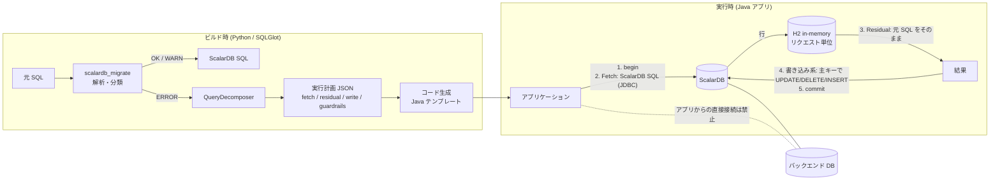

# ScalarDB 非対応 SQL のアプリケーション側処理 実装計画 (v2: H2 / sqlite3 方式)

作成日: 2026-09-10 (v2)
前提: `scalardb_migrate` (SQLGlot ベースの解析・変換 PoC) が ERROR と判定した文が対象。
v1 からの変更: 残余処理エンジンを DuckDB から **H2 in-memory (Java)** と **sqlite3 (Python)** に変更。
「バックエンド DB に直接 SQL を投げない」を全体の制約として明文化。

## 0. 全体制約

1. **データアクセスは必ず ScalarDB を経由する。** アプリケーションは ScalarDB SQL (JDBC ドライバまたは ScalarDB Cluster の SQL インターフェース) だけを使い、バックエンド DB (PostgreSQL / MySQL / Oracle / Cassandra / DynamoDB など) への接続情報を持たない。読み取り専用レプリカやレポート用途も例外にしない。バックエンドを直接読むと ScalarDB のトランザクションメタデータを迂回し、未コミットの状態が見えるため。
2. **残余処理エンジン (H2 / sqlite3) は「リクエスト単位の一時的なインメモリ作業領域」であり、データストアではない。** 永続化せず、リクエスト終了時に破棄する。
3. **1 つの残余クエリに必要な fetch はすべて同一の ScalarDB トランザクション内で行う。** 複数テーブルを取得しても一貫したスナップショットになる。
4. 分析系・大量集計は本方式の対象外とし、ScalarDB Analytics (ScalarDB 管理下のデータを Spark 経由で読む公式製品) へ振り分ける。これも ScalarDB 経由であり、制約 1 に反しない。

## 1. 基本方針: 「プッシュダウン + 残余処理」の 2 段実行

ScalarDB で実行できない文は、次の 2 段に分解して実行する。

1. **Fetch 段 (ScalarDB SQL)**: ScalarDB が実行できる最大の部分だけを投げる。対象テーブルから、パーティションキー / 主キー / セカンダリインデックスを使った `col op literal` の AND 述語で絞り、必要な基底列を取得する。
2. **Residual 段 (アプリケーション内)**: 取得した行をインメモリ SQL エンジンに投入し、残りの処理 (式の評価、関数、DISTINCT、OFFSET、サブクエリ、集約、結合、集合演算) を SQL のまま実行する。

残余処理の実装は 2 方式に分ける。

| 方式 | 対象 | 実装 | 根拠 |
|---|---|---|---|
| **A. インメモリ SQL エンジン方式** | 読み取り系 (SELECT) のほぼ全て | Java: **H2 in-memory** を移行元に合わせた互換モード (`MODE=Oracle` / `PostgreSQL` / `MySQL`) で起動し、**元の SQL を変換せずに** 実行する。Python (参照実装・テスト): **sqlite3 (標準ライブラリ)** に SQLGlot で SQLite 方言へ変換した SQL を実行する | 実験 (`spikes/h2/ResidualH2.java`、`spikes/residual_sqlite.py`) で 14 件中 12 件が正しい結果。失敗は Oracle `(+)`/`ROWNUM` (静的書き換えで解消) と日付関数 1 件 (H2: MySQL `DATE_FORMAT`、sqlite: `TO_DATE`) のみ |
| **B. パターン別テンプレート方式** | 書き込み系 (UPDATE / DELETE / INSERT / MERGE) と ID 生成 | パターンごとに「ScalarDB から読む → アプリで計算 → 主キーで ScalarDB に書く」の定型コードを生成する | ScalarDB のトランザクション (Consensus Commit) の中で読み書きを完結させないと lost update になる |

方式 A で H2 を選ぶ理由は、純 Java の jar 1 つで済み (ネイティブライブラリ不要)、互換モードにより実行時の SQL 変換が要らず、SQLGlot をビルド時の解析・分類・静的書き換えに限定できることにある。SQLGlot 同梱の `sqlglot.executor` は `UNION` と `COUNT(DISTINCT)` で誤った結果を返したため使わない。DuckDB は関数互換で僅かに優れる (13/14) が、ネイティブ依存を避けるため採用しない。

## 2. パターン分類

| ERROR コード | 元 SQL の特徴 | パターン | 方式 | 難易度 |
|---|---|---|---|---|
| PROJECTION | 射影に式・関数・CASE | P1 計算 | A | 低 |
| PRED / COL_COL | WHERE に関数適用、列同士比較 | P2 残余フィルタ | A | 低 |
| DISTINCT / AGG_DISTINCT | DISTINCT、COUNT(DISTINCT) | P3 重複排除 | A | 低 |
| OFFSET | OFFSET ページング | P4 ページング | A (少量) / キーセットページングへ書き換え (大量) | 中 |
| SUBQUERY | IN / EXISTS サブクエリ | P5 2 段クエリ | A (小規模) / 内側を先に実行して OR 展開 (大規模) | 中 |
| CTE / SET_OP | WITH、UNION | P6 複数クエリ合成 | A | 低 |
| AGG / ウィンドウ関数 | ウィンドウ関数、複雑な HAVING | P7 アプリ内集約 | A | 低 |
| JOIN_KEY / JOIN_SCOPE / JOIN | 相手テーブルのキーを覆わない結合、3 表以上 | P8 アプリ内結合 | A (両側を fetch して H2 で結合) | 中 |
| RMW | `SET c = c + 1` | P9 読み書き更新 | B | 低 |
| UPDATE_JOIN / DELETE_JOIN | 結合条件付き更新・削除 | P9 (A でキー抽出 → 主キーで書く) | A + B | 中 |
| INSERT_SELECT | `INSERT ... SELECT` | P9 (A で行を作る → INSERT バッチ) | A + B | 中 |
| MERGE (表ソース) | 表を入力にする MERGE | P9 (fetch → 行ごとに UPSERT) | A + B | 中 |
| DO_NOTHING / INSERT_IGNORE | 存在すればスキップ | P10 条件付き書き込み | B | 低 |
| SEQUENCE / AUTO_INC | 連番採番 | P11 ID 生成 | B | 中 |
| NOW | `NOW()` / `SYSDATE` | P12 アプリ時計 | B | 低 |
| ORACLE_JOIN_MARK / ROWNUM | `(+)` 外部結合、`ROWNUM` | 静的書き換え (LEFT/RIGHT JOIN、LIMIT) の後 A | 変換ツール | 低 |
| 関数互換ギャップ | H2 互換モードに無い関数 (`DATE_FORMAT` など) | 静的書き換え (H2 の同等関数へ) | 変換ツール | 中 |
| DDL (VIEW / TRIGGER / PROCEDURE) | ビュー、トリガー、ストアド | ビューは残余 SQL に展開、トリガー・ストアドはアプリロジックへ移植 | 手作業 | 高 |

## 3. アーキテクチャ



### 3.1 実行計画 JSON (変換ツールの新しい出力)

```json
{
  "statement_id": 8,
  "pattern": "P1",
  "source_dialect": "oracle",
  "source_sql": "SELECT e.ename, NVL(e.sal, 0) AS sal FROM emp e WHERE e.deptno IN (10, 20, 30)",
  "fetch": [
    {"table": "emp",
     "scalardb_sql": "SELECT ename, sal, deptno FROM emp WHERE (deptno = 10 OR deptno = 20 OR deptno = 30)",
     "columns": {"ename": "TEXT", "sal": "DOUBLE", "deptno": "INT"},
     "access_path": "INDEX_SCAN", "params": [], "max_rows": 10000}
  ],
  "residual": {
    "java":   {"engine": "h2", "mode": "Oracle", "sql": "SELECT e.ename, NVL(e.sal, 0) AS sal FROM emp e WHERE e.deptno IN (10, 20, 30)"},
    "python": {"engine": "sqlite3", "sql": "SELECT e.ename, COALESCE(e.sal, 0) AS sal FROM emp AS e WHERE e.deptno IN (10, 20, 30)"}
  },
  "write": null,
  "guardrails": {"requires_cross_partition_scan": false, "row_limit": 10000},
  "unresolved": []
}
```

`residual.java.sql` は元 SQL に静的書き換え (`(+)`、`ROWNUM`、H2 に無い関数) を施したもの。書き換えできない関数は `unresolved` に残し、手作業対象として一覧化する。

### 3.2 分解アルゴリズム (SELECT)

1. 文に現れる基底テーブルを列挙する (CTE・サブクエリの中も含む)。
2. テーブルごとに **プッシュダウン述語** を作る。WHERE を CNF に正規化し、そのテーブルの `col op literal` だけからなる AND 連言を取り出す。OR を含む項は中身がすべて同一テーブルの `col op literal` のときだけ残す。それ以外は残余に回す。
3. **取得列** はそのテーブルの列で文中のどこかに現れるものすべて。`SELECT *` はスキーマから展開する。
4. アクセスパス (GET / パーティション SCAN / インデックス SCAN / クロスパーティション SCAN) を判定し、クロスパーティションなら `guardrails.requires_cross_partition_scan = true` と行数上限を付ける。
5. 残余 SQL は Java 向けには元 SQL (静的書き換え後)、Python 向けには SQLGlot で SQLite 方言へ変換したもの。テーブル名は fetch 結果を投入するテーブル名に一致させる (スキーマ修飾は落とす)。
6. 型対応を固定する。

| ScalarDB | H2 (Java) | sqlite3 (Python) |
|---|---|---|
| BOOLEAN | BOOLEAN | INTEGER (0/1) |
| INT | INT | INTEGER |
| BIGINT | BIGINT | INTEGER |
| FLOAT | REAL | REAL |
| DOUBLE | DOUBLE PRECISION | REAL |
| TEXT | VARCHAR | TEXT |
| BLOB | BINARY VARYING | BLOB |
| DATE | DATE | TEXT (ISO 8601) |
| TIME | TIME | TEXT |
| TIMESTAMP | TIMESTAMP | TEXT |
| TIMESTAMPTZ | TIMESTAMP WITH TIME ZONE | TEXT (UTC) |

DECIMAL をスケール済み BIGINT にした列は、H2 投入時に `DECIMAL(p,s)` へ戻す (元 SQL の算術が小数を前提としているため)。

### 3.3 Java ランタイムの構造

| クラス | 役割 |
|---|---|
| `ResidualPlan` | 実行計画 JSON の読み込み (ビルド成果物としてクラスパスに同梱) |
| `ScalarDbFetcher` | ScalarDB SQL JDBC で fetch を実行。**必ず呼び出し側のトランザクション (Connection) を受け取る**。行数上限を超えたら `RowLimitExceededException` |
| `ResidualSession` | リクエストごとに `jdbc:h2:mem:<uuid>;MODE=<mode>;DATABASE_TO_UPPER=FALSE` を開き、型対応表どおりに CREATE TABLE、fetch 行を batch INSERT、残余 SQL を実行、`close()` で破棄。`try-with-resources` で使う |
| `WriteTemplates` | 方式 B のテンプレート (3.4)。主キーでの UPDATE / DELETE / INSERT / UPSERT だけを ScalarDB に発行 |
| `TxRunner` | ScalarDB トランザクションの begin / commit / rollback と、`CommitConflictException` / `CrudConflictException` の指数バックオフ付きリトライ |
| `Guardrails` | クロスパーティション走査の許可設定、行数上限、H2 のメモリ上限 (`MAX_MEMORY_ROWS` 相当) |

Python の参照実装は同じ構造を `scalardb_migrate/runtime/` に持ち、エンジンだけ sqlite3 にする。差分テストと Java 実装の正解生成に使う。

### 3.4 書き込み系のトランザクションテンプレート (方式 B)

すべて 1 つの ScalarDB トランザクション内で完結させ、競合例外はトランザクション全体をリトライする。

| パターン | テンプレート (擬似コード) |
|---|---|
| P9 RMW `UPDATE t SET c = c + 1 WHERE pk = ?` | `begin; row = SELECT c FROM t WHERE pk = ?; UPDATE t SET c = :c+1 WHERE pk = ?; commit` |
| P9 結合条件付き UPDATE / DELETE | `begin; fetch(対象表と関連表) → H2 で残余フィルタ・結合 → 主キー一覧; for k in keys: UPDATE/DELETE ... WHERE pk = k; commit` |
| P9 INSERT ... SELECT | `begin; rows = fetch + residual; INSERT ... VALUES を N 件ずつ; commit` (大量なら分割し、再実行で重複しないよう UPSERT を使う) |
| P9 表ソース MERGE | `begin; src = fetch(ソース表); for r in src: UPSERT INTO target ... VALUES (r...); commit` |
| P10 DO NOTHING / INSERT IGNORE | `try INSERT catch 重複エラー → 無視` (ScalarDB の INSERT は既存キーで失敗するため意味が保たれる) |
| P11 連番 | 推奨は UUID (TEXT)。連番必須なら `counters` テーブルを RMW でブロック採番し競合を減らす |
| P12 NOW() | アプリのクロックで `TIMESTAMPTZ` を生成してバインド |

### 3.5 ガードレール (必須)

- Fetch はパーティションキーを含む述語を原則とし、含まない場合は `scalar.db.cross_partition_scan.enabled` の有効化と行数上限を計画に明記する。非 JDBC バックエンドでのクロスパーティション走査は既定で禁止。
- 行数上限 (既定 10,000 行) を超えたら例外にし、キーセットページング (クラスタリングキーの `>` 述語 + LIMIT) に切り替える。
- H2 はリクエストごとに生成・破棄し、ヒープ上限をメトリクスで監視する。H2 の永続化 (`jdbc:h2:file:`) は使わない。
- アプリの設定ファイル・依存にバックエンド DB のドライバや接続文字列を含めない。CI で静的検査する (依存一覧と設定ファイルの grep)。

## 4. 変換ツールの拡張 (`scalardb_migrate`)

| 追加モジュール | 内容 |
|---|---|
| `decomposer.py` | 3.2 のアルゴリズム。`Result` に `plan` を追加し、新ステータス `PLANNED` を導入 |
| `residual.py` | Java 向け静的書き換え (`(+)` → LEFT JOIN、`ROWNUM` → LIMIT、関数対応表による置換) と、Python 向け SQLite 方言変換。H2 互換モードに無い関数の対応表 (`DATE_FORMAT` → `FORMATDATETIME` など) を持ち、未対応は `unresolved` に出す |
| `runtime/` (Python) | 参照実装。`run_plan(plan, scalardb_conn)` が begin → fetch → sqlite3 投入 → residual 実行 → (write テンプレート) → commit |
| `codegen/java/` | Jinja テンプレートで 3.3 のクラスと、文ごとの `Query<N>` クラスを生成 |
| `difftest/` | 差分テストハーネス (第 5 章) |

CLI に `--plan-dir` を追加し、文ごとの実行計画 JSON と生成コードを出力する。

## 5. 検証戦略

1. **差分テスト**: 同じデータを移行元 DB (Docker の PostgreSQL / MySQL / Oracle XE) と ScalarDB (JDBC バックエンド) に投入する。元 SQL を移行元で、実行計画を「ScalarDB → H2」で実行し、結果集合を比較する。ORDER BY が無い文は順序を無視する。移行元 DB への接続はテストハーネスだけが持ち、アプリコードには渡さない。
2. **関数互換の洗い出し**: H2 互換モードで失敗した関数を対応表に追加し、対応できないものは手作業リストに載せる。sqlite3 側も同様。
3. **並行性テスト**: P9 RMW を複数スレッドで同時実行し、lost update が起きないこと、リトライで収束することを確認する。
4. **性能・メモリテスト**: fetch 行数、H2 投入時間、ヒープ使用量、レイテンシを計画ごとに記録し、行数上限とページング閾値を決める。
5. **制約 1 の検査**: アプリの依存とプロパティにバックエンド DB ドライバ・接続文字列が無いことを CI で確認する。

## 6. フェーズと成果物

| フェーズ | 期間 (目安) | 内容 | 成果物 |
|---|---|---|---|
| 1. 設計確定 | 1〜2 週 | パターン表の確定、実行計画 JSON スキーマ、ScalarDB SQL JDBC と H2 を同一 JVM で動かすスパイク (トランザクション内 fetch、メモリ計測)、H2 互換モードの関数ギャップ一覧 | 設計書、スパイク結果、関数対応表 v0 |
| 2. 読み取り系 | 2〜3 週 | `decomposer.py` / `residual.py` / Python 参照ランタイム (sqlite3)、差分テストハーネス | ERROR 文の読み取り系を PLANNED に変換できる CLI |
| 3. Java ランタイムと書き込み系 | 3 週 | 3.3 のクラス群、3.4 のテンプレート、リトライ、コード生成 | Java ライブラリと並行性テスト |
| 4. パイロット | 2 週 | 実案件の SQL (クエリログ / MyBatis XML) を全文通し、ホットパスはキー設計変更で ScalarDB ネイティブに戻す | 移行工数見積り、性能レポート |
| 5. 仕上げ | 1〜2 週 | ガードレール、メトリクス (fetch 行数、H2 ヒープ、リトライ回数)、運用ドキュメント | v1.0 |

## 7. リスクと対策

| リスク | 対策 |
|---|---|
| Fetch がテーブル全体を取り込む | パーティションキー必須、行数上限、キーセットページング、分析系は ScalarDB Analytics へ |
| H2 互換モードと移行元 DB の関数意味差 | 差分テストを CI に組み込み、関数対応表と許容差リストを維持 |
| H2 のヒープ消費 | リクエスト単位で破棄、行数上限、ヒープ監視。超えるクエリはキー設計変更の対象にする |
| 非 JDBC バックエンドでのクロスパーティション走査の一貫性 | 既定で禁止。必要なら JDBC バックエンド限定 |
| 書き込み競合によるリトライ増加 | ブロック採番、ホットキー分散、トランザクション粒度の縮小 |
| 「性能のために直接バックエンドを読みたい」という逸脱 | 制約 1 を設計原則として文書化し、CI の静的検査と ScalarDB Analytics への誘導で防ぐ |
| Python (sqlite3) と Java (H2) で結果が食い違う | Java を正とし、Python は差分テストの補助に限定。食い違いは関数対応表に反映 |

## 8. 最初に着手する作業

1. `spikes/h2/ResidualH2.java` を拡張し、ScalarDB SQL JDBC (`scalardb-sql-jdbc`) からのトランザクション内 fetch → H2 投入 → 残余実行を同一 JVM で通す。
2. `decomposer.py` を実装し、`samples/*.sql` の ERROR 文 21 件のうち読み取り系 10 件 (射影の式 3、サブクエリ・CTE 2、DISTINCT 1、OFFSET 2、WHERE の関数 1、Oracle `(+)` 1) を PLANNED にする。
3. PostgreSQL バックエンドの ScalarDB を Docker で立て、差分テストハーネスの最小版を作る。
