# アーキテクチャと仕組み

SQL → ScalarDB SQL 移行ツールの構成と、変換・実行計画・実行基盤・検証基盤の仕組みを図でまとめる。使い方は [README](../README.md)、変換ルールの一覧は [scalardb-grammar.md](../skills/sql-transpile/references/scalardb-grammar.md) を参照。

## 目次

1. [設計方針](#1-設計方針)
2. [システム全体](#2-システム全体)
3. [コンポーネント](#3-コンポーネント)
4. [変換パイプライン](#4-変換パイプライン)
5. [アクセスパス分析](#5-アクセスパス分析)
6. [実行計画（取得 + H2）](#6-実行計画取得--h2)
7. [実行基盤（runtime-java）](#7-実行基盤runtime-java)
8. [アプリ側に移す処理の分析](#8-アプリ側に移す処理の分析)
9. [書き込み文の扱い](#9-書き込み文の扱い)
10. [sql-transpile スキル](#10-sql-transpile-スキル)
11. [検証基盤（difftest）](#11-検証基盤difftest)
12. [トランザクションと整合性](#12-トランザクションと整合性)
13. [性能の特性](#13-性能の特性)

---

## 1. 設計方針

| 方針 | 理由 | 実装 |
|---|---|---|
| **構文木で変換する** | 文字列置換では、コメント・文字列リテラル・入れ子の構文を正しく扱えない | SQLGlot で移行元の方言として解析し、構文木を書き換える |
| **ScalarDB に無い構文は出さない** | 変換漏れを「黙って通る SQL」ではなく「エラー」として見えるようにする | ScalarDB 方言の生成側（`dialect.py`）が、文法に無い構文で例外を出す |
| **変換できない理由を全部挙げる** | 移行の見積もりには、最初の 1 つではなく作業の全量が要る | `appside.inventory()` が文全体（CTE・副問合せを含む）を調べる |
| **読み取りは元の SQL をそのまま実行する** | 意味（NULL の扱い、丸め、並び順）を書き直すと、結果が変わりやすい | 取得した行を H2 の互換モードに入れ、元の SQL を実行する |
| **ScalarDB のバックエンドに直接つながない** | ScalarDB のトランザクションとメタデータを迂回しない | 取得・投入はすべて ScalarDB SQL / Core API。ハーネスだけが移行元 DB に接続する |
| **実データで確かめる** | 変換ツールの判定だけでは、型・リテラル・照合順序の差を見逃す | 移行元 DB と ScalarDB Cluster で同じ文を実行し、結果集合と応答時間を比べる |

---

## 2. システム全体

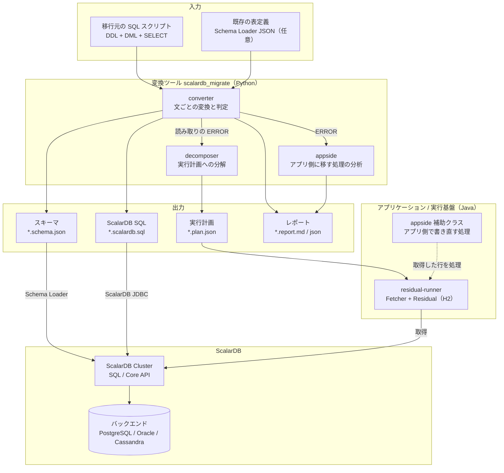
```mermaid
flowchart TB
    subgraph IN["入力"]
        SQL["移行元の SQL スクリプト<br/>DDL + DML + SELECT"]
        SCH["既存の表定義<br/>Schema Loader JSON（任意）"]
    end

    subgraph TOOL["変換ツール scalardb_migrate（Python）"]
        CONV["converter<br/>文ごとの変換と判定"]
        DEC["decomposer<br/>実行計画への分解"]
        APP["appside<br/>アプリ側に移す処理の分析"]
    end

    subgraph OUT["出力"]
        OSQL["ScalarDB SQL<br/>*.scalardb.sql"]
        OSCH["スキーマ<br/>*.schema.json"]
        OPLAN["実行計画<br/>*.plan.json"]
        OREP["レポート<br/>*.report.md / json"]
    end

    subgraph RUNTIME["アプリケーション / 実行基盤（Java）"]
        RR["residual-runner<br/>Fetcher + Residual（H2）"]
        HELP["appside 補助クラス<br/>アプリ側で書き直す処理"]
    end

    subgraph SCALAR["ScalarDB"]
        CL["ScalarDB Cluster<br/>SQL / Core API"]
        BE[("バックエンド<br/>PostgreSQL / Oracle / Cassandra")]
    end

    SQL --> CONV
    SCH --> CONV
    CONV --> OSQL
    CONV --> OSCH
    CONV --> OREP
    CONV -- "読み取りの ERROR" --> DEC
    CONV -- "ERROR" --> APP
    DEC --> OPLAN
    APP --> OREP
    OSCH -- "Schema Loader" --> CL
    OSQL -- "ScalarDB JDBC" --> CL
    OPLAN --> RR
    RR -- "取得" --> CL
    HELP -. "取得した行を処理" .-> RR
    CL --> BE
```

移行する SQL は、次の 3 つの経路のどれかで ScalarDB 上で動く。

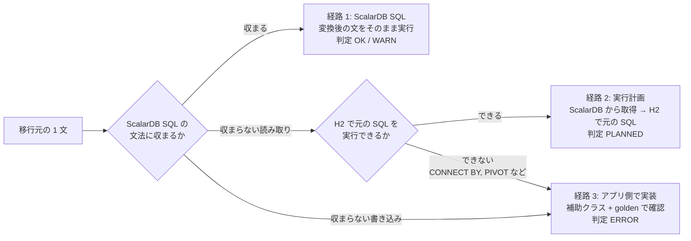
```mermaid
flowchart LR
    S["移行元の 1 文"] --> Q{"ScalarDB SQL の<br/>文法に収まるか"}
    Q -- 収まる --> A["経路 1: ScalarDB SQL<br/>変換後の文をそのまま実行<br/>判定 OK / WARN"]
    Q -- "収まらない読み取り" --> H{"H2 で元の SQL を<br/>実行できるか"}
    H -- できる --> B["経路 2: 実行計画<br/>ScalarDB から取得 → H2 で元の SQL<br/>判定 PLANNED"]
    H -- "できない<br/>CONNECT BY, PIVOT など" --> C["経路 3: アプリ側で実装<br/>補助クラス + golden で確認<br/>判定 ERROR"]
    Q -- "収まらない書き込み" --> C
```

---

## 3. コンポーネント

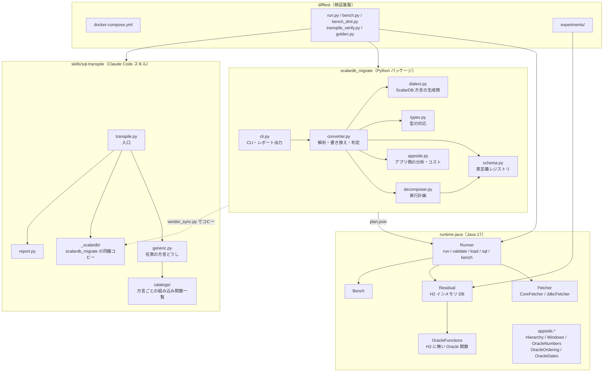
```mermaid
flowchart TB
    subgraph PY["scalardb_migrate（Python パッケージ）"]
        CLI["cli.py<br/>CLI・レポート出力"]
        CONV["converter.py<br/>解析・書き換え・判定"]
        DIA["dialect.py<br/>ScalarDB 方言の生成側"]
        TYP["types.py<br/>型の対応"]
        SCM["schema.py<br/>表定義レジストリ"]
        DEC["decomposer.py<br/>実行計画"]
        APS["appside.py<br/>アプリ側の分析・コスト"]
        CLI --> CONV
        CONV --> DIA
        CONV --> TYP
        CONV --> SCM
        CONV --> DEC
        CONV --> APS
        DEC --> SCM
    end

    subgraph SK["skills/sql-transpile（Claude Code スキル）"]
        TR["transpile.py<br/>入口"]
        GEN["generic.py<br/>任意の方言どうし"]
        RP["report.py"]
        VEN["_scalardb/<br/>scalardb_migrate の同梱コピー"]
        CAT["catalogs/<br/>方言ごとの組み込み関数一覧"]
        TR --> GEN
        TR --> VEN
        TR --> RP
        GEN --> CAT
    end

    subgraph JV["runtime-java（Java 17）"]
        RUN["Runner<br/>run / validate / load / sql / bench"]
        FET["Fetcher<br/>CoreFetcher / JdbcFetcher"]
        RES["Residual<br/>H2 インメモリ DB"]
        BEN["Bench"]
        ORF["OracleFunctions<br/>H2 に無い Oracle 関数"]
        HLP["appside.*<br/>Hierarchy / Windows / OracleNumbers<br/>OracleOrdering / OracleDates"]
        RUN --> FET
        RUN --> RES
        RUN --> BEN
        RES --> ORF
    end

    subgraph DT["difftest（検証基盤）"]
        DC["docker-compose.yml"]
        HAR["run.py / bench.py / bench_dml.py<br/>transpile_verify.py / golden.py"]
        EXP["experiments/"]
    end

    PY -. "vendor_sync.py でコピー" .-> VEN
    PY -- "plan.json" --> RUN
    HAR --> PY
    HAR --> SK
    HAR --> RUN
    EXP --> RES
```

| モジュール | 主な責務 | 入力 → 出力 |
|---|---|---|
| `converter.py` | 文の種類ごとの書き換え、制約の検査、アクセスパス分析、判定 | SQL の 1 文 → `Result`（判定、変換後 SQL、指摘、計画） |
| `dialect.py` | ScalarDB SQL の文法だけを生成する SQLGlot 方言 | 構文木 → ScalarDB SQL（文法外は例外） |
| `types.py` | 移行元の型 → ScalarDB の 11 型、精度の警告 | 型 → 型 + 指摘 |
| `schema.py` | パーティションキー・クラスタリングキー・インデックスの管理 | DDL / Schema Loader JSON → `TableMeta` |
| `decomposer.py` | 読み取り文を取得と残りの SQL に分ける | 構文木 → `Plan`（JSON） |
| `appside.py` | アプリ側に移す構文、H2 で動かない構文、意味の注意、設計の提案、コスト | 構文木 → 指摘 |
| `Runner` / `Bench` | 計画の実行、ベンチマーク | plan.json → 結果 JSON |
| `Fetcher` | ScalarDB からの取得（1 トランザクション） | 取得の指定 → 行 |
| `Residual` | H2 への投入、索引（任意）、元の SQL の実行 | 行 + SQL → 結果 |

---

## 4. 変換パイプライン

### 4.1 1 文の処理

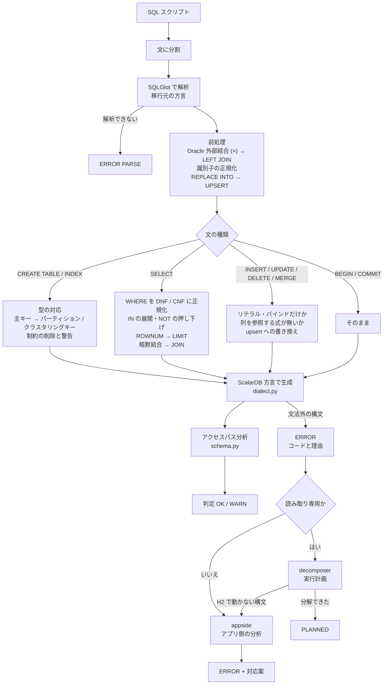
```mermaid
flowchart TD
    A["SQL スクリプト"] --> B["文に分割"]
    B --> C["SQLGlot で解析<br/>移行元の方言"]
    C -- "解析できない" --> PE["ERROR PARSE"]
    C --> D["前処理<br/>Oracle 外部結合 (+) → LEFT JOIN<br/>識別子の正規化<br/>REPLACE INTO → UPSERT"]
    D --> E{"文の種類"}
    E -- "CREATE TABLE / INDEX" --> T["型の対応<br/>主キー → パーティション / クラスタリングキー<br/>制約の削除と警告"]
    E -- SELECT --> S["WHERE を DNF / CNF に正規化<br/>IN の展開・NOT の押し下げ<br/>ROWNUM → LIMIT<br/>暗黙結合 → JOIN"]
    E -- "INSERT / UPDATE / DELETE / MERGE" --> W["リテラル・バインドだけか<br/>列を参照する式が無いか<br/>upsert への書き換え"]
    E -- "BEGIN / COMMIT" --> X["そのまま"]
    T --> G["ScalarDB 方言で生成<br/>dialect.py"]
    S --> G
    W --> G
    X --> G
    G -- "文法外の構文" --> U["ERROR<br/>コードと理由"]
    G --> AP["アクセスパス分析<br/>schema.py"]
    AP --> J["判定 OK / WARN"]
    U --> K{"読み取り専用か"}
    K -- はい --> DP["decomposer<br/>実行計画"]
    K -- いいえ --> AS["appside<br/>アプリ側の分析"]
    DP -- "分解できた" --> PL["PLANNED"]
    DP -- "H2 で動かない構文" --> AS
    AS --> ER["ERROR + 対応案"]
```

### 4.2 判定の決まり方

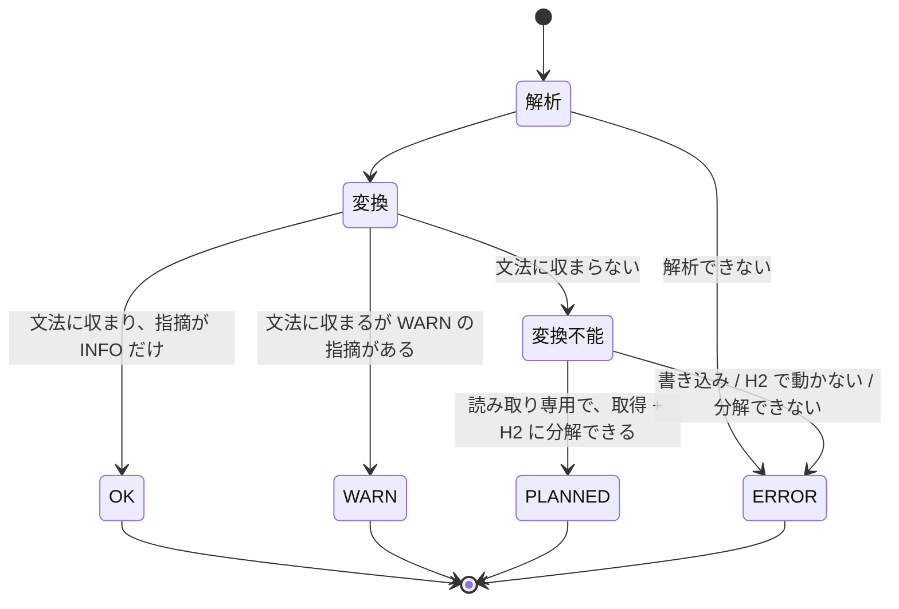
```mermaid
stateDiagram-v2
    [*] --> 解析
    解析 --> ERROR: 解析できない
    解析 --> 変換
    変換 --> OK: 文法に収まり、指摘が INFO だけ
    変換 --> WARN: 文法に収まるが WARN の指摘がある
    変換 --> 変換不能: 文法に収まらない
    変換不能 --> PLANNED: 読み取り専用で、取得 + H2 に分解できる
    変換不能 --> ERROR: 書き込み / H2 で動かない / 分解できない
    OK --> [*]
    WARN --> [*]
    PLANNED --> [*]
    ERROR --> [*]
```

### 4.3 主な書き換えルール

| 移行元の構文 | ScalarDB SQL |
|---|---|
| `IN (a, b, c)` / `NOT IN` | `(col = a OR col = b OR col = c)` / `col <> a AND col <> b` |
| `NOT (a = 1)` | `a <> 1`（比較演算子を反転して押し下げ） |
| 任意の AND / OR のネスト | DNF か CNF の短いほうに正規化 |
| `10 < col` | `col > 10` |
| `ROWNUM <= n` / `FETCH FIRST n ROWS ONLY` | `LIMIT n` |
| `FROM a, b WHERE a.x = b.y` / `a.x = b.y(+)` | `INNER JOIN` / `LEFT JOIN` |
| `ON CONFLICT DO UPDATE` / `ON DUPLICATE KEY UPDATE` / `REPLACE INTO` / 定数の `MERGE` | `UPSERT INTO`（意味の差を WARN） |
| `NUMBER(p)` / `NUMBER(p, s)` / `VARCHAR2(n)` | `INT`・`BIGINT` / `DOUBLE`（精度の WARN） / `TEXT` |
| 複合主キー | 先頭列がパーティションキー、残りがクラスタリングキー（`--keys` で変更） |

変換できない主な構文: 射影の式・関数、副問合せ、CTE、UNION、ウィンドウ関数、DISTINCT、OFFSET、列を参照する UPDATE、`INSERT ... SELECT`、採番、ビュー・トリガー。全体は [scalardb-grammar.md](../skills/sql-transpile/references/scalardb-grammar.md)。

---

## 5. アクセスパス分析

表定義（入力の DDL か `--schema`）が分かると、SELECT / UPDATE / DELETE ごとに、ScalarDB がどう読むかを判定する。

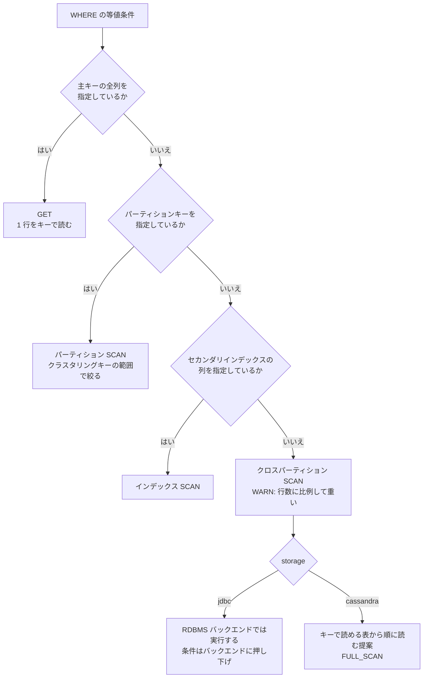
```mermaid
flowchart TD
    A["WHERE の等値条件"] --> B{"主キーの全列を<br/>指定しているか"}
    B -- はい --> GET["GET<br/>1 行をキーで読む"]
    B -- いいえ --> C{"パーティションキーを<br/>指定しているか"}
    C -- はい --> PS["パーティション SCAN<br/>クラスタリングキーの範囲で絞る"]
    C -- いいえ --> D{"セカンダリインデックスの<br/>列を指定しているか"}
    D -- はい --> IS["インデックス SCAN"]
    D -- いいえ --> CP["クロスパーティション SCAN<br/>WARN: 行数に比例して重い"]
    CP --> E{"storage"}
    E -- jdbc --> OKCP["RDBMS バックエンドでは実行する<br/>条件はバックエンドに押し下げ"]
    E -- cassandra --> NG["キーで読める表から順に読む提案<br/>FULL_SCAN"]
```

結合は、ON の条件が相手の表の主キーかセカンダリインデックスを覆っているかも検査する。

---

## 6. 実行計画（取得 + H2）

### 6.1 考え方

ScalarDB SQL で実行できない読み取り文を、「ScalarDB で絞れるだけ絞って取得する部分」と「取得した行に元の SQL を実行する部分」に分ける。

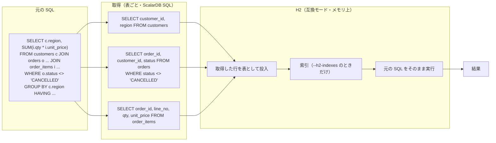
```mermaid
flowchart LR
    subgraph ORIG["元の SQL"]
        O["SELECT c.region, SUM(i.qty * i.unit_price)<br/>FROM customers c JOIN orders o ... JOIN order_items i ...<br/>WHERE o.status &lt;&gt; 'CANCELLED'<br/>GROUP BY c.region HAVING ..."]
    end

    subgraph FETCH["取得（表ごと・ScalarDB SQL）"]
        F1["SELECT customer_id, region FROM customers"]
        F2["SELECT order_id, customer_id, status FROM orders<br/>WHERE status &lt;&gt; 'CANCELLED'"]
        F3["SELECT order_id, line_no, qty, unit_price FROM order_items"]
    end

    subgraph H2["H2（互換モード・メモリ上）"]
        L["取得した行を表として投入"]
        IX["索引（--h2-indexes のときだけ）"]
        R["元の SQL をそのまま実行"]
        L --> IX --> R
    end

    O --> F1
    O --> F2
    O --> F3
    F1 --> L
    F2 --> L
    F3 --> L
    R --> RES["結果"]
```

- **取得**は、表ごとに ScalarDB で評価できる条件（`列 演算子 リテラル` とその AND / OR）と、文が使う列だけを読む。WITH の中の日付リテラルも押し下げる
- **H2** は移行元の方言の互換モード（`MODE=Oracle|PostgreSQL|MySQL`）で、元の SQL を実行する。H2 に無い Oracle 関数は `OracleFunctions` で補う
- H2 で実行できない構文（`CONNECT BY`、`ROLLUP` / `CUBE` / `GROUPING SETS`、`PIVOT` / `UNPIVOT`、`KEEP`）を含む文は計画にしない（`RESIDUAL_H2`）

### 6.2 計画 JSON の構造

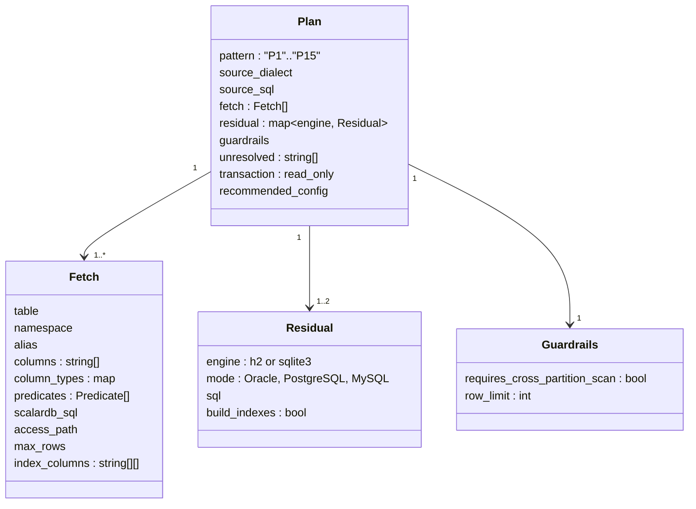
```mermaid
classDiagram
    class Plan {
        pattern : "P1".."P15"
        source_dialect
        source_sql
        fetch : Fetch[]
        residual : map~engine, Residual~
        guardrails
        unresolved : string[]
        transaction : read_only
        recommended_config
    }
    class Fetch {
        table
        namespace
        alias
        columns : string[]
        column_types : map
        predicates : Predicate[]
        scalardb_sql
        access_path
        max_rows
        index_columns : string[][]
    }
    class Residual {
        engine : h2 or sqlite3
        mode : Oracle, PostgreSQL, MySQL
        sql
        build_indexes : bool
    }
    class Guardrails {
        requires_cross_partition_scan : bool
        row_limit : int
    }
    Plan "1" --> "1..*" Fetch
    Plan "1" --> "1..2" Residual
    Plan "1" --> "1" Guardrails
```

例（S05: 明細の無い注文を探す反結合、抜粋）:

```json
{
  "pattern": "P8",
  "fetch": [
    {"table": "orders", "columns": ["order_id"], "scalardb_sql": "SELECT order_id FROM orders",
     "access_path": "CROSS_PARTITION", "max_rows": 10000, "index_columns": [["order_id"]]},
    {"table": "order_items", "columns": ["order_id", "line_no"],
     "scalardb_sql": "SELECT order_id, line_no FROM order_items", "access_path": "CROSS_PARTITION",
     "max_rows": 10000, "index_columns": [["order_id", "line_no"]]}
  ],
  "residual": {"java": {"engine": "h2", "mode": "Oracle", "build_indexes": false,
    "sql": "SELECT o.order_id FROM orders o LEFT JOIN order_items i ON i.order_id = o.order_id WHERE i.order_id IS NULL ORDER BY o.order_id NULLS LAST"}},
  "guardrails": {"requires_cross_partition_scan": true, "row_limit": 10000},
  "transaction": {"read_only": true},
  "recommended_config": {"scalar.db.scan_fetch_size": 1000}
}
```

`pattern` は ScalarDB SQL に収まらなかった理由の分類:

| パターン | 理由 | パターン | 理由 |
|---|---|---|---|
| P1 | 射影の式・関数 | P7 | 集約 |
| P2 | WHERE の式・列どうしの比較 | P8 | 結合（キーを覆わない ON、外部結合など） |
| P3 | DISTINCT | P13 | ストレージが実行できない ORDER BY |
| P4 | OFFSET | P14 | キーの OR / IN |
| P5 | 副問合せ | P15 | クロスパーティション走査を使えない |
| P6 | CTE・集合演算 | | |

---

## 7. 実行基盤（runtime-java）

### 7.1 クラス構成

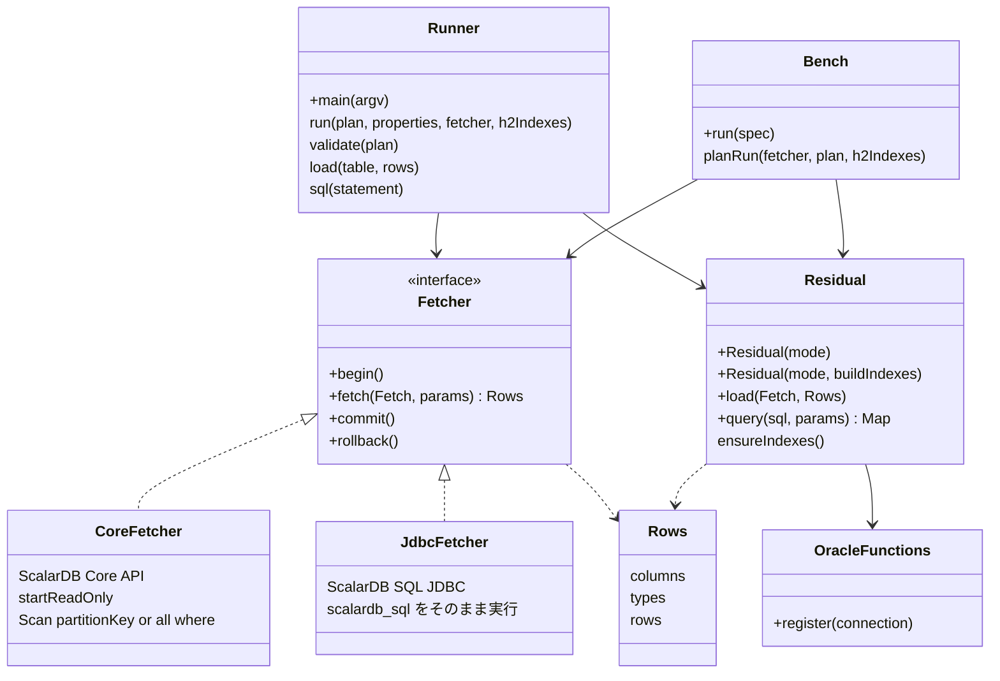
```mermaid
classDiagram
    class Runner {
        +main(argv)
        run(plan, properties, fetcher, h2Indexes)
        validate(plan)
        load(table, rows)
        sql(statement)
    }
    class Fetcher {
        <<interface>>
        +begin()
        +fetch(Fetch, params) Rows
        +commit()
        +rollback()
    }
    class CoreFetcher {
        ScalarDB Core API
        startReadOnly
        Scan partitionKey or all where
    }
    class JdbcFetcher {
        ScalarDB SQL JDBC
        scalardb_sql をそのまま実行
    }
    class Residual {
        +Residual(mode)
        +Residual(mode, buildIndexes)
        +load(Fetch, Rows)
        +query(sql, params) Map
        ensureIndexes()
    }
    class OracleFunctions {
        +register(connection)
    }
    class Bench {
        +run(spec)
        planRun(fetcher, plan, h2Indexes)
    }
    class Rows {
        columns
        types
        rows
    }
    Fetcher <|.. CoreFetcher
    Fetcher <|.. JdbcFetcher
    Runner --> Fetcher
    Runner --> Residual
    Bench --> Fetcher
    Bench --> Residual
    Residual --> OracleFunctions
    Fetcher ..> Rows
    Residual ..> Rows
```

| Fetcher | 経路 | ライセンス | 用途 |
|---|---|---|---|
| `CoreFetcher` | ScalarDB Core API（`Scan`、読み取り専用トランザクション） | 不要 | 開発・差分テスト |
| `JdbcFetcher` | ScalarDB SQL の JDBC（ScalarDB Cluster） | 要 | 本番想定の経路・ベンチマーク |

### 7.2 計画の実行

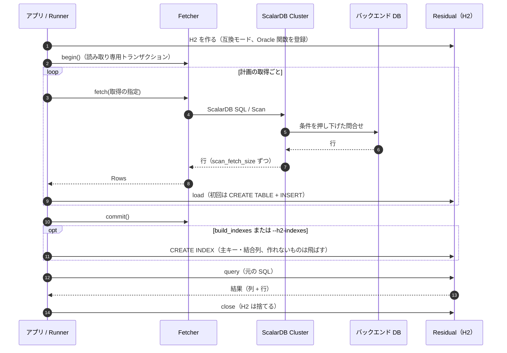
```mermaid
sequenceDiagram
    autonumber
    participant App as アプリ / Runner
    participant F as Fetcher
    participant C as ScalarDB Cluster
    participant B as バックエンド DB
    participant H as Residual（H2）

    App->>H: H2 を作る（互換モード、Oracle 関数を登録）
    App->>F: begin()（読み取り専用トランザクション）
    loop 計画の取得ごと
        App->>F: fetch(取得の指定)
        F->>C: ScalarDB SQL / Scan
        C->>B: 条件を押し下げた問合せ
        B-->>C: 行
        C-->>F: 行（scan_fetch_size ずつ）
        F-->>App: Rows
        App->>H: load（初回は CREATE TABLE + INSERT）
    end
    App->>F: commit()
    opt build_indexes または --h2-indexes
        App->>H: CREATE INDEX（主キー・結合列、作れないものは飛ばす）
    end
    App->>H: query（元の SQL）
    H-->>App: 結果（列 + 行）
    App->>H: close（H2 は捨てる）
```

- 1 つの計画の取得は、すべて **1 つの ScalarDB トランザクション**で行う。表ごとの結果が同じ時点のデータになる
- H2 は**要求ごとに作って捨てる**。永続化しない
- 取得の行数が `max_rows` を超えると `RowLimitExceededException` で止める

### 7.3 H2 の索引（オプション）

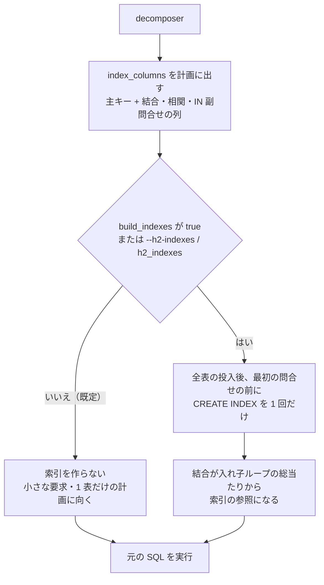
```mermaid
flowchart TD
    A["decomposer"] --> B["index_columns を計画に出す<br/>主キー + 結合・相関・IN 副問合せの列"]
    B --> C{"build_indexes が true<br/>または --h2-indexes / h2_indexes"}
    C -- "いいえ（既定）" --> N["索引を作らない<br/>小さな要求・1 表だけの計画に向く"]
    C -- はい --> Y["全表の投入後、最初の問合せの前に<br/>CREATE INDEX を 1 回だけ"]
    Y --> Y2["結合が入れ子ループの総当たりから<br/>索引の参照になる"]
    N --> Q["元の SQL を実行"]
    Y2 --> Q
```

| | 索引なし（既定） | 索引あり |
|---|---|---|
| 向く処理 | オンラインの小さな要求、1 表だけの集約・並べ替え | 数万行以上の表を結合するバッチ処理 |
| 3 表結合（2 万注文・5 万明細） | 26〜28 秒 | 1.7〜1.9 秒 |
| 1 表の集約（100 万行規模） | 基準 | 構築の分だけ +19〜50% |
| H2 のメモリ | 基準 | 約 1.6 倍 |

---

## 8. アプリ側に移す処理の分析

ERROR の読み取り文には、`appside.py` が文全体を調べた結果が付く。

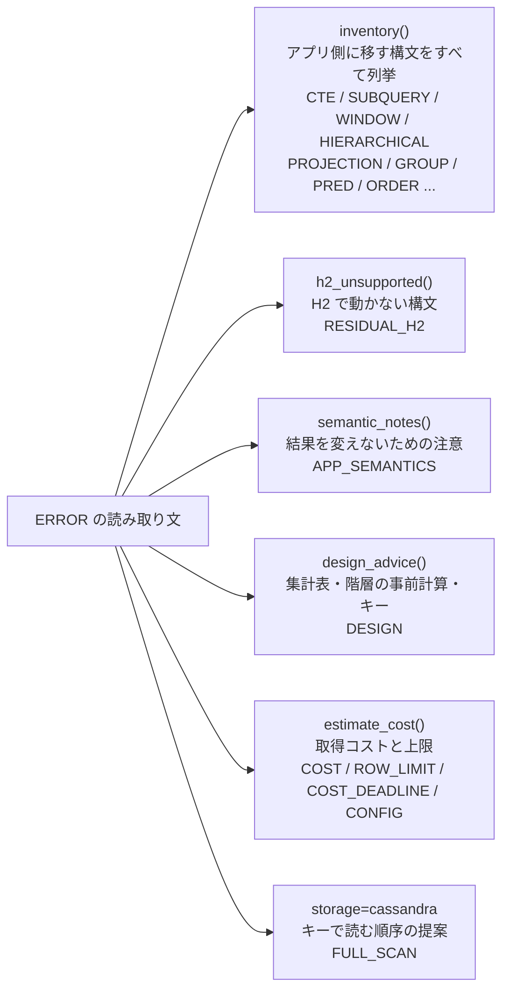
```mermaid
flowchart LR
    E["ERROR の読み取り文"] --> INV["inventory()<br/>アプリ側に移す構文をすべて列挙<br/>CTE / SUBQUERY / WINDOW / HIERARCHICAL<br/>PROJECTION / GROUP / PRED / ORDER ..."]
    E --> H2U["h2_unsupported()<br/>H2 で動かない構文<br/>RESIDUAL_H2"]
    E --> SEM["semantic_notes()<br/>結果を変えないための注意<br/>APP_SEMANTICS"]
    E --> DES["design_advice()<br/>集計表・階層の事前計算・キー<br/>DESIGN"]
    E --> COST["estimate_cost()<br/>取得コストと上限<br/>COST / ROW_LIMIT / COST_DEADLINE / CONFIG"]
    E --> FS["storage=cassandra<br/>キーで読む順序の提案<br/>FULL_SCAN"]
```

アプリ側で書き直すときは、Oracle の動きを再現する補助クラスを使い、Oracle で一度取った正解と比べる。

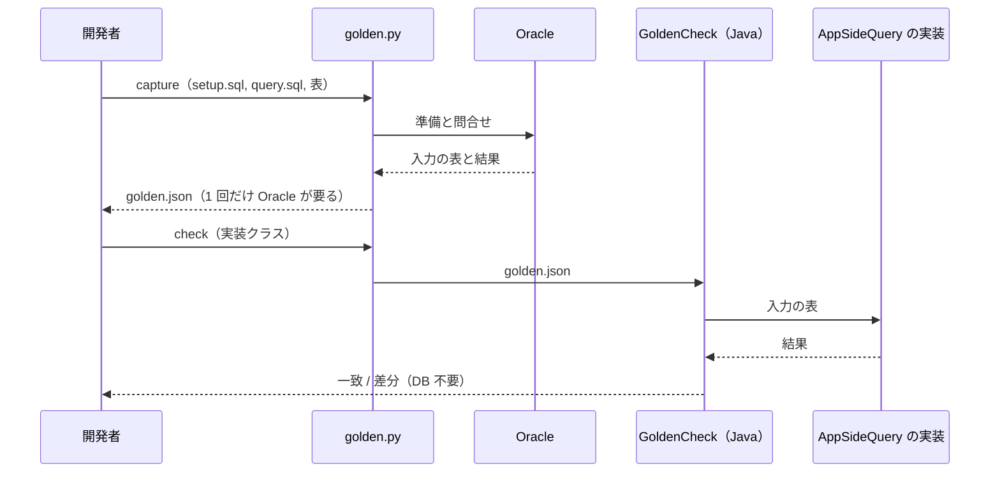
```mermaid
sequenceDiagram
    participant Dev as 開発者
    participant G as golden.py
    participant O as Oracle
    participant J as GoldenCheck（Java）
    participant I as AppSideQuery の実装

    Dev->>G: capture（setup.sql, query.sql, 表）
    G->>O: 準備と問合せ
    O-->>G: 入力の表と結果
    G-->>Dev: golden.json（1 回だけ Oracle が要る）
    Dev->>G: check（実装クラス）
    G->>J: golden.json
    J->>I: 入力の表
    I-->>J: 結果
    J-->>Dev: 一致 / 差分（DB 不要）
```

| 補助クラス | 再現する Oracle の動き |
|---|---|
| `Hierarchy` | `START WITH` / `CONNECT BY`、`LEVEL`、`SYS_CONNECT_BY_PATH`、循環の検出 |
| `Windows` | `LAG` / `LEAD`、移動平均、`RANK` / `DENSE_RANK` |
| `OracleNumbers` | `NUMBER` の算術、0 除算のエラー、0 から遠いほうへの丸め、NULL を除く集約 |
| `OracleOrdering` | NULL の並び位置、`NLS_SORT=BINARY` の文字列順 |
| `OracleDates` | `ADD_MONTHS` の月末、`TO_CHAR` の年月 |

---

## 9. 書き込み文の扱い

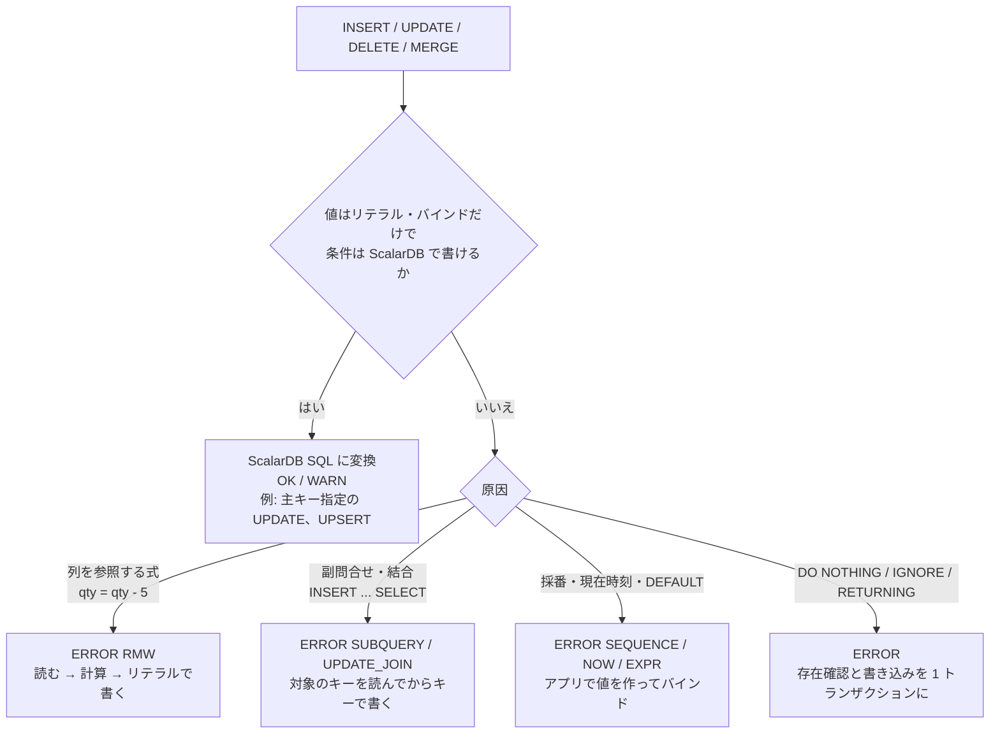
```mermaid
flowchart TD
    W["INSERT / UPDATE / DELETE / MERGE"] --> A{"値はリテラル・バインドだけで<br/>条件は ScalarDB で書けるか"}
    A -- はい --> OK["ScalarDB SQL に変換<br/>OK / WARN<br/>例: 主キー指定の UPDATE、UPSERT"]
    A -- いいえ --> K{"原因"}
    K -- "列を参照する式<br/>qty = qty - 5" --> RMW["ERROR RMW<br/>読む → 計算 → リテラルで書く"]
    K -- "副問合せ・結合<br/>INSERT ... SELECT" --> SUB["ERROR SUBQUERY / UPDATE_JOIN<br/>対象のキーを読んでからキーで書く"]
    K -- "採番・現在時刻・DEFAULT" --> GEN["ERROR SEQUENCE / NOW / EXPR<br/>アプリで値を作ってバインド"]
    K -- "DO NOTHING / IGNORE / RETURNING" --> EX["ERROR<br/>存在確認と書き込みを 1 トランザクションに"]
```

変換できない書き込みの多くは、読み取りの実行計画を書き込みに広げた「書き込み計画」で自動化できる見込み（未実装。[dml-followup-research.md](dml-followup-research.md) 1.3）。

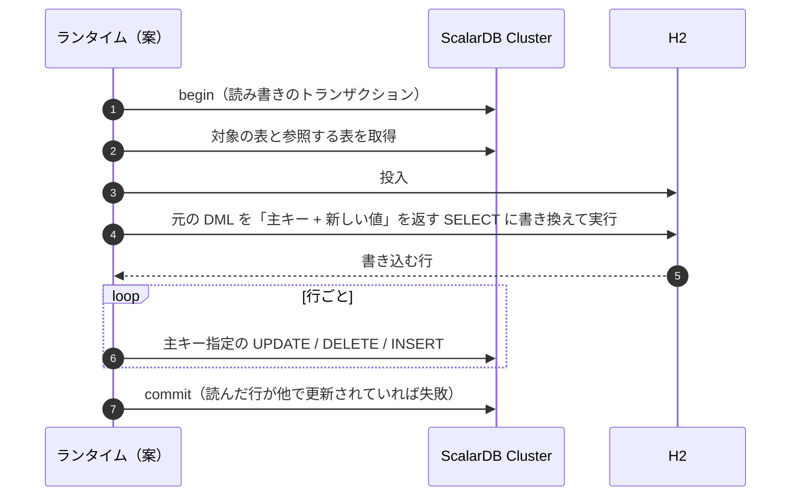
```mermaid
sequenceDiagram
    autonumber
    participant R as ランタイム（案）
    participant C as ScalarDB Cluster
    participant H as H2
    R->>C: begin（読み書きのトランザクション）
    R->>C: 対象の表と参照する表を取得
    R->>H: 投入
    R->>H: 元の DML を「主キー + 新しい値」を返す SELECT に書き換えて実行
    H-->>R: 書き込む行
    loop 行ごと
        R->>C: 主キー指定の UPDATE / DELETE / INSERT
    end
    R->>C: commit（読んだ行が他で更新されていれば失敗）
```

---

## 10. sql-transpile スキル

任意の SQLGlot 方言どうしの変換（汎用パス）と、ScalarDB SQL への変換（同梱した `scalardb_migrate`）を 1 つの入口で扱う。

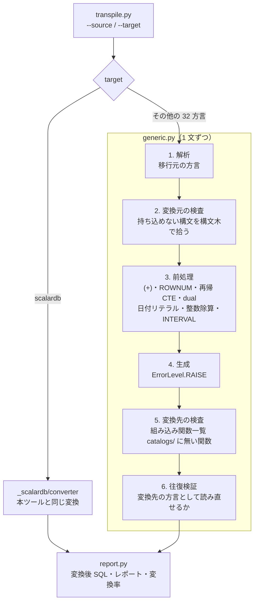
```mermaid
flowchart TD
    IN["transpile.py<br/>--source / --target"] --> T{"target"}
    T -- scalardb --> V["_scalardb/converter<br/>本ツールと同じ変換"]
    T -- "その他の 32 方言" --> G1

    subgraph GEN["generic.py（1 文ずつ）"]
        G1["1. 解析<br/>移行元の方言"] --> G2["2. 変換元の検査<br/>持ち込めない構文を構文木で拾う"]
        G2 --> G3["3. 前処理<br/>(+)・ROWNUM・再帰 CTE・dual<br/>日付リテラル・整数除算・INTERVAL"]
        G3 --> G4["4. 生成<br/>ErrorLevel.RAISE"]
        G4 --> G5["5. 変換先の検査<br/>組み込み関数一覧 catalogs/ に無い関数"]
        G5 --> G6["6. 往復検証<br/>変換先の方言として読み直せるか"]
    end

    V --> RP["report.py<br/>変換後 SQL・レポート・変換率"]
    G6 --> RP
```

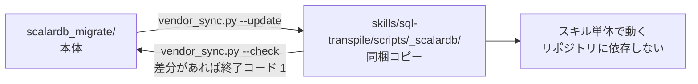
```mermaid
flowchart LR
    M["scalardb_migrate/<br/>本体"] -- "vendor_sync.py --update" --> C["skills/sql-transpile/scripts/_scalardb/<br/>同梱コピー"]
    C -- "vendor_sync.py --check<br/>差分があれば終了コード 1" --> M
    C --> S["スキル単体で動く<br/>リポジトリに依存しない"]
```

---

## 11. 検証基盤（difftest）

### 11.1 コンテナ構成

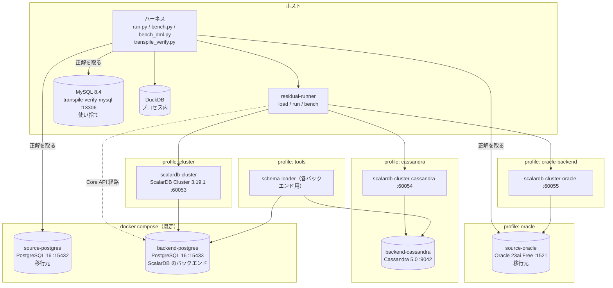
```mermaid
flowchart TB
    subgraph HOST["ホスト"]
        HAR["ハーネス<br/>run.py / bench.py / bench_dml.py<br/>transpile_verify.py"]
        RR["residual-runner<br/>load / run / bench"]
        MY[("MySQL 8.4<br/>transpile-verify-mysql :13306<br/>使い捨て")]
        DUCK[("DuckDB<br/>プロセス内")]
    end

    subgraph DEF["docker compose（既定）"]
        SPG[("source-postgres<br/>PostgreSQL 16 :15432<br/>移行元")]
        BPG[("backend-postgres<br/>PostgreSQL 16 :15433<br/>ScalarDB のバックエンド")]
    end

    subgraph POR["profile: oracle"]
        SOR[("source-oracle<br/>Oracle 23ai Free :1521<br/>移行元")]
    end

    subgraph PCL["profile: cluster"]
        CL["scalardb-cluster<br/>ScalarDB Cluster 3.19.1 :60053"]
    end

    subgraph PCA["profile: cassandra"]
        CCA["scalardb-cluster-cassandra :60054"]
        BCA[("backend-cassandra<br/>Cassandra 5.0 :9042")]
    end

    subgraph POB["profile: oracle-backend"]
        COR["scalardb-cluster-oracle :60055"]
    end

    subgraph PTO["profile: tools"]
        SL["schema-loader（各バックエンド用）"]
    end

    HAR -- "正解を取る" --> SPG
    HAR -- "正解を取る" --> SOR
    HAR -- "正解を取る" --> MY
    HAR --> DUCK
    HAR --> RR
    RR --> CL
    RR --> CCA
    RR --> COR
    RR -. "Core API 経路" .-> BPG
    CL --> BPG
    CCA --> BCA
    COR --> SOR
    SL --> BPG
    SL --> BCA
```

Core API 経路（`--fetcher core`）はホストの ScalarDB ライブラリがバックエンドに接続する。ハーネス自身は、ScalarDB のバックエンドには接続しない。

### 11.2 差分テスト（`run.py`）

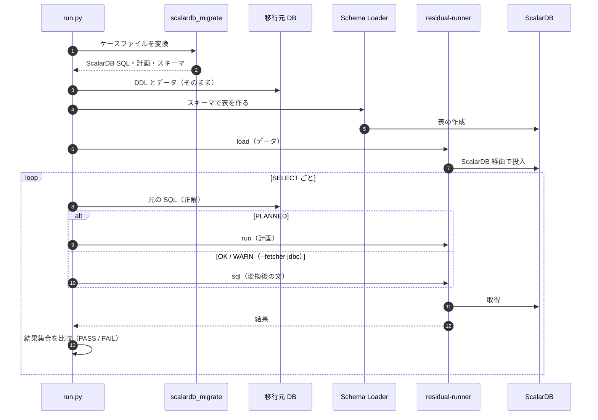
```mermaid
sequenceDiagram
    autonumber
    participant H as run.py
    participant CV as scalardb_migrate
    participant S as 移行元 DB
    participant SL as Schema Loader
    participant RR as residual-runner
    participant C as ScalarDB

    H->>CV: ケースファイルを変換
    CV-->>H: ScalarDB SQL・計画・スキーマ
    H->>S: DDL とデータ（そのまま）
    H->>SL: スキーマで表を作る
    SL->>C: 表の作成
    H->>RR: load（データ）
    RR->>C: ScalarDB 経由で投入
    loop SELECT ごと
        H->>S: 元の SQL（正解）
        alt PLANNED
            H->>RR: run（計画）
        else OK / WARN（--fetcher jdbc）
            H->>RR: sql（変換後の文）
        end
        RR->>C: 取得
        RR-->>H: 結果
        H->>H: 結果集合を比較（PASS / FAIL）
    end
```

### 11.3 ベンチマーク（`bench_dml.py`）

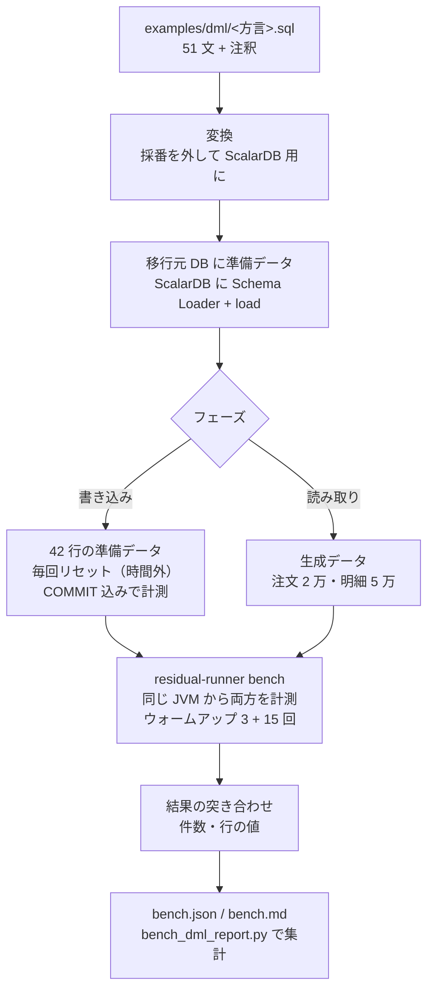
```mermaid
flowchart TD
    A["examples/dml/&lt;方言&gt;.sql<br/>51 文 + 注釈"] --> B["変換<br/>採番を外して ScalarDB 用に"]
    B --> C["移行元 DB に準備データ<br/>ScalarDB に Schema Loader + load"]
    C --> D{"フェーズ"}
    D -- 書き込み --> W["42 行の準備データ<br/>毎回リセット（時間外）<br/>COMMIT 込みで計測"]
    D -- 読み取り --> R["生成データ<br/>注文 2 万・明細 5 万"]
    W --> E["residual-runner bench<br/>同じ JVM から両方を計測<br/>ウォームアップ 3 + 15 回"]
    R --> E
    E --> F["結果の突き合わせ<br/>件数・行の値"]
    F --> G["bench.json / bench.md<br/>bench_dml_report.py で集計"]
```

### 11.4 スキルの実行検証（`transpile_verify.py`）

変換元での実行結果を正解とし、変換先で「スキルの変換結果」と「素の `sqlglot.transpile`」を実行して、スキルの判定が正しかったかを分類する。

| スキルの判定 | 変換後 SQL が変換元と一致 | 変換後 SQL が失敗・不一致 |
|---|---|---|
| OK | 正しく変換 | **見逃し**（スキルの不具合） |
| WARN | 警告は杞憂 | 警告が的中 |
| ERROR | —（素の変換が一致すれば **過剰な拒否**） | 正しく拒否 |

---

## 12. トランザクションと整合性

```mermaid
flowchart LR
    subgraph READ["読み取り（実行計画）"]
        R1["1 つの読み取り専用トランザクション"] --> R2["計画の全取得"]
        R2 --> R3["COMMIT<br/>SERIALIZABLE ではスキャンを再検証"]
    end
    subgraph WRITE["書き込み（変換後 SQL）"]
        W1["ScalarDB SQL のトランザクション"] --> W2["主キー・条件で書く"]
        W2 --> W3["COMMIT<br/>Consensus Commit で競合を検出"]
    end
    subgraph PAR["並列取得（未採用）"]
        P1["取得ごとに別トランザクション"] --> P2["表ごとに時点がずれる<br/>整合が要る文には使えない"]
    end
```

| 項目 | 本ツールでの扱い |
|---|---|
| 分離レベル | 検証環境は `SERIALIZABLE`。コスト見積もりは `--isolation` で切り替える（`SERIALIZABLE` はスキャンの再検証で約 2 倍） |
| 実行計画のトランザクション | 読み取り専用（ScalarDB 3.16 以降、Coordinator への書き込みを省く） |
| 並列取得 | ScalarDB の `SqlSession` / トランザクションはスレッドセーフでないため、並列にするとトランザクションが分かれ、1 つのスナップショットで読めなくなる。既定では行わない |
| バックエンドへの接続 | しない。取得・投入は ScalarDB SQL / Core API だけ |
| 表を作り直したとき | 列の型を変えて作り直したら ScalarDB Cluster を再起動する（バックエンドの準備済み文のキャッシュ） |

---

## 13. 性能の特性

| 経路 | ScalarDB 側の応答時間 | 何で決まるか | 出典 |
|---|---|---|---|
| 変換後の書き込み | 3〜6 ms（COMMIT 込み、移行元の 7〜20 倍） | 往復とコミット | [dml-benchmark-report.md](dml-benchmark-report.md) |
| キーで絞る読み取り | 4〜6 ms（6〜13 倍） | 往復 | 同上 |
| 実行計画の読み取り | 中央値 0.6 秒前後 | **読む行数**（スキャン 1 行 約 25 µs） | 同上、[bench-report.md](bench-report.md) |
| 3 表結合（取得 約 6.7 万行） | 索引なし 26〜28 秒 / 索引あり 1.7〜1.9 秒 | 索引なしは H2 の総当たり、索引ありは取得 | [dml-benchmark-report.md](dml-benchmark-report.md) 3.4 |

```mermaid
flowchart LR
    T["実行計画の時間"] --> F["取得<br/>行数 × 往復"]
    T --> L["H2 への投入<br/>6 万行で約 50 ms"]
    T --> I["索引の構築<br/>投入と同程度（任意）"]
    T --> Q["問合せ<br/>索引なしの結合は行数の積"]
    F --> F1["scan_fetch_size 10 → 1000 で 1.5〜2.4 倍"]
    F --> F2["表の並列取得は 1.2〜1.3 倍<br/>キーごとの取得は 2 倍前後"]
    F --> F3["根本対策: 読む行数を減らす<br/>集計表・キー設計・ScalarDB Analytics"]
    Q --> Q1["--h2-indexes（バッチ処理）"]
```

改善の優先順位と根拠は [dml-followup-research.md](dml-followup-research.md) の 4 章を参照。
