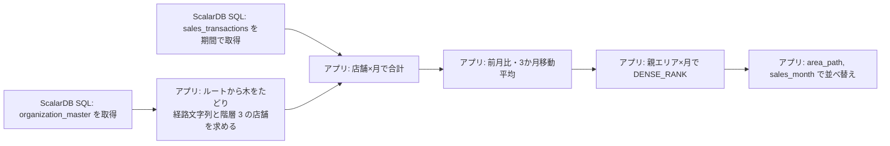

# エリア別・店舗別の月次売上分析 SQL の ScalarDB 対応

Oracle の「エリア別・店舗別の月次売上分析」SQL（`CONNECT BY` による組織階層・CTE・ウィンドウ関数を使用）を ScalarDB 向けに書き換えた結果をまとめる。

**結論:** 1 文の ScalarDB SQL にはできない。**ScalarDB SQL では組織マスタと売上明細を取得するだけにし、階層の展開・月次集計・前月比・移動平均・順位付け・並べ替えはアプリケーション（Java）で行う。**

---

## 1. 元の SQL（Oracle）

```sql
WITH area_hierarchy AS (
    SELECT node_id AS shop_or_area_id, parent_id, node_name,
           SYS_CONNECT_BY_PATH(node_name, ' > ') AS area_path,
           LEVEL AS hierarchy_level
    FROM organization_master
    START WITH parent_id IS NULL
    CONNECT BY PRIOR node_id = parent_id
),
monthly_sales AS (
    SELECT shop_id, TO_CHAR(sales_date, 'YYYY-MM') AS sales_month,
           SUM(amount) AS total_amount, COUNT(order_id) AS total_orders
    FROM sales_transactions
    WHERE sales_date >= DATE '2026-01-01' AND sales_date < DATE '2027-01-01'
    GROUP BY shop_id, TO_CHAR(sales_date, 'YYYY-MM')
)
SELECT h.area_path, h.node_name AS shop_name, s.sales_month, s.total_amount,
       ROUND((s.total_amount / LAG(s.total_amount, 1) OVER (
           PARTITION BY s.shop_id ORDER BY s.sales_month)) * 100, 2) AS mom_ratio_pct,
       ROUND(AVG(s.total_amount) OVER (
           PARTITION BY s.shop_id ORDER BY s.sales_month
           ROWS BETWEEN 2 PRECEDING AND CURRENT ROW), 0) AS moving_avg_3m,
       DENSE_RANK() OVER (
           PARTITION BY h.parent_id, s.sales_month ORDER BY s.total_amount DESC) AS rank_in_area
FROM area_hierarchy h
INNER JOIN monthly_sales s ON h.shop_or_area_id = s.shop_id
WHERE h.hierarchy_level = 3
ORDER BY h.area_path, s.sales_month;
```

（コメントは省略した）

---

## 2. そのままでは変換できない理由

`skills/sql-transpile/scripts/transpile.py --source oracle --target scalardb` の結果:

```text
[  1] ERROR SELECT     WITH area_hierarchy AS (
        ERROR CTE: WITH (common table expressions) are not supported

oracle → scalardb: 1 文 / OK 0 / WARN 0 / ERROR 1
変換率 0.0% (0/1)
```

ScalarDB SQL で使えない構文と、その処理の移し先:

| 元の SQL の構文 | ScalarDB SQL | 移す先 |
|---|---|---|
| `WITH`（CTE） | 使えない | アプリ |
| `START WITH` / `CONNECT BY` / `LEVEL` / `SYS_CONNECT_BY_PATH` | 使えない（階層問合せ） | アプリ（木をたどる） |
| `TO_CHAR(sales_date, 'YYYY-MM')` と、それによる `GROUP BY` | 使えない（射影・GROUP BY に式は書けない） | アプリ |
| `LAG` / `AVG OVER (ROWS BETWEEN ...)` / `DENSE_RANK` | 使えない（ウィンドウ関数） | アプリ |
| `ROUND`、除算・乗算 | 使えない（射影に書けるのは列と集約関数だけ） | アプリ |
| `ORDER BY area_path`（計算列） | 使えない | アプリ |
| `sales_date >= DATE '...' AND sales_date < DATE '...'` | 使える | ScalarDB（パラメータで渡す） |

---

## 3. 分解後の構成



### 3.1 前提とした表定義

実際の表定義は未確認のため、次を仮定した。

```sql
CREATE TABLE organization_master (
  node_id BIGINT PRIMARY KEY,
  parent_id BIGINT,
  node_name TEXT
);
CREATE INDEX ON organization_master (parent_id);   -- Cassandra 版だけで使う

CREATE TABLE sales_transactions (
  shop_id BIGINT,
  sales_date TIMESTAMP,      -- Oracle の DATE は時刻を持つので TIMESTAMP
  order_id BIGINT,
  amount BIGINT,             -- ScalarDB に DECIMAL は無い。円単位などの整数で持つ
  PRIMARY KEY (shop_id, sales_date, order_id)      -- パーティションキー: shop_id
);
```

### 3.2 ScalarDB SQL（取得用）

バックエンドによって取得の仕方を変える。どちらも変換ツールで ERROR が出ないことを確認した。

**RDBMS バックエンド（Oracle / PostgreSQL など）**: 2 文で取得する。

```sql
SELECT node_id, parent_id, node_name FROM organization_master;
SELECT shop_id, sales_date, amount FROM sales_transactions
WHERE sales_date >= ? AND sales_date < ?;     -- 2026-01-01 00:00:00, 2027-01-01 00:00:00
```

どちらもパーティションキーで絞らないため、WARN `CROSS_PARTITION` になる。`scalar.db.cross_partition_scan.enabled=true` の設定が必要。組織マスタは件数が少ないので問題になりにくいが、売上は 1 年分を全店舗まとめて読むため、件数に比例して遅くなる（`docs/bench-report.md` では 4 万行の全件走査で約 1 秒）。

**Cassandra バックエンド**: 表全体のスキャンを使わず、キーとインデックスで取得する。

```sql
-- ルート（本部）: 主キーで GET。parent_id IS NULL は検索できないので、ルートの node_id はアプリが持つ
SELECT node_id, parent_id, node_name FROM organization_master WHERE node_id = ?;
-- 子ノード: parent_id のセカンダリインデックスで取得。階層 2 → 3 の順にたどる
SELECT node_id, parent_id, node_name FROM organization_master WHERE parent_id = ?;
-- 売上: 階層 3 の店舗ごとにパーティション内の範囲スキャン
SELECT shop_id, sales_date, amount FROM sales_transactions
WHERE shop_id = ? AND sales_date >= ? AND sales_date < ?;
```

変換ツール（`--storage cassandra`）での判定は、順に GET / index SCAN / partition SCAN。`WHERE parent_id IS NULL` は ERROR `NO_CROSS_PARTITION` になるため使わない。発行する SQL の数は「ルート数 + 階層 1〜2 のノード数 + 店舗数」になる。

RDBMS バックエンドでも、店舗数が少なく売上の件数が多い場合は、この店舗ごとの取得のほうが速いことがある。

### 3.3 アプリ側の処理（Java、ScalarDB JDBC）

```java
import java.math.BigDecimal;
import java.math.RoundingMode;
import java.sql.Connection;
import java.sql.PreparedStatement;
import java.sql.ResultSet;
import java.sql.SQLException;
import java.sql.Timestamp;
import java.time.LocalDate;
import java.time.LocalDateTime;
import java.time.format.DateTimeFormatter;
import java.util.ArrayList;
import java.util.Collection;
import java.util.Comparator;
import java.util.HashMap;
import java.util.List;
import java.util.Map;
import java.util.TreeMap;

/** エリア別・店舗別の月次売上分析。Oracle の CONNECT BY + ウィンドウ関数の SQL をアプリ側で再現する。 */
public final class AreaSalesReport {
    public record OrgNode(long nodeId, Long parentId, String nodeName) {}
    public record Sale(long shopId, LocalDateTime salesDate, Long amount) {}
    public record Shop(long shopId, long parentId, String shopName, String areaPath) {}
    public record ResultRow(String areaPath, String shopName, String salesMonth, BigDecimal totalAmount,
                            BigDecimal momRatioPct, BigDecimal movingAvg3m, long rankInArea) {}

    private record Draft(Shop shop, String salesMonth, BigDecimal total, BigDecimal mom, BigDecimal avg) {}

    private static final class MonthTotal {
        BigDecimal sum; // SUM(amount): NULL だけの月は null のまま
    }

    static final String SEPARATOR = " > ";
    static final int SHOP_LEVEL = 3;
    static final BigDecimal HUNDRED = BigDecimal.valueOf(100);
    static final DateTimeFormatter YYYY_MM = DateTimeFormatter.ofPattern("uuuu-MM");

    // ---------------------------------------------------------------- 取得（ScalarDB SQL）

    /** RDBMS バックエンド用（scalar.db.cross_partition_scan.enabled=true が前提）。 */
    public static List<ResultRow> runOnRdbms(Connection conn, LocalDate fromDate, LocalDate toDate)
            throws SQLException {
        LocalDateTime from = fromDate.atStartOfDay();
        LocalDateTime to = toDate.atStartOfDay();
        conn.setAutoCommit(false); // 2 回の読み取りを 1 トランザクションにする
        try {
            List<OrgNode> nodes = new ArrayList<>();
            try (PreparedStatement ps = conn.prepareStatement(
                    "SELECT node_id, parent_id, node_name FROM organization_master");
                 ResultSet rs = ps.executeQuery()) {
                while (rs.next()) {
                    nodes.add(toNode(rs));
                }
            }
            List<Sale> sales = new ArrayList<>();
            try (PreparedStatement ps = conn.prepareStatement(
                    "SELECT shop_id, sales_date, amount FROM sales_transactions "
                            + "WHERE sales_date >= ? AND sales_date < ?")) {
                ps.setTimestamp(1, Timestamp.valueOf(from));
                ps.setTimestamp(2, Timestamp.valueOf(to));
                readSales(ps, sales);
            }
            conn.commit();
            return build(nodes, sales, from, to);
        } catch (SQLException | RuntimeException e) {
            conn.rollback();
            throw e;
        }
    }

    /**
     * Cassandra バックエンド用。表全体のスキャンを使わず、キーとインデックスで取得する。
     * parent_id IS NULL は検索できないため、ルート（本部）の node_id はアプリが持つ。
     * organization_master の parent_id にセカンダリインデックスが必要。
     */
    public static List<ResultRow> runOnCassandra(Connection conn, List<Long> rootIds,
                                                 LocalDate fromDate, LocalDate toDate) throws SQLException {
        LocalDateTime from = fromDate.atStartOfDay();
        LocalDateTime to = toDate.atStartOfDay();
        conn.setAutoCommit(false);
        try {
            List<OrgNode> nodes = new ArrayList<>();
            List<OrgNode> current = new ArrayList<>();
            try (PreparedStatement ps = conn.prepareStatement(
                    "SELECT node_id, parent_id, node_name FROM organization_master WHERE node_id = ?")) {
                for (long id : rootIds) {
                    ps.setLong(1, id);
                    try (ResultSet rs = ps.executeQuery()) {
                        while (rs.next()) {
                            OrgNode n = toNode(rs);
                            if (n.parentId() == null) { // START WITH parent_id IS NULL
                                current.add(n);
                            }
                        }
                    }
                }
            }
            nodes.addAll(current);
            try (PreparedStatement ps = conn.prepareStatement(
                    "SELECT node_id, parent_id, node_name FROM organization_master WHERE parent_id = ?")) {
                for (int level = 2; level <= SHOP_LEVEL; level++) { // 店舗の階層まで下りる
                    List<OrgNode> next = new ArrayList<>();
                    for (OrgNode parent : current) {
                        ps.setLong(1, parent.nodeId());
                        try (ResultSet rs = ps.executeQuery()) {
                            while (rs.next()) {
                                next.add(toNode(rs));
                            }
                        }
                    }
                    nodes.addAll(next);
                    current = next;
                }
            }
            List<Sale> sales = new ArrayList<>();
            try (PreparedStatement ps = conn.prepareStatement(
                    "SELECT shop_id, sales_date, amount FROM sales_transactions "
                            + "WHERE shop_id = ? AND sales_date >= ? AND sales_date < ?")) {
                for (OrgNode shop : current) {
                    ps.setLong(1, shop.nodeId());
                    ps.setTimestamp(2, Timestamp.valueOf(from));
                    ps.setTimestamp(3, Timestamp.valueOf(to));
                    readSales(ps, sales);
                }
            }
            conn.commit();
            return build(nodes, sales, from, to);
        } catch (SQLException | RuntimeException e) {
            conn.rollback();
            throw e;
        }
    }

    private static OrgNode toNode(ResultSet rs) throws SQLException {
        long nodeId = rs.getLong("node_id");
        long parentId = rs.getLong("parent_id");
        Long parent = rs.wasNull() ? null : parentId;
        return new OrgNode(nodeId, parent, rs.getString("node_name"));
    }

    private static void readSales(PreparedStatement ps, List<Sale> out) throws SQLException {
        try (ResultSet rs = ps.executeQuery()) {
            while (rs.next()) {
                long shopId = rs.getLong("shop_id");
                LocalDateTime salesDate = rs.getTimestamp("sales_date").toLocalDateTime();
                long amount = rs.getLong("amount");
                out.add(new Sale(shopId, salesDate, rs.wasNull() ? null : amount));
            }
        }
    }

    // ---------------------------------------------------------------- 集計・分析（アプリ側）

    /** area_hierarchy: START WITH parent_id IS NULL CONNECT BY PRIOR node_id = parent_id の LEVEL = 3 の行。 */
    static List<Shop> shopsAtLevel3(Collection<OrgNode> nodes) {
        Map<Long, List<OrgNode>> children = new HashMap<>();
        List<OrgNode> roots = new ArrayList<>();
        for (OrgNode n : nodes) {
            if (n.parentId() == null) {
                roots.add(n);
            } else {
                children.computeIfAbsent(n.parentId(), k -> new ArrayList<>()).add(n);
            }
        }
        List<Shop> shops = new ArrayList<>();
        for (OrgNode root : roots) {
            walk(root, "", 1, children, shops);
        }
        return shops;
    }

    private static void walk(OrgNode node, String parentPath, int level,
                             Map<Long, List<OrgNode>> children, List<Shop> out) {
        String name = node.nodeName() == null ? "" : node.nodeName();
        if (name.contains(SEPARATOR)) { // Oracle は ORA-30004 で失敗する
            throw new IllegalStateException("node_name contains the path separator: node_id=" + node.nodeId());
        }
        String path = parentPath + SEPARATOR + name; // SYS_CONNECT_BY_PATH は先頭にも区切り文字が付く
        if (level == SHOP_LEVEL) {
            out.add(new Shop(node.nodeId(), node.parentId(), node.nodeName(), path));
        }
        for (OrgNode child : children.getOrDefault(node.nodeId(), List.of())) {
            walk(child, path, level + 1, children, out);
        }
    }

    /** monthly_sales と、メイン SELECT の結合・LAG・移動平均・DENSE_RANK・ORDER BY。 */
    static List<ResultRow> build(Collection<OrgNode> nodes, Collection<Sale> sales,
                                 LocalDateTime from, LocalDateTime to) {
        Map<Long, Shop> shops = new HashMap<>();
        for (Shop s : shopsAtLevel3(nodes)) {
            shops.put(s.shopId(), s);
        }

        // shop_id → 月（昇順）→ 合計
        Map<Long, TreeMap<String, MonthTotal>> monthly = new HashMap<>();
        for (Sale s : sales) {
            if (s.salesDate().isBefore(from) || !s.salesDate().isBefore(to)) {
                continue;
            }
            if (!shops.containsKey(s.shopId())) { // INNER JOIN ... WHERE hierarchy_level = 3
                continue;
            }
            MonthTotal m = monthly.computeIfAbsent(s.shopId(), k -> new TreeMap<>())
                    .computeIfAbsent(YYYY_MM.format(s.salesDate()), k -> new MonthTotal());
            if (s.amount() != null) {
                BigDecimal a = BigDecimal.valueOf(s.amount());
                m.sum = m.sum == null ? a : m.sum.add(a);
            }
        }

        // PARTITION BY shop_id ORDER BY sales_month の LAG と 3 か月移動平均
        List<Draft> drafts = new ArrayList<>();
        for (Map.Entry<Long, TreeMap<String, MonthTotal>> e : monthly.entrySet()) {
            Shop shop = shops.get(e.getKey());
            List<Map.Entry<String, MonthTotal>> months = new ArrayList<>(e.getValue().entrySet());
            for (int i = 0; i < months.size(); i++) {
                BigDecimal cur = months.get(i).getValue().sum;
                BigDecimal prev = i == 0 ? null : months.get(i - 1).getValue().sum; // 売上のあった前の月
                BigDecimal mom = cur == null || prev == null ? null
                        // 前月の合計が 0 なら Oracle は ORA-01476、ここでは ArithmeticException
                        : cur.multiply(HUNDRED).divide(prev, 2, RoundingMode.HALF_UP);

                BigDecimal sum = null;
                int count = 0;
                for (int j = Math.max(0, i - 2); j <= i; j++) { // ROWS BETWEEN 2 PRECEDING AND CURRENT ROW
                    BigDecimal v = months.get(j).getValue().sum;
                    if (v != null) { // AVG は NULL を除く
                        sum = sum == null ? v : sum.add(v);
                        count++;
                    }
                }
                BigDecimal avg = count == 0 ? null
                        : sum.divide(BigDecimal.valueOf(count), 0, RoundingMode.HALF_UP);
                drafts.add(new Draft(shop, months.get(i).getKey(), cur, mom, avg));
            }
        }

        // DENSE_RANK() OVER (PARTITION BY parent_id, sales_month ORDER BY total_amount DESC)
        // Oracle の DESC は NULL が先頭
        Comparator<BigDecimal> desc = Comparator.nullsFirst(Comparator.<BigDecimal>reverseOrder());
        Map<List<Object>, List<Draft>> partitions = new HashMap<>();
        for (Draft d : drafts) {
            partitions.computeIfAbsent(List.of(d.shop().parentId(), d.salesMonth()), k -> new ArrayList<>()).add(d);
        }
        List<ResultRow> result = new ArrayList<>();
        for (List<Draft> p : partitions.values()) {
            p.sort(Comparator.comparing(Draft::total, desc));
            long rank = 0;
            for (int i = 0; i < p.size(); i++) {
                Draft d = p.get(i);
                if (i == 0 || desc.compare(p.get(i - 1).total(), d.total()) != 0) {
                    rank++;
                }
                result.add(new ResultRow(d.shop().areaPath(), d.shop().shopName(), d.salesMonth(),
                        d.total(), d.mom(), d.avg(), rank));
            }
        }

        // ORDER BY area_path, sales_month（NLS_SORT=BINARY: AL32UTF8 のバイト順 = コードポイント順）
        result.sort(Comparator.comparing(ResultRow::areaPath, AreaSalesReport::compareCodePoints)
                .thenComparing(ResultRow::salesMonth));
        return result;
    }

    /** String.compareTo は UTF-16 の順で、サロゲートペアの文字だけ Oracle のバイト順と食い違うため使わない。 */
    static int compareCodePoints(String a, String b) {
        int i = 0;
        int j = 0;
        while (i < a.length() && j < b.length()) {
            int ca = a.codePointAt(i);
            int cb = b.codePointAt(j);
            if (ca != cb) {
                return Integer.compare(ca, cb);
            }
            i += Character.charCount(ca);
            j += Character.charCount(cb);
        }
        return Integer.compare(a.length() - i, b.length() - j);
    }
}
```

元の SQL の各部分との対応:

| 元の SQL | アプリ側の処理 |
|---|---|
| `START WITH parent_id IS NULL CONNECT BY PRIOR node_id = parent_id` | `parent_id` が null のノードから、子の一覧をたどる（`walk`） |
| `SYS_CONNECT_BY_PATH(node_name, ' > ')` | 親の経路に `" > " + node_name` を足す。先頭にも区切り文字が付く |
| `LEVEL = 3` | 深さ 3 のノードだけを店舗として残す |
| `WHERE sales_date >= ... AND < ...` | 取得 SQL の条件（アプリでも同じ範囲で絞る） |
| `TO_CHAR(sales_date, 'YYYY-MM')` + `GROUP BY` + `SUM` | `uuuu-MM` で月を作り、NULL を除いて合計（全部 NULL なら null） |
| `INNER JOIN ... WHERE hierarchy_level = 3` | 階層 3 の店舗に無い `shop_id` の売上を捨てる |
| `LAG(total, 1)` → `/ * 100` → `ROUND(.., 2)` | 同じ店舗の 1 つ前の月（売上がある月）と比べ、`total × 100 ÷ 前月` を小数 2 桁で四捨五入 |
| `AVG OVER (ROWS BETWEEN 2 PRECEDING AND CURRENT ROW)` → `ROUND(.., 0)` | 直近 3 行の NULL 以外の平均を整数に四捨五入 |
| `DENSE_RANK() OVER (PARTITION BY parent_id, sales_month ORDER BY total DESC)` | 親エリア×月でまとめ、NULL を先頭にした降順で並べ、合計が変わったときだけ順位を 1 増やす |
| `ORDER BY area_path, sales_month` | コードポイント順（`NLS_SORT=BINARY` と同じ）で並べ替え |
| `COUNT(order_id) AS total_orders` | 最終結果で使われないので計算しない |

---

## 4. 検証結果

**未実施。** Docker Desktop が起動せず、Oracle のコンテナを使えなかった。

用意した検証（`Verify.java`）の内容:

- Oracle に表とデータ（固定ケース + 乱数 8,000 行）を作り、元の SQL の結果と、同じ取得 SQL を Oracle に発行して `AreaSalesReport` で計算した結果を 1 行ずつ比べる（RDBMS 版と Cassandra 版の両方）
- 固定ケース: ルートが 2 つ、売上の無い月（LAG が 2 か月前を指す）、`amount` が NULL だけの月（順位で先頭）、同額の順位、負の金額の四捨五入（-2.5 → -3、-3.125 → -3.13）、期間の境界（2025-12-31 23:59:59 / 2027-01-01 00:00:00）、階層 2・4 や親の無いノードの売上、サロゲートペアを含む店舗名の並び順
- 前月の合計が 0 のとき、Oracle とアプリの両方が失敗すること

変換ツールによる判定（ScalarDB SQL として ERROR が無いこと）と Java のコンパイルは確認済み。

---

## 5. 元の SQL と結果が変わりうる点・注意点

1. **前月比は「暦の前月」ではない:** `LAG` は売上がある 1 つ前の月を返す。3 月に売上が無ければ、4 月は 2 月と比べる。アプリ側も同じ動きにしている。暦どおりの前月比が本来の意図なら、元の SQL のほうを直す必要がある。
2. **前月の合計が 0 のとき:** Oracle は `ORA-01476: 除数がゼロです` で文全体が失敗する。アプリ側も `ArithmeticException` にしている。業務上は NULL にするほうが自然なら、アプリで決めて変える。
3. **並び順と照合順序:** `ORDER BY area_path` は、セッションの `NLS_SORT` が `BINARY` のとき AL32UTF8 のバイト順になる。Java の `String.compareTo` は UTF-16 の順で、「𠮷」のようなサロゲートペアの文字だけ結果が変わるため、コードポイント順で比べている。`NLS_SORT` が `JAPANESE_M` などの場合は、その規則に合わせる必要がある。
4. **経路が同じ店舗が複数ある場合:** 同じエリアに同名の店舗があると `area_path` が同じになり、その間の順序は元の SQL でも決まっていない。
5. **区切り文字を含む名前:** `node_name` に `' > '` が含まれると、Oracle は `ORA-30004` で失敗する。アプリも例外にしている（Cassandra 版は階層 3 までしか読まないため、階層 4 以下の名前は確認しない）。
6. **金額の型:** `amount` を `DOUBLE` にすると誤差が出る。`BIGINT` で持ち、`BigDecimal` で計算する。`ROUND` は Oracle と同じく 0 から遠いほうへの四捨五入（`HALF_UP`）。
7. **読み取りの一貫性:** 組織と売上を別の SQL で読むため、1 つのトランザクションにまとめている（`setAutoCommit(false)` → `commit`）。
8. **件数の多さ:** RDBMS 版は 1 年分の明細をすべてアプリのメモリに載せる。店舗数が多い場合は、店舗ごとに取得して月次合計にしてから明細を捨てる形にする。
9. **ルートの node_id（Cassandra 版）:** `parent_id IS NULL` の検索ができないため、アプリがルートの ID を持つ。本部の追加・削除があれば設定も変える。

---

## 6. 自動分解ツールの結果との比較

`scalardb_migrate.cli --plan-dir` による自動分解も試した。

```text
# --storage jdbc（既定）
[  1] PLANNED SELECT       WITH area_hierarchy AS (
        INFO  PLAN_FETCH: UNKNOWN: SELECT * FROM organization_master
        INFO  PLAN_FETCH: UNKNOWN: SELECT * FROM sales_transactions
        INFO  PLAN_RESIDUAL: H2 Oracle mode runs the original SQL (pattern P6)

# --storage cassandra
[  1] ERROR SELECT       WITH area_hierarchy AS (
        ERROR FULL_SCAN: organization_master: no key or index condition to fetch by; ...
```

RDBMS 向けの計画は、両表をすべて取得し、元の SQL を H2（Oracle モード）で実行するものだった。しかし H2 は `CONNECT BY` に対応していない（`docs/oracle-sql-report.md`）ため、この計画は実行時に失敗する。期間の絞り込みも ScalarDB 側に渡らない。Cassandra 向けは計画自体が作られない。本書の手作業による分解を使う。

**2026-09-15 の改修後:** この分析をもとに変換ツールを直した。同じ SQL の結果は次のとおり。

```text
[  1] ERROR SELECT
        ERROR CTE: WITH area_hierarchy, monthly_sales: evaluate each common table expression in the application ...
        ERROR WINDOW: main query: window functions DENSE_RANK, AVG OVER, LAG -- partition, sort and compute in the application
        ERROR PROJECTION: main query: expressions in the select list (ROUND, *, /) -- compute them in the application
        ERROR HIERARCHICAL: CTE area_hierarchy: START WITH / CONNECT BY with LEVEL, SYS_CONNECT_BY_PATH -- walk the tree ...
        ERROR PROJECTION: CTE monthly_sales: expressions in the select list (TO_CHAR) -- compute them in the application
        ERROR GROUP: CTE monthly_sales: GROUP BY expression TO_CHAR(sales_date, 'YYYY-MM') -- group in the application
        ERROR RESIDUAL_H2: the H2 residual engine cannot run CONNECT BY ...; implement this part in the application
        WARN  APP_SEMANTICS: (LAG、ORA-01476、ROUND、NULL の集約と並び順、NLS_SORT、ORA-30004、LEVEL、TO_CHAR の 9 件)
        INFO  DESIGN: (集計表 (shop_id, sales_month)、階層の事前計算、ScalarDB Analytics など)
```

- 実行できない計画は作らず、アプリ側に移す構文を CTE の中まで全部挙げる。本書 2 章の表とほぼ同じ内容が自動で出る
- 本書 5 章の注意点のうち、`LAG`、0 除算、丸め、並び順、区切り文字は `APP_SEMANTICS` として出る
- Cassandra（表定義あり）では 2 表とも `FULL_SCAN` になり、互いのキーに頼るため循環すること、アプリが持つキー（本書ではルートの node_id）から始める必要があることを示す

---

## 7. 未確認事項

- 実際の表定義（主キー、`amount` と `sales_date` の型）と、ルート（本部）の ID
- バックエンドが RDBMS か Cassandra か
- ScalarDB Cluster 経由での実行（ScalarDB SQL としての妥当性は変換ツールの判定だけ）
- Oracle の結果との突き合わせ。補助クラスを使った同じ処理を `runtime-java` の `com.scalar.migrate.examples.AreaSalesReport` に置き、手計算の期待値で単体テストした。Oracle で正解を取る準備（`difftest/golden/area-sales/`）はできているが、`difftest/golden.py capture` はまだ実行していない
- 階層が 3 段で固定か（店舗が階層 3 以外にもあるなら、元の SQL の前提から見直す）
