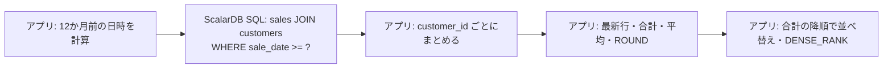

# 顧客別売上ランキング SQL の ScalarDB 対応

Oracle の「顧客別売上ランキング」SQL（CTE・ウィンドウ関数を使用）を ScalarDB 向けに書き換えた結果をまとめる。

**結論:** 1 文の ScalarDB SQL にはできない。**ScalarDB SQL で明細行を取得し、集計・順位付け・丸めはアプリケーション（Java）で行う**形に分解する。

---

## 1. 元の SQL（Oracle）

```sql
WITH RankedSales AS (
    -- 1. 顧客ごとの売上明細にウィンドウ関数で順位や累計を付与
    SELECT
        c.customer_id,
        c.customer_name,
        s.sale_date,
        s.amount,
        ROW_NUMBER() OVER (PARTITION BY c.customer_id ORDER BY s.sale_date DESC) as rn,
        SUM(s.amount) OVER (PARTITION BY c.customer_id) as total_customer_sales,
        AVG(s.amount) OVER (PARTITION BY c.customer_id) as avg_customer_sales
    FROM customers c
    JOIN sales s ON c.customer_id = s.customer_id
    WHERE s.sale_date >= ADD_MONTHS(SYSDATE, -12)
),
CustomerSummary AS (
    -- 2. 直近の購入日や集計結果をフィルタリング・整形
    SELECT
        customer_id,
        customer_name,
        MAX(CASE WHEN rn = 1 THEN sale_date END) as latest_sale_date,
        MAX(CASE WHEN rn = 1 THEN amount END) as latest_sale_amount,
        MAX(total_customer_sales) as total_customer_sales,
        MAX(avg_customer_sales) as avg_customer_sales
    FROM RankedSales
    GROUP BY customer_id, customer_name
)
-- 3. 全体順位（DENSE_RANK）や条件分岐を適用して最終出力
SELECT
    customer_id,
    customer_name,
    latest_sale_date,
    latest_sale_amount,
    total_customer_sales,
    ROUND(avg_customer_sales, 2) as avg_customer_sales,
    DENSE_RANK() OVER (ORDER BY total_customer_sales DESC) as sales_rank
FROM CustomerSummary
ORDER BY total_customer_sales DESC;
```

---

## 2. そのままでは変換できない理由

`skills/sql-transpile/scripts/transpile.py --source oracle --target scalardb` で変換すると、結果は次のとおり。

```text
[  1] ERROR SELECT     WITH RankedSales AS (
        ERROR CTE: WITH (common table expressions) are not supported

oracle → scalardb: 1 文 / OK 0 / WARN 0 / ERROR 1
変換率 0.0% (0/1)
```

ScalarDB SQL で使えない構文と、その処理の移し先:

| 元の SQL の構文 | ScalarDB SQL | 移す先 |
|---|---|---|
| `WITH`（CTE） | 使えない | アプリ |
| `ROW_NUMBER` / `SUM OVER` / `AVG OVER` / `DENSE_RANK` | 使えない（ウィンドウ関数） | アプリ |
| `CASE`, `ROUND` | 使えない（SELECT 句に書けるのは列と集約関数だけ） | アプリ |
| `ADD_MONTHS(SYSDATE, -12)` | 使えない（WHERE の右辺はリテラルだけ） | アプリで日時を計算し、パラメータで渡す |
| `JOIN` | 使える（結合先の主キーを条件に含めれば可） | ScalarDB |

---

## 3. 分解後の構成



### 3.1 前提とした表定義

実際の表定義は未確認のため、次を仮定した。

```sql
CREATE TABLE customers (
  customer_id BIGINT PRIMARY KEY,
  customer_name TEXT
);

CREATE TABLE sales (
  customer_id BIGINT,
  sale_date TIMESTAMP,
  sale_id BIGINT,
  amount BIGINT,
  PRIMARY KEY (customer_id, sale_date, sale_id)   -- パーティションキー: customer_id
);
```

### 3.2 ScalarDB SQL（取得用）

この前提で変換ツールにかけ、変換率 100%（ERROR なし）を確認した。

```sql
SELECT s.customer_id, c.customer_name, s.sale_date, s.amount
FROM sales AS s
INNER JOIN customers AS c ON s.customer_id = c.customer_id
WHERE s.sale_date >= ?;          -- アプリで計算した12か月前の日時
```

ただし、WHERE で `sales` のパーティションキー（`customer_id`）を絞っていないため、警告 `CROSS_PARTITION`（クロスパーティションスキャン）が出る。

| バックエンド | 対応 |
|---|---|
| RDBMS（Oracle / PostgreSQL） | `scalar.db.cross_partition_scan.enabled=true` を設定すれば、上の SQL をそのまま使える |
| Cassandra | 表全体のスキャンは避ける。対象の顧客 ID をアプリ側で持ち、下のキー指定の取得を繰り返す。`customer_name` は `customers` から主キーで取得する |

Cassandra の場合の取得用 SQL:

```sql
SELECT customer_id, sale_date, amount FROM sales WHERE customer_id = ? AND sale_date >= ?;
SELECT customer_id, customer_name FROM customers WHERE customer_id = ?;
```

### 3.3 アプリ側の処理（Java、ScalarDB JDBC）

```java
record Row(long customerId, String customerName, LocalDateTime saleDate, BigDecimal amount) {}
record Summary(long customerId, String customerName, LocalDateTime latestSaleDate,
               BigDecimal latestSaleAmount, BigDecimal total, BigDecimal avg, int salesRank) {}

// ADD_MONTHS(SYSDATE, -12) と同じ結果にする: 基準日が月末なら、結果も月末に揃える
static LocalDateTime addMonthsOracle(LocalDateTime now, int months) {
    LocalDate d = now.toLocalDate();
    LocalDate r = d.plusMonths(months);
    if (d.equals(d.with(TemporalAdjusters.lastDayOfMonth()))) {
        r = r.with(TemporalAdjusters.lastDayOfMonth());
    }
    return r.atTime(now.toLocalTime());
}

List<Summary> salesRanking(Connection conn, ZoneId dbZone) throws SQLException {
    LocalDateTime cutoff = addMonthsOracle(LocalDateTime.now(dbZone), -12);

    // 1. 明細を取得して customer_id ごとにまとめる
    Map<Long, List<Row>> byCustomer = new HashMap<>();
    try (PreparedStatement ps = conn.prepareStatement(
            "SELECT s.customer_id, c.customer_name, s.sale_date, s.amount " +
            "FROM sales AS s INNER JOIN customers AS c ON s.customer_id = c.customer_id " +
            "WHERE s.sale_date >= ?")) {
        ps.setTimestamp(1, Timestamp.valueOf(cutoff));
        try (ResultSet rs = ps.executeQuery()) {
            while (rs.next()) {
                long amt = rs.getLong("amount");
                Row r = new Row(rs.getLong("customer_id"), rs.getString("customer_name"),
                        rs.getTimestamp("sale_date").toLocalDateTime(),
                        rs.wasNull() ? null : BigDecimal.valueOf(amt));
                byCustomer.computeIfAbsent(r.customerId(), k -> new ArrayList<>()).add(r);
            }
        }
    }

    // 2. CustomerSummary に当たる集計（rn = 1 の行、SUM、AVG）
    List<Summary> tmp = new ArrayList<>();
    for (List<Row> rows : byCustomer.values()) {
        Row latest = rows.stream().max(Comparator.comparing(Row::saleDate)).orElseThrow(); // rn = 1
        List<BigDecimal> amts = rows.stream().map(Row::amount).filter(Objects::nonNull).toList();
        BigDecimal total = amts.isEmpty() ? null : amts.stream().reduce(BigDecimal.ZERO, BigDecimal::add);
        BigDecimal avg = amts.isEmpty() ? null
                : total.divide(BigDecimal.valueOf(amts.size()), 2, RoundingMode.HALF_UP); // ROUND(avg, 2)
        tmp.add(new Summary(latest.customerId(), latest.customerName(), latest.saleDate(),
                latest.amount(), total, avg, 0));
    }

    // 3. ORDER BY total DESC（Oracle は DESC で NULL が先頭）と DENSE_RANK
    tmp.sort(Comparator.comparing(Summary::total, Comparator.nullsFirst(Comparator.<BigDecimal>reverseOrder())));
    List<Summary> result = new ArrayList<>();
    int rank = 0; BigDecimal prev = null; boolean first = true;
    for (Summary s : tmp) {
        if (first || !Objects.equals(prev == null ? null : prev.stripTrailingZeros(),
                                     s.total() == null ? null : s.total().stripTrailingZeros())) {
            rank++;
        }
        first = false; prev = s.total();
        result.add(new Summary(s.customerId(), s.customerName(), s.latestSaleDate(),
                s.latestSaleAmount(), s.total(), s.avg(), rank));
    }
    return result;
}
```

元の SQL の各部分との対応:

| 元の SQL | アプリ側の処理 |
|---|---|
| `ADD_MONTHS(SYSDATE, -12)` | `addMonthsOracle(LocalDateTime.now(dbZone), -12)` |
| `ROW_NUMBER() ... ORDER BY sale_date DESC` → `rn = 1` | `sale_date` が最大の行を選ぶ |
| `SUM(amount) OVER (PARTITION BY customer_id)` | `BigDecimal` の合計（NULL は除外） |
| `AVG(amount) OVER (...)` + `ROUND(..., 2)` | 合計 ÷ 件数を小数 2 桁で四捨五入（`HALF_UP`） |
| `DENSE_RANK() OVER (ORDER BY total DESC)` | 並べ替え後、合計が変わったときだけ順位を 1 増やす |
| `ORDER BY total_customer_sales DESC` | NULL を先頭にした降順で並べ替え |

---

## 4. 元の SQL と結果が変わりうる点

1. **`ADD_MONTHS` の月末ルール:** Java の `minusMonths` だけでは Oracle と結果が変わる。例えば基準日が 2025-02-28 のとき、Oracle は 2024-02-29、`minusMonths` は 2024-02-28 を返す。`addMonthsOracle` はこの差を吸収している。
2. **`SYSDATE` のタイムゾーン:** `SYSDATE` は DB サーバーの時刻。アプリの JVM とタイムゾーンが違うと取得範囲がずれるため、`dbZone` を明示している。
3. **金額の型:** ScalarDB には `DECIMAL` が無い。`amount` を `DOUBLE` にすると誤差が出るので、`BIGINT`（円単位など整数に換算した値）で持ち、アプリで `BigDecimal` として計算する前提にしている。`ROUND` は Oracle と同じく四捨五入（`HALF_UP`）。
4. **最新日時が同じ売上が複数ある場合:** `latest_sale_amount` にどの行が選ばれるかは、元の SQL でも決まっていない。確実に一致させる必要があるなら `sale_id` などで順序を決める。
5. **件数の多さ:** 12 か月分の明細をすべてアプリのメモリに載せる。件数が多い場合は顧客単位で取得し、集計してから捨てる形にする。Cassandra ではその形が必須。

---

## 5. 自動分解ツールの結果との比較

`scalardb_migrate.cli --plan-dir` による自動分解も試した。

```text
[  1] PLANNED SELECT       WITH RankedSales AS (
        INFO  PLAN_FETCH: UNKNOWN: SELECT * FROM customers
        INFO  PLAN_FETCH: UNKNOWN: SELECT * FROM sales
        INFO  PLAN_RESIDUAL: H2 Oracle mode runs the original SQL (pattern P6)
```

自動分解は `customers` と `sales` を表ごとすべて取得し、元の SQL を H2（Oracle モード）でそのまま実行する計画だった。日付の絞り込みが ScalarDB 側に渡らず、取得件数も上限（10,000 行）に当たりやすいため、本書の手作業による分解を推奨する。

---

## 6. 未確認事項

- 実際の表定義（主キー、`amount` の型）
- バックエンドが RDBMS か Cassandra か
- 上の Java コードは未実行。移行前に Oracle の結果と実データで突き合わせること（`difftest/run.py` を利用できる）
