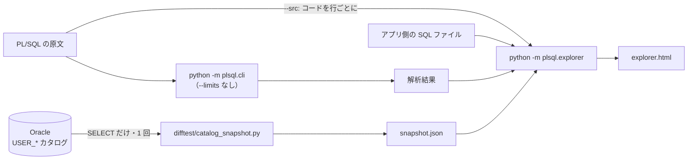

# Migration Explorer — 移行の前の調査を 1 つの画面で

移行を検討するときに最初に要るのは、変換の結果ではなく、いまの姿です。どの PL/SQL と SQL が、どのテーブルを触り、そのテーブルが何とつながっていて、どれくらいの量があるのか。Migration Explorer は、それを 1 つの HTML にまとめます。

- **読むだけ**の画面です。サーバも DB もネットワークも要りません。ファイルを渡せば、受け取った人はブラウザで開けます
- 入口は**テーブルの一覧**（行数、サイズ、前回の統計からの書き込み、書く / 読む routine と SQL の数、外部キー、trigger）。テーブルを選ぶと、触る routine と SQL、外部キーの図、制約、索引、付いている trigger と view、列の統計（選択性、NULL の割合）が出ます。routine を選ぶと、**コードそのもの**（行番号つき、SQL・ロック・例外・診断の行に印）、判定の中身、引数と変数、DB のコードとの比較、呼び出し関係が出ます
- DB にしかない情報（制約、外部キー、trigger、view、行数、サイズ、統計）は、実 DB で **1 回だけ** 流す収集スクリプトの **snapshot ファイル**から読みます。画面が DB につながることはありません



## 1. snapshot を取る（DB に入れる人がやること）

`difftest/catalog_snapshot.py` の **1 ファイルだけ**を渡せば済みます。リポジトリのほかのコードは要りません。必要なのは Python 3.9 以上と `pip install oracledb` です。既定の thin モードでは Oracle クライアントは要りません。

```bash
export SRC_ORACLE_HOST=db.example SRC_ORACLE_PORT=1521 SRC_ORACLE_SERVICE=ORCLPDB1
export SRC_ORACLE_USER=shop            # このユーザのスキーマが snapshot になる
python catalog_snapshot.py --out /secure/dir/shop.snapshot.json      # パスワードは端末で聞かれる
```

**DB に何をするか: 何もしません。**

- 送る文は、ファイルの先頭の `STATEMENTS` に全部並んでいます。接続するユーザ自身の `USER_*` ディクショナリビューへの `SELECT` と、その前の `SET TRANSACTION READ ONLY` の 1 文だけです。流す前に `--print-statements` で、送る文をそのまま出せます（このときは接続しません）
- 何も作らず、統計も取らず、あなたのテーブルの行は読みません。行数は Oracle のオプティマイザ統計の値で、画面には統計を取った日時と並べて出ます
- 追加の権限は要りません（`USER_*` は自分のオブジェクトだけを見せる）

**何を取るか**

| | 既定 | オプション |
|---|---|---|
| テーブル、列、制約、外部キー、索引と索引の統計、trigger、view、依存関係、サイズ、テーブルと列の統計、オブジェクトの一覧（有効か、最終 DDL 時刻）、前回の統計からの INSERT / UPDATE / DELETE の件数、採番、パーティションの方式とキー、シノニム、DB リンクの**名前**、LOB の列、マテリアライズドビュー、テーブルと列のコメント | 取る | |
| **view の定義、マテリアライズドビューの問い合わせ、trigger の本体、CHECK の条件** | **取る** | 画面が「何がこのテーブルを触るか」を言うのに要る。リテラルやコメントに業務の値が書かれていることはありえます |
| procedure・function・package・type のコード（`USER_SOURCE`） | 文を送らない | `--include-source` |
| 列の最小値・最大値・頻出値 | 文を送らない | `--include-values --acknowledge-real-data` |
| DB リンクの接続先（ホスト、アカウント）、パーティションの境界の値 | **取らない** | どのオプションでも取らない |
| wrapped（難読化）されたコードの本文 | **取らない** | `--include-source` でも、wrapped であることだけを記録する |

**`--include-source` を付けない snapshot は、「構造だけ」ではありません。** 上の表のとおり、view の定義と trigger の本体は入っています。このオプションが決めるのは、`USER_SOURCE`（procedure・function・package・type のコード）を取るかどうかだけです。`--include-source` を付けると、渡された原文と DB で動いているコードの食い違いを、画面が見つけられるようになります（下の 3）。

**実データの値は、頼まなければ取りません。** 列の統計には、その列の最小値・最大値と、ヒストグラムの頻出値が入っています。これは実データの行そのものです。

| | 既定 | `--include-values --acknowledge-real-data` |
|---|---|---|
| distinct 数、NULL 数、平均長、ヒストグラムの種類 | 取る | 取る |
| 最小値、最大値、頻出値（上位 20） | **文を送らない** | 取る（Oracle の内部形式を、型ごとに復号して持つ。復号できない型は「復号できない」と持つ） |
| snapshot の `containsDataValues` | `false` | `true`。ここから作った画面は、どの画面にも帯が出る |

`--include-values` だけでは取りません。何が入るかを説明して、接続する前に終了コード 2 で止まります。**`--acknowledge-real-data` も付けたときだけ**取ります。オプションを 1 つ付け間違えただけで、誰かの実データが DB の外に出ることがないようにするためです。

どちらの場合も、view の定義、trigger の本体、CHECK の条件は取ります。**その中にリテラルとして業務の値が書かれていることはありえます**（`WHERE status <> 'CANCELLED'` のように）。画面は、値を含むかどうかに関わらず、そのことを先頭に出します。

**接続**

| 環境変数 | |
|---|---|
| `SRC_ORACLE_DSN` | 接続記述子か Easy Connect の文字列を丸ごと。下の 3 つより優先する。`tcps://host:2484/service` で TLS の接続 |
| `SRC_ORACLE_HOST` / `SRC_ORACLE_PORT` / `SRC_ORACLE_SERVICE` | 既定は `localhost` / `1521` / なし |
| `SRC_ORACLE_USER` | snapshot を取るスキーマのユーザ |
| `SRC_ORACLE_PASSWORD` | 無ければ端末で聞く。**引数では受けません**（`ps` とシェルの履歴に残るため） |

DB が Native Network Encryption を必須にしていると、thin モードではつながりません（`DPY-3001`）。道は 2 つあります。

- TLS が使えるなら、接続記述子を `SRC_ORACLE_DSN` に渡す（`tcps://…`）。thin モードのままで済みます
- 使えないなら、Oracle Client（Instant Client で足ります）が入っている端末で `--thick` を付ける。python-oracledb が Oracle Client を使って接続します。Client が見つからなければ、接続する前に説明つきで止まります

終了コードは、0 = 書けた、1 = 書けたが取れなかった節がある（ファイルの `skipped` に理由）、2 = 書けなかった、です。

**実案件の snapshot と、そこから作った HTML は、リポジトリの外に置いてください。** 誰かの DB の構造が入っています。`--out` に必ず置き場所を書かせるのはそのためです。このリポジトリでは `out/` と `*.snapshot.json` を `.gitignore` に入れてあります（コミットしてあるのは、合成データの fixture だけです）。

## 2. 解析して、画面を作る

```bash
.venv/bin/python -m plsql.cli <PL/SQL のディレクトリ> --out-dir out/explore/analysis --quiet
.venv/bin/python -m plsql.explorer out/explore/analysis \
    --src <PL/SQL のディレクトリ> \
    --snapshot /secure/dir/shop.snapshot.json \
    --sql <アプリ側の SQL のファイルかディレクトリ> \
    --spec-dir out/migrate/<名前>/spec \
    --out out/explore/explorer.html
```

- **解析は `--limits` なしで流します。** `--limits` は、SQL を変換後の形に書き換えることがあります。調べたいのは、いまの姿です。`--limits` つきの解析結果を渡すと、画面は作りますが警告を出し、終了コードが 1 になります
- **`--src` は、解析にかけたのと同じディレクトリ**です。渡すと、routine の画面にコードが行番号つきで出て、テーブルの「触るもの」からその行へ飛べます。渡さなければ、SQL 文は出ますが、その周りのコードは出ません。**原文は、コメントも含めて全文が HTML に入ります。** 原文に資格情報（`CREATE DATABASE LINK … IDENTIFIED BY` など）が書かれていれば、それも入ります。渡す前に確かめてください
- `--snapshot` は無くても動きます。そのときは、DB にしかない欄がすべて「未取得」になります
- `--sql` は何度でも書けます。ディレクトリなら `*.sql` を探します。PL/SQL からは誰も触らないテーブルを、アプリケーションが直接触っていることはよくあります
- `--spec-dir` に plsql-spec の仕様書（`<module>.md`）があれば、routine の画面からリンクします
- 同じ入力からは、バイト単位で同じ HTML ができます

終了コードは、0 = 作れた、1 = 作れたが警告がある、2 = 入力が誤っていて作らなかった、です。

fixture で試すには:

```bash
.venv/bin/python -m plsql.cli fixtures/explorer/src --out-dir out/explore/analysis --quiet
.venv/bin/python -m plsql.explorer out/explore/analysis --snapshot fixtures/explorer/snapshot.json \
    --src fixtures/explorer/src --sql fixtures/explorer/app --out out/explore/explorer.html
open out/explore/explorer.html
# DB のコードとの比較も見るなら、--snapshot fixtures/explorer/snapshot-with-source.json
```

## 3. 画面の見方

**テーブルの一覧**は、どの欄でも並べ替えられます。行数やサイズで並べると、scan が重くなるテーブルと、移行の順番の見当が付きます。「書く / 読む」は `routine の数 / SQL の数`（SQL は、アプリ側の文と view の定義）です。上の検索は、テーブル・routine・SQL ファイルを名前で探して、その詳細へ直接飛びます。URL の `#/table/orders` の部分ごと人に渡せます。

**routine の画面**は、上から、判定の中身（効いたルール、確信度の因子と 0 の因子、AUTO にならない理由、直し方の候補、必要なテスト）、診断、引数とローカル変数（書かれた型と解決した型）、DB のコードとの比較、コード、SQL、呼び出し関係です。コードの右の印は、その行にあるものです: SQL（読むテーブル、書くテーブル）、`FOR UPDATE`、動的 SQL、`RAISE`、例外ハンドラ、`COMMIT` / `ROLLBACK`、呼び出し、診断。行番号を押すと、その行を指す URL（`#/routine/create_order/L45`）になります。

- 解析が足した文（trigger の織り込みなど）と、解析が足した変数は、印にも変数の一覧にも出ません。原文に無いからです
- 式の中の関数呼び出し（`v := f(x)`）は、IR に文として出ないので、行の印にはなりません。「呼び出す routine」の欄には出ます

**DB のコードとの比較**（`--include-source` で取った snapshot と `--src` の両方があるとき）。比べる単位は DB のオブジェクト 1 つです。package は仕様部（`PACKAGE`）と本体（`PACKAGE BODY`）を別々に比べ、仕様部は本体と同じ名前の `.pks` から取ります。`CREATE OR REPLACE` の前置き、末尾の `/`、行末の空白、空行の違いは、違いに数えません。それ以外は「DB のコードと違う」で、違いを統合 diff で見られます（`-` が原文、`+` が DB。原文の側の行番号は、ファイルの行番号です）。wrapped のコードは比べません。

**DB にあるが原文が渡されていないもの**は、一覧の上のリンクから見られます。コードを取っていれば本文が読めます。TYPE と TYPE BODY は解析の対象外なので、別の欄に出ます。`--src` を渡していないときは、package の仕様部が渡されたかどうかが分からないので、そこには数えません。

**採番**（sequence）の一覧も、一覧の上のリンクからです。ScalarDB に sequence は無いので、使っている routine ごとに採番の設計が要ります。SQL の中だけでなく、代入（`p_id := order_seq.NEXTVAL`）の中の利用も拾います。

**書き込みの件数**は、前回の統計から Oracle が数えた INSERT / UPDATE / DELETE です。Oracle はこれをメモリに持ち、ときどき書き出します。だから値は「少なくともこれだけ」の目安で、0 は「書き出された書き込みが無い」です。書き込みの多いテーブルの見当を、AWR なしで付けるための欄です。

**選択性**は distinct 数 ÷ 行数、**NULL の割合**は NULL 数 ÷ 行数です。統計の無いテーブルと、行数が 0 のテーブルでは計算しません。

**「分からない」は、0 とは別の言葉で出ます。**

| 画面の言葉 | 意味 |
|---|---|
| 未取得 | snapshot を渡していない、または snapshot にその節が無い（取れなかった理由は先頭に出る） |
| 統計なし | テーブルは snapshot にあるが、Oracle が一度も統計を取っていない。行数 0 ではない |
| 行数の横の日付、「古い」 | 行数は統計の値で、実際の件数ではない。いつの値かを必ず見る |
| snapshot に無い | 原文の SQL は名指ししているが、このスキーマにそのテーブルが無い（別のスキーマ、消された表） |
| リモート（DB リンク） | `orders@link`。この snapshot には入らない |
| 見えていない SQL | 下の節 |
| 原文が渡されていない | `--src` が無い、またはそのファイルが見つからなかった |
| 比べていない | DB のコードと比べられなかった。理由（コードを取っていない、wrapped、snapshot が無い）が並べて出る |
| 0 | 確かめて、0 だった |

並べ替えても、未取得と統計なしは数値と混ざらず、末尾にまとまります。

**見えていない SQL。** 「このテーブルを書く routine は無い」が本当なのは、隠れているものが無いときだけです。次のものは、どのテーブルを触るかが静的には分かりません。消さずに一覧に載せ、**どのテーブルの詳細にも**出します。

- 動的 SQL（`EXECUTE IMMEDIATE`）で、変種を列挙できなかったもの
- 解析できなかった SQL、アプリ側の SQL ファイルの中の PL/SQL ブロック
- 原文が渡されていない trigger。DB にはあるので「付いているもの」に出ます。中の SQL は解析しませんが、依存関係（`USER_DEPENDENCIES`）が取れていれば、その trigger が名指しするテーブルの側にだけ出ます

**偏りの目安**は、Oracle がその列にヒストグラムを作ったかどうかです（既定の設定では、値が偏っていて、その列で絞り込む問い合わせがあったときに作られる）。distinct 数と並べて、パーティションキーの候補を見る材料にします。目安であって、判定ではありません。

## 4. 限界

- snapshot には版があります。いまの収集スクリプトが書くのは**版 2** です。版 1（索引の統計、書き込みの件数、オブジェクトの一覧、採番、パーティション、コメント、コードを持たない）の snapshot も読め、無い欄は「未取得」になります
- **snapshot 1 つは 1 スキーマ**です。複数のスキーマにまたがる DB は、スキーマごとに取ります。別のスキーマの親を指す外部キーは、持ち主の名前つきで「この snapshot の外」と出ます（相手のテーブル名は `ALL_CONSTRAINTS` にあり、これは読みません）
- **テーブル名は、スキーマ名を除いた小文字の名前で突き合わせます**（解析がスキーマ名を落とすため）。別のスキーマに同じ名前のテーブルがあると、1 つに見えます
- **同じ文の中で読みも書きもするテーブル**は、「書く」にだけ数えます（解析の制限）
- 解析結果はファイル名しか持たないので、サブディレクトリに同じ名前の原文があると、行の出どころを取り違えることがあります。そのときは警告が出ます
- 実行統計（`V$SQL`、AWR）は取りません。どの SQL が何回流れているかは分かりません
- 対象は Oracle 12.2 以降です

## 5. fixture を取り直す（リポジトリを直す人向け）

`fixtures/explorer/` の 3 つの snapshot は、検証用の Oracle（[検証環境](verification.md) の `source-oracle`）で実際に取ったものです。収集スクリプトか fixture のスキーマを変えたら取り直します。

```bash
(cd difftest && docker compose --profile oracle up -d)
sh fixtures/explorer/db/setup.sh                 # ユーザ explorer を作り直し、表・PL/SQL・DB にしか無い view と trigger・合成データを入れる
export SRC_ORACLE_SERVICE=FREEPDB1 SRC_ORACLE_USER=explorer SRC_ORACLE_PASSWORD=explorer
.venv/bin/python difftest/catalog_snapshot.py --out fixtures/explorer/snapshot-no-stats.json
sh fixtures/explorer/db/setup.sh stats           # 統計を取り、そのあとで少し書き込み、件数を書き出させる（準備の側でやる。収集スクリプトは SELECT しかしない）
.venv/bin/python difftest/catalog_snapshot.py --out fixtures/explorer/snapshot.json
.venv/bin/python difftest/catalog_snapshot.py --include-values --acknowledge-real-data --out fixtures/explorer/snapshot-with-values.json
.venv/bin/python difftest/catalog_snapshot.py --include-source --out fixtures/explorer/snapshot-with-source.json
.venv/bin/python -m pytest -q tests/test_catalog_snapshot.py tests/test_plsql_explorer_*.py
```

`snapshot-v1.json` は版 1 の見本で、取り直しません（古い snapshot が読めることを確かめるためのもの）。

CI は DB なしで回ります。収集スクリプトの「送る文は SELECT だけ」「既定では値の列を名指ししない」の検査と、snapshot の組み立ては、ドライバ（`oracledb`）が無くても走ります。

画面の動き（並べ替え、検索、テーブル → 触る行 → コードのその行 → テーブル、外部キーの図からの移動、300 テーブル・500 routine・原文 48,000 行での速さ）は、ブラウザで確かめたものです。`template.html` を直したら、fixture の HTML を開いて同じ道をたどってください。
