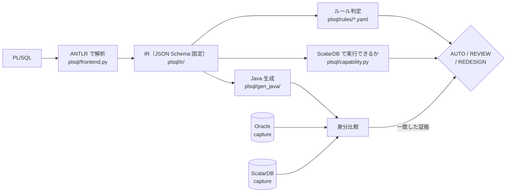

# PL/SQL → Java 変換（`plsql/`）

[文書の入口](../README.md) ｜ [はじめに](getting-started.md) ｜ [SQL の変換](sql-conversion.md) ｜ [PL/SQL の変換](plsql-conversion.md) ｜ [スキル](skills.md) ｜ [検証環境](verification.md)

SQL 文単位の変換に加えて、**PL/SQL の package / procedure / trigger を Java + ScalarDB へ移す**系統が
あります。SQL 部分は上の変換ツールをそのまま使い、制御構造・例外・型を Java へ落とします。

**この系統の中心は「変換できること」ではなく「変換してよいか」の判定です。** routine ごとに
AUTO / REVIEW / REDESIGN を出し、**AUTO は「無人で生成してよい」という意味**なので、そう言えるだけの
証拠が揃ったものにしか付きません。証拠とは、**実 Oracle と実 ScalarDB で同じシナリオを走らせて結果が
一致したこと**です。



## 使い方

Claude Code から、仕様の調査 → 変換と人の判断 → 変換後の仕様 → 承認 → テストの順に進めるなら [migrate-flow スキル](skills.md#migrate-flow-スキル) を使います。下はその中で動いているコマンドです。

```bash
# 判定・レポート・トレーサビリティ
python -m plsql.cli fixtures/plsql/src --out-dir out/plsql     --evidence difftest/work/plsql-diff.json --generated generated

# Java を生成する（--limits でプロジェクトの決定を渡す。--handover は引き渡し版の見出しに替える。
# 決まると生成コードが変わるもの（REVIEW、未決定の REDESIGN）が残っていれば、--handover は何も書かずに拒否する）
python -m plsql.generate fixtures/plsql/src --out-dir generated --limits fixtures/plsql/limits.yaml

# 生成物が javac を通ることまで確かめる（JVM と Gradle が要る。落ちた routine を名指しして 1 を返す）
python -m plsql.generate fixtures/plsql/src --out-dir generated --verify-compile

# ルールが行数上限の確認を求めているのに誰も決めていない routine を挙げて止める
python -m plsql.generate fixtures/plsql/src --out-dir generated --limits fixtures/plsql/limits.yaml --limits-strict

# 差分比較（Oracle と ScalarDB の両方が要る）
python difftest/plsql_capture.py --variant scaled
python difftest/plsql_diff.py --full --json difftest/work/plsql-diff.json

# レビュー用の報告（decisions.json / unresolved.md）。--limits でプロジェクトの決定を適用し、REDESIGN の状態も出す
python -m plsql.cli fixtures/plsql/src --evidence difftest/work/plsql-diff.json --variant scaled \
    --generated generated --limits fixtures/plsql/limits.yaml --out-dir out/plsql-report

# KPI
python -m plsql.kpi --evidence difftest/work/plsql-diff.json --generated generated
```

比較結果（`--evidence`）は、**いまのソースと生成器で測ったものだけ**が数えられます。capture の時点で PL/SQL の
ソースとツールチェーン（生成器・SQL 変換器・実行時ヘルパ）のハッシュを記録し、判定のときに照らします
（`plsql/fingerprint.py`、[KPI](../design/plsql-kpi.md) の「確信度」）。ソースか生成器を変えたら、その分は
「古い証拠」として REVIEW に戻り、`decisions.json` の `staleEvidence` に理由が出ます。`plsql_capture.py` から取り直してください。

## 出力

| ファイル | 中身 |
|---|---|
| `decisions.json` | routine ごとの判定・確信度 5 因子・**どのルールがどのファイルで判定したか**・代替案・`whyNotAuto` |
| `unresolved.md` | REVIEW / REDESIGN を REDESIGN 先頭で並べ、根拠と受け入れに必要なテストを付ける |
| `traceability.csv` | 生成 Java の member → 元 PL/SQL の `file:line`（**生成ツリーと突き合わせ済み**） |
| `generated/` | Java。`Do not edit`（引き渡し後は `--handover` で文言が変わる） |

## 現在地

合成 corpus（29 unit / 67 routine）に対して:

| | |
|---|---|
| parse 率・型解決率・compile 率 | **100%** |
| 判定一致 | **95.5%**（64/67。食い違う 3 件は holdout2 の期待値で、2026-09-20 の方針変更によるもの。期待値は書き換えていない） |
| **意味的同等性（AUTO 対象）** | **100%**（金額の 2 規約とも AUTO 49/49 が実 Oracle と一致） |
| 判定（2026-09-20 の実測。金額の 2 規約とも同じ） | AUTO 35 / REVIEW 5 / REDESIGN 27。プロジェクトの決定（`--limits fixtures/plsql/limits.yaml`）を適用すると AUTO 40 / REVIEW 0 / REDESIGN 27 |
| REDESIGN 27 件の状態（決定の適用後） | **27 件すべて、再設計を決定済みで実 DB でも一致** / 未決定 0。DB Link の `prc_remote_sync` は、失敗時の例外の種類の差 1 点を「受け入れた差」として記録してある（2026-09-20。比較の報告には理由つきで出る）。判定は REDESIGN のまま動かさない（AUTO 禁止条件） |

**数値は合成 corpus 上のものであり、実案件耐性の証拠ではありません。** 非 AUTO の 27 件（決定の適用後。すべて REDESIGN で、全件が再設計を決定済み・実 DB で一致）を塞いでいるのは
変換できない構文ではなく、**人が決めるべきこと**です（走査行数の上限、採番方式、トランザクション境界など。
[トランザクションと行ロック](../plsql-migration/plsql-transaction-patterns.md)、[cursor](../plsql-migration/plsql-cursor-patterns.md)、[生成コードの外で決めること](../plsql-migration/plsql-decisions-outside-generator.md)）。

## 次に読むもの

| 知りたいこと | 文書 |
|---|---|
| 判定（AUTO / REVIEW / REDESIGN）と確信度の定義、計測コマンド | [KPI](../design/plsql-kpi.md) |
| REVIEW / REDESIGN になった routine をどう直すか | [cursor](../plsql-migration/plsql-cursor-patterns.md) / [トランザクションと行ロック](../plsql-migration/plsql-transaction-patterns.md) / [trigger と外部副作用](../plsql-migration/plsql-trigger-patterns.md) |
| 生成器が決めずに残す問い（運用・呼び出し側・業務） | [生成コードの外で決めること](../plsql-migration/plsql-decisions-outside-generator.md)、[業務ロジックとの整合の問い](../plsql-migration/plsql-biz-alignment-questions.md) |
| corpus とシナリオの作り、corpus の外の routine を流す手順 | [fixtures/plsql/](../../fixtures/plsql/README.md)、[fixtures/plsql-external/](../../fixtures/plsql-external/README.md) |
| なぜこの構成か、これまでの決定 | [移行基盤の設計](../design/plsql-migration-platform-design.md)、[実装計画](../design/plsql-conversion-implementation-plan.md)（§9 が決定事項） |
