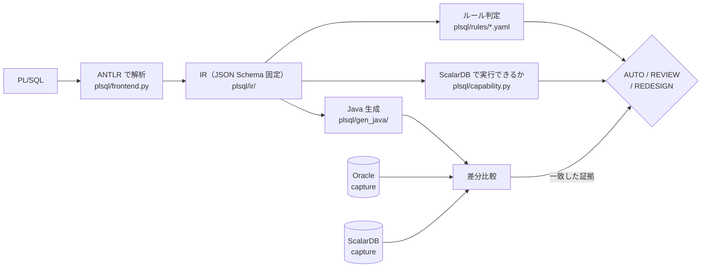
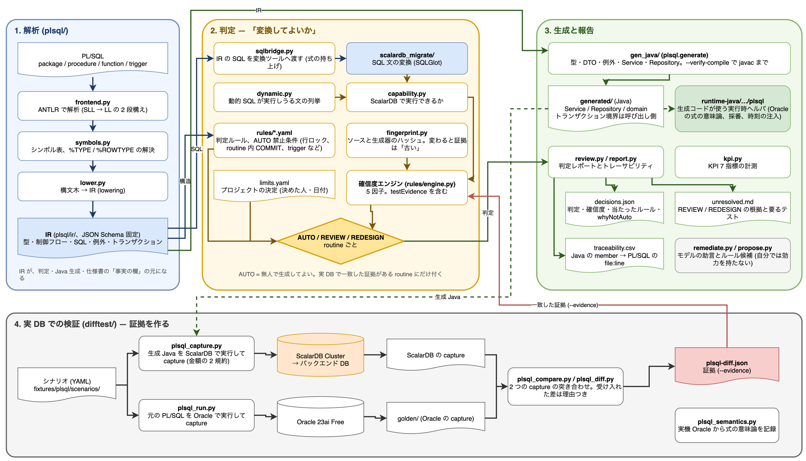

# PL/SQL → Java 変換（`plsql/`）

[文書の入口](../README.md) ｜ [はじめに](getting-started.md) ｜ [チュートリアル](tutorial.md) ｜ [SQL の変換](sql-conversion.md) ｜ [PL/SQL の変換](plsql-conversion.md) ｜ [スキル](skills.md) ｜ [検証環境](verification.md)

SQL 文単位の変換に加えて、**PL/SQL の package / procedure / trigger を Java + ScalarDB へ移す**系統が
あります。SQL 部分は上の変換ツールをそのまま使い、制御構造・例外・型を Java へ落とします。

**この系統の中心は「変換できること」ではなく「変換してよいか」の判定です。** routine ごとに
AUTO / REVIEW / REDESIGN を出し、**AUTO は「無人で生成してよい」という意味**なので、そう言えるだけの
証拠が揃ったものにしか付きません。証拠とは、**実 Oracle と実 ScalarDB で同じシナリオを走らせて結果が
一致したこと**です。



全体の構成図（draw.io。元データは [plsql-conversion.drawio](../diagrams/plsql-conversion.drawio)）:



## 使い方

Claude Code や Codex から、仕様の調査 → 変換と人の判断 → 変換後の仕様 → 承認 → テストの順に進めるなら [migrate-flow スキル](skills.md#migrate-flow-スキル) を使います。下はその中で動いているコマンドです。

```bash
# 判定・レポート・トレーサビリティ
python -m plsql.cli fixtures/plsql/src --out-dir out/plsql     --evidence difftest/work/plsql-diff.json --generated generated

# Java を生成する（--limits でプロジェクトの決定を渡す。--handover は引き渡し版の見出しに替える。
# 決まると生成コードが変わるもの（REVIEW、未決定の REDESIGN）が残っていれば、--handover は何も書かずに拒否する）
python -m plsql.generate fixtures/plsql/src --out-dir generated --limits fixtures/plsql/limits.yaml

# 生成物が javac を通ることまで確かめる（JVM と Gradle が要る。落ちた routine を名指しして 1 を返す）
python -m plsql.generate fixtures/plsql/src --out-dir generated --verify-compile

# ルールが行数上限の確認を求めているのに誰も決めていない routine を挙げて止める
python -m plsql.generate fixtures/plsql/src --out-dir generated --limits fixtures/plsql/limits.yaml --limits-strict

# 差分比較（Oracle と ScalarDB の両方が要る）
python difftest/plsql_capture.py --variant scaled
python difftest/plsql_diff.py --full --json difftest/work/plsql-diff.json

# レビュー用の報告（decisions.json / unresolved.md）。--limits でプロジェクトの決定を適用し、REDESIGN の状態も出す
python -m plsql.cli fixtures/plsql/src --evidence difftest/work/plsql-diff.json --variant scaled \
    --generated generated --limits fixtures/plsql/limits.yaml --out-dir out/plsql-report

# KPI
python -m plsql.kpi --evidence difftest/work/plsql-diff.json --generated generated
```

比較結果（`--evidence`）は、**いまのソースと生成器で測ったものだけ**が数えられます。capture の時点で PL/SQL の
ソースとツールチェーン（生成器・SQL 変換器・実行時ヘルパ）のハッシュを記録し、判定のときに照らします
（`plsql/fingerprint.py`、[KPI](../design/plsql-kpi.md) の「確信度」）。ソースか生成器を変えたら、その分は
「古い証拠」として REVIEW に戻り、`decisions.json` の `staleEvidence` に理由が出ます。`plsql_capture.py` から取り直してください。

## 出力

| ファイル | 中身 |
|---|---|
| `decisions.json` | routine ごとの判定・確信度 5 因子・**どのルールがどのファイルで判定したか**・代替案・`whyNotAuto` |
| `unresolved.md` | REVIEW / REDESIGN を REDESIGN 先頭で並べ、根拠と受け入れに必要なテストを付ける |
| `traceability.csv` | 生成 Java の member → 元 PL/SQL の `file:line`（**生成ツリーと突き合わせ済み**） |
| `callgraph.json` | routine ごとの呼び出し先（解決できたものは id、できなかったものは名前）。式の中の関数呼び出し（`v := f(x)`）は `program.ir.json` に文として出ないので、呼び出し関係はここにしか無い。呼び出しの無い routine も載る |
| `program.ir.json` / `inventory.json` / `diagnostics.sarif` / `summary.md` | IR（JSON Schema 固定）、資産の一覧と KPI、行つきの診断（SARIF）、人が読む要約 |
| `generated/` | Java。`Do not edit`（引き渡し後は `--handover` で文言が変わる） |

これらを 1 つの画面で読むなら [Migration Explorer](explorer.md) です: routine のコード（行ごとに、触るテーブル・ロック・例外・診断の印つき）、判定の中身（効いたルール、確信度の因子、`whyNotAuto`、直し方、必要なテスト）、呼び出し関係を、テーブルの側からもたどれます。

## Java の型の対応

PL/SQL の変数・引数・戻り値・`%TYPE` / `%ROWTYPE` の列は、`plsql/gen_java/types.py` の `java_type()` が **Java の型**と **ScalarDB に置くときの型（保存形）**の 2 つに対応させます。
2 つを分けるのは、Java の型に合わせて保存形を決めると精度が黙って落ちるからです（[移行基盤の設計](../design/plsql-migration-platform-design.md) の 5.3「型表現」）。
[SQL の変換](sql-conversion.md#データ型の対応)の対応表とは小数の扱いが違い、そこは意図的です。

| Oracle の型 | Java の型 | 保存形 | 注意 |
|---|---|---|---|
| NUMBER(p), p ≤ 9 | Integer | INT | |
| NUMBER(p), p ≤ 18 | Long | BIGINT | |
| NUMBER(p), p > 18 | BigDecimal | BIGINT | Java 側は正確に持つが、64 ビットを超える値は保存であふれる。SQL 変換側と同じ選択で、列の型を黙って変えない |
| NUMBER(p, s), s > 0（金額を含む） | BigDecimal | BIGINT（10^s 倍した整数） | ScalarDB に DECIMAL が無く、DOUBLE では Oracle の四捨五入が保てない。`scale` を持ち、生成された repository が `Plsql.bind` / `Plsql.read` で往復させる |
| 精度なしの NUMBER | BigDecimal | TEXT | 何桁でも入るので、今のデータが long に収まるからと long にはしない。精度が分からないことを見える形で残す |
| PLS_INTEGER / BINARY_INTEGER / SIMPLE_INTEGER / INTEGER / INT / SMALLINT | Integer | INT | |
| BINARY_FLOAT | Float | FLOAT | |
| BINARY_DOUBLE / FLOAT / REAL | Double | DOUBLE | |
| VARCHAR2 / NVARCHAR2 / CHAR / NCHAR / VARCHAR / STRING | String | TEXT | Oracle は `''` を NULL として扱う。この区別はアプリが保つ（`Plsql.bind` は `''` を NULL にして渡す） |
| CLOB / NCLOB / LONG | String | TEXT | 大きな値のサイズとストリーミングは別に決める |
| RAW / LONG RAW / BLOB | byte[] | BLOB | String を経由しない |
| DATE | LocalDateTime | TIMESTAMP | Oracle の DATE は時刻を持つので LocalDate にしない |
| TIMESTAMP(p) | LocalDateTime | TIMESTAMP | ScalarDB はミリ秒まで |
| TIMESTAMP WITH (LOCAL) TIME ZONE | OffsetDateTime | TIMESTAMPTZ | UTC で保存、ミリ秒まで |
| BOOLEAN | Boolean | BOOLEAN | PL/SQL の BOOLEAN は NULL を取るので primitive にしない |
| TABLE OF x / VARRAY(n) OF x（コレクション） | `List<x の Java 型>` | x の保存形 | 1 始まり。コンストラクタ・要素の読み書き・COUNT / FIRST / LAST / NEXT / PRIOR / EXISTS / DELETE / EXTEND / TRIM / LIMIT は `Plsql` の helper。途中の `DELETE(i)` は隙間として持つ。要素の型が解決できなければ Object のまま（#45） |
| TABLE OF x INDEX BY VARCHAR2 | `Map<String, x の Java 型>`（TreeMap） | — | キー順に FIRST / NEXT で回る。`INDEX BY PLS_INTEGER` は BULK COLLECT / FORALL / 配列 bind の使い方に合わせて List のまま（疎なキーは模していない） |
| RECORD（`TYPE t IS RECORD`） | 生成した record | 列ごと | field ごとに NULL か既定値で作り、field への代入は record を組み直す（Java の record は不変） |
| SYS_REFCURSOR | routine の中: 行を先に読むループ。呼び出し側へ返す: `List<行の record>` | — | `OPEN rc FOR q` の問合せで読む。`RETURN rc` は行の List を返す method になり、呼び出し側は FETCH の代わりに List を受け取る（#44） |
| `%ROWTYPE` | 生成した record | 列ごと | 列名で対応する（dto.py）。cursor FOR ループの行は列の幅にかかわらず数値を BigDecimal にする。ループ変数は PL/SQL では NUMBER で、NUMBER 引数の routine にそのまま渡されるため |
| 解決できない型 | Object | TEXT | 生成器は推測しない。`type not resolved` の注記が付く |

**金額の 2 規約。** `NUMBER(12, 2)` の列は、規約 `scaled` では 10^2 倍の BIGINT、規約 `double` では DOUBLE です（`difftest/plsql_schema.py --variant`）。
生成コードはバインドする列の ScalarDB 型を Oracle の型ではなく**実際に読み込んだスキーマ**から取り、`Plsql.bind(値, "BIGINT", 2)` のように型とスケールを添えて渡します。
素の BigDecimal を ScalarDB SQL に渡すと型ごと拒否されるため（DB-SQL-10016）、この境界は必ず通します。読み取りは `Plsql.read(値, 型, スケール)` が BigDecimal に戻し、
routine の NUMBER 引数に列由来の Long / Integer を渡すときは `Plsql.dec(値)` で BigDecimal にします。

## 現在地

合成 corpus（29 unit / 67 routine）に対して:

| | |
|---|---|
| parse 率・型解決率・compile 率 | **100%** |
| 判定一致 | **95.5%**（64/67。食い違う 3 件は holdout2 の期待値で、2026-09-20 の方針変更によるもの。期待値は書き換えていない） |
| **意味的同等性（AUTO 対象）** | **100%**（金額の 2 規約とも AUTO 49/49 が実 Oracle と一致） |
| 判定（2026-09-20 の実測。金額の 2 規約とも同じ） | AUTO 35 / REVIEW 5 / REDESIGN 27。プロジェクトの決定（`--limits fixtures/plsql/limits.yaml`）を適用すると AUTO 40 / REVIEW 0 / REDESIGN 27 |
| REDESIGN 27 件の状態（決定の適用後） | **27 件すべて、再設計を決定済みで実 DB でも一致** / 未決定 0。DB Link の `prc_remote_sync` は、失敗時の例外の種類の差 1 点を「受け入れた差」として記録してある（2026-09-20。比較の報告には理由つきで出る）。判定は REDESIGN のまま動かさない（AUTO 禁止条件） |

**構文カタログ上の値**（[samples/oracle-samples](../../samples/oracle-samples/README.md)、Oracle 公式ドキュメントの構成に沿った SQL 4 本 + PL/SQL 3 本、2026-09-24〜25）:
41 routine が AUTO 候補 7 / REVIEW 10 / REDESIGN 24、41 routine 全部が javac を通り、実 DB の 31 シナリオで一致 26 / 相違 5（2026-09-25 の 5 回目の対応後。相違は値の差ではなく、下の「まだ模していない構文」で止まるもの）。
この検証で直した生成器の穴は 22 件（Issue #30〜#45）+ 4 回目の 5 件 + 5 回目の 4 件（#47〜#50）で、記録の「Issue の修正後」以降の節にある。

### 移行先で模していない構文（2026-09-25 時点）

構文カタログで見つかり、Issue にしてある穴。判定は REDESIGN / REVIEW のまま、生成物はその文で `UnsupportedOperationException` を投げる（コンパイルはできる）。

| 構文 | 止まり方 | Issue |
|---|---|---|
| `:NEW` の値を書き換える BEFORE trigger（`:NEW.email := UPPER(:NEW.email)`） | 対応済み（無条件で :NEW / :OLD だけを読む代入は書く値に畳み込む、`TRIGGER_FOLDED`）。条件つき・局所変数を読む代入は `TRIGGER_REDESIGN` のまま | #47 |
| 式の中の別 module の関数呼び出し（`v := pkg.f(...)`） | 対応済み（注入した Service を呼ぶ）。OUT / IN OUT 引数（運ぶ package 変数を含む）のある関数は式の中では断る（理由つき） | #48 |
| `transactions.separate` の routine を呼ぶ側 | 対応済み（呼ぶ側が `SeparateTransactions` の口を受け取り、その connection の上に呼び先を組み立てて呼ぶ）。OUT 引数 / 戻り値を境界の外へ持ち出す形は無い | #49 |
| CHECK / FK 制約の代わり | 決定済み（2026-09-25「表ごとに決めて guard を生成」、`constraints.enforce`）。決めていない表は `CONSTRAINT_UNDECIDED` | #50 |
| `FORALL … RETURNING BULK COLLECT INTO`、`SQL%BULK_ROWCOUNT(i)` | 対応済み（RMW を割った 1 行ごとに書いた値を List に足す。FORALL の前で空にする。要素ごとの件数は `bulkRowCount`）。RMW なので `rowLocks.optimistic` の決定が要る | #51 |
| 動的 UPDATE の `RETURNING INTO`、動的 PL/SQL ブロック、`OPEN FOR '定数'` | 対応済み（文字列が定数なら静的な文として下ろす、`DYN_STATIC` / `DYN_INLINED`）。routine の中の DDL は断る（`ddl.omit` で省ける） | #52 |
| `DBMS_SQL` | PARSE の文字列が定数の問合せなら対応済み（静的な cursor FOR ループ、`DBMS_SQL_STATIC`。列番号で読む `COLUMN_VALUE` と `col_name` は列ごとの CASE）。文字列が実行時に決まるもの、DML、BIND_VARIABLE などは `DBMS_SQL_DYNAMIC` で断る | #53 |
| select list のオブジェクト型コンストラクタ、`TABLE(コレクション)`、PIPELINED | 対応済み（スキーマの `CREATE TYPE … AS OBJECT` は Java の record、`AS TABLE OF` はその List。コンストラクタを選ぶ SELECT は列を読んでアプリで組む `OBJECT_BUILT`、`TABLE(v)` への `COUNT(*)` は List を回す `TABLE_COLLECTION`、PIPELINED は List を返す関数）。`TABLE(v)` への COUNT(*) 以外の問合せは断る | #54 |
| program の外の routine への名前付き引数（`DBMS_APPLICATION_INFO`） | 対応済み（組み込み package の対応表 `plsql/builtins.py`）。表に無い package は断る | #55 |
| view への INSTEAD OF trigger | trigger 本体は対応済み（:NEW / :OLD は view の列の型で受け取る。SET の相関の無いスカラ副問合せは先に読む `SUBQUERY_READ_FIRST`、0 行は NULL、2 行以上は ORA-01427）。view へ書く routine に本体を織り込む形はまだ無い（view へ書く文は ScalarDB に view が無いので断られる） | #56 |

模せるようになったもの（同じ検証で直した）: DDL の `DEFAULT` 句（省いた列を INSERT に足す）、trigger 本体の `UPDATING('列')`（書く側が静的に決めて渡す）、`INSERT … VALUES (seq.NEXTVAL, …) RETURNING id INTO v`（INSERT の前に代入）、
CHECK / FOREIGN KEY の guard（`constraints.enforce`、#50）、`PRAGMA EXCEPTION_INIT` の番号を持つ例外クラス、`:NEW` を書き換える BEFORE trigger の畳み込み（#47）、式の中の別 module の関数呼び出しと OUT 引数のある関数の巻き上げ（#48）、別トランザクションの routine を呼ぶ側（#49）。
`WHERE p IS NULL OR col = p`（引数が NULL なら絞らない）は、p が NULL のときの問合せと等号で絞る問合せに分けて、実行時に選ぶ（`OPTIONAL_FILTER`）。

**数値は合成 corpus 上のものであり、実案件耐性の証拠ではありません。** 非 AUTO の 27 件（決定の適用後。すべて REDESIGN で、全件が再設計を決定済み・実 DB で一致）を塞いでいるのは
変換できない構文ではなく、**人が決めるべきこと**です（走査行数の上限、採番方式、トランザクション境界など。
[トランザクションと行ロック](../plsql-migration/plsql-transaction-patterns.md)、[cursor](../plsql-migration/plsql-cursor-patterns.md)、[生成コードの外で決めること](../plsql-migration/plsql-decisions-outside-generator.md)）。

## 次に読むもの

| 知りたいこと | 文書 |
|---|---|
| 判定（AUTO / REVIEW / REDESIGN）と確信度の定義、計測コマンド | [KPI](../design/plsql-kpi.md) |
| REVIEW / REDESIGN になった routine をどう直すか | [cursor](../plsql-migration/plsql-cursor-patterns.md) / [トランザクションと行ロック](../plsql-migration/plsql-transaction-patterns.md) / [trigger と外部副作用](../plsql-migration/plsql-trigger-patterns.md) |
| 生成器が決めずに残す問い（運用・呼び出し側・業務） | [生成コードの外で決めること](../plsql-migration/plsql-decisions-outside-generator.md)、[業務ロジックとの整合の問い](../plsql-migration/plsql-biz-alignment-questions.md) |
| corpus とシナリオの作り、corpus の外の routine を流す手順 | [fixtures/plsql/](../../fixtures/plsql/README.md)、[fixtures/plsql-external/](../../fixtures/plsql-external/README.md) |
| なぜこの構成か、これまでの決定 | [移行基盤の設計](../design/plsql-migration-platform-design.md)、[実装計画](../design/plsql-conversion-implementation-plan.md)（§9 が決定事項） |
