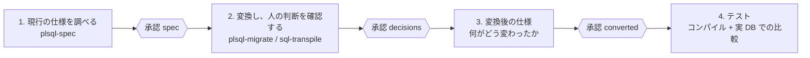
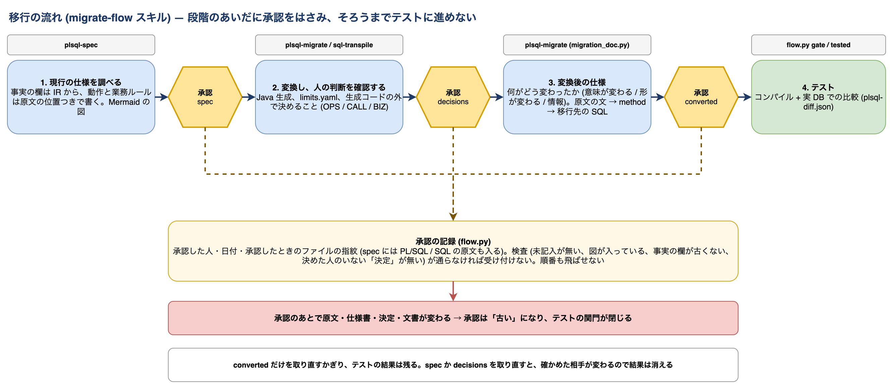

# スキル（Claude Code / Codex）

[文書の入口](../README.md) ｜ [はじめに](getting-started.md) ｜ [SQL の変換](sql-conversion.md) ｜ [PL/SQL の変換](plsql-conversion.md) ｜ [スキル](skills.md) ｜ [検証環境](verification.md)

移行の手順をコーディングエージェントから進めるためのスキルが 4 つあります。どれも `skills/<名前>/` に `SKILL.md`・`scripts/`・`references/`・`examples/` を持ちます。
Claude Code と Codex（codex-cli 0.154.0 で確認）のどちらからも使えます。

## インストール

入れ方は 2 つあります。**ほかのプロジェクトの PL/SQL / SQL を移すなら marketplace から**、このリポジトリ自体を開発するならチェックアウトから使います。

### marketplace から入れる（どのプロジェクトからでも使える）

このリポジトリが、そのまま Claude Code と Codex のプラグイン `sql-migration`（4 つのスキル入り）の marketplace になっています。

| | 手順 |
|---|---|
| Claude Code | `/plugin marketplace add wfukatsu/sql-migration` → `/plugin install sql-migration@sql-migration`。端末からなら `claude plugin marketplace add wfukatsu/sql-migration` と `claude plugin install sql-migration@sql-migration`。スキルは `/sql-migration:migrate-flow` のようにプラグインの名前つきで呼べる |
| Codex | `codex plugin marketplace add wfukatsu/sql-migration` → `codex plugin add sql-migration@sql-migration` |
| 更新 | Claude Code は `/plugin marketplace update sql-migration`、Codex は `codex plugin marketplace upgrade` |

GitLab のほう（非公開）から入れるときは、`wfukatsu/sql-migration` の代わりに HTTPS か SSH の Git URL を渡します（そのリポジトリを読める認証が要ります）。

プラグインとして入れたときの動き方:

- 要るのは **Python 3.10 以上**だけです。スキルは `<プラグインの場所>/bin/python` 経由でスクリプトを動かし、これが初回に仮想環境を作って `requirements.txt` を入れます（1 分ほど。
  場所は Claude Code のプラグイン用データ領域、無ければ `~/.cache/sql-migration/venv`。`SQL_MIGRATION_VENV` で変えられ、`requirements.txt` が変わると作り直します）
- 作業ディレクトリは**利用者のプロジェクトのまま**で、入力の PL/SQL / SQL も、出力（`out/migrate/<名前>/` など）も、決定の記録もそちらに置きます。プラグインの場所には書きません（更新で消えます）
- プラグインはリポジトリ全体（約 18 MB。`plsql/`・`scalardb_migrate/`・`runtime-java/`・`fixtures/` を含む）です。プラグインは自分のディレクトリの外を読めないので、`skills/` だけを配ることはできません
- Java のコンパイルの確認（`plsql.generate --verify-compile`）には Java 17 とネットワーク（Gradle の依存の取得）が要ります。実 DB での比較（`difftest/`）は Docker と ScalarDB Cluster のライセンスが要り、
  これはチェックアウトから動かすほうが向いています（[検証環境](verification.md)）
- Claude Code では、スクリプトのパスが絶対パスになるので `allowed-tools` のパターンに合わず、コマンドごとに許可を聞かれます

### チェックアウトから使う（このリポジトリを開発するとき）

エージェントはこのリポジトリのルートで開きます。スキルのコマンドは `.venv/bin/python skills/...` と `.venv/bin/python -m plsql.cli` の形で書いてあるので、先に [はじめに](getting-started.md) の準備（`.venv`）を済ませます。

| | 手順 |
|---|---|
| Claude Code | `for n in migrate-flow plsql-spec plsql-migrate sql-transpile; do ln -s "$PWD/skills/$n" ~/.claude/skills/$n; done`（編集がすぐ反映される）。1 回だけ試すなら `claude --plugin-dir .` |
| Codex | 何もしなくてよい。リポジトリの `.agents/skills`（`skills/` へのシンボリックリンク）を Codex が読む |

プラグインとリンクの両方を入れると同じスキルが 2 つずつ見えるので、どちらか一方にします。

Claude Code と Codex での違い:

| | Claude Code | Codex |
|---|---|---|
| スキルの選択 | `description` と `when_to_use` | `description` だけ（`when_to_use` は読まれないので、きっかけと対象外は `description` の末尾にも書いてある） |
| コマンドの許可 | `allowed-tools` の範囲は聞かれずに動く | `allowed-tools` は使われない。Codex のサンドボックスと承認の設定に従う（書き込むので `--sandbox workspace-write` 以上） |
| 利用者への確認 | AskUserQuestion（推奨を先頭に、選択肢ごとの影響つき） | 同じ内容を本文で聞く |
| `model` / `effort`（sql-transpile） | 効く | 無視される |
| Java のコンパイル（`plsql.generate --verify-compile`）と実 DB の比較 | そのまま動く | Gradle の依存の取得と DB への接続にネットワークが要る。サンドボックスがネットワークを閉じていると止まるので、その段階は承認つきで動かすか、手で回す |

確かめてあること: Claude Code はプラグインを入れて、ほかのプロジェクトのディレクトリから sql-transpile を最後まで（仮想環境の作成、変換、レポート）。Codex はこのリポジトリで sql-transpile を最後までと、marketplace の追加・プラグインのインストール。PL/SQL の 3 つは、スクリプトがほかのディレクトリから動くことと、スキルとして読み込まれることまでの確認です。
マニフェスト（`.claude-plugin/`、`.codex-plugin/`、`.agents/plugins/marketplace.json`）がそろっていること、スキルが `.agents/skills` から読めること、`description` が共通の形式（64 字以内の名前、1024 字以内の説明、きっかけと対象外）に収まっていることは、
`tests/test_skills_portability.py` が確かめます。

## スキルの一覧

| スキル | 役割 | 手順の本体 |
|---|---|---|
| migrate-flow | 移行を決まった順で最後まで進める（仕様 → 承認 → 変換と判断 → 承認 → 変換後の仕様 → 承認 → テスト） | [SKILL.md](../../skills/migrate-flow/SKILL.md)、[承認の求め方](../../skills/migrate-flow/references/approval.md)、[SQL 文だけの移行](../../skills/migrate-flow/references/sql.md) |
| plsql-spec | 既存の PL/SQL のいまの動作を仕様書にする | [SKILL.md](../../skills/plsql-spec/SKILL.md)、[仕様書の書き方](../../skills/plsql-spec/references/writing.md)、[例](../../skills/plsql-spec/examples/create_order/README.md) |
| plsql-migrate | PL/SQL を Java に変換し、人の判断を記録し、変換後の文書を作る | [SKILL.md](../../skills/plsql-migrate/SKILL.md)、[業務ロジックとの整合](../../skills/plsql-migrate/references/alignment.md)、[変換後の文書の書き方](../../skills/plsql-migrate/references/documenting.md)、[運用の手順](../../skills/plsql-migrate/references/operations.md)、[例](../../skills/plsql-migrate/examples/create_order/README.md) |
| sql-transpile | SQL を任意の方言どうし、または ScalarDB SQL に変換する | [SKILL.md](../../skills/sql-transpile/SKILL.md)、[scalardb-grammar.md](../../skills/sql-transpile/references/scalardb-grammar.md)、[dialect-notes.md](../../skills/sql-transpile/references/dialect-notes.md)、[app-side-notes.md](../../skills/sql-transpile/references/app-side-notes.md)、[運用](../../skills/sql-transpile/references/operations.md) |

スキルの仕組み（段階と承認、事実の欄と文章、人への確認）は [アーキテクチャ](../design/architecture.md) の 10 章と 14 章にあります。

## migrate-flow スキル

移行を 4 つの段階に分け、段階のあいだに承認をはさみます。各段階の中身は下の 3 つのスキルが受け持ち、このスキルは
順番と、承認の記録と、テストの関門を受け持ちます。



- **承認には、承認した人と日付が要り**、その段階の検査（未記入が無い、図が入っている、事実の欄が古くない、
  決めた人のいない「決定」が無い）が通っていなければ受け付けません。順番も飛ばせません
- 未決の判断（記録の未決の項目、判定が REVIEW のままの routine、`limits.yaml` に答えの無いルールが残る REDESIGN の
  routine）を残して進めるなら、利用者が決めた理由を承認に控えます。REDESIGN が決まったかどうかは、決定を適用した
  解析（`<out>/generated/analysis/decisions.json`）から読みます
- SQL 文だけの移行では、変換できなかった文（ERROR）の 1 つずつに、どう扱うかの項目（`SQL-<文の番号>`）が記録に
  無ければ `decisions` を承認できません。記録のファイルを渡してあるだけでは通りません
- **承認したときのファイルの指紋を控える**ので、承認のあとで原文・仕様書・決定・文書が変わると承認は「古い」になり、
  テストの関門（`flow.py gate`）が閉じます（`spec` の指紋には PL/SQL / SQL の原文も入ります）。テストの結果も、
  そのとき有効だった承認の指紋と一緒に残ります
- `flow.py tested --report <plsql-diff.json>` は、その比較を入力（`inputs.evidence`）に控えます。比較の結果を文書に
  入れると（`migration_doc.py --evidence`）`converted` の承認は古くなりますが、**`converted` だけを取り直すかぎり、
  テストの結果は残ります**。`spec` か `decisions` を取り直すと、確かめた相手が変わるので、テストの結果は消えます
- 図は IR と生成物から決定的に描きます: routine ごとの処理の流れ、routine と表、呼び出しと trigger、変換後の全体の形、
  1 回の呼び出し、**変換前の文 → 変換後の method**（赤 = 意味が変わる、黄 = 形が変わるが結果は同じ）。
  文ごとの診断は「意味が変わる / 形が変わる / 情報」に分類してあり、分類の無い診断は「未分類」と出ます
  （corpus に未分類が無いことをテストが確かめます）

```bash
.venv/bin/python skills/migrate-flow/scripts/flow.py init --out out/migrate/create_order --kind plsql \
  --src fixtures/plsql-external/create_order/src --scalardb-schema fixtures/plsql-external/create_order/scalardb-schema.json \
  --limits fixtures/plsql-external/create_order/limits.yaml
.venv/bin/python skills/migrate-flow/scripts/flow.py status --out out/migrate/create_order    # 段階ごとの状態と、次にすること
.venv/bin/python skills/migrate-flow/scripts/flow.py gate --out out/migrate/create_order      # 0 = テストしてよい
ln -s "$PWD/skills/migrate-flow" ~/.claude/skills/migrate-flow        # Claude Code から使う
```



## plsql-spec スキル

移行の前に、既存の PL/SQL が**いま何をしているか**を仕様書にします。引数・読み書きする表・SQL・エラーコード・
例外ハンドラ・トランザクション制御・呼び出しの関係・発火する trigger は `plsql.cli` の IR から機械的に出し
（事実の欄。lowering が足した文は除く。IF / ELSIF / CASE の分岐とループの中も、そこへ至る条件つきで拾う。
読み書きする表は SQL そのものから出すので、ScalarDB の schema を渡さない解析でも入る）、動作・業務ルール・エラー時の振る舞い・確かめたいことは原文を読んで、
原文の位置（`ファイル:行`）つきで書きます。処理の流れの図は、CASE の分岐（ELSE が無ければ `CASE_NOT_FOUND`）と、
ループを抜ける `EXIT` / 先頭へ戻る `CONTINUE` も線で描きます。事実の欄は作り直しても文章に触れません。`check` は、未記入、古い事実、
文章に出てこないエラーコードと表、routine の範囲の外を指す引用を問題として返します。
書き上がった例は [`skills/plsql-spec/examples/create_order/`](../../skills/plsql-spec/examples/create_order/README.md) にあります。

```bash
.venv/bin/python -m plsql.cli fixtures/plsql-external/create_order/src --out-dir out/plsql-spec/create_order/analysis --quiet
.venv/bin/python skills/plsql-spec/scripts/spec_facts.py facts --analysis out/plsql-spec/create_order/analysis --out-dir out/plsql-spec/create_order/spec
.venv/bin/python skills/plsql-spec/scripts/spec_facts.py check --analysis out/plsql-spec/create_order/analysis --out-dir out/plsql-spec/create_order/spec
ln -s "$PWD/skills/plsql-spec" ~/.claude/skills/plsql-spec            # Claude Code から使う
```

## plsql-migrate スキル

PL/SQL を `plsql.generate` で Java に変換し（コンパイルと行数上限の決定漏れまで確かめる）、生成器が決めずに
残した問い——[生成コードの外で決めること](../plsql-migration/plsql-decisions-outside-generator.md) の OPS / CALL / BIZ 項目——を
生成物から拾って、利用者に確認し、決めた人と日付つきで記録します。BIZ 項目は routine ごとに「移行で何が変わるか」を
業務の言葉にし、業務文書と照らして整合を確かめます。リポジトリの中で動きます（`plsql/` を使う）。

```bash
.venv/bin/python skills/plsql-migrate/scripts/decision_items.py scan --generated out/plsql \
  --limits fixtures/plsql/limits.yaml --scalardb-schema fixtures/plsql/scalardb-schema.json \
  --record fixtures/plsql/decisions-outside-generator.yaml --write --out out/plsql/decision-items.md
ln -s "$PWD/skills/plsql-migrate" ~/.claude/skills/plsql-migrate      # Claude Code から使う
```

変換のあと、**変換後のコードの文書**を作ります（スキルの Step 7）。`README.md` に アーキテクチャ / 使い方 / 制限 /
どのように移行したか、module ごとの Markdown に routine ごとの 仕様 / 移行で変わったこと / 制限と注意 が入ります。
Java の入口と constructor、引数の対応、例外、**原文の文 → Repository の method → 移行先の SQL** の対応、当たった
判定ルール、`limits.yaml` の決定、実 DB の比較の結果と受け入れた差は、生成物・解析・決定・比較から機械的に出します
（事実の欄）。文章は生成された Java を読んで書き、`check` が、判定の理由・受け入れた差・決定・「比較していないこと」を
文章が落としていないか、生成物に無い Java の名前を引いていないかを確かめます。
書き上がった例は [`skills/plsql-migrate/examples/create_order/`](../../skills/plsql-migrate/examples/create_order/README.md) にあります。

```bash
.venv/bin/python -m plsql.cli fixtures/plsql/src --scalardb-schema fixtures/plsql/scalardb-schema.json \
  --limits fixtures/plsql/limits.yaml --out-dir out/plsql/analysis --quiet
.venv/bin/python skills/plsql-migrate/scripts/migration_doc.py facts --src fixtures/plsql/src --generated out/plsql --analysis out/plsql/analysis \
  --limits fixtures/plsql/limits.yaml --record fixtures/plsql/decisions-outside-generator.yaml --out-dir out/plsql/docs
```

## sql-transpile スキル

任意の方言どうし（SQLGlot の 32 方言）または ScalarDB SQL に変換します。素の `sqlglot.transpile()` が黙って通してしまう構文（`ROWNUM`、Oracle の外部結合 `(+)`、`CONNECT BY`、`NEXTVAL` など）を直すか、理由付きで報告します。

- Oracle の入力は SQL*Plus のスクリプトとして読みます: `/` だけの行は文の切れ目で、PL/SQL のブロック（`CREATE … PROCEDURE / FUNCTION / PACKAGE / TRIGGER`、無名ブロック）は `/` までを 1 つにまとめて ERROR `PLSQL_BLOCK` にします（変換しません。plsql-migrate の仕事です）。`END` のように式として解析できてしまう断片は OK にしません
- 終了コードは 0 = ERROR の文なし / 1 = ERROR の文あり / 2 = 入力の誤り（無いファイル、UTF-8 でない、形の違う `--schema`、不正な `--session-time-zone`、変換する文が無い）。**2 のときレポートは書きません**。UTF-8 の BOM は読み飛ばします
- レポートの名前に Target は入らないので、同じ入力を別の Target へ変換するときは `--out-dir` を分けます。`--plan-dir` の計画は、実行のたびにその入力のものを作り直します（前の実行の計画を残しません）
- 指摘コードの意味は `references/scalardb-grammar.md` と `references/dialect-notes.md` にあります。変換器が出すコードがすべてどこかに載っていることを、テストが確かめます（コードを足したら表にも足すことになります）

```bash
.venv/bin/python skills/sql-transpile/scripts/transpile.py samples/oracle.sql --source oracle --target postgres --out-dir out/transpile
.venv/bin/python skills/sql-transpile/scripts/transpile.py samples/oracle.sql --source oracle --target scalardb --out-dir out/transpile
ln -s "$PWD/skills/sql-transpile" ~/.claude/skills/sql-transpile      # Claude Code から使う
```

スキルは `scalardb_migrate/` のコピーを `scripts/_scalardb/` に同梱しています。本体を変えたら同期してください。

```bash
.venv/bin/python skills/sql-transpile/scripts/vendor_sync.py --check    # 差分があれば終了コード 1
.venv/bin/python skills/sql-transpile/scripts/vendor_sync.py --update
```
