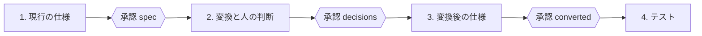

# チュートリアル: Oracle の SQL と PL/SQL を、スキルで ScalarDB に移す

[文書の入口](../README.md) ｜ [はじめに](getting-started.md) ｜ **チュートリアル** ｜ [SQL の変換](sql-conversion.md) ｜ [PL/SQL の変換](plsql-conversion.md) ｜ [スキル](skills.md) ｜ [検証環境](verification.md)

サンプルの Oracle SQL と PL/SQL（ポイントカード）を、スキルを使って ScalarDB に移し、実 DB で Oracle と同じ結果になることを確かめるまでを、順にたどります。
**2026-09-20 に実際に通した記録**で、途中でツールが断った文、人が決めたこと、見つかって直した不具合も、起きた順に書いてあります。

| | |
|---|---|
| サンプル | [`samples/tutorial/`](../../samples/tutorial/) — `sql/points.sql`（20 文）、`plsql/src/`（package `pkg_points`、routine 4） |
| 通した結果 | [`samples/tutorial/result/`](../../samples/tutorial/result/) — 変換レポート、現行の仕様、変換後の仕様、実 DB の比較 |
| 使うスキル | 第 1 部: `sql-transpile`。第 2 部: `migrate-flow`（中で `plsql-spec` と `plsql-migrate` を使う） |
| 要るもの | 第 1 部の変換と、第 2 部の段階 1〜3 は Python だけ（コンパイルの確認に Java 17）。実 DB の突き合わせ（1.3 と 2.5）は Docker と ScalarDB Cluster のトライアルライセンス（[検証環境](verification.md)） |

スキルは Claude Code か Codex から自然文で呼びます（入れ方は [スキル](skills.md)）。下の各節の「頼み方」がそれで、「動くコマンド」はスキルがその中で打っているものです。
コマンドだけをたどっても同じ結果になります。

---

## 題材

会員（`members`）のポイント残高と、その増減の履歴（`point_history`）。履歴は会員ごとの連番（`seq_no`）で、番号は sequence ではなく会員の行の `last_seq` から進めます。

| routine | すること |
|---|---|
| `get_balance` | 残高を返す。会員がいなければ -20101 |
| `add_points` | ポイントを付与し、履歴を足し、残高に応じてランクを付け直す（300 以上 SILVER、1000 以上 GOLD） |
| `use_points` | ポイントを使う。残高不足は -20103。**同時の利用を `FOR UPDATE` の行ロックで直列にしている** |
| `rank_of` | 残高からランクを求める、package の中だけの関数 |

---

## 第 1 部: SQL 文を変換する（sql-transpile）

### 1.1 変換する

頼み方: **「samples/tutorial/sql/points.sql を Oracle から ScalarDB 用に変換して」**

```bash
.venv/bin/python skills/sql-transpile/scripts/transpile.py samples/tutorial/sql/points.sql \
  --source oracle --target scalardb --out-dir out/tutorial/sql --plan-dir out/tutorial/sql/plans
```

```text
oracle → scalardb: 20 文 / OK 7 / WARN 6 / PLANNED 4 / ERROR 3
変換率 65.0% (13/20)
```

終了コードは 1（ERROR の文がある）。出力は `points.scalardb.sql`（変換後の SQL）、`points.report.md`（文ごとの判定と理由）、`plans/*.plan.json`（実行計画）です
（通した結果: [`result/sql/`](../../samples/tutorial/result/sql/points.report.md)）。

### 1.2 結果を読む

| 判定 | 文 | 何が起きたか | 次にすること |
|---|---|---|---|
| OK | 主キーの SELECT、パーティション内の範囲 + `ORDER BY`、索引列の検索、INSERT / UPDATE / DELETE（値がリテラル） | そのまま ScalarDB SQL になった | そのまま使う |
| WARN | `CREATE TABLE` | `DEFAULT 'REGULAR'` が落ちた。Oracle の `DATE` は時刻を持つ | 既定値はアプリが入れる。時刻を使うなら TIMESTAMP にする |
| WARN | `MERGE` | UPSERT に書き換えた。**既存行では `WHEN MATCHED` が触れない列（`rank`・`balance`・`last_seq`）も上書きする** | 既存行がありうるなら、読んでから書き分ける |
| WARN | `WHERE ROWNUM <= 3 ORDER BY balance DESC` | `LIMIT 3` に書き換えた。**Oracle の ROWNUM は ORDER BY より先に効く**ので意味が変わる | 元の意図を確かめる（→ 1.3） |
| WARN | `GROUP BY rank` の集計、`FETCH FIRST 3 ROWS ONLY` | パーティションをまたぐ走査になる | `scalar.db.cross_partition_scan.enabled` が要る。RDBMS のバックエンドでだけ使う |
| PLANNED | `NVL(name, …)`、外部結合 `(+)`、`SUM(…) OVER (…)`、`WHERE balance > (SELECT AVG…)` | ScalarDB SQL にはできないが、実行計画（ScalarDB から取得 → メモリ上の H2 で元の SQL）で動かせる | 行数と応答時間を確かめる |
| ERROR | `CREATE SEQUENCE`、`member_seq.NEXTVAL` | ScalarDB に sequence は無い | 採番をアプリで行う |
| ERROR | `SET balance = balance + 100` | SET に列を含む式は書けない | 同じトランザクションの中で、読む → 計算する → リテラルで書く |

### 1.3 実 DB で確かめる

判定が実際の動作と合うかを、移行元の Oracle と ScalarDB Cluster で同じデータに同じ問い合わせを流して比べます。読み取り文と表の DDL だけを
[`points-check.sql`](../../samples/tutorial/sql/points-check.sql) に、データを `points-check.data.json` に置いてあります。

```bash
.venv/bin/python difftest/run.py samples/tutorial/sql/points-check.sql --dialect oracle --fetcher jdbc --restart-cluster
```

```text
PASS [4]  scalardb-sql  SELECT member_id, name, balance FROM members WHERE member_id = 1
PASS [5]  scalardb-sql  SELECT seq_no, points, reason FROM point_history WHERE member_id = 1 A…
PASS [6]  scalardb-sql  SELECT member_id, name FROM members WHERE rank = 'GOLD'
FAIL [7]  scalardb-sql  SELECT member_id, name, balance FROM members WHERE ROWNUM <= 3 ORDER B…
PASS [8]  scalardb-sql  SELECT member_id, name, balance FROM members ORDER BY balance DESC FET…
PASS [9]  plan P1  fetched=1   SELECT member_id, NVL(name, '(no name)') AS name, balance FROM members
PASS [10] plan P8  fetched=7   SELECT m.member_id, m.name, h.seq_no, h.points FROM members m, point…
PASS [11] scalardb-sql  SELECT rank, COUNT(*) AS members, SUM(balance) AS total FROM members G…
PASS [12] plan P1  fetched=4   SELECT member_id, points, SUM(points) OVER (PARTITION BY member…
PASS [13] plan P5  fetched=4   SELECT member_id, name, balance FROM members WHERE balance > (SELECT A…
PASS=9 FAIL=1
```

- **FAIL の 1 件は、WARN が言っていたとおりの差です。** `WHERE ROWNUM <= 3 ORDER BY balance DESC` は、Oracle では「任意の 3 行を取ってから並べる」、変換後は
  「並べてから 3 行取る」。「残高の多い 3 人」のつもりなら、Oracle の側をそう書きます（次の文の `ORDER BY … FETCH FIRST 3 ROWS ONLY`。こちらは一致）。
  **WARN は「変換できた」であって「同じ結果になる」ではありません。** 教材として、この文は直さずに残してあります
- **この検証で、変換ツールの判定の誤りが 1 件見つかりました。** 外部結合の文（`m.member_id = h.member_id(+)`）は、結合が相手の表（`point_history`）の主キー全体
  （`member_id`, `seq_no`）を覆っていません。ツールは「ScalarDB が断る」と**言いながら WARN** にしていて、実際の Cluster は `DB-SQL-10067` で断りました。
  `JOIN_KEY` を ERROR にし、読み取りなら実行計画（P8: 両方を取得して H2 で結合）に回るよう直しました。上の結果は直したあとのものです

---

## 第 2 部: PL/SQL を移す（migrate-flow）

頼み方: **「samples/tutorial/plsql の PL/SQL を ScalarDB に移行して」**

`migrate-flow` は 4 つの段階を順に進め、段階のあいだで**人の承認**を求めます。承認するのは利用者で、スキルは承認の問いを出して答えを記録するだけです。



プロジェクトの形は [`fixtures/plsql-external/`](../../fixtures/plsql-external/README.md) と同じです: `src/`（`schema.sql` と PL/SQL）、`scalardb-schema.json`、
`limits.yaml`（決定）、`decisions-outside-generator.yaml`（記録）、`scenarios/`、`golden/`。作業ディレクトリ（`out/migrate/tutorial-points/`）は消してよく、決定と記録は原文のそばに残ります。

```bash
P=samples/tutorial/plsql; O=out/migrate/tutorial-points
.venv/bin/python skills/migrate-flow/scripts/flow.py init --out $O --kind plsql --src $P/src \
  --scalardb-schema $P/scalardb-schema.json --limits $P/limits.yaml --record $P/decisions-outside-generator.yaml
.venv/bin/python skills/migrate-flow/scripts/flow.py status --out $O     # いつでも、いまの段階と次にすることが出る
```

### 2.1 段階 1: 現行の仕様を調べる → 承認 `spec`

```bash
.venv/bin/python -m plsql.cli $P/src --out-dir $O/spec-analysis --quiet
.venv/bin/python skills/plsql-spec/scripts/spec_facts.py facts --analysis $O/spec-analysis --out-dir $O/spec
# …「未記入」の所に、原文を読んで文章を書く（スキルが行う）…
.venv/bin/python skills/plsql-spec/scripts/spec_facts.py check --analysis $O/spec-analysis --out-dir $O/spec
```

`facts` は、引数・読み書きする表・SQL・エラーコード・処理の流れの図を IR から機械的に出します（**事実の欄**）。動作・業務ルール・エラー時の振る舞い・確かめたいことは、
原文を読んで、原文の位置（`` `pkg_points.pkb:74` ``）つきで書きます。`check` は未記入、古い事実、文章に出てこないエラーコードと表、routine の範囲の外を指す引用を返します。

- 最初の `check`: `UNWRITTEN=18`。書き上げたあと、`add_points` の節から `use_points` の行を引いた 1 か所が「routine の範囲の外」と指摘され、直して `PROBLEMS=0`
- 書き上がった仕様: [`result/plsql/spec/`](../../samples/tutorial/result/plsql/spec/README.md)。ランクの遷移は、事実の欄の図では伝わらないので状態遷移図を足しました

**原文を読んで初めて分かったこと**（仕様書の「確かめたいこと」。承認する人が見る中心です）:

1. `add_points` は行をロックしない。同じ会員への同時の付与は、片方が履歴の主キー重複で落ちるはず。`use_points` はロックしている
2. 会員がいないとき、`use_points` だけが -20101 に言い換えず、`NO_DATA_FOUND` をそのまま出す（**移行ではいまの動きを保つ**）
3. 付与ポイントに上限が無い。行ロックの待ちにも上限が無い

```bash
.venv/bin/python skills/migrate-flow/scripts/flow.py approve spec --out $O --by 移行責任者 --date 2026-09-20
```

`--by` には承認した人の役割を書きます。検査が通っていない、順番が違う、承認する人がいない、のどれでも `approve` は断ります。

### 2.2 段階 2: 変換し、人の判断を確認する → 承認 `decisions`

```bash
.venv/bin/python -m plsql.generate $P/src --scalardb-schema $P/scalardb-schema.json --limits $P/limits.yaml \
  --out-dir $O/generated --verify-compile --limits-strict
```

**最初の生成で、ツールは 3 文を断りました**（`SQL ScalarDB refuses 3`。生成された Repository の method は `UnsupportedOperationException` を投げる）。原因は 2 種類ありました。

| 断られた文 | 原因 | どうしたか |
|---|---|---|
| `SET rank = rank_of(v_balance)`（`add_points`） | **SQL の中で package の関数を呼んでいる。** ScalarDB SQL の SET / VALUES はリテラルと bind しか取れず、ツールが Java 側へ持ち上げられるのは実行時ヘルパが実装している関数だけ | **原文を直す**: `v_rank := rank_of(v_balance);` と先に変数へ入れる。Oracle 上の結果は変わらない |
| `VALUES (…, -p_points, …)` と `SET balance = v_balance - p_points`（`use_points`） | **行ロックの決定がまだ無い。** ロックが読み書きを安全にしていたので、誰も決めていないあいだ、ツールはこの routine の書き込みを拒否したままにする | **人が決める**（下） |

あわせて、`SYSDATE` を 2 回読む routine が `SEM-007` で REVIEW になりました（2 回の読みは違う値を返しうる）。`v_now DATE := SYSDATE;` と 1 度だけ読む形に直しました。
最初の版と直した版の違いは、この 2 点だけです。

> **承認は中身に付きます。** 原文を直したので、承認済みの `spec` は「承認が古い」になり、先へ進めなくなりました。事実の欄を作り直し、行番号と「現在日時を 1 度だけ読む」を
> 文章に反映し、**変えた所を示して承認を取り直しました**。黙って取り直すことはできません（`flow.py` は原文の指紋も控えています）。

**人が決めたこと 1: `use_points` の行ロック（`LOCK-001`、REDESIGN）**

| | |
|---|---|
| 現行 | 会員の行をロックし、同時の利用を待たせて直列にする（コメント: 「残高がマイナスにならないよう」） |
| 決定 | **楽観制御 + 呼び出し側が衝突だけを再試行**（移行責任者、2026-09-20）。同じトランザクションの中で読んで書くので、同時の利用は commit で片方が衝突（`DB-CORE-20013`）として弾かれ、残高はマイナスにならない |
| 採らなかった案 | 決めずに残す → `use_points` は実行時に例外を投げるコードのままで、テストできない |
| 記録先 | [`limits.yaml`](../../samples/tutorial/plsql/limits.yaml) の `rowLocks.optimistic`（**理由つき**。理由の無い決定は決定として扱われない） |

`limits.yaml` を書いて生成し直すと、断られる文は 0 になりました。ここで**生成器の不具合が 1 件**見つかりました: `rank_of(v_balance)` の `v_balance` は `NUMBER(10)` の列の型（Java では `Long`）、
`rank_of` の引数は `NUMBER`（`BigDecimal`）で、生成された Java がコンパイルできませんでした（`--verify-compile` が routine を名指しして止めます）。
**生成物を手で直さず、生成器を直しました**（兄弟の routine の NUMBER 引数には `Plsql.dec(…)` で渡す。回帰テストつき）。

```text
routines: 4  rules: AUTO 3  REVIEW 0  REDESIGN 1  |  verdict: AUTO 0  REVIEW 3  REDESIGN 1
untranslated statements 0  SQL ScalarDB refuses 0  planned 0
  compile check: gradle compileJava succeeded over the generated tree
```

**人が決めたこと 2: 生成コードの外で決めること**

```bash
.venv/bin/python -m plsql.cli $P/src --scalardb-schema $P/scalardb-schema.json --limits $P/limits.yaml --out-dir $O/generated/analysis --quiet
.venv/bin/python skills/plsql-migrate/scripts/decision_items.py scan --generated $O/generated --limits $P/limits.yaml \
  --scalardb-schema $P/scalardb-schema.json --record $P/decisions-outside-generator.yaml --write --out $O/generated/decision-items.md
```

楽観制御にしたことで、3 項目が「出た」と判定されました（項目の定義は [生成コードの外で決めること](../plsql-migration/plsql-decisions-outside-generator.md)）。スキルは 1 項目ずつ、
**何を決めるか・推奨・理由・影響・決めないとどうなるか・誰が答えるか**を示してから聞きます。

| 項目 | 答える人 | 決定（移行責任者、2026-09-20） |
|---|---|---|
| CALL-5 弾かれたときの再試行 | 呼び出し側の設計者 | 衝突だけを最大 3 回、50 ms から倍々で再試行する。-20103 / -20102 は再試行しない。`use_points` に採番も外部通知も無く、番号は読み直されるので、再試行は二重実行にならない |
| BIZ-4 衝突が分かるタイミング | 業務担当 | 受け入れる。「後から来たほうが待たされる」が「後から commit したほうが弾かれる」に変わる。現行は `NOWAIT` を使っておらず、待たずに諦めることに業務上の意味は無い |
| BIZ-5 MERGE の分割 | — | 該当しない（`pkg_points` に MERGE は無い。同じ診断から一緒に出ただけ） |

```bash
.venv/bin/python skills/plsql-migrate/scripts/decision_items.py set CALL-5 --record $P/decisions-outside-generator.yaml \
  --status 決定 --decision "…" --by 移行責任者 --date 2026-09-20 --where "limits.yaml の rowLocks.optimistic、呼び出し側の設計書"
```

> 「対象外」は「生成物に出ていない」項目にだけ付く状態です。出ている項目を対象外にすると、次の `scan` が未決に戻します。当てはまらないと分かった項目（BIZ-5）は、
> 「該当しない」という**決定**として、決めた人と日付つきで記録します。

**残ったもの**: `add_points`・`get_balance`・`rank_of` は REVIEW のままでした。当たった判定ルールは無く、理由は 3 つとも「まだ誰も Oracle と突き合わせていない」
（確信度の `testEvidence` が 0）。人の判断では解けず、段階 4 のテストが証拠を作ります。その理由を控えて承認しました:

```bash
.venv/bin/python skills/migrate-flow/scripts/flow.py approve decisions --out $O --by 移行責任者 --date 2026-09-20 \
  --with-open "REVIEW の 3 routine は、実 DB の証拠がまだ無いだけで、当たった判定ルールは無い。段階 4 のテストで証拠を作る"
```

### 2.3 段階 3: 変換後の仕様と、何がどう変わったか → 承認 `converted`

```bash
.venv/bin/python skills/plsql-migrate/scripts/migration_doc.py facts --src $P/src --generated $O/generated --analysis $O/generated/analysis \
  --limits $P/limits.yaml --record $P/decisions-outside-generator.yaml --out-dir $O/docs
# …文章を書く（スキルが、生成された Java を読んで書く）…
.venv/bin/python skills/plsql-migrate/scripts/migration_doc.py check …同じ引数…
```

`README.md`（アーキテクチャ / 使い方 / 制限 / どのように移行したか）と、module ごとの文書（routine ごとの 仕様 / 移行で変わったこと / 制限と注意）ができます
（通した結果: [`result/plsql/docs/`](../../samples/tutorial/result/plsql/docs/README.md)）。`check` は、AUTO でない routine・決定・受け入れた差を文章が落としていないか、
生成物に無い Java の名前を引いていないかを見ます（今回の指摘は「制限の文章に routine の完全な名前が出てこない」の 3 件）。

承認する人が見る所:

- **意味が変わるのは `use_points` の行ロックだけ**（診断 `ROW_LOCK` / `LOCK` / `OPTIMISTIC`）
- **呼び出し側に増える仕事**: トランザクションの開始・commit・rollback と、衝突の再試行（コード例つき）
- **現行の動きをそのまま保った所**: `use_points` は会員がいないと `NoDataFoundException` をそのまま出す
- **制限**: 現在日時の出所が DB サーバからアプリの時計（`Plsql.sysdate()`）に変わる。同時実行は比較が観ていない

### 2.4 段階 4 の前に: シナリオを起こす

3 つの承認がそろうと、テストの関門が開きます（`flow.py gate` の最終行が `GATE=open`）。シナリオは**承認済みの現行の仕様から起こします**——「業務ルール」と「エラーと例外」の 1 行が
1 シナリオで、境界は両側を取ります。13 本（[`scenarios/`](../../samples/tutorial/plsql/scenarios/)）:

| routine | シナリオ |
|---|---|
| `get_balance` | 正常 / 会員なし（-20101） |
| `add_points` | 正常 / 残高 299（REGULAR のまま）/ **残高ちょうど 300（SILVER）** / **残高ちょうど 1000（GOLD）**、理由 NULL / 0 ポイント（-20102）/ 会員なし（-20101） |
| `use_points` | 正常（ランクは下げない）/ **残高ちょうど**（残高 0）/ **残高 + 1**（-20103）/ 負の数（-20102）/ 会員なし（`NO_DATA_FOUND`） |

テストは DB に書き込むので、スキルは**何をどこに作るか**を示して、実行してよいかを先に確かめます。

### 2.5 段階 4: 実 DB で比べる

```bash
samples/tutorial/plsql/oracle-user.sh                          # SYSTEM で 1 度だけ: Oracle のユーザ points を作る
export SRC_ORACLE_USER=points SRC_ORACLE_PASSWORD=points
.venv/bin/python difftest/plsql_run.py deploy --project $P     # 2 表と pkg_points を配備する
.venv/bin/python difftest/plsql_run.py run --project $P        # Oracle で 13 シナリオを流す -> $P/golden/

cp $P/scalardb-schema.json difftest/work/points-schema.json    # Schema Loader のコンテナから見える場所
(cd difftest && docker compose --profile tools --profile oracle --profile cassandra --profile cluster run --rm schema-loader \
    --config /conf/scalardb-in-docker.properties --schema-file /work/points-schema.json --coordinator)   # namespace points
.venv/bin/python difftest/plsql_capture.py --project $P --namespace points --variant double   # 生成した Java を Cluster で流す
.venv/bin/python difftest/plsql_compare.py --project $P --variant double --json $P/work/plsql-diff.json
```

```text
  use_points_exact_balance           returned None
  use_points_no_member               raised -1403
  use_points_short                   raised -20103
  …
13 compared: 13 identical, 0 differing; 0 not compared
```

**13 本すべてが一致しました**（戻り値、例外のコード、2 表の状態）。`SYSDATE` は両側で同じ時刻に固定して比べます（Oracle は `FIXED_DATE`、Java は `Plsql` の時計）。

ここで**ハーネスの不具合が 1 件**見つかりました: corpus の外のプロジェクトでは、capture に「どの原文・どの生成器で測ったか」の指紋が付かず、比較の結果を渡しても
`plsql.cli` が「古い証拠」として数えませんでした（一致していても routine は REVIEW のまま）。`plsql_capture.py --project` を足して直しました。

結果を控え、証拠を渡して判定を出し直します:

```bash
.venv/bin/python skills/migrate-flow/scripts/flow.py tested --out $O --result pass --report $P/work/plsql-diff.json
.venv/bin/python -m plsql.cli $P/src --scalardb-schema $P/scalardb-schema.json --limits $P/limits.yaml \
  --evidence $P/work/plsql-diff.json --variant double --generated $P/work/generated --out-dir $O/generated/analysis
```

```text
verdicts        {'AUTO': 3, 'REDESIGN': 1}
```

**AUTO は「無人で生成してよい」という判定で、実 DB で一致した証拠があって初めて付きます。** `use_points` は決定のあとも REDESIGN のままです（行ロックというルールが当たった事実は変わらない）が、
決定済みで、実 DB でも一致しています。証拠は、原文か生成器が変わると「古い」になり、判定は REVIEW に戻ります。

最後に、比較の結果を文書に入れます（`migration_doc.py` に同じ `--evidence` を足して `facts` と `check`）。**文書が変わるので `converted` の承認は古くなり**、変えた所
（「まだ確かめていない」→ 実際の結果）を示して取り直しました。`converted` だけを取り直すかぎり、テストの結果は残ります。

```text
| 現行の仕様（`spec`）        | 承認済み | 移行責任者（2026-09-20） |
| 人の判断（`decisions`）     | 承認済み | 移行責任者（2026-09-20） |
| 変換後の仕様（`converted`） | 承認済み | 移行責任者（2026-09-20） |
| テスト                      | pass     | 2026-09-20 |
```

---

## この記録から分かること

- **WARN は読むものです。** SQL の FAIL 1 件は、WARN が先に言っていたとおりの差でした
- **ツールが断ったら、原因は 2 種類あります**: 書き方（SQL の中の関数呼び出し → 変数に出す）と、人が決めていないこと（行ロック → `limits.yaml` に理由つきで書く）。
  後者を黙って進めないのが、このツールの設計です
- **承認は中身に付きます。** 今回は 2 回、承認が古くなりました（原文を直したとき、テストの結果を文書に入れたとき）。どちらも、変えた所を示して取り直しています
- **AUTO は証拠でしか付きません。** テストの前は、当たったルールが無くても REVIEW でした
- **実 DB で通すと、ツールの側の不具合も見つかります。** この 1 回で 4 件を直しました:

| 見つかったもの | 直した所 |
|---|---|
| 相手の主キーを覆わない結合を、「断られる」と言いながら WARN にしていた | `scalardb_migrate/converter.py`（`JOIN_KEY` を ERROR に。読み取りは実行計画 P8 へ） |
| package 内の関数に、宣言と違う数値型の変数を渡すと、コンパイルできない Java が出た | `plsql/gen_java/`（NUMBER 引数には `Plsql.dec(…)` で渡す） |
| corpus の外のプロジェクトの証拠に指紋が付かず、AUTO にならなかった | `difftest/plsql_capture.py --project` |
| テストのあとも、`migrate-flow` が「証拠待ちだった REVIEW」を未決の判断として出し続けた | `skills/migrate-flow/scripts/flow.py`（証拠つきの解析が AUTO と言えば、未決から外す） |

**比較が観ていないこと**: 同時実行（`use_points` の衝突と再試行、`add_points` の同時の付与）、途中で止まったとき、PL/SQL の外からの書き込み。1 回の呼び出しの結果が
Oracle と一致した、というのが、ここで言えることのすべてです。

## 自分の PL/SQL で試すには

1. `src/schema.sql`（Oracle の DDL）と PL/SQL、`scalardb-schema.json`（キーの設計つき）を 1 つのディレクトリに置く（[プロジェクトの形](../../fixtures/plsql-external/README.md)）
2. Claude Code か Codex で **「このディレクトリの PL/SQL を ScalarDB に移行して」** と頼む（`migrate-flow` が段階 1 から進め、承認と判断を求めてくる）
3. SQL 文だけなら **「この SQL を Oracle から ScalarDB 用に変換して」**（`sql-transpile`）。承認つきで進めたければ `migrate-flow` に SQL のファイルを渡す（[SQL 文だけの移行](../../skills/migrate-flow/references/sql.md)）
