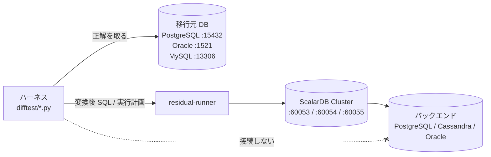

# 検証環境（`difftest/`）

[文書の入口](../README.md) ｜ [はじめに](getting-started.md) ｜ [チュートリアル](tutorial.md) ｜ [SQL の変換](sql-conversion.md) ｜ [PL/SQL の変換](plsql-conversion.md) ｜ [スキル](skills.md) ｜ [検証環境](verification.md)

変換結果が正しいかを、移行元 DB と ScalarDB Cluster で実際に実行して突き合わせ、性能を測るためのハーネスです。Docker が要ります。
測った結果は [検証レポート](../README.md#検証レポート) にまとめてあります。実 DB を使うときの落とし穴（タイムゾーン、Cluster の再起動など）は各レポートの「制約」の章にあります。



ハーネスだけが移行元 DB に接続し、ScalarDB のバックエンド DB には ScalarDB 以外は接続しません。

結果集合の比較は、どのハーネスも `difftest/rowcompare.py` で行います。値はペアで比べます: 整数は桁数によらず厳密に、小数は有効 15 桁で（ScalarDB に DECIMAL が無く、`NUMBER(10,2)` は double を通って返るため）、文字列を日付として読むのは相手が日付型のときだけ、日時はミリ秒まで、真偽値は真偽値とだけ一致し、NULL は空文字と一致しません。`ORDER BY` の有無は構文木で見ます。`run.py` は、比較できた文が 1 つも無い回を終了コード 2、移行元 DB がケースを拒否した回（`CASE_ERROR`）を 1 で終えます。両側が 0 行の一致は PASS ですが、`EMPTY` として件数を出します。

ケースファイルでは、文の上のコメントで比べ方を宣言できます（`difftest/case_notes.py`、理由は必須）。`-- @nondeterministic: unordered | ignore=列 | count; reason=…` は、同順位の並び・時刻・接続ユーザのように移行元の答えそのものが一つに決まらない文を、集合として・その列を外して・行数だけで比べます。緩めた比べ方で一致すれば PASS で、`DECLARED` として件数を出します。`-- @source-rejects: sample | harness; reason=…` は、移行元が拒否すると分かっている文（ケースの不備か、ハーネスの都合）を CASE_ERROR ではなく理由つきの SKIP（`SOURCE_REJECTS`）にします。宣言の無い不一致と拒否だけが FAIL と CASE_ERROR に残ります。例は `samples/oracle-samples/sql/queries-check.sql` にあります。

移行元 DB の接続情報は、値ではなく**環境変数の名前**を書いたプロファイル（`difftest/conf/sources/<方言>-local.json`、`difftest/sources.py`）で受け取ります。既定のプロファイルは Docker Compose のコンテナを指すので、そのままで動きます。ほかの DB を使うときは `--profile oracle=path.json` か環境変数 `DIFFTEST_PROFILE_ORACLE` で指定します。プロファイルの `environment` は必須で、表の作成とデータ投入を行うハーネスは `local` / `dev` / `test` / `ci` 以外を拒否します。`environment` は人が書いたラベルにすぎないので、**解決したホストと一致することも確かめます**: `local` は localhost / 127.0.0.1 / ::1 だけ（`SRC_ORACLE_HOST` などでほかのホストを指すと拒否）、`dev` / `test` / `ci` に書き込むには、プロファイルの `hosts`（`"*.ci.example.internal"` のようなパターンの一覧）にそのホストが要ります。メッセージには接続先のホストとポートを出します（ユーザーとパスワードは出しません）。本番の移行元から正解データを一度だけ取るときは、`golden.py capture --no-setup --allow-production`（読み取り専用トランザクション）を使います。

```bash
.venv/bin/python difftest/sources.py oracle --profile oracle=my-profile.json     # 接続せずに、使われるプロファイルと可否を確認
```

```bash
# 移行元 PostgreSQL + ScalarDB のバックエンド（ライセンス不要の Core API 経路）
cd difftest && docker compose up -d source-postgres backend-postgres && cd ..
.venv/bin/python difftest/run.py difftest/cases/postgres.sql --dialect postgres --fetcher core

# ScalarDB Cluster（ScalarDB SQL 経路）。トライアルライセンスの 2 行を difftest/license.properties（git 管理外）に置く
cd difftest && ./make-cluster-conf.sh && docker compose --profile cluster --profile oracle up -d && cd ..
.venv/bin/python difftest/run.py difftest/cases/oracle.sql --dialect oracle --fetcher jdbc --restart-cluster
```

`--restart-cluster` は、表を作り直したあとに ScalarDB Cluster のノードを再起動します。直前の回が同じ表を別の型で作っていると、ノードから PostgreSQL への接続に残った prepared plan が `cached plan must not change result type` で落ちるためです（ケースを続けて回すときに付けます）。

| ハーネス | 何を確かめるか | 結果 |
|---|---|---|
| `difftest/run.py` | 移行元 DB と ScalarDB（変換後 SQL / 実行計画）の結果集合の差分 | `docs/reports/test-report.md` |
| `difftest/bench.py` | Oracle 直接実行と ScalarDB の互換性・応答時間 | `docs/reports/bench-report.md` |
| `difftest/bench_dml.py` | DML テスト SQL（3 方言 × 51 文）の変換と、移行元 DB 直接 vs ScalarDB Cluster | `docs/reports/dml-benchmark-report.md` |
| `difftest/transpile_verify.py` | スキルの判定（OK / WARN / ERROR）が実際の DB での動作と合うか | `out/transpile-verify/report.md` |
| `difftest/backend_compare.sh` | ScalarDB のバックエンドを PostgreSQL / Oracle / Cassandra にしたときの互換性と性能 | `docs/reports/scalardb-backend-comparison.md` |
| `difftest/golden.py` | アプリ側（Java）で書き直した問合せを、Oracle で一度取った正解と DB なしで比べる | — |
| `difftest/catalog_snapshot.py` | 検証ではなく**調査**の道具。Oracle の 1 スキーマのカタログ（制約・外部キー・trigger・view・行数・統計）を SELECT だけで書き出す。単一ファイルで、ほかのコードを import しない → [Migration Explorer](explorer.md) | `fixtures/explorer/*.json`（fixture） |
| `difftest/experiments/run.sh` | 並列取得・H2 の索引・書き込み計画のコスト | `docs/reports/dml-followup-research.md` |

<details>
<summary>各ハーネスの実行例</summary>

```bash
# Oracle 直接実行との互換性・性能比較
.venv/bin/python difftest/bench.py --rows 20000 --iterations 15 --fetcher jdbc --out out/bench-jdbc

# DML テスト SQL の変換とベンチマーク（MySQL は使い捨てコンテナ）
docker run -d --name transpile-verify-mysql -e MYSQL_ROOT_PASSWORD=verify -e MYSQL_DATABASE=verify -p 13306:3306 mysql:8.4
for d in oracle postgres mysql; do
  .venv/bin/python difftest/bench_dml.py --dialect $d --restart-cluster --orders 20000 --h2-indexes --out out/dml-bench
done
.venv/bin/python difftest/bench_dml_report.py out/dml-bench

# スキルの実行検証
.venv/bin/pip install pymysql
.venv/bin/python difftest/transpile_verify.py                                   # 9 ペア
.venv/bin/python difftest/transpile_verify.py --examples-dir skills/sql-transpile/examples/dml --out-dir out/transpile-verify-dml

# バックエンドを Cassandra / Oracle にした比較
cd difftest && docker compose stop scalardb-cluster && docker compose --profile cassandra up -d && cd ..
difftest/backend_compare.sh cassandra out/cassandra-verify/after
difftest/oracle-backend-init.sh
cd difftest && docker compose --profile oracle --profile oracle-backend up -d scalardb-cluster-oracle && cd ..
difftest/backend_compare.sh oracle out/cassandra-verify/oracle-backend

# アプリ側実装の golden 比較
.venv/bin/python difftest/golden.py capture --setup difftest/golden/area-sales/setup.sql \
    --query difftest/golden/area-sales/query.sql --tables organization_master,sales_transactions --out difftest/golden/area-sales
.venv/bin/python difftest/golden.py check --golden difftest/golden/area-sales --impl com.scalar.migrate.examples.AreaSalesReport
```

</details>
