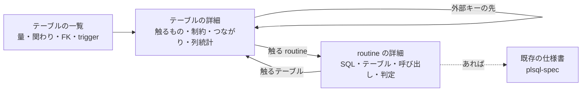
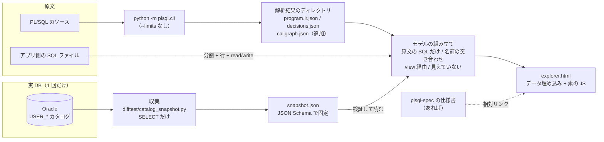

# Migration Explorer - Plan

## Goal Capsule

- **Objective:** 移行を検討する人が、対象の PL/SQL と SQL、それらが触るテーブル、そのテーブルの制約・つながり・データ量を、ファイルを探し回らずに 1 か所でたどれる。
- **Means:** SELECT だけの収集スクリプトが書き出す snapshot ファイルと、既存の解析結果から、CLI が読むだけの静的 HTML を生成する。
- **Product authority:** wfukatsu。GitLab Issue #16 をこの内容に書き換える前提である。レビュー消化の Workbench（複数人、承認、API、PostgreSQL）は、この計画の範囲ではない。
- **Open blockers:** なし。
- **Authority:** 製品の振る舞いは Product Contract の R が決め、作り方は Planning Contract の KTD が決める。食い違ったら R が勝つ。
- **Execution profile:** コード。CI は DB なしで回る。実 DB に触るのは U2 の手で流す確認だけ。
- **Stop conditions:** Product Contract の範囲を変えないと進めないと分かったとき。解析の既存の出力（`program.ir.json`、`decisions.json`）の形を変えないと進めないと分かったとき。
- **Who finishes:** 実装は ce-work。Issue #16 の書き換えと GitLab / GitHub への push は、利用者の確認を取ってから。

---

## Product Contract

### Summary

移行前の調査のための、読むだけの画面を作る。入口はテーブルの一覧で、テーブルからは触る routine と SQL へ、routine からは SQL とテーブルへたどれる。制約、外部キー、trigger、行数、オプティマイザ統計など DB にしかない情報は、実 DB で 1 回流す収集スクリプトの snapshot から読む。

### Problem Frame

これまでの移行作業（create_order、チュートリアルのサンプル、corpus）で手間がかかったのは、REVIEW の消化ではなく、その手前の調査だった。どの PL/SQL が対象か、その中にどんな SQL があるか、どのテーブルを触るか、そのテーブルが何とつながっているか、制約は何か、データはどれくらいあるかを、毎回ばらばらの場所から集めていた。

原文から分かること（routine の中の SQL、読み書きするテーブル、呼び出し関係）は解析結果に入っているが、routine ごとの仕様書に散っていて、テーブルの側から引けない。DB にしかないこと（外部キー、制約、trigger、行数、統計）は、どこにも取っていない。`--schema` に渡す DDL は `%TYPE` の解決にしか使っておらず、Oracle のカタログを読むコードは無い。

これらは ScalarDB 側の設計にそのまま効く。パーティションキーの候補、scan が重くなるテーブル、cross-partition scan を避けるべき箇所、外部キーをアプリで守る必要のある箇所は、テーブルの量とつながりを見ないと決められない。

### Key Decisions

- **DB の情報は snapshot ファイルで取り込み、オプティマイザ統計も取る。** DB につなげない案件でも DBA に頼め、同じ入力から同じ画面を作り直せ、画面が資格情報を持たない。Governs R1, R2, R3, R4. (session-settled: user-directed — chosen over UI から実 DB に接続 / DDL ファイルだけ / snapshot と DDL の両対応: 接続できない案件でも使え、再現でき、データ量が取れるのはこれだけ)
- **入口はテーブルの一覧、routine は詳細。** 移行の範囲と順番を決める材料はテーブルの側にある。Governs R8, R9, R10, R12. (session-settled: user-approved — chosen over routine を入口 / 関係の図を入口 / 両方を対等: 困りごとの多くがテーブル側の情報で、図は実案件の規模で読めなくなる)
- **読むだけ。** 困っていたのは探すことで、記録することではない。判断と承認の記録は migrate-flow がすでに持っている。Governs R14. (session-settled: user-approved — chosen over 範囲の印を書き出す / メモと判断を共有して残す: サーバも DB も認証も要らず、ファイルを渡せば共有できる)
- **一覧に載せる SQL は、PL/SQL の中、アプリ側の SQL ファイル、view と trigger。** 載っていない SQL があると、テーブルの「誰も触らない」が嘘になる。Governs R5, R6, R7. (session-settled: user-approved — chosen over PL/SQL の中だけ / 実行統計も含める: テーブル側の数字が信頼でき、DBA 権限や別ライセンスを要求しない)
- **列統計の実データの値は、既定で取らない。** そのまま渡せる HTML にするため。Governs R3, R15. (session-settled: user-approved — chosen over 常に取らない / 常に取る: 既定が安全で、日付の範囲などが要るときは取る側が選べる)
- **Issue #16 をこの内容に書き換える。** レビュー消化の Workbench は Issue から消えるので、必要になったときに立て直す。(session-settled: user-directed — chosen over 新しい Issue を立てて #16 は #6 待ちのまま残す: 利用者の選択)

### Actors

- A1. 移行を検討する人。画面を開いて調べる。移行の範囲、順番、ScalarDB 側の設計の材料を集める。
- A2. snapshot を取る人。対象の DB に SELECT できる人で、A1 と同じとは限らない（顧客の DBA など）。収集スクリプトを流し、できたファイルを渡す。
- A3. 画面を受け取って読む人。顧客やチームの関係者。ツールも DB への経路も持たない。

### Requirements

**snapshot の収集**

- R1. 収集は SELECT だけで完結し、対象の DB に何も作らず、何も書き込まない。
- R2. snapshot は、テーブル、列、制約（PK、UNIQUE、CHECK、外部キー）、索引、trigger、view の定義、オブジェクト間の依存、行数、サイズ、テーブルと列のオプティマイザ統計、統計を取った日時を持つ。
- R3. 列統計のうち実データの値（最小値、最大値、ヒストグラムの頻出値）は既定で取らず、収集時に明示したときだけ取る。値を含む snapshot は、そのことが snapshot 自身に記録される。
- R4. snapshot は、いつ、どの DB のどのスキーマから取ったかを持ち、同じ snapshot と同じ原文からは同じ画面が生成される。

**SQL の一覧**

- R5. 一覧は、PL/SQL の中の SQL、渡されたアプリ側の SQL ファイル、snapshot にある view の定義と trigger を載せる。
- R6. 各 SQL は、出どころ（ファイルと行、または DB のオブジェクト名）、触るテーブル、読みか書きかを持つ。
- R7. 静的に拾えないもの（動的 SQL、テーブルを特定できなかった SQL）は、一覧から落とさず「見えていない」として出す。テーブルの側では、そのテーブルに届きうる「見えていない」SQL があることが分かる。

**テーブルの一覧（入口）**

- R8. 最初に見えるのは全テーブルの一覧で、行数、サイズ、書く routine と SQL の数、読む routine と SQL の数、外部キーの入りと出の数、trigger の数を並べる。
- R9. 一覧は、どの欄でも並べ替えられ、名前で絞り込める。

**テーブルの詳細**

- R10. テーブルを選ぶと、触る routine と SQL（行と操作の種類つき）、制約、外部キーでつながるテーブル（親と子、その先も 1 つずつたどれる）、付いている trigger、列ごとの統計が見える。
- R11. 原文のどこにも出てこないが snapshot にある trigger と view は、そのテーブルに「付いているもの」として出す。

**routine の詳細**

- R12. routine を選ぶと、その中の SQL（行、操作、テーブル）、呼び出す routine と呼ばれる routine、判定（AUTO / REVIEW / REDESIGN）が見え、各テーブルからテーブルの詳細へ、routine から既存の仕様書（plsql-spec の出力）があればそこへ飛べる。

**分からないことの見せ方**

- R13. snapshot が無い、または項目が取れていないとき、その欄は空や 0 ではなく「未取得」と出す。統計が無いテーブルは「統計なし」、統計が古いテーブルは取った日付とともに出す。

**共有**

- R14. 画面は読むだけである。生成物はサーバ、DB、認証、ネットワークなしで、ファイルを開くだけで動く。
- R15. 値を含む snapshot から作った画面は、値を含むことが画面の上で分かる。

### Key Flows

- F1. snapshot を取って画面を作る
  - **Trigger:** A1 が新しい移行対象の調査を始める。
  - **Actors:** A1, A2
  - **Steps:** A1 が収集スクリプトを A2 に渡す。A2 が対象のスキーマに対して流し、snapshot ファイルを返す。A1 が原文、SQL ファイル、snapshot を指定して画面を生成する。
  - **Outcome:** 1 つの HTML ができ、A1 が開いて調べ始められる。
  - **Covered by:** R1, R2, R3, R4, R5, R14
- F2. テーブルから移行の範囲を調べる
  - **Trigger:** A1 が「どこから移すか」「このテーブルを移すと何が巻き込まれるか」を知りたい。
  - **Actors:** A1
  - **Steps:** 一覧を行数や関わりの多さで並べ替える。テーブルを選ぶ。触る routine と SQL、外部キーの先、trigger、列の distinct 数と偏りを見る。外部キーの先のテーブルへ移る。
  - **Outcome:** 一緒に移すテーブルと routine のかたまり、パーティションキーの候補、scan が重くなる箇所の見当が付く。
  - **Covered by:** R8, R9, R10, R11, R13
- F3. routine から必要な情報をそろえる
  - **Trigger:** 移す routine が決まっていて、migrate-flow の段階 1（現行の仕様）に入る。
  - **Actors:** A1
  - **Steps:** テーブルの詳細か routine の絞り込みから routine を選ぶ。SQL と触るテーブルを見る。各テーブルの制約と量を確かめる。仕様書へ飛ぶ。
  - **Outcome:** その routine を移すのに考慮する DB の情報が、1 か所でそろう。
  - **Covered by:** R6, R10, R12
- F4. 画面を人に渡す
  - **Trigger:** A1 が調査の結果を A3 と共有したい。
  - **Actors:** A1, A3
  - **Steps:** A1 が HTML を渡す。A3 がブラウザで開く。
  - **Outcome:** A3 が A1 と同じものを見る。値を含む snapshot なら、A1 も A3 もそれに気づける。
  - **Covered by:** R14, R15

画面のたどり方:



### Acceptance Examples

- AE1. **Covers R13.** Given snapshot を指定せずに画面を生成した, when テーブルの一覧を開く, then 触る routine と SQL の数は出て、行数、サイズ、外部キー、trigger の欄は「未取得」と出る。0 や空欄にはならない。
- AE2. **Covers R13.** Given snapshot に、統計を一度も取っていないテーブルがある, when 一覧を行数で並べ替える, then そのテーブルは「統計なし」と出て、行数 0 のテーブルとは区別される。
- AE3. **Covers R7.** Given ある routine が `EXECUTE IMMEDIATE` でテーブル名を組み立てている, when その routine の詳細を開く, then その SQL は「見えていない」として一覧にあり、触るテーブルは空ではなく「特定できない」と出る。
- AE4. **Covers R11.** Given `order_items` に trigger が付いているが、その原文は渡されていない, when `order_items` の詳細を開く, then その trigger が「付いているもの」に出て、原文が無いことが分かる。
- AE5. **Covers R3, R15.** Given 値を取る指定なしで取った snapshot, when 列の統計を見る, then distinct 数、NULL 数、平均長、ヒストグラムの種類、偏りの有無は出て、最小値、最大値、頻出値はどこにも出ない。
- AE6. **Covers R3, R15.** Given 値を取る指定つきで取った snapshot, when 画面を開く, then どのページでも、値を含む snapshot から作られたことが見える。
- AE7. **Covers R5, R8.** Given あるテーブルを、PL/SQL は触らず、アプリ側の SQL ファイルだけが触っている, when 一覧を見る, then そのテーブルの「触る SQL」は 0 ではない。

### Success Criteria

- create_order のサンプルと tutorial のサンプルで、「この routine を移すのに考慮する DB の情報」を、画面の外のファイルを開かずに答えられる。
- 実案件の規模（数百のテーブル、数百の routine）でも、一覧の並べ替えと絞り込みで目的のテーブルに数操作で着ける。
- 収集スクリプトを、説明を読んだ DBA が、質問なしで流して返せる。

### Scope Boundaries

**あとに回すもの**

- 複数人でのレビュー消化、承認の画面、課題と差分の管理、再生成、監査ログ、API、PostgreSQL（設計書 §3 と §12 の Workbench の残り）。#6（判定者）と、REVIEW の消化を誰がどう回すかが決まってから。
- 実行統計（`V$SQL`、AWR）。DBA 権限と Diagnostics Pack のライセンスが要り、SQL 文に業務の値が入りうる。
- 移行の範囲を画面で選んで migrate-flow の入力として書き出すこと。
- スキーマ全体の関係の図。選んだテーブルの周りを小さく出すかどうかは計画で決めてよい。
- Oracle 以外（PostgreSQL、MySQL）のカタログの収集。

**やらないもの**

- 画面から実 DB につなぐこと。
- DDL ファイルから制約を読んで、snapshot が無いときの穴を埋めること。

### Dependencies / Assumptions

- snapshot を取れる Oracle がある。corpus とサンプルで試すには、検証で使っている Docker の Oracle で 1 回取る手順が要る。
- 収集する人は、対象のスキーマの持ち主として接続できる。snapshot 1 つは 1 スキーマで、読むのは `USER_*` のカタログだけなので、追加の権限は要らない（KTD3）。
- 「統計情報」はオプティマイザ統計を指すものとして扱った。利用者の言葉は「統計情報も取得」で、実行統計を含める案は、そのあとの SQL の範囲の選択で採られなかった。
- 行数は統計の値であって、実際の件数ではない。画面はそのことが分かるように出す（R13 の日付）。

### Outstanding Questions

**Deferred to Implementation**

- 偏りの有無を判定する境目。ヒストグラムの種類と distinct 数からの目安を U1 で決め、実 DB の snapshot を見て直す。
- 数百のテーブルと routine を入れた HTML の大きさと、開く速さ。U6 で大きめの合成データを入れて確かめ、重ければ SQL の本文を折りたたんで持つ。

### Sources / Research

- `docs/design/plsql-migration-platform-design.md` §3（Migration Workbench の定義）、§12（API。この計画は `GET /snapshots/{id}/inventory` に当たる部分）、§14（ソースを機密情報として扱う、再現性）。
- `plsql/review.py`（いまのレビュー動線の 3 ファイル。routine ごとの判定の出どころ）。
- `plsql/analysis.py`、`skills/plsql-spec/scripts/spec_facts.py`（routine の中の SQL、読み書きするテーブル、呼び出し関係、データの図。原文から分かることはここにある）。
- `plsql/cli.py` の `--schema`（DDL は `%TYPE` / `%ROWTYPE` の解決に使うだけ）。
- `skills/migrate-flow/SKILL.md`（承認と記録はここが持つ。この画面が記録を持たない理由）。
- `fixtures/plsql-external/create_order/src/`（受け入れの確認に使うサンプル。`customers`、`products`、`orders`、`order_items`）。
- GitLab Issue #16、#6。

---

## Planning Contract

**Product Contract preservation:** Product Contract unchanged. 計画で解けた Outstanding Questions をその場で解き、Dependencies の権限の行を KTD3 に合わせて言い切りに直した。R、A、F、AE の ID と意味は変えていない。

### Key Technical Decisions

- KTD1. **収集は Python の単一ファイルで、リポジトリのほかのコードを import しない。** python-oracledb の thin モードだけに依存し、発行する SELECT はファイルの先頭に名前つきで並べて、読めば SELECT だけだと確かめられるようにする。置き場所は `difftest/` で、`requirements-difftest.txt` の側に属する。Governs R1, R2, R3, R4. (session-settled: user-directed — chosen over SQL*Plus スクリプト / 両方 / Python を先に SQL*Plus は後で: JSON と R3 の既定をコードで守れ、LONG 型と改行で壊れない)
- KTD2. **接続の情報は環境変数と対話入力から取り、パスワードを引数で受けない。** 変数の名前は `difftest/conf/sources/oracle-local.json` と同じ `SRC_ORACLE_*` にそろえ、既存の検証環境でそのまま動くようにする。接続したら最初にトランザクションを読み取り専用にする。接続記述子や Easy Connect の文字列を丸ごと渡す変数も受け、これがあればホスト、ポート、サービスより優先する（`tcps://` で TLS の接続ができる）。単一ファイルの制約（KTD1）があるので `difftest/sources.py` は import しない。
- KTD3. **snapshot 1 つは Oracle の 1 スキーマで、読むのは `USER_*` のカタログだけ。** 検証環境の「1 ユーザ = 1 スキーマ」の流儀と同じで、追加の権限が要らない。スキーマをまたぐ外部キーは、相手の持ち主と名前だけを持ち「この snapshot の外」と出す。複数スキーマを 1 つに入れるのは、あとに回す。
- KTD4. **snapshot の形式は JSON Schema で固定し、読む側が検証する。** `plsql/ir/schema.json` と同じ流儀で、`jsonschema` はすでに依存にある。「項目が無い」と「空」を区別する: 節のキーが無ければ未取得、テーブルの統計が null なら統計なし、空の配列は「0 件と確かめた」。値を含むかどうかは snapshot の先頭のフラグが持つ。Governs R3, R4, R13, R15.
- KTD5. **画面の生成は、解析結果のディレクトリと snapshot を読む。解析はやり直さない。** `plsql-spec` と同じ入力（`python -m plsql.cli` の出力）にそろえ、判定（`decisions.json`）も同じ場所から読める。同じファイルからは同じ画面ができる（R4）。
- KTD6. **呼び出し関係を、解析の出力に 1 ファイル足す。** いまはメモリの中にしか無く、式の中の関数呼び出しは `program.ir.json` に出ない。既存のファイルの形は変えない。
- KTD7. **原文にある SQL だけを載せる。** 解析が足した文（trigger の織り込み、paging、MERGE の分解）は、`skills/plsql-spec/scripts/spec_facts.py` の `FROM_SOURCE` と同じ基準で除く。基準が 2 か所になるので、corpus の全 routine で両者の SQL の件数が一致することをテストで押さえる。`spec_facts.py` の作り直しはしない。
- KTD8. **テーブル名は、スキーマ名抜きの小文字の名前で突き合わせる。** 解析（`plsql/sqlbridge.py` の `read_write_sets`）がスキーマ名を落とすため。CTE の別名と `dual` は除く。`@link` つきの名前は「リモートのテーブル」として別に扱う。snapshot に無い名前は消さずに「snapshot に無い」と出す。同じ文の中で読み書きの両方があるテーブルは、解析が書きだけを返すので、その制限を画面の注記に書く。
- KTD9. **アプリ側の SQL の行番号は、変換器を変えずに得る。** 分割は `scalardb_migrate/converter.py` のものをそのまま使い、分割の決まり（`;`、SQL*Plus の `/`、PL/SQL のブロック）を 2 か所に持たない。各文は原文の切り出しそのままなので、原文の中で前から順に探して開始行を出す。変換器に手を入れると toolchain の指紋（`plsql/fingerprint.py`）が変わり、`samples/tutorial/result/plsql/evidence.json` が古くなるので、それを避ける。テーブルと読み書きの別は `read_write_sets` を使う。
- KTD10. **view は snapshot の依存関係で元のテーブルに結び、trigger は原文が無ければ中身を解析しない。** view を読む SQL は、元のテーブルの側に「view 経由」として出す。原文の無い trigger は「付いているもの」に出し、その中の SQL は「見えていない」とする（R7, R11）。
- KTD11. **HTML は 1 ファイルで、データを JSON として埋め込み、素の JavaScript で描く。** 外部のライブラリも CDN も使わない（R14）。Python の側は標準ライブラリだけで、テンプレートのファイルに JSON を差し込む。リポジトリに HTML 生成の前例は無いので、これが最初の形になる。画面の切り替えは URL のハッシュで行い、テーブルや routine へのリンクをそのまま人に渡せる。
- KTD12. **調査用の解析は `--limits` なしで流す。** `--limits` や ScalarDB のスキーマを渡すと、解析が原文の SQL を書き換えた形で出すことがある。画面の生成は、解析結果に書き換えの跡を見つけたら警告を出す。

### High-Level Technical Design



画面に出す 1 つの値が「分からない」ときの出し分け:

| 状態 | 出どころ | 画面 |
|---|---|---|
| snapshot を渡していない | `--snapshot` なし | 未取得 |
| snapshot にその節が無い | キーが無い（KTD4） | 未取得 |
| テーブルの統計が取られていない | 統計が null | 統計なし |
| 統計はあるが古い | 統計を取った日時 | 値 + 日付 |
| 確かめて 0 件 | 空の配列、0 | 0 |
| テーブルが snapshot に無い | 名前が突き合わない（KTD8） | snapshot に無い |
| SQL のテーブルが特定できない | 動的 SQL、解析できない SQL | 見えていない |
| テーブルを特定できない SQL が、原文のどこかにある | 変種を列挙できない動的 SQL | どのテーブルの詳細にも「特定できない SQL が届きうる」と出し、その SQL へのリンクを付ける |

### Output Structure

```text
difftest/
  catalog_snapshot.py          収集（単一ファイル）
plsql/
  explorer/
    __init__.py
    __main__.py                python -m plsql.explorer
    snapshot.py                snapshot の読み込みと検証
    snapshot.schema.json
    appsql.py                  アプリ側 SQL の分割・開始行・read/write
    model.py                   解析結果 + snapshot + アプリ側 SQL → 画面のデータ
    page.py                    データを HTML に差し込む
    template.html              画面（HTML + CSS + JS）
fixtures/
  explorer/
    src/                       FK・trigger・view を持つ小さなスキーマと PL/SQL
    app/                       アプリ側の SQL ファイル
    snapshot.json              実 DB で取ってコミットしたもの
    snapshot-no-stats.json     統計なしの版
    snapshot-with-values.json  値を含む版
docs/guide/explorer.md
```

### Assumptions

- 検証用の Oracle（`difftest/docker-compose.yml` の `source-oracle`、`gvenzl/oracle-free:23-slim-faststart`）で取った snapshot を fixture としてコミットしてよい。中身は合成データで、値を含む版も合成の値である。
- fixture のテーブルは統計を取らないと空なので、統計つきの snapshot を取る前に、fixture の準備の側で統計を取る。収集スクリプト自身は統計を取らない（R1）。
- 原文の無い trigger の本体と view の定義は、snapshot に文字列として入る。値を含むかどうかのフラグ（R3）は列統計の値だけを指し、これらの定義の文は含めない。定義の中にリテラルが書かれていることはありうるので、案内の文書にその旨を書く。

### Risks & Dependencies

| リスク | 手当て |
|---|---|
| `FROM_SOURCE` の基準が `spec_facts.py` と別々に変わり、画面と仕様書で SQL の件数がずれる | KTD7 の一致テスト |
| 同じ文がファイルに 2 回あると、開始行を取り違える | 前の文の終わりから先だけを探す（KTD9）。U4 のテストで押さえる |
| 実案件の snapshot や HTML を、誤ってリポジトリにコミットする（GitLab と GitHub の両方に出る） | 案内に「リポジトリの外に置く」と書き、`difftest/golden.py` と同じく出力先を明示させる。fixture 以外の snapshot を置く場所を `.gitignore` に足す（U8） |
| `sourceRange.file` がファイル名だけなので、サブディレクトリに同名のファイルがあると取り違える | 画面には解析結果のとおりに出し、同名が複数あれば警告する。解析の側を直すのはあとに回す |
| 埋め込んだ JSON に `</script>` や不正な文字が入って画面が壊れる、または SQL の本文が HTML として解釈される | 差し込むときに閉じタグを無害化し、画面の側は文字列を必ずテキストとして入れる（U6 のテスト） |
| Oracle のバージョンでカタログの列が違う | 対象は 12.2 以降とし、無い列は未取得として扱う。取れなかった節は snapshot に理由つきで記録する |
| 実案件で `USER_*` では足りない（別の持ち主のスキーマを読む） | KTD3 の限界として案内に書く。必要になったら `ALL_*` と持ち主の指定を足す（あとに回す） |

### Open Questions

どちらも実装を止めない。利用者が決めるまで、書いてある既定で進める。

- Native Network Encryption が必須で TLS も使えない DB のために、thick モードに切り替える明示のオプションを足すか。KTD1 の文面が変わるので、利用者の判断が要る。既定: 足さない（KTD2 の接続記述子と、失敗時のメッセージまで）。
- 値を取るオプションを本番の DB に使うとき、`difftest/golden.py` の `--allow-production` のような明示の確認を求めるか。既定: 求めない。

---

## Implementation Units

### U1. snapshot の形式と読み込み

**Goal:** snapshot の形を JSON Schema で固定し、読み込んで検証し、「未取得」「統計なし」「0」を区別できる形で返す。

**Requirements:** R2, R3, R4, R13, R15. KTD3, KTD4.

**Dependencies:** なし。

**Files:**
- `plsql/explorer/__init__.py`
- `plsql/explorer/snapshot.py`
- `plsql/explorer/snapshot.schema.json`
- `tests/test_plsql_explorer_snapshot.py`

**Approach:**
- 先頭に、形式の版、取った日時、DB の名前とバージョン、スキーマ、収集スクリプトの版、値を含むかどうか、取れなかった節とその理由を持つ。
- 節は、テーブル、列、制約、索引、trigger、view、依存関係、サイズ、テーブルの統計、列の統計。節ごとにキーの有無で未取得を表す（KTD4）。
- 列の統計の値（最小、最大、頻出値）は、値を含むフラグが真のときだけ許す。偽なのに値があれば検証で落とす。列、列の統計、ヒストグラムの節は、知らないキーを許さない（値を持つ列が別の名前で紛れ込むのを検証で止める）。
- 値は、復号した文字列と元の型の組で持つ。復号できなかった値は「復号できない」と型の名前で持ち、16 進のままでは持たない。
- 偏りの目安は、読み込みの側でヒストグラムの種類と distinct 数から出す。境目は定数 1 か所に置く。
- 名前は読み込みのときに小文字にそろえる（KTD8）。

**Patterns to follow:** `plsql/ir/schema.json` と、その検証のしかた。`plsql/symbols.py` の `OracleSchema` の `snapshot="<file>@<sha1[:8]>"` の名付け。

**Test scenarios:**
- 全部の節がある snapshot を読むと、テーブル、制約、外部キー、trigger、view、統計が取り出せる。
- 節のキーが無い snapshot を読むと、その節は未取得になり、空とは区別される。
- 統計が null のテーブルは統計なしになり、行数 0 のテーブルとは区別される。
- 値を含むフラグが偽で、列の統計に最小値が入っている snapshot は、検証で落ち、どの列かがメッセージに出る。
- 値を含むフラグが真の snapshot は通り、読み込んだ結果がそのことを持つ。
- 形式の版が知らない版なら、読まずに分かるメッセージで落ちる。
- スキーマをまたぐ外部キーは、相手が「この snapshot の外」として読める。
- 大文字と引用符つきの名前が、小文字にそろって読める。

**Verification:** テストの中に書いた小さな合成の snapshot が検証を通り、壊した snapshot が理由つきで落ちる。実 DB で取った 3 つの snapshot の確認は U2 が受け持つ。

### U2. 収集スクリプト

**Goal:** 実 DB の 1 スキーマから、SELECT だけで snapshot を書き出す。

**Requirements:** R1, R2, R3, R4. F1. KTD1, KTD2, KTD3.

**Dependencies:** U1（形式）。

**Files:**
- `difftest/catalog_snapshot.py`
- `tests/test_catalog_snapshot.py`
- `fixtures/explorer/src/schema.sql`、`fixtures/explorer/src/*.prc`（FK、CHECK、UNIQUE、trigger、view を持つ小さなスキーマ。create_order のサンプルを元にする）
- `fixtures/explorer/snapshot.json`、`fixtures/explorer/snapshot-no-stats.json`、`fixtures/explorer/snapshot-with-values.json`（実 DB で取ってコミットする）

**Approach:**
1. 発行する文を、ファイルの先頭に節の名前つきで並べる。中身は SELECT と、名前つきの 1 文 `SET TRANSACTION READ ONLY` だけで、それ以外の文を発行する道を作らない。
2. 接続は KTD2 のとおり。`oracledb` は接続する関数の中でだけ import する（`difftest/golden.py` と同じ）。ドライバが無くても、文の一覧と組み立ての部分は import できる。
3. DB の名前とバージョンは、問い合わせではなく接続の属性から取る（`USER_*` の外を読まない）。
4. 節ごとに SELECT を流し、失敗した節は飛ばして、理由を snapshot に記録する（1 つの失敗で全体を止めない）。
5. 値を取るのは明示のオプションのときだけ。既定では、値の列を SELECT の段階で取らない（取ってから捨てない）。値の列は Oracle の内部形式の RAW なので、Python の側で列の型ごとに復号する。対象は NUMBER、文字列の型、DATE、TIMESTAMP。ほかの型は「復号できない」と記録する（U1）。
6. 出力は U1 の形式。書き出す前に、同じ JSON Schema の写しではなく、形式の版と必須のキーだけを自分で確かめる（単一ファイルの制約）。完全な検証は読む側（U1）が行う。

**Execution note:** 実 DB が要る部分は手で流して確かめ、取れた snapshot を fixture としてコミットする。CI で回るテストは、SELECT の一覧の静的な検査と、カーソルを差し替えた組み立ての確認にとどめる。

**Patterns to follow:** `difftest/golden.py` の読むだけの取り込み（`--allow-production` と `--no-setup` の考え方）。`difftest/sources.py` の「資格情報をメッセージに出さない」。`samples/tutorial/plsql/oracle-user.sh` のユーザの作り方。

**Test scenarios:**
- ファイルに並んだ文が、`SET TRANSACTION READ ONLY` の 1 文を除いてすべて SELECT で始まり、`USER_*` 以外のカタログを読まず、`SELECT *` を使わない（静的な検査）。
- 値を取る指定なしのとき、どの文にも値を持つ列（`LOW_VALUE`、`HIGH_VALUE`、`ENDPOINT_VALUE`、`ENDPOINT_ACTUAL_VALUE`）が含まれない。
- 既知の RAW の NUMBER、VARCHAR2、DATE が、DB なしで正しく復号される。復号できない型は「復号できない」になる。
- `oracledb` が入っていない環境でも、このテストファイルの静的な検査と組み立ての確認が走る。
- DB が Native Network Encryption を必須にしていて接続に失敗したとき、原因と、TLS の接続記述子を渡す道があることがメッセージに出る。
- 値を取る指定つきのとき、snapshot の値を含むフラグが真になる。
- ある節の SELECT が失敗しても、ほかの節は書き出され、失敗した節は理由つきで「取れなかった」と記録される。
- パスワードを引数で渡そうとすると、受け付けずに使い方を出す。
- 接続の失敗のメッセージに、パスワードが出ない。
- リポジトリのほかのモジュールを import していない（静的な検査）。
- （手で流す）`source-oracle` の fixture のスキーマから取った snapshot が U1 の検証を通る。
- （手で流す）流す前と後で、スキーマのオブジェクトの数と `LAST_DDL_TIME` が変わっていない。

**Verification:** Docker の Oracle で取った 3 つの snapshot が U1 の検証を通り、コミットされている。

### U3. 呼び出し関係の出力

**Goal:** 解析の出力に、routine の呼び出し関係を 1 ファイル足す。

**Requirements:** R12. KTD6.

**Dependencies:** なし。

**Files:**
- `plsql/report.py`
- `plsql/cli.py`（呼び出し関係を持つ `ProgramAnalysis` はここで作られ、いまは `write` に渡っていない）
- `tests/test_plsql_report.py`

**Approach:**
- `ProgramAnalysis.call_graph` の解決できた呼び出しと、名前だけ分かる外部の呼び出しを、routine の id をキーにして書き出す。
- 既存の出力ファイルの形は変えない。

**Patterns to follow:** `plsql/report.py` の `write` がほかの JSON を書くやり方。

**Test scenarios:**
- corpus を解析すると、呼び出し関係のファイルができ、式の中の関数呼び出し（`v := f(x)`）が入っている。
- 解決できない呼び出し先は、名前のまま外部として入る。
- 呼び出しの無い routine も、空の関係として入る。
- 既存の出力ファイル（`inventory.json`、`program.ir.json`）の中身が、この追加の前後で変わらない。

**Verification:** 既存のテストが全部通り、新しいファイルが corpus の全 routine を含む。

### U4. アプリ側の SQL の文と開始行

**Goal:** SQL ファイルを文に分け、各文が何行目から始まるかと、触るテーブルを得る。変換器は変えない。

**Requirements:** R5, R6, R7. KTD9.

**Dependencies:** なし。

**Files:**
- `plsql/explorer/appsql.py`
- `tests/test_plsql_explorer_appsql.py`

**Approach:**
- 分割は `scalardb_migrate/converter.py` のものを呼ぶ。開始行は KTD9 のとおり、前の文の終わりから先を探して出す。
- 文ごとに `plsql/sqlbridge.py` の `read_write_sets` でテーブルと読み書きの別を得る。解析できない文は、ファイルと行を持ったまま「見えていない」に回す。DDL は種類だけ持ち、読み書きには数えない。

**Patterns to follow:** `scalardb_migrate/converter.py` の `_split_statements` と `Result.source_sql`。

**Test scenarios:**
- `samples/tutorial/sql/points.sql` を分けると、各文の開始行が原文の行と一致する。
- 文の前にコメント行や空行があっても、開始行は文の最初の行を指す。
- SQL*Plus の `/` で区切った PL/SQL のブロックの開始行が正しい。
- 文字列の中の `;` で文が切れず、次の文の行がずれない。
- BOM つきのファイルで行がずれない。
- 同じ文が 2 回あるファイルで、2 つ目の開始行が 2 つ目の位置を指す。
- 解析できない文は、開始行つきで「見えていない」になる。

**Verification:** `scalardb_migrate/` と vendored の写しに差分が無く、toolchain の指紋が変わっていない。

### U5. 画面のデータの組み立て

**Goal:** 解析結果、snapshot、アプリ側の SQL を 1 つのデータにまとめる。テーブルの側からも routine の側からも引ける。

**Requirements:** R5, R6, R7, R8, R10, R11, R12, R13. AE1, AE2, AE3, AE4, AE7. KTD5, KTD7, KTD8, KTD10, KTD12.

**Dependencies:** U1, U3, U4.

**Files:**
- `plsql/explorer/model.py`
- `tests/test_plsql_explorer_model.py`
- `fixtures/explorer/app/orders.sql`

**Approach:**
1. `program.ir.json` から、原文にある SQL（KTD7）、動的 SQL、trigger のモジュールを拾う。`decisions.json` から判定を、U3 のファイルから呼び出し関係を結ぶ。
2. アプリ側の SQL は U4 の結果をそのまま使う。
3. テーブル名を KTD8 で突き合わせる。
4. view と trigger を KTD10 で結ぶ。原文にある trigger と snapshot の trigger は、名前で同じものとして 1 つにまとめる。
5. テーブルごとに、書くものと読むものの数、外部キーの入りと出、trigger の数、「見えていない SQL を持つ routine が届きうるか」を数える。動的 SQL は、列挙できた変種にテーブルがあればそのテーブルに付ける。列挙できなければ、どのテーブルにも届きうるので、すべてのテーブルの側にその印を付け、全体の注記にも出す（R7）。
6. 解析結果に書き換えの跡（KTD12）があれば、データに警告を入れる。
7. `--evidence` なしの解析では AUTO が出ないことを、判定の注記としてデータに入れる。

**Patterns to follow:** `skills/plsql-spec/scripts/spec_facts.py` の `_collect` と `Facts.tables`（拾い方と `FROM_SOURCE`）。`tests/test_plsql_report.py` の、モジュール単位の fixture で `analyse` を 1 回だけ回すやり方。

**Test scenarios:**
- Covers AE1. snapshot なしで組み立てると、テーブルの触るものの数は入り、行数、サイズ、外部キー、trigger は未取得になる。
- Covers AE2. 統計なしの snapshot では、テーブルは統計なしになり、行数 0 とは別の状態になる。
- Covers AE3. `EXECUTE IMMEDIATE` でテーブル名を組み立てる routine の SQL は「見えていない」に入り、テーブルは「特定できない」になる。
- Covers AE4. snapshot にだけある trigger は、そのテーブルの「付いているもの」に入り、原文なしと印が付く。
- Covers AE7. アプリ側の SQL だけが触るテーブルの、触る SQL の数が 0 でない。
- corpus の全 routine で、原文にある SQL の件数が `spec_facts.py` の結果と一致する（KTD7）。
- trigger の織り込みで足された SELECT と Call は、どの routine の SQL にも入らない。
- CTE を使う SELECT で、CTE の別名がテーブルとして出ない。
- `SELECT ... FROM dual` が、テーブルの行を作らない。
- 変種を列挙できない動的 SQL が 1 つあると、どのテーブルの側からも「特定できない SQL が届きうる」と引ける。
- `orders@warehouse_link` は、リモートのテーブルとして `orders` とは別に出る。
- 原文には出るが snapshot に無いテーブルは、「snapshot に無い」として一覧に残る。
- view を読む SQL が、元のテーブルの側に「view 経由」として出る。
- 原文にも snapshot にもある trigger が、2 つでなく 1 つとして出る。
- 外部キーの親と子が、両方のテーブルの側から引ける。
- 解析できないアプリ側の SQL は、ファイルと行つきで「見えていない」に入る。
- `--limits` つきで流した解析結果を渡すと、警告が入る。
- 同じ入力から 2 回組み立てると、同じデータになる（並びも同じ）。

**Verification:** fixture の入力から組み立てたデータが、テーブル、routine、SQL のどこから引いても食い違わない。

### U6. 画面

**Goal:** U5 のデータを、1 つの HTML として見られるようにする。

**Requirements:** R8, R9, R10, R11, R12, R13, R14, R15. F2, F3, F4. AE5, AE6. KTD11.

**Dependencies:** U5.

**Files:**
- `plsql/explorer/template.html`
- `plsql/explorer/page.py`
- `tests/test_plsql_explorer_page.py`

**Approach:**
- 画面は 3 つ: テーブルの一覧、テーブルの詳細、routine の詳細。切り替えは URL のハッシュ（KTD11）。
- どの画面の上部にも名前の検索を置く。テーブル、routine、SQL の出どころを名前で探し、選ぶとその詳細へ飛ぶ。F3 の「routine の絞り込み」はこれを指し、4 つ目の画面は作らない。
- 一覧の絞り込みや検索で何も当たらないときは、空の表ではなく「該当なし」と出す。
- 一覧は、どの欄でも並べ替えられ、名前で絞り込める。未取得と統計なしは、並べ替えで数値の 0 と混ざらず、末尾にまとまる。
- 「分からない」の出し分けは、High-Level Technical Design の表のとおり。
- 値を含む snapshot のときは、どの画面でも上部に帯を出す（R15）。帯と、帯が無いときの表示は「列統計の値: 含む / 取っていない」と範囲を絞って書く。
- 値のフラグに関係なく、先頭に固定の注意を出す: このファイルは原文の SQL と DB のオブジェクトの定義を含み、その中にリテラルが書かれていることがある。
- 先頭に、snapshot の出どころ（DB、スキーマ、日時）、解析の出どころ、警告（U5）、注記（同じ文の中の読み書きの制限、AUTO が出ない条件）を出す。
- 仕様書へのリンクは、`--spec-dir` にその module の文書があるときだけ、相対パスで張る。
- 色だけで状態を表さない。文字でも出す。

**Execution note:** 見た目は、ブレーンストーミングで選んだ形（テーブルの一覧を入口、詳細は右か下）に合わせる。最初に fixture のデータでブラウザに出して形を確かめ、それからテストを足す。

**Test scenarios:**
- Covers AE5. 値を含まない snapshot から作った HTML のどこにも、fixture の最小値、最大値、頻出値の文字列が現れない。
- Covers AE6. 値を含む snapshot から作った HTML に、値を含むことを示す帯がある。
- 生成した HTML に、外部の URL への参照（`http://`、`https://`、`//` で始まる `src` と `href`）が無い。
- SQL の本文に `</script>` と `` を含む入力から作った HTML で、埋め込みの JSON が途中で閉じず、画面の側がそれをテキストとして扱う。
- 埋め込んだ JSON を取り出して読むと、U5 のデータと一致する。
- `--spec-dir` に文書がある module の routine にはリンクがあり、無い module には無い。
- 値を含まない snapshot から作った HTML にも、原文と定義を含む旨の固定の注意がある。
- （ブラウザで確かめる）検索で routine の名前を入れると、テーブルを経由せずにその routine の詳細が開く。
- （ブラウザで確かめる）当たらない名前で絞り込むと「該当なし」と出る。
- （ブラウザで確かめる）一覧を行数で並べ替えると、未取得と統計なしが末尾にまとまる。
- （ブラウザで確かめる）テーブルの詳細から外部キーの先へ、そこから routine へ、routine からテーブルへ戻れる。
- （ブラウザで確かめる）ハッシュつきの URL を開くと、そのテーブルの詳細が直接開く。
- （ブラウザで確かめる）合成の 300 テーブル、500 routine のデータで、一覧の並べ替えと絞り込みが待たされずに動く。

**Verification:** fixture から作った HTML を、ネットワークを切ったブラウザで開いて、F2 と F3 の手順が最後までたどれる。

### U7. コマンドと、端から端までの確認

**Goal:** `python -m plsql.explorer` で、解析結果と snapshot とアプリ側の SQL から HTML を作る。

**Requirements:** R4, R14. F1. KTD5.

**Dependencies:** U5, U6.

**Files:**
- `plsql/explorer/__main__.py`
- `tests/test_plsql_explorer_cli.py`

**Approach:**
- 引数は、解析結果のディレクトリ（位置引数）、`--snapshot`、`--sql`（ファイルかディレクトリ、複数可）、`--spec-dir`、`--out`、`--quiet`。
- 終了コードは既存の流儀: 0 は成功、1 は警告つきで作れた、2 は入力の誤り。
- 解析結果のディレクトリに `program.ir.json` が無ければ、先に `python -m plsql.cli` を流すように案内して 2 で終わる。

**Patterns to follow:** `plsql/cli.py` と `plsql/generate.py` の `main(argv) -> int`、モジュールの docstring を使い方にする書き方。`tests/` の、`main([...])` を `tmp_path` で直接呼ぶやり方。

**Test scenarios:**
- fixture の原文を解析し、snapshot とアプリ側の SQL を渡すと、HTML が 1 つでき、終了コードが 0。
- snapshot なしでも HTML ができ、終了コードが 0。
- 検証に落ちる snapshot を渡すと、HTML を作らずに 2 で終わり、どこが悪いかが出る。
- 解析結果のディレクトリが空なら、2 で終わり、先に流すコマンドが出る。
- `--limits` つきの解析結果を渡すと、HTML はできて、終了コードが 1。
- 同じ入力で 2 回流すと、2 つの HTML がバイト単位で同じ（R4）。
- create_order のサンプル（`fixtures/plsql-external/create_order/src`）でも HTML ができる。

**Verification:** fixture と create_order のサンプルの両方で、1 つのコマンドから HTML ができる。

### U8. 案内の文書と Issue

**Goal:** 使い方を文書にし、入口からたどれるようにする。Issue #16 をこの内容に合わせる。

**Requirements:** F1, F4. Success Criteria の「DBA が質問なしで流せる」。

**Dependencies:** U2, U7.

**Files:**
- `docs/guide/explorer.md`
- `docs/README.md`（guide の表に 1 行、用語の表に snapshot と未取得）
- `.gitignore`（fixture 以外の snapshot と、生成した HTML の置き場所）
- `docs/guide/verification.md`（収集を検証環境で流す手順への参照）
- `README.md`（道具の一覧に 1 行）

**Approach:**
- `docs/guide/explorer.md` は 2 部に分ける: DBA に渡す部分（何を読むか、何も書かないこと、値を取らない既定、流し方、できたファイルの渡し方）と、調べる人の部分（解析 → 画面の生成 → 見方、「分からない」の出し分け、限界）。
- 限界として、1 snapshot = 1 スキーマ（KTD3）、スキーマ名抜きの突き合わせと同じ文の中の読み書き（KTD8）、`--limits` なしで流すこと（KTD12）、定義の文にリテラルがありうること（Assumptions）を書く。
- 実案件の snapshot と HTML はリポジトリの外に置くこと、TLS で接続するときの接続記述子の渡し方を、DBA に渡す部分に書く。
- Issue #16 は、新しい題と本文の案を利用者に見せて、確認を取ってから書き換える。元の本文（レビュー消化の Workbench）は、コメントとして残す。

**Test expectation:** none -- 文書だけの変更。リンクの確認は既存の文書のテストがあればそれに従う。

**Verification:** `docs/README.md` から `docs/guide/explorer.md` にたどれ、案内のコマンドを上から順に流すと fixture の HTML ができる。

---

## Verification Contract

- CI と同じ 2 つが通る: `python skills/sql-transpile/scripts/vendor_sync.py --check` と `python -m pytest -q`（ローカルでは `.venv/bin/python`）。DB は要らない。
- 新しいテストは `tests/test_plsql_explorer_*.py` と `tests/test_catalog_snapshot.py`。`pytest.importorskip("oracledb")` で守るのは、実際に接続を開くテストだけにする。収集スクリプトの静的な検査と組み立ての確認は、`oracledb` なしの CI で走る。
- 手で流す確認（CI の外）:
  - `docker compose --profile oracle up -d`（`difftest/`）の `source-oracle` に fixture のスキーマを入れ、収集を流して、3 つの snapshot を取り直せる。
  - 収集の前後で、スキーマのオブジェクトが変わっていない。
  - fixture の HTML を、ネットワークを切ったブラウザで開き、F2 と F3 をたどれる。
  - 合成の 300 テーブル、500 routine で、一覧が待たされずに動く。
- Acceptance Examples の AE1〜AE7 は、それぞれ U5 と U6 の「Covers AE」のテストで押さえる。

## Definition of Done

- U1〜U8 の Verification が、それぞれ満たされている。
- R1〜R15 のそれぞれに、対応するテストか、手で流した確認の記録がある。
- 既存のテストがすべて通り、既存の解析の出力ファイルの形が変わっていない。`scalardb_migrate/` に差分が無い。
- fixture の 3 つの snapshot が、実 DB で取ったものとしてコミットされている。
- 値を含まない snapshot から作った HTML に、実データの値が入っていないことをテストが押さえている。
- `docs/guide/explorer.md` の手順だけで、fixture の HTML が作れる。
- Issue #16 の書き換えは、利用者が案を確認してから行われている。
- 試して捨てた実装や、使っていないコードが差分に残っていない。
