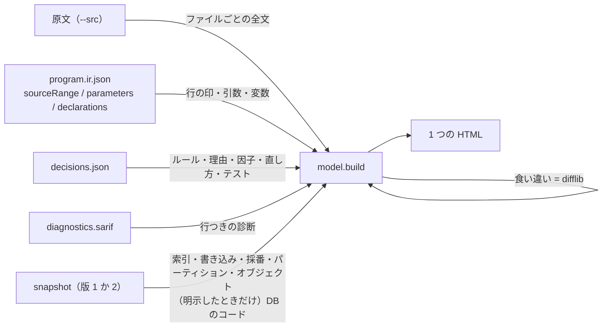

# Explorer Code and Statistics - Plan

## Goal Capsule

- **Objective:** Migration Explorer を開いた人が、routine のコードそのものと、テーブルと索引の統計、判定の中身を、画面の外のファイルを開かずに読める。
- **Means:** 原文を `--src` で受けて行番号と印つきで出し、解析結果と snapshot がすでに持っている情報を画面に出し、収集を `USER_*` の範囲で広げる（KTD1〜KTD8）。
- **Product authority:** wfukatsu。元の計画（`origin`）の決定（読むだけ、1 つの HTML、snapshot ファイル、値は明示したときだけ、1 snapshot = 1 スキーマ）は、そのまま生きている。
- **Authority:** 製品の振る舞いは R が決め、作り方は KTD が決める。食い違ったら R が勝つ。
- **Execution profile:** コード。CI は DB なしで回る。実 DB に触るのは U2 の fixture の取り直しだけ。
- **Stop conditions:** 元の計画の決定を変えないと進めないと分かったとき。解析の既存の出力の形、または `scalardb_migrate/` を変えないと進めないと分かったとき。
- **Open blockers:** なし。
- **Who finishes:** 実装はこのセッション。push と merge は、利用者の確認を取ってから。

---

## Product Contract

### Summary

Migration Explorer に、3 つのものを足す。routine のコード（原文を行番号つきで、SQL・ロック・例外・診断の行に印を付けて）。判定の中身（効いたルール、AUTO にならない理由、確信度の因子、直し方、必要なテスト）。テーブルと索引の統計（索引、書き込みの多さ、選択性、NULL の割合、採番、パーティション）と、それを一目で比べられる見せ方。あわせて、DB にあるコードと渡された原文の食い違いを出す。

### Problem Frame

最初の版を実際に開いてみると、コードが見えなかった。画面は解析結果の JSON だけを読んでいて、原文のファイルを入力に取っていない。出るのは SQL 文の本文だけで、それも折りたたみの中にある。どの行がどのテーブルを触るのかを、原文の上で確かめられない。

調べると、持っているのに出していないものが多かった。snapshot に取ってある索引（fixture で 7 本）は、画面のどこにも出ていない。`decisions.json` にある、効いたルール・AUTO にならない理由・確信度の 5 因子・直し方・必要なテストは、判定のチップ 1 つに畳まれている。`diagnostics.sarif` の行つきの診断も出ていない。行数とサイズは数字だけで、並べて比べにくい。

取っていないものもある。`USER_*` の範囲で読めることを実 DB で確かめた: DB にあるコード（`USER_SOURCE`）、何があって有効か（`USER_OBJECTS`）、前回の統計からの書き込みの件数（`USER_TAB_MODIFICATIONS`）、索引の統計、採番、パーティション。実案件でいちばん起こりやすい事故は「渡された原文が、DB で動いているものと違う」「渡されていない routine が DB にある」で、いまの画面はどちらにも気づけない。

### Key Decisions

- **`USER_SOURCE` のコード（procedure、function、package、type の本文）は、明示したときだけ取る。** 顧客のソースコードは機密で、DBA が渡す範囲を選べるようにする。何があるか（`USER_OBJECTS`）は常に取る。view の定義、マテリアライズドビューの問い合わせ、trigger の本体、CHECK の条件は、元の計画の決定どおり、どちらの場合も取る。だから既定の snapshot は「構造だけ」ではなく、この計画のどこでもそうは言わない。Governs R8, R9, R10. (session-settled: user-directed — chosen over 既定で取る / 取らない: 渡す範囲を DBA が選べ、「原文が渡されていない routine がある」ことはコードなしでも分かる)
- **発展的な項目は、食い違いの検出と、外部キーの小さな図までにする。** Mermaid の流れ図は入れず、仕様書へのリンクに任せる。Governs R10, R14. (session-settled: user-directed — chosen over 全部入れる / 入れない: 食い違いは実案件で起こりやすく、`USER_SOURCE` があれば安い。Mermaid は「外部の何も読まない 1 ファイル」と相性が悪い)

### Requirements

**コード**

- R1. `--src` で原文のディレクトリを渡すと、routine の詳細に、その routine の原文が行番号つきで出る。渡さなければ、その欄は「原文が渡されていない」と出て、画面のほかの部分はいままでどおり動く。
- R2. 原文の行には、その行にあるものの印が付く: SQL（読むテーブルと書くテーブル）、行ロック、動的 SQL、例外の送出、例外ハンドラ、COMMIT / ROLLBACK、呼び出し、診断。
- R3. テーブルの詳細の「触るもの」と、routine の SQL の一覧から、原文のその行へ飛べる。
- R4. routine の詳細に、引数とローカル変数が、書かれた型と解決した型つきで出る。
- R5. アプリ側の SQL ファイルも、ファイルの詳細に行番号つきで全文が出て、各文の行に印が付く。

**判定の中身**

- R6. routine の詳細に、効いたルール（id、判定、メッセージ）、AUTO にならない理由、確信度の因子（0 の因子が分かる）、直し方の候補、必要なテストが出る。
- R7. 解析の診断（`diagnostics.sarif`）が、routine の詳細と、原文のその行に出る。

**収集を広げる**

- R8. snapshot（版 2）は、次を常に持つ: オブジェクトの一覧（種類、有効か、最終 DDL 時刻）、前回の統計からの INSERT / UPDATE / DELETE の件数、索引の統計（distinct なキーの数、リーフブロック、クラスタリングファクタ）、採番、パーティションの方式とキー、シノニム、DB リンクの名前（接続先のホスト・ユーザは取らない）、LOB の列、マテリアライズドビュー、テーブルと列のコメント。どれも接続したユーザの `USER_*` への SELECT だけで取る。
- R9. `USER_SOURCE` のコード（procedure、function、package、type の本文と、そこに入っている trigger のテキスト）は、明示したときだけ取る。取った snapshot は、そのことを自分で持つ。明示しないときは、`USER_SOURCE` を読む文を送らない。view の定義、マテリアライズドビューの問い合わせ、trigger の本体（`USER_TRIGGERS`）、CHECK の条件は、どちらの場合も取る。収集スクリプトの説明、実行時の表示、画面の文言は、既定の snapshot を「`USER_SOURCE` のコードは取っていない（view・trigger の定義は含む）」と言い、「コードは無い」とは言わない。
- R18. wrapped（難読化）された PL/SQL の本文は、明示したときも取らない。wrapped であることだけを持ち、比較は「比べていない（DB のコードは wrapped）」になる。
- R10. 画面は、DB にあるが原文が渡されていない routine を一覧に出す。コードを取ってあれば、渡された原文と DB のコードを比べて「同じ」「違う」を出し、違うときはどこが違うかを見られる。コードを取っていなければ「比べていない」と出す。比べる単位は DB のオブジェクト 1 つで、package の spec と body は別々に比べる。TYPE と TYPE BODY は解析の対象外なので、「原文が渡されていない」には数えず、別に出す。

**統計と構造の見せ方**

- R11. テーブルの詳細に索引が出る: 名前、UNIQUE か、列、サイズ、索引の統計。
- R12. テーブルの一覧で、行数とサイズが棒でも比べられる。書き込みの件数（INSERT / UPDATE / DELETE）の欄があり、並べ替えられる。
- R13. 列の統計に、NULL の割合と選択性（distinct 数 ÷ 行数）が出る。値を含む snapshot では、頻出値が棒で比べられる。
- R14. テーブルの詳細に、そのテーブルと外部キーで直接つながるテーブルの小さな図が出る。図の中のテーブルから、そのテーブルの詳細へ飛べる。図が無くても、同じ内容が表で読める。
- R15. テーブルの詳細に、パーティションの方式とキー、テーブルと列のコメント、LOB の列、一時表かどうかが出る。採番（sequence）は、それを使う routine と並べて一覧で見られる。

**変わらないこと**

- R16. 元の計画の「分からない」の出し分けは、新しい欄にもそのまま当てはまる: 取っていなければ未取得、取って 0 なら 0。古い形式の snapshot を渡しても画面は作れ、新しい欄は未取得になる。
- R17. 画面は外部の何も読まない 1 つのファイルのままで、データは必ずテキストとして入る。コードを含む snapshot から作った画面は、先頭の固定の注意がそのことを言う。

### Acceptance Examples

- AE1. **Covers R1, R2.** Given fixture の原文を `--src` で渡した, when `create_order` の詳細を開く, then 69 行の原文が行番号つきで出て、16〜22 行目に「読む products」と「FOR UPDATE」の印がある。
- AE2. **Covers R1.** Given `--src` を渡していない, when routine の詳細を開く, then コードの欄は「原文が渡されていない」と出て、SQL の一覧と判定はいままでどおり出る。
- AE3. **Covers R3.** Given `order_items` の詳細の「触るもの」に `create_order :45` がある, when それを選ぶ, then `create_order` の詳細の 45 行目が見える位置に来て、その行が分かるように示される。
- AE4. **Covers R9.** Given コードを取る指定なしで収集した, when 送った文を調べる, then `USER_SOURCE` を読む文が 1 つも無い。
- AE5. **Covers R10.** Given コードを取った snapshot と、DB のものから 1 行変えた原文, when その routine の詳細を開く, then 「DB のコードと違う」と出て、変えた行が分かる。
- AE6. **Covers R10.** Given DB に `archive_shipments` があり、原文には渡していない, when 画面を開く, then `archive_shipments` は「DB にあるが原文が渡されていない」として一覧にある。コードを取っていれば本文が読め、取っていなければ「`USER_SOURCE` のコードは取っていない」と出る。
- AE7. **Covers R16.** Given 前の形式（版 1）の snapshot, when 画面を作る, then 作れて、索引は出て、書き込みの件数・オブジェクトの一覧・採番は「未取得」と出る。
- AE8. **Covers R12, R16.** Given 統計を取った直後で、書き込みの件数の行が無いテーブル, when 一覧を見る, then そのテーブルの書き込みの件数は 0 と出る（その節を取って、行が無かった）。画面の注記は、0 が「前回の統計から、Oracle が書き出した書き込みが無い」という意味で、まだ書き出されていない書き込みはありうることを言う。節を取っていない snapshot では「未取得」と出る。

### Scope Boundaries

**あとに回すもの**

- 制御の流れ・データの流れ・呼び出しの図（Mermaid）。仕様書（plsql-spec）へのリンクに任せる。
- スキーマ全体の関係の図、2 つ以上先までの外部キーの図。
- 実行統計（`V$SQL`、AWR）、索引の使用状況（`DBA_INDEX_USAGE`）。`USER_*` の外にある。
- 構文の色付け。印と行番号までにする。
- 複数スキーマを 1 つの snapshot に入れること。

**やらないもの**

- DB にあるコードを解析にかけること。比べて、見せるだけ。解析するのは、渡された原文だけである。
- 画面から何かを書き込むこと、DB につなぐこと。

### Dependencies / Assumptions

- 原文のファイルは、解析結果の `sourceRange.file`（ファイル名だけ）から探す。`plsql/fingerprint.py` の `sources` と同じ探し方にする（ルート直下、無ければ名前で再帰的に）。
- `USER_TAB_MODIFICATIONS` は、Oracle がメモリから書き出したときにだけ更新される。値は「少なくともこれだけ」の目安で、0 は「書き出された書き込みが無い」である。画面にそう書く。テーブル単位の行（`PARTITION_NAME IS NULL`）が、すでにパーティションの合計である。
- 渡された原文と DB のコードの比較は、`CREATE OR REPLACE` の前置き、末尾の `/`、行末の空白、空行の違いを無視する。それ以外の違いは「違う」とする。この正規化は「同じか違うか」の判定にだけ使う。
- パーティションの境界の値（`USER_TAB_PARTITIONS.HIGH_VALUE`）は実データなので取らない。取るのは方式とキーの列まで。見せたくなったら、値を取る文（`VALUE_STATEMENTS`）の側に入れる。
- `--src` で渡した原文は、コメントも含めて全文が HTML に入る。原文に資格情報（`CREATE DATABASE LINK … IDENTIFIED BY` など）が書かれていれば、それも入る。案内にそう書く。

---

## Planning Contract

**Product Contract preservation:** この計画は `ce-plan-bootstrap` として新しく書いた。元の計画（`origin`）の Product Contract は変えていない。

### Key Technical Decisions

- KTD1. **原文は `--src` で受け、ファイルごとに全文を 1 回だけ埋め込む。** routine は、その中の行の範囲を指す。1 つの package に routine が多くても、本文は 1 回しか入らない。探し方は `plsql/fingerprint.py` の `sources` と同じにする。
- KTD2. **行の印は、組み立ての側で作って、行番号をキーに持たせる。** IR のノードの `sourceRange` と SARIF の `region` から作る。画面は、行を描くときにその行の印を引くだけにする。解析が足した文は、SQL のときと同じ基準（`FROM_SOURCE`）で除く。引数と変数は、id が `#param-<数字>` / `#decl-<数字>` で終わるものだけが原文のもので、解析が足した宣言（`#decl-<名前>`。trigger の織り込みなど）は出さず、印も付けない。
- KTD3. **snapshot の形式を版 2 にし、版 1 も読む。** 版 2 は節が増え、`containsSourceCode` を持つ。版 1 を読んだときは、無い節は未取得になる（R16）。JSON Schema は 1 つで、`formatVersion` は 1 か 2。
- KTD4. **コードを取る文は、値を取る文と同じ形で分ける。** `SOURCE_STATEMENTS` に置き、`--include-source` のときだけ送る。静的な検査（SELECT だけ、`USER_*` だけ、`SELECT *` なし、禁じた列なし）は、この文にも明示的にかける。禁じる列に `HOST`、`USERNAME`、`PASSWORD` を足す。先頭の行が `wrapped` で終わるオブジェクトは、本文を持たずに `wrapped: true` とだけ持つ（R18）。`containsDataValues: false` の検証と同じく、`containsSourceCode: false` なのにコードの節があれば、読む側が拒む。2 つ目の確認のフラグは付けない（Key Decisions）。
- KTD5. **食い違いは、DB のオブジェクト 1 つ = IR の module 1 つを単位に、組み立ての側で判定する。** 原文の側は module の `sourceRange` の行（ファイル全体でも routine の範囲でもない）、DB の側はその（種類、名前）の `USER_SOURCE`。`moduleKind` が `package` の module は、切り出した原文が（前置きを除いて）`PACKAGE BODY` で始まれば `PACKAGE BODY`、そうでなければ `PACKAGE` に当てる。procedure、function、trigger は 1 対 1。module の routine は、どれもその module の結果を出す。`dbOnly` は PROCEDURE、FUNCTION、PACKAGE、PACKAGE BODY、TRIGGER だけで数え、TYPE と TYPE BODY は「解析の対象外」として別に持つ。正規化（Dependencies）は同じか違うかの判定にだけ使い、違いは、行を保ったテキストから `difflib` の統合 diff として作る。原文の側の行番号は、module の開始行を足してファイルの行番号にする。
- KTD6. **外部キーの図は、素の SVG を画面の側で描く。** 中央に選んだテーブル、左に親、右に子を縦に並べるだけの、配置を計算しない図にする。要素は DOM の API で作り、データは文字列として入れる（R17）。表は残す（R14）。
- KTD7. **棒は、CSS の幅だけで描く。** 一覧の行数とサイズは、表示している行の中の最大値に対する割合。対数にはしない（小さいテーブルが見えなくなるのは、並べ替えで補う）。
- KTD8. **判定の中身と診断は、`decisions.json` と `diagnostics.sarif` を読んで、routine の記録に足す。** どちらも無ければ、その欄は「解析結果に無い」と出す。既存の解析の出力は変えない。

### High-Level Technical Design

snapshot の版と、画面の出し分け:

| 節 | 版 1 | 版 2（既定） | 版 2（`--include-source`） |
|---|---|---|---|
| 索引（名前・列） | 出る | 出る | 出る |
| 索引の統計、書き込みの件数、オブジェクトの一覧、採番、パーティション、コメント | 未取得 | 出る | 出る |
| DB にあるが原文が渡されていない routine | 未取得 | 名前と種類が出る。「コードは取っていない」 | 本文が読める |
| 原文と DB のコードの比較 | 比べていない | 比べていない | 同じ / 違う（違いが見える） |

### Risks & Dependencies

| リスク | 手当て |
|---|---|
| 原文を埋め込むので HTML が大きくなる | ファイルごとに 1 回だけ入れる（KTD1）。合成の 500 routine で大きさと速さを確かめる |
| 同じ名前の原文がサブディレクトリにあって、取り違える | 元の計画と同じく警告を出す。探し方は `fingerprint.sources` と同じなので、解析と食い違わない |
| 正規化が甘くて、同じコードを「違う」と言う、またはその逆 | 実 DB のコードと fixture の原文で「同じ」になること、1 行変えると「違う」になることを、実際に取った snapshot でテストする |
| 原文や DB のコードに `</script>` や HTML が入っている | 既存の埋め込みのエスケープと、テキストとして入れる決まりがそのまま効く。コードの欄についてもテストする |
| Oracle のバージョンで、無い列や無いビューがある | 節ごとに失敗を記録して先へ進む、既存の仕組みがそのまま効く |

---

## Implementation Units

### U1. snapshot の版 2 と、読む側

**Goal:** 新しい節を持つ版 2 を定義し、版 1 も読めるようにする。

**Requirements:** R8, R9, R16, R18. KTD3, KTD4.

**Dependencies:** なし。

**Files:**
- `plsql/explorer/snapshot.schema.json`
- `plsql/explorer/snapshot.py`
- `tests/test_plsql_explorer_snapshot.py`

**Approach:**
- 節を足す: `objects`、`tableModifications`、`indexStatistics`、`sequences`、`partitions`、`synonyms`、`dbLinks`、`lobs`、`materializedViews`、`columnComments`、`sources`。どれも知らないキーを許さない。
- `containsSourceCode` は版 2 で必須。偽なのに `sources` があれば拒む。`sources` の各要素は、本文か `wrapped: true` のどちらかを持つ。
- 取り出し口を足す: テーブルの索引に統計とサイズを付ける、書き込みの件数（節が無ければ未取得、行が無ければ 0）、パーティション、コメント、LOB の列、オブジェクトの一覧、コード。

**Patterns to follow:** 既存の `_data_values` の検証、`SECTIONS` と `_normalise`。

**Test scenarios:**
- 版 2 の snapshot から、索引の統計、書き込みの件数、採番、パーティション、コメント、オブジェクトの一覧が取り出せる。
- Covers AE7. 版 1 の snapshot が読めて、新しい取り出し口はどれも未取得を返す。
- Covers AE8. 書き込みの件数の節があって行が無いテーブルは 0、節が無ければ未取得。
- `containsSourceCode` が偽で `sources` がある snapshot は、どのオブジェクトかを言って拒む。
- 版 2 で `containsSourceCode` が無い snapshot は拒む。
- 知らない版（3）は拒む。
- 新しい節に知らないキーがあれば拒む。

**Verification:** 既存の 3 つの fixture（版 1 のうちに）と、テストの中の版 2 の snapshot が、どちらも読める。

### U2. 収集を広げる

**Goal:** 新しい節を `USER_*` から取り、コードは明示したときだけ取る。fixture を版 2 で取り直す。

**Requirements:** R8, R9. AE4. KTD4.

**Dependencies:** U1.

**Files:**
- `difftest/catalog_snapshot.py`
- `tests/test_catalog_snapshot.py`
- `fixtures/explorer/db/setup.sh`、`fixtures/explorer/db/db-only.sql`（DB にだけある procedure を 1 本足す。統計のあとで書き込みを少し起こす）
- `fixtures/explorer/src/schema.sql`（パーティション表を 1 つ足す）、`fixtures/explorer/src/pkg_shipping.pks` と `.pkb`（spec と body を持つ package を 1 つ足す）
- `fixtures/explorer/snapshot.json`、`snapshot-no-stats.json`、`snapshot-with-values.json`（取り直し）、`snapshot-with-source.json`（新規）、`snapshot-v1.json`（いまの `snapshot.json` を版 1 の見本として残す）

**Approach:**
1. `STATEMENTS` に新しい節の SELECT を足す。`SOURCE_STATEMENTS` に `USER_SOURCE` の SELECT を置き、`--include-source` のときだけ送る。
2. `USER_SOURCE` は行ごとなので、オブジェクトごとに行をつないで 1 つの文字列にする。
3. `USER_TAB_MODIFICATIONS` は、テーブル単位の行（`PARTITION_NAME IS NULL`）だけを読む。パーティションの行を足すと二重に数える。
4. DB リンクは名前だけを取る。パーティションは方式とキーの列だけを取る（Dependencies）。
5. wrapped のオブジェクトは KTD4 のとおり、本文を持たない。
6. `VERSION` と `FORMAT_VERSION` を 2 にする。実行時の表示と説明の文言は R9 のとおり。

**Execution note:** 実 DB が要るのは fixture の取り直しだけ。Docker の Oracle は上がっている。

**Test scenarios:**
- Covers AE4. 既定では、どの文も `USER_SOURCE` を読まない。`--include-source` のときだけ読む。
- 新しい文も、すべて SELECT で、`USER_*` だけを読み、`SELECT *` を使わず、値を持つ列を名指ししない（既存の静的な検査が、足した文にもそのまま効く）。
- 行ごとのコードが、オブジェクトごとに順番どおりつながる。
- テーブル単位の行とパーティションの行が両方あるとき、テーブル単位の数字がそのまま出る（足さない）。
- どの文も（どのオプションでも）`HOST`、`USERNAME`、`PASSWORD` を名指ししない。コードを取る文にも、静的な検査がかかる。
- 先頭の行が `wrapped` で終わるオブジェクトは、本文を持たず `wrapped: true` になる。
- （実 DB で）パーティション表の書き込みの件数が、実際に起こした件数と合う。
- `--include-source` のとき `containsSourceCode` が真になり、読む側（U1）が受け入れる。
- 取り直した 4 つの fixture が読め、`snapshot-with-source.json` に fixture の procedure の本文がある。
- `snapshot-v1.json` が、いままでどおり読める。
- （手で流す）収集の前後で、スキーマのオブジェクトの数と最終 DDL 時刻が変わらない。

**Verification:** 4 つの版 2 の fixture と 1 つの版 1 の fixture がコミットされ、テストが通る。

### U3. コード、判定の中身、食い違いを、データに入れる

**Goal:** 原文、行の印、引数と変数、判定の中身、診断、DB にだけある routine、食い違いを、画面のデータに足す。

**Requirements:** R1, R2, R4, R5, R6, R7, R10, R18. KTD1, KTD2, KTD5, KTD8.

**Dependencies:** U1, U2.

**Files:**
- `plsql/explorer/sources.py`（新規: 原文を探して読む、行の印、正規化と比較）
- `plsql/explorer/model.py`
- `plsql/explorer/appsql.py`（ファイルの全文を返す口を足す）
- `tests/test_plsql_explorer_sources.py`
- `tests/test_plsql_explorer_model.py`

**Approach:**
1. 原文を KTD1 のとおりに読む。見つからないファイルは、警告に出して、その routine のコードは「原文が渡されていない」にする。
2. 行の印を KTD2 のとおりに作る。種類は R2 のもの。SQL の印は、その文の読み書きのテーブルを持つ。
3. routine の記録に、引数と変数（名前、書かれた型、解決した型）、判定の中身（KTD8）、診断を足す。
4. snapshot のオブジェクトの一覧と、解析結果の module を、KTD5 の単位で突き合わせる。DB にだけあるものを `dbOnly` として、TYPE / TYPE BODY を「解析の対象外」として持つ。原文にだけあるものも、そう分かるように持つ。
5. コードがあれば KTD5 のとおりに比べ、`same` / `different`（diff つき）/ `not_compared`（理由つき: コードを取っていない、wrapped）を持つ。

**Patterns to follow:** `plsql/fingerprint.py` の `sources`。既存の `_walk` と `FROM_SOURCE`。

**Test scenarios:**
- Covers AE1. fixture の原文を渡すと、`create_order` の 16 行目に、読む `products` と `FOR UPDATE` の印がある。
- Covers AE2. 原文を渡さないと、コードは無く、SQL と判定はいままでどおりある。
- 解析が足した文（trigger の織り込み）の印は無い。
- `RAISE_APPLICATION_ERROR` の行、例外ハンドラの行、動的 SQL の行に、それぞれの印がある。
- 引数 `p_customer_id` が、書かれた型 `customers.customer_id%TYPE` と、解決した型 `NUMBER(10)` を持つ。
- 判定の記録に、ルール、AUTO にならない理由、0 の因子、直し方、必要なテストがある。`decisions.json` が無ければ、その欄は無く、警告が出る。
- SARIF の診断が、その行の印と、routine の記録の両方にある。
- Covers AE5. 実 DB で取ったコードと fixture の原文は「同じ」。原文を 1 行変えると「違う」で、diff にその行がある。
- `CREATE OR REPLACE` の前置き、末尾の `/`、行末の空白、空行の違いは、「同じ」のままである。
- Covers AE6. DB にだけある procedure が `dbOnly` にあり、コードを取っていれば本文がある。
- コードを取っていない snapshot では、比較は `not_compared` になる。wrapped のオブジェクトも `not_compared` で、理由が wrapped になる。
- `cancel_order` の変数は `v_status` だけである（trigger の織り込みで足された `v_trg_1` は出ない）。
- spec と body を 1 つずつ持つ package が、`PACKAGE` と `PACKAGE BODY` のそれぞれと「同じ」になる。body だけを渡すと、`PACKAGE` が `dbOnly` に残る。
- DB の TYPE は `dbOnly` に入らず、「解析の対象外」に入る。
- 空行のあとの行を変えた原文で、diff の行番号がファイルの行番号と合う。
- 原文のファイルが見つからないと、警告が出て、画面は作れる。
- アプリ側の SQL ファイルの全文と、各文の行の印がある。
- 同じ入力から 2 回組み立てると、同じデータになる。

**Verification:** fixture の原文と `snapshot-with-source.json` から組み立てたデータで、4 本の procedure と、package の spec と body がすべて「同じ」、DB にだけある 1 本が `dbOnly` にある。

### U4. 統計と構造を、データに入れる

**Goal:** 索引、書き込みの件数、選択性、NULL の割合、パーティション、コメント、LOB、採番を、テーブルの記録に足す。

**Requirements:** R11, R12, R13, R15, R16.

**Dependencies:** U1, U2.

**Files:**
- `plsql/explorer/model.py`
- `tests/test_plsql_explorer_model.py`

**Approach:**
- テーブルの記録に、索引（統計とサイズつき）、書き込みの件数、パーティション、コメント、LOB の列、一時表かどうかを足す。未取得の区別は既存の決まりのとおり。
- 列の統計に、NULL の割合と選択性を足す。行数が無い、または 0 のときは計算せず、未取得のままにする。
- 採番の一覧を、トップレベルに持つ。SQL の本文に `<名前>.NEXTVAL` か `CURRVAL` がある routine を、その採番の利用者として結ぶ。

**Test scenarios:**
- `order_items` の索引に、主キーの索引が、列・UNIQUE・サイズ・統計つきである。
- Covers AE7. 版 1 の snapshot では、索引は出て、索引の統計は未取得になる。
- Covers AE8. 書き込みの件数が、取って 0 のときと、未取得のときで区別される。
- `orders.status` の選択性が 3 ÷ 400、NULL の割合が 0 になる。統計なしのテーブルでは、どちらも無い。
- 採番 `order_seq` の利用者に `create_order` がある。`audit_seq` の利用者に trigger の本体がある。

**Verification:** fixture のデータで、索引・書き込み・選択性・採番が、テーブルと routine の両側から食い違わずに引ける。

### U5. 画面

**Goal:** U3 と U4 のデータを、画面に出す。

**Requirements:** R1, R2, R3, R4, R5, R6, R7, R9, R10, R11, R12, R13, R14, R15, R17, R18. AE3. KTD6, KTD7.

**Dependencies:** U3, U4.

**Files:**
- `plsql/explorer/template.html`
- `plsql/explorer/page.py`（変更は要らない見込み）
- `tests/test_plsql_explorer_page.py`

**Approach:**
- routine の詳細: 判定の中身（ルールの表、AUTO にならない理由、因子、直し方、必要なテスト）、引数と変数、コード（行番号、行ごとの印、行へのアンカー `#/routine/<id>/L<行>`）、DB のコードとの比較。
- SQL ファイルの詳細も、同じコードの部品で出す。
- テーブルの詳細: 外部キーの図（KTD6）、索引、書き込みの件数、パーティション・コメント・LOB、列の統計に NULL の割合と選択性、頻出値の棒。
- 一覧: 行数とサイズの棒（KTD7）、書き込みの件数の欄。採番と、DB にだけある routine への入口。
- 先頭の固定の注意に、コードを含む snapshot のときの一言を足す。
- 行へ飛んだときは、その行を見える位置に動かし、背景で示す。色だけに頼らず、行の先頭に印も出す。

**Execution note:** 最初の版と同じく、fixture のデータでブラウザに出して、形と動きを確かめてからテストを足す。入れ子の配列のような、ブラウザでしか見つからない誤りがある。

**Test scenarios:**
- 原文に `</script>` と `` を含むコードから作った HTML で、埋め込みが途中で閉じず、コードの欄がそれをテキストとして扱う。
- テンプレートに、データを markup として読む呼び出し（`innerHTML` など）が無く、外部への参照が無い（既存のテストが、足した部分にもそのまま効く）。
- コードを含む snapshot から作った HTML に、そのことを言う注意がある。含まない snapshot から作った HTML は「`USER_SOURCE` のコードは取っていない（view・trigger の定義は含む）」と言う。
- （ブラウザで確かめる）routine の詳細に、引数と変数が、書かれた型と解決した型つきで出る。
- 埋め込んだデータを取り出すと、U3 と U4 のデータと一致する。
- Covers AE3. （ブラウザで確かめる）テーブルの「触るもの」から行を選ぶと、routine の詳細のその行が見える位置に来て、示される。
- （ブラウザで確かめる）`create_order` のコードが 69 行出て、SQL・ロック・例外の行に印がある。
- （ブラウザで確かめる）外部キーの図のテーブルを選ぶと、そのテーブルの詳細へ移る。
- （ブラウザで確かめる）一覧を書き込みの件数で並べ替えられ、未取得は末尾にまとまる。
- （ブラウザで確かめる）食い違いのある routine で、違いが読める。
- （ブラウザで確かめる）合成の 300 テーブル・500 routine・原文つきで、読み込みと、コードの表示が待たされない。

**Verification:** fixture の HTML で、テーブル → 触る行 → コードのその行 → テーブル、とたどれる。

### U6. コマンドと案内

**Goal:** `--src` を足し、案内を直す。

**Requirements:** R1, R9, R16.

**Dependencies:** U2, U3, U5.

**Files:**
- `plsql/explorer/__main__.py`
- `tests/test_plsql_explorer_cli.py`
- `docs/guide/explorer.md`
- `README.md`（1 行）

**Approach:**
- `--src` を足す。無い、または読めないディレクトリなら 2 で終わる。
- 実行時の表示に、原文を入れたか、コードを含む snapshot かを足す。
- 案内: `--src`、`--include-source`、新しい節の表、`USER_TAB_MODIFICATIONS` が目安であること、食い違いの見方（単位は DB のオブジェクト、wrapped と TYPE の扱い）、正規化の決まり、`--src` の原文はコメントも含めて全文が入ること、既定の snapshot が何を含むか（R9）、fixture の取り直しの手順（4 つ + 版 1 の見本）。

**Test scenarios:**
- `--src` つきで HTML ができ、埋め込んだデータにコードがある。
- `--src` なしでも、いままでどおり HTML ができる。
- `--src` に無いディレクトリを渡すと、HTML を作らずに 2 で終わる。
- 版 1 の snapshot でも HTML ができる。
- 同じ入力で 2 回流すと、バイト単位で同じ HTML ができる。

**Verification:** 案内のコマンドを上から順に流すと、コードつきの fixture の HTML ができる。

---

## Verification Contract

- CI と同じ 2 つが通る: `python skills/sql-transpile/scripts/vendor_sync.py --check` と `python -m pytest -q`。
- toolchain の指紋（`plsql.fingerprint.toolchain()`）が変わっていない。`scalardb_migrate/` に差分が無い。
- 手で流す確認: fixture の取り直しと、収集の前後でスキーマが変わらないこと。U5 のブラウザでの確認。
- AE1〜AE8 は、U1〜U5 の「Covers AE」のテストと、ブラウザでの確認で押さえる。

## Definition of Done

- U1〜U6 の Verification が満たされている。
- R1〜R18 のそれぞれに、対応するテストか、手で流した確認がある。
- 既存のテストがすべて通り、既存の解析の出力の形が変わっていない。
- 版 1 の snapshot が、いままでどおり読める。
- コードを取る指定なしで取った snapshot に、DB のコードが入っていないことを、テストが押さえている。
- `docs/guide/explorer.md` の手順だけで、コードつきの HTML が作れる。
- 試して捨てた実装や、使っていないコードが差分に残っていない。
