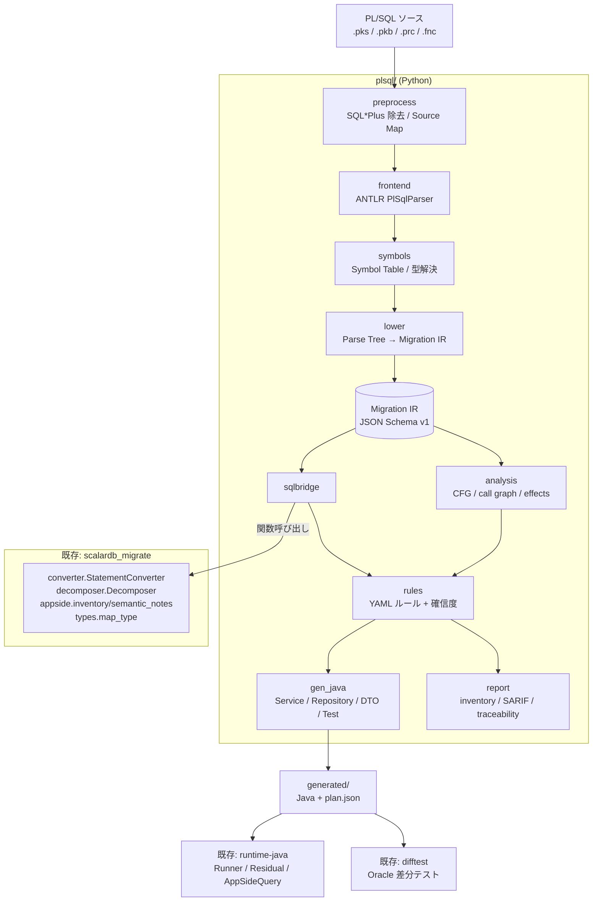

# PL/SQL 変換処理 実装計画

作成日: 2026-09-16
対象設計: [plsql-migration-platform-design.md](../plsql-migration-platform-design.md)
対象リポジトリ: 本リポジトリ（`plsql/` を新設）

---

## 1. この計画で決めたこと

設計書 §3 / §13 は Java 21 + ANTLR フロントエンド、Python/SQLGlot を別サービスとする構成を想定している。
本計画では PoC 到達速度を優先し、次の 3 点を確定させたうえでタスクに落とす。

| 決定 | 内容 | 設計書との差分 | 根拠 |
|---|---|---|---|
| D1 | PL/SQL フロントエンドは **Python + antlr4-python3-runtime** で実装する | §3「Java 21 / ANTLR4」から変更 | `scalardb_migrate`（converter / decomposer / appside / types / schema、計 2,811 行）を**同一プロセスで関数呼び出し**でき、SQL 断片の変換・実行計画生成・アプリ側処理分析をそのまま再利用できる。JSON ブリッジとプロセス分離の初期コストが不要 |
| D2 | 実装は本リポジトリに `plsql/` を追加する | §13 の `plsql-modernizer/` 新設から変更 | 型マッピング（`types.py`）、実行計画 JSON、H2 residual runner（`runtime-java`）、Oracle 差分テスト基盤（`difftest/`）が既にあり、PL/SQL 側はその上に procedural 層を重ねるだけで済む |
| D3 | **生成物（ターゲットコード）は Java のまま**。Python は解析・判定・生成器の実装言語にとどめる | 変更なし | 実行時の ScalarDB 連携は `runtime-java` が担う |

設計書の他の原則（Parse Tree から直接 Java を生成しない / SQLGlot に procedural semantics を持たせない /
ScalarDB SQL は allowlist 方式 / AUTO・REVIEW・REDESIGN の 3 分類 / unsupported を黙って通さない）は**そのまま維持する**。

> D1 の退避経路: Phase 3 完了後に Java 化が必要になった場合、境界は `plsql/ir`（JSON Schema 固定）と
> `plsql/sqlbridge.py`（`SqlAnalysisResult` JSON）の 2 箇所だけである。Phase 1 からこの 2 つを
> **プロセス境界として通用する JSON 契約**として設計し、Java 移植時に前段だけ差し替えられるようにする。

---

## 2. 全体像



### モジュール構成（新設）

```text
plsql/
  __init__.py
  grammar/                  ANTLR grammar と生成済み parser（vendor 化・commit する）
    PlSqlLexer.g4  PlSqlParser.g4  (grammars-v4 の固定 commit)
    generated/              antlr4 -Dlanguage=Python3 の出力。再生成手順は Makefile に置く
  preprocess.py             SQL*Plus 命令除去、'/' 区切り分割、Source Map
  frontend.py               ANTLR 呼び出し、構文エラーの構造化診断化
  symbols.py                Symbol Table、%TYPE/%ROWTYPE 解決、overload 解決、依存グラフ
  ir/
    model.py                IR ノード（dataclass）
    schema.json             IR JSON Schema v1
    serde.py                IR ⇄ JSON
  lower.py                  Parse Tree → IR（visitor）
  sqlbridge.py              SQL 断片抽出 → scalardb_migrate 呼び出し → SqlAnalysisResult
  analysis.py               CFG、call graph、read/write set、transaction graph、副作用
  rules/
    engine.py               YAML ルール評価、確信度計算
    *.yaml                  TX-*, STATE-*, DYN-*, TRG-*, SQL-* ルール
  gen_java/
    service.py  repository.py  dto.py  exception.py  test.py  emit.py
  report.py                 inventory.json / diagnostics.sarif / decisions.json / traceability.csv
  cli.py                    python -m plsql.cli <dir|file> --out-dir ...
fixtures/plsql/             PL/SQL corpus と golden（IR / 判定 / 生成物）
tests/plsql/                pytest
```

生成される Java は `runtime-java/src/main/java/com/scalar/migrate/plsql/`（手書きのランタイム補助）と、
`generated/`（機械生成、手編集禁止）に分ける。

---

## 3. 既存資産の再利用マップ

| PL/SQL 側で必要なもの | 再利用する既存実装 | 追加で必要な作業 |
|---|---|---|
| Oracle 型 → ScalarDB 型 | `scalardb_migrate/types.py: map_type` | PL/SQL 専用型（BOOLEAN、`%TYPE`、record、collection）の追加と、**Oracle 型 → Java 型**の対応表（設計書 §5.3）を新規に持つ |
| SQL 断片の ScalarDB SQL 変換 | `converter.StatementConverter.convert()` / `convert_script()` | バインド変数を `?`（`exp.Placeholder`、`dialect.py` が対応済み）に置換して渡す薄いラッパ |
| 変換不能 SELECT の実行計画 | `decomposer.Decomposer.decompose()` → `plan.json` | PL/SQL 変数を `?` にしたまま計画化し、実行時に値を埋めるためのパラメータ化 |
| アプリ側へ移る処理の列挙・意味注意 | `appside.inventory()` / `semantic_notes()` / `design_advice()` / `estimate_cost()` | 出力を IR の診断として持ち上げる |
| スキーマ情報 | `schema.SchemaRegistry`（Schema Loader JSON 入出力） | DDL スナップショットから `%TYPE`/`%ROWTYPE` 解決に使う |
| 実行計画の実行 | `runtime-java` `Runner` / `Plan` / `Residual` / `CoreFetcher` | 生成 Repository から `Plan` を呼ぶ呼び出し規約 |
| アプリ側関数の Java 実装 | `com.scalar.migrate.appside.{OracleDates,OracleNumbers,OracleOrdering,Windows,Hierarchy}` | PL/SQL 組込み関数の不足分を追加 |
| Oracle との差分検証 | `difftest/`（docker-compose、`run.py`、`golden.py`、`backends.py`） | PL/SQL の実行と結果・DB 状態の突き合わせランナーを追加 |

**再利用しないもの**: `converter._split_statements()` は SQL スクリプト用であり、PL/SQL ブロックには使えない。
`plsql/preprocess.py` を別に用意する。

---

## 4. 主要インタフェース（Phase 1 で確定させる契約）

### 4.1 SQL bridge の入出力

`plsql/sqlbridge.py` は IR の `SqlOperation` ごとに次の JSON を作り、`scalardb_migrate` に渡して結果を戻す。
この JSON がプロセス境界の契約になる（D1 の退避経路）。

```json
{
  "sqlId": "pkg_order.create_order#stmt-12",
  "sourceDialect": "oracle",
  "text": "SELECT status FROM orders WHERE id = ?",
  "intoTargets": [{"name": "v_status", "oracleType": "VARCHAR2(20)"}],
  "binds": [{"ordinal": 1, "name": "p_id", "direction": "IN", "oracleType": "NUMBER(19)"}],
  "cardinalityExpectation": "EXACTLY_ONE",
  "sourceRange": {"file": "pkg_order.pkb", "startLine": 42, "endLine": 44}
}
```

戻り値 `SqlAnalysisResult` は既存の `converter.Result`（`status` / `converted` / `issues` / `plan`）に
`sqlId`・`readSet`・`writeSet`・`accessPath` を足した形にする。
`SELECT INTO` は sqlglot が `Select.args["into"]` として保持することを確認済みのため、
**bridge 側で `into` を剥がして `intoTargets` に移し**、SELECT 本体だけを converter に渡す。

### 4.2 判定の 3 分類

`AUTO` / `REVIEW` / `REDESIGN` は `plsql/rules/*.yaml` だけが決める。生成器は判定しない。
確信度は設計書 §8 の積で計算し、いずれかが 0 なら AUTO にしない。

```text
confidence = ruleCoverage × symbolResolution × typeResolution × targetCapability × testEvidence
```

既存の `Issue(severity, code, message)` を IR 診断でも使い、`severity=ERROR` を含む routine は AUTO にしない。

---

## 5. フェーズとタスク

見積りは 1 人日 = 1d、担当 1 名前提の目安。並行可能なタスクは「依存」欄で判別する。

### Phase 0: Corpus と評価基準（合計 8d）

| ID | タスク | 成果物 | 受入条件 | 依存 | 見積 |
|---|---|---|---|---|---|
| P0-1 | PL/SQL corpus の作成（設計書 §16 の 11 カテゴリを 1〜3 本ずつ、計 20〜30 本） | `fixtures/plsql/src/*.pks,*.pkb,*.prc` | 11 カテゴリすべてに 1 本以上。実データ・機密を含まない | — | 3d |
| P0-2 | 各 corpus に期待値タグを付与（機能タグ、期待判定 AUTO/REVIEW/REDESIGN、期待挙動） | `fixtures/plsql/manifest.yaml` | 全ファイルにタグと期待判定。判定根拠を 1 行で書く | P0-1 | 1d |
| P0-3 | Oracle 上で corpus を実行し characterization の期待結果を採取 | `fixtures/plsql/golden/*.json`（戻り値・OUT・例外・DB 差分） | `difftest` の Oracle コンテナで再現でき、2 回実行して同一 | P0-1 | 2d |
| P0-4 | ANTLR grammar と依存の固定 | `plsql/grammar/`（grammars-v4 の commit hash 明記）、`requirements.txt` に `antlr4-python3-runtime` 追加、`Makefile` に再生成手順 | クリーン環境で `pip install -r requirements.txt` 後に parser が import でき、生成コードを commit 済み | — | 1d |
| P0-5 | KPI と AUTO 禁止条件の確定 | `docs/plsql-kpi.md` | parse 率 / 解決率 / 判定適合率 / compile 率 / 意味的同等性合格率 / 未解決重大リスク数 の測り方が定義済み。AUTO 禁止条件（COMMIT、Package 変数、動的 SQL、Trigger、AUTHID）が列挙済み | P0-2 | 1d |

**Phase 0 完了条件**: corpus・期待判定・golden・KPI 定義が揃い、以降のフェーズの合否を機械的に判定できる。

### Phase 1: Analyzer MVP（合計 17d）

| ID | タスク | 成果物 | 受入条件 | 依存 | 見積 |
|---|---|---|---|---|---|
| P1-1 | SQL*Plus 前処理と Source Map | `plsql/preprocess.py` | `SET`/`SHOW`/`@`/`/` 区切り/コメントを処理し、前処理後の (行, 列) から元ファイル位置へ逆写像できる。単体テストあり | P0-4 | 2d |
| P1-2 | ANTLR フロントエンド | `plsql/frontend.py` | corpus の **90% 以上**を構文エラーなく parse。構文エラーは例外でなく `Issue(ERROR, PARSE, ...)` + source range で返る。1 ファイルの失敗が他を止めない | P1-1 | 2d |
| P1-3 | Symbol Table・型解決 | `plsql/symbols.py` | 変数・定数・引数・戻り値・package 公開要素を解決。`%TYPE`/`%ROWTYPE` を DDL スナップショット（`SchemaRegistry`）から解決し、参照した DDL snapshot ID を記録。未解決シンボルを一覧できる | P1-2 | 3d |
| P1-4 | Migration IR v1 とシリアライザ | `plsql/ir/model.py`, `ir/schema.json`, `ir/serde.py` | 設計書 §5.2 のノードを表現。全ノードが `id` / `sourceRange` / `type` / `confidence` / `diagnostics` を持つ。JSON Schema 検証を通る。`schemaVersion` を持つ | P1-2 | 2d |
| P1-5 | Parse Tree → IR の lowering | `plsql/lower.py` | MVP 対象（設計書 §2.1）の構文が IR に落ちる。golden IR 比較テストが corpus 全件で一致 | P1-3, P1-4 | 4d |
| P1-6 | SQL bridge | `plsql/sqlbridge.py` | §4.1 の入出力を実装。`SELECT INTO` の `into` 剥がし、PL/SQL 変数 → `?` 置換と逆写像、`convert()`/`Decomposer` 呼び出し、`plan.json` の保持。単体テストあり | P1-4 | 3d |
| P1-7 | inventory / diagnostics レポート | `plsql/report.py`, `plsql/cli.py` | `python -m plsql.cli fixtures/plsql/src --out-dir out/plsql` が `inventory.json`・`diagnostics.sarif`・Markdown サマリを出力。SARIF が VS Code で開ける | P1-5, P1-6 | 1d |

**Phase 1 完了条件**: corpus の 90% 以上を parse し、資産・依存・未解決理由を一覧できる。
（変換率ではなく **parser coverage** の目標である点に注意。）

### Phase 2: Safe Generator（合計 22d）

| ID | タスク | 成果物 | 受入条件 | 依存 | 見積 |
|---|---|---|---|---|---|
| P2-1 | プログラム解析（CFG / call graph / read-write set / transaction graph） | `plsql/analysis.py` | routine 単位の CFG、package 内外の call graph、SQL から得た read/write set、COMMIT/ROLLBACK/SAVEPOINT の位置を IR に付与。GOTO は region 解析で検出のみ | P1-5 | 4d |
| P2-2 | ルールエンジン | `plsql/rules/engine.py` + YAML | 設計書 §8 の YAML 形式を評価し、判定・理由・対策・必要テストを出す。確信度式を実装。ルールは全て YAML 側にあり Python に判定を埋め込まない | P2-1 | 3d |
| P2-3 | 安全側ルールセット（AUTO 禁止条件） | `rules/transaction.yaml`, `state.yaml`, `dynamic_sql.yaml`, `trigger.yaml`, `authid.yaml` | routine 内 COMMIT、Package 変数、`EXECUTE IMMEDIATE`/`DBMS_SQL`、Trigger、`AUTHID CURRENT_USER`、Autonomous Transaction を REDESIGN として必ず検出。corpus の期待判定と突き合わせて**取りこぼし 0**（false negative を許さない） | P2-2 | 2d |
| P2-4 | ScalarDB capability checker | `rules/scalardb_capability.yaml` + `sqlbridge` 連携 | 許可 AST ノードの allowlist 方式。converter が `ERROR` を返した SQL を含む routine は AUTO にしない。`PLANNED` は REVIEW 以上 | P1-6, P2-2 | 2d |
| P2-5 | 型・DTO・例外の生成 | `plsql/gen_java/dto.py`, `exception.py` | 設計書 §5.3 の対応表どおりに Java 型を決める。`NUMBER` は精度不明なら `BigDecimal`。`%ROWTYPE` は列名対応の record。user exception と `RAISE_APPLICATION_ERROR` のコード registry を生成 | P1-3 | 3d |
| P2-6 | 制御構造と本体の Java 生成 | `plsql/gen_java/service.py`, `emit.py` | IF/CASE/LOOP/WHILE/FOR/EXIT/CONTINUE、代入、ローカル呼び出し、例外ハンドラを生成。`@Transactional` 相当の境界は公開 Service にのみ置き、private/Repository には置かない。全 statement に元 PL/SQL 行へのコメント付き traceability | P2-1, P2-5 | 4d |
| P2-7 | Repository 生成（SELECT / 基本 DML / 実行計画） | `plsql/gen_java/repository.py` | ScalarDB SQL で通る文は直接発行。`PLANNED` は `plan.json` を同梱して `runtime-java` の `Runner` を呼ぶ。`SELECT INTO` は 0 件→`NoDataFoundException`、複数件→`TooManyRowsException` を再現。影響行数を返す | P1-6, P2-6 | 3d |
| P2-8 | 生成物の compile / golden テスト | `tests/plsql/test_generate.py`, `fixtures/plsql/golden/java/` | AUTO 判定の routine が生成 → `gradle compileJava` **全件成功**。golden 比較で生成差分が検知できる | P2-6, P2-7 | 1d |

**Phase 2 完了条件**: AUTO 対象が全件 compile し、重大な意味欠落（黙って落ちた SQL 構文・未検出の副作用）がゼロ。

### Phase 3: Verification（合計 15d）

| ID | タスク | 成果物 | 受入条件 | 依存 | 見積 |
|---|---|---|---|---|---|
| P3-1 | Oracle characterization ランナー | `difftest/plsql_run.py` | corpus を Oracle 上で fixture 込みで実行し、戻り値・OUT・例外・DB 全行を canonical JSON 化。順序非仕様の結果は正規化するが重複除去はしない | P0-3 | 3d |
| P3-2 | 生成 Java 側ランナー | `runtime-java` に `plsql` テストハーネス | 同一 fixture を ScalarDB 側に投入し、生成 Service を呼んで同形式の JSON を出す | P2-7 | 3d |
| P3-3 | 差分比較 | `difftest/plsql_diff.py` | 設計書 §10.2 の全項目（戻り値、例外型・コード、更新前後の行集合、影響行数、NULL・空文字、数値精度、日付・TZ）を比較し、差分箇所を expected/actual で表示（既存 `GoldenCheck` の表示方針に合わせる） | P3-1, P3-2 | 3d |
| P3-4 | property テスト | `tests/plsql/test_property.py` | NULL、空文字＝NULL、境界値、`NUMBER` overflow、Oracle `DATE` の時刻成分、TZ 依存を網羅 | P3-3 | 2d |
| P3-5 | トランザクション・並行性テスト | `runtime-java` テスト | commit/rollback 後の永続状態、部分失敗、同時更新時の不変条件を検証。REDESIGN 判定した routine は「再設計が必要」であることをテストで示す | P3-3 | 2d |
| P3-6 | レポートとレビュー動線 | `report.py` 拡張（`decisions.json`, `unresolved.md`, `traceability.csv`） | 生成 Java の method/statement から元 PL/SQL 行へ辿れる。REVIEW 項目に根拠・代替案・必要テストが付く | P3-3 | 2d |

**Phase 3 完了条件**: AUTO 対象の意味的同等性テストが 100%、REVIEW 対象は差分理由を説明できる。

### Phase 4 以降（概要のみ）

- 動的 SQL の部分評価（定数畳み込み、条件分岐による有限 variant 列挙、上限つき）
- Trigger / Scheduler / 外部副作用の設計テンプレート出力
- LLM Remediator（REDESIGN 説明、未対応関数の mapping 候補。**生成コードは必ず REVIEW 扱い**、AUTO に昇格させない）
- 承認された決定からのルール提案
- Migration Workbench（Web UI）と API（設計書 §12）

---

## 6. 直近 2 週間の着手順

1. P0-4（grammar 固定）と P0-1（corpus）を並行で開始する。P0-4 は 1d で終わるため、先に parser を動く状態にする。
2. P1-1 → P1-2 を通し、corpus の parse 率を最初の数値として出す。ここで grammar の穴が見えるため、Phase 0 の corpus 選定へ反映する。
3. P1-4（IR）と P1-6（SQL bridge）は独立に進められる。bridge は既存 `converter` の上に薄く載るだけなので、先に単体で動かして `SELECT INTO` とバインド変数の扱いを確定させる。

---

## 7. リスクと対処

| リスク | 影響 | 対処 |
|---|---|---|
| grammars-v4 の PL/SQL grammar が実案件の構文を取りこぼす | parse 率が Phase 1 の受入条件に届かない | grammar は fork せず、まず**未対応構文を診断として可視化**する。修正が必要なら vendor 化した grammar に最小パッチを当て、パッチを `plsql/grammar/patches/` に残す |
| Python ANTLR ランタイムの性能 | 大規模 schema の解析が遅い | routine 単位で並列化（`multiprocessing`）。schema snapshot は不変にして共有。Phase 1 終了時に実測し、必要なら D1 の退避経路を検討 |
| `NUMBER` の精度・丸めが Java 側でずれる | 意味的同等性テストが落ちる | 精度不明な `NUMBER` は `BigDecimal` 固定。ScalarDB に DECIMAL 型がない（`types.py` が DOUBLE/BIGINT へ落とす）ため、**金額列はスケール済み整数 + BIGINT** を設計上の既定とし、REVIEW で明示する |
| routine 内 COMMIT が corpus に大量に含まれ、ほとんどが REDESIGN になる | 自動変換率が低く見える | KPI を行数ベースの変換率にしない（§P0-5）。REDESIGN は「検出できたこと」を成果として数える |
| ScalarDB の cross-partition scan 制約（Cassandra バックエンド） | 生成 Repository が実行時に失敗する | 既存 `decomposer` の `PlanBlocked` / `requires_cross_partition_scan` をそのまま判定に使い、`--storage cassandra` では該当 routine を REVIEW 以上にする |
| 生成コードへの直接修正が始まる | 再生成できなくなる | `generated/` を手編集禁止とし、CI で `generated/` の差分が生成器由来かを検証する |

---

## 8. KPI（Phase ごとに計測する）

| KPI | 計測方法 | 目標 |
|---|---|---|
| parse 率 | parse 成功ファイル / corpus 全件 | Phase 1 で 90% 以上 |
| symbol / type 解決率 | 解決済みシンボル / 全参照 | Phase 1 で 95% 以上（未解決は理由付きで一覧） |
| 判定適合率 | 判定結果 vs `manifest.yaml` の期待判定 | Phase 2 で AUTO 禁止条件の取りこぼし 0、全体一致 90% 以上 |
| AUTO 生成コードの compile 率 | `gradle compileJava` | Phase 2 で 100% |
| 意味的同等性テスト合格率 | `difftest/plsql_diff.py` | Phase 3 で AUTO 対象 100% |
| 1,000 行当たりの未解決重大リスク数 | `unresolved.md` の ERROR 件数 / corpus 行数 | 継続計測（削減トレンドを見る） |

---

## 9. 未決事項

- corpus の入手元（実案件の匿名化が可能か、合成で代替するか）。P0-1 開始前に確定が必要。
- 差分テストで使う Oracle のバージョンとエディション（既存 `difftest` の Oracle Database Free を流用する想定。接続プール設定は `docs/oracle-backend-verification-plan.md` の知見を引き継ぐ）。
- 生成先の Spring Boot バージョンと、`@Transactional` を Spring の宣言的トランザクションにするか ScalarDB の try-with-resources 定型にするか。Phase 2 の P2-6 開始までに決める。
