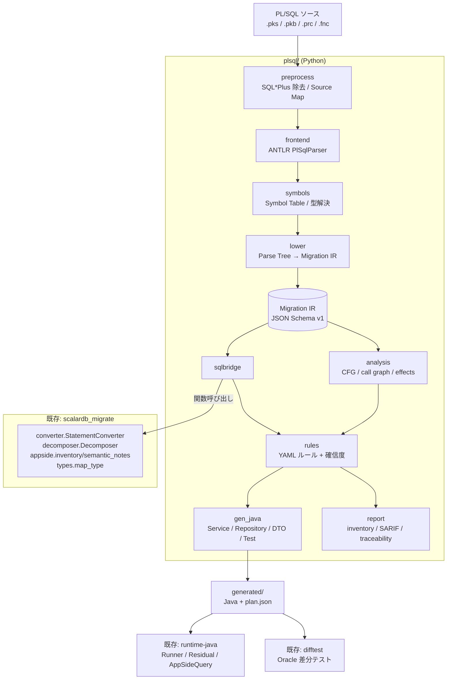

# PL/SQL 変換処理 実装計画

作成日: 2026-09-16
対象設計: [plsql-migration-platform-design.md](../plsql-migration-platform-design.md)
対象リポジトリ: 本リポジトリ（`plsql/` を新設）

---

## 1. この計画で決めたこと

設計書 §3 / §13 は Java 21 + ANTLR フロントエンド、Python/SQLGlot を別サービスとする構成を想定している。
本計画では PoC 到達速度を優先し、次の 3 点を確定させたうえでタスクに落とす。

| 決定 | 内容 | 設計書との差分 | 根拠 |
|---|---|---|---|
| D1 | PL/SQL フロントエンドは **Python + antlr4-python3-runtime** で実装する | §3「Java 21 / ANTLR4」から変更 | `scalardb_migrate`（converter / decomposer / appside / types / schema、計 2,530 行）を**同一プロセスで関数呼び出し**でき、SQL 断片の変換・実行計画生成・アプリ側処理分析をそのまま再利用できる。JSON ブリッジとプロセス分離の初期コストが不要 |
| D2 | 実装は本リポジトリに `plsql/` を追加する | §13 の `plsql-modernizer/` 新設から変更 | 型マッピング（`types.py`）、実行計画 JSON、H2 residual runner（`runtime-java`）、Oracle 差分テスト基盤（`difftest/`）が既にあり、PL/SQL 側はその上に procedural 層を重ねるだけで済む |
| D3 | **生成物（ターゲットコード）は Java のまま**。Python は解析・判定・生成器の実装言語にとどめる | 変更なし | 実行時の ScalarDB 連携は `runtime-java` が担う |

設計書の他の原則（Parse Tree から直接 Java を生成しない / SQLGlot に procedural semantics を持たせない /
ScalarDB SQL は allowlist 方式 / AUTO・REVIEW・REDESIGN の 3 分類 / unsupported を黙って通さない）は**そのまま維持する**。

> D1 の退避経路: Phase 3 完了後に Java 化が必要になった場合、境界は `plsql/ir`（JSON Schema 固定）と
> `plsql/sqlbridge.py`（`SqlAnalysisResult` JSON）の 2 箇所だけである。Phase 1 からこの 2 つを
> **プロセス境界として通用する JSON 契約**として設計し、Java 移植時に前段だけ差し替えられるようにする。

---

## 2. 全体像



### モジュール構成（新設）

```text
plsql/
  __init__.py
  grammar/                  ANTLR grammar と生成済み parser（vendor 化・commit する）
    PlSqlLexer.g4  PlSqlParser.g4  (grammars-v4 の固定 commit)
    generated/              antlr4 -Dlanguage=Python3 の出力。再生成手順は Makefile に置く
  preprocess.py             SQL*Plus 命令除去、'/' 区切り分割、Source Map
  frontend.py               ANTLR 呼び出し、構文エラーの構造化診断化
  symbols.py                Symbol Table、%TYPE/%ROWTYPE 解決、overload 解決、依存グラフ
  ir/
    model.py                IR ノード（dataclass）
    schema.json             IR JSON Schema v1
    serde.py                IR ⇄ JSON
  lower.py                  Parse Tree → IR（visitor）
  sqlbridge.py              SQL 断片抽出 → scalardb_migrate 呼び出し → SqlAnalysisResult
  analysis.py               CFG、call graph、read/write set、transaction graph、副作用
  rules/
    engine.py               YAML ルール評価、確信度計算
    *.yaml                  TX-*, STATE-*, DYN-*, TRG-*, SQL-* ルール
  gen_java/
    service.py  repository.py  dto.py  exception.py  test.py  emit.py
  report.py                 inventory.json / diagnostics.sarif / decisions.json / traceability.csv
  cli.py                    python -m plsql.cli <dir|file> --out-dir ...
fixtures/plsql/             PL/SQL corpus と golden（IR / 判定 / 生成物）
tests/plsql/                pytest
```

生成される Java は `runtime-java/src/main/java/com/scalar/migrate/plsql/`（手書きのランタイム補助）と、
`generated/`（機械生成、手編集禁止）に分ける。

---

## 3. 既存資産の再利用マップ

| PL/SQL 側で必要なもの | 再利用する既存実装 | 追加で必要な作業 |
|---|---|---|
| Oracle 型 → ScalarDB 型 | `scalardb_migrate/types.py: map_type` | PL/SQL 専用型（BOOLEAN、`%TYPE`、record、collection）の追加と、**Oracle 型 → Java 型**の対応表（設計書 §5.3）を新規に持つ |
| SQL 断片の ScalarDB SQL 変換 | `converter.StatementConverter.convert()` / `convert_script()` | バインド変数を `?`（`exp.Placeholder`、`dialect.py` が対応済み）に置換して渡す薄いラッパ |
| 変換不能 SELECT の実行計画 | `decomposer.Decomposer.decompose()` → `plan.json` | PL/SQL 変数を**名前付きプレースホルダのまま**計画化し、実行時に値を埋めるためのパラメータ化（§4.1） |
| アプリ側へ移る処理の列挙・意味注意 | `appside.inventory()` / `semantic_notes()` / `design_advice()` / `estimate_cost()` | 出力を IR の診断として持ち上げる |
| スキーマ情報 | `schema.SchemaRegistry`（Schema Loader JSON 入出力） | DDL スナップショットから `%TYPE`/`%ROWTYPE` 解決に使う |
| 実行計画の実行 | `runtime-java` `PlanRunner` / `Plan` / `Residual` / `CoreFetcher` | 外部トランザクションに参加する API は P2-9 で切り出し済み（`PlanRunner.join(tx, admin, plan, params)`）。生成 Repository はこれを呼ぶ |
| アプリ側関数の Java 実装 | `com.scalar.migrate.appside.{OracleDates,OracleNumbers,OracleOrdering,Windows,Hierarchy}` | PL/SQL 組込み関数の不足分を追加 |
| Oracle との差分検証 | `difftest/`（docker-compose、`run.py`、`golden.py`、`backends.py`） | PL/SQL の実行と結果・DB 状態の突き合わせランナーを追加 |

**再利用しないもの**: `converter._split_statements()` は SQL スクリプト用であり、PL/SQL ブロックには使えない。
`plsql/preprocess.py` を別に用意する。

---

## 4. 主要インタフェース（Phase 1 で確定させる契約）

### 4.1 SQL bridge の入出力

`plsql/sqlbridge.py` は IR の `SqlOperation` ごとに次の JSON を作り、`scalardb_migrate` に渡して結果を戻す。
この JSON がプロセス境界の契約になる（D1 の退避経路）。

```json
{
  "sqlId": "pkg_order.create_order#stmt-12",
  "sourceDialect": "oracle",
  "text": "SELECT status FROM orders WHERE id = :p_id",
  "intoTargets": [{"name": "v_status", "oracleType": "VARCHAR2(20)"}],
  "binds": [{"placeholder": "p_id", "plsqlVar": "p_id", "direction": "IN", "oracleType": "NUMBER(19)"}],
  "cardinalityExpectation": "EXACTLY_ONE",
  "sourceRange": {"file": "pkg_order.pkb", "startLine": 42, "endLine": 44}
}
```

戻り値 `SqlAnalysisResult` は既存の `converter.Result`（`status` / `converted` / `issues` / `plan`）に
`sqlId`・`readSet`・`writeSet`・`accessPath` を足した形にする。
`SELECT INTO` は sqlglot が `Select.args["into"]` として保持することを確認済みのため、
**bridge 側で `into` を剥がして `intoTargets` に移し**、SELECT 本体だけを converter に渡す。
（`into` は代入先が 1 個のときと複数のときで内部表現の形が変わるため、bridge は両形を扱う。）

バインド変数は**序数付きの無名 `?` ではなく、文中で一意な名前付きプレースホルダ**（`:p_id`）に置換する。
既存の `decomposer._literal_value()` は無名プレースホルダを `{"param": "?"}` に潰し、Java 側の
`CoreFetcher.resolve()` はその文字列をキーにパラメータを引くため、1 つの fetch に `?` が 2 つ以上あると
すべて同じ値に解決されてしまう。名前付きなら `dialect._placeholder_sql()` と `decomposer` の既存経路のまま
正しく解決される。

### 4.2 判定の 3 分類

`AUTO` / `REVIEW` / `REDESIGN` は `plsql/rules/*.yaml` だけが決める。生成器は判定しない。
確信度は設計書 §8 の積で計算し、いずれかが 0 なら AUTO にしない。

```text
confidence = ruleCoverage × symbolResolution × typeResolution × targetCapability × testEvidence
```

既存の `Issue(severity, code, message)` を IR 診断でも使い、`severity=ERROR` を含む routine は AUTO にしない。

---

## 5. フェーズとタスク

見積りは 1 人日 = 1d、担当 1 名前提の目安。並行可能なタスクは「依存」欄で判別する。

### Phase 0: Corpus と評価基準（合計 13d）

| ID | タスク | 成果物 | 受入条件 | 依存 | 見積 |
|---|---|---|---|---|---|
| P0-1 | PL/SQL corpus と元表 DDL の作成（設計書 §16 の 11 カテゴリを 1〜3 本ずつ、計 20〜30 本） | `fixtures/plsql/src/*.pks,*.pkb,*.prc`、`fixtures/plsql/src/schema.sql` | 11 カテゴリすべてに 1 本以上。実データ・機密を含まない。corpus が参照する全表の Oracle DDL が揃う。**ルール・grammar の作成時に参照しない holdout を 20% 以上確保する**。カテゴリ 9（Trigger / DB Link）のため `*.trg` も置く | — | 3d |
| P0-2 | 各 corpus に期待値タグと出自を付与 | `fixtures/plsql/manifest.yaml` | 全ファイルにタグ（機能タグ、期待判定 AUTO/REVIEW/REDESIGN、期待挙動）と**出自欄（`real-anonymized` / `synthetic`）**、holdout フラグが付く。判定根拠を 1 行で書く | P0-1 | 1d |
| P0-3 | corpus 表の ScalarDB スキーマ設計 | `fixtures/plsql/scalardb-schema.json`（Schema Loader JSON）、キー設計の根拠メモ | 全表の partition key / clustering key / secondary index が決まり、既存 `SchemaRegistry.from_schema_loader_json()` で読める。cross-partition scan になるアクセスを事前に洗い出して記録 | P0-1 | 2d |
| P0-4 | Oracle characterization ランナー | `difftest/plsql_run.py` | corpus を Oracle 上で fixture 込みで実行し、戻り値・OUT・例外・DB 全行を canonical JSON 化する。順序非仕様の結果は正規化するが重複除去はしない。**採取形式（canonical JSON）と正規化規則をここで確定する** | P0-1 | 3d |
| P0-5 | Oracle 上で golden を採取 | `fixtures/plsql/golden/*.json`（戻り値・OUT・例外・DB 差分） | P0-4 のランナーで採取する。**非決定要素を固定したうえで** 2 回実行して同一。`SYSDATE` は `ALTER SYSTEM SET FIXED_DATE`、Sequence は実行前に `START WITH` で再作成。**`SYSTIMESTAMP` / `CURRENT_DATE` / `LOCALTIMESTAMP` は固定できない**ため（P0-4 で実測）、それらから書かれる列はシナリオの `mask` で宣言して比較対象から外す。固定した時刻・採番開始値とマスクした列を capture に記録する | P0-4 | 2d |
| P0-6 | ANTLR grammar と依存の固定 | `plsql/grammar/`（grammars-v4 の commit hash 明記。`PlSqlLexer.g4` / `PlSqlParser.g4` と Python3 ターゲットの `PlSqlLexerBase.py` / `PlSqlParserBase.py` / `transformGrammar.py` を含む）、`requirements.txt` に `antlr4-python3-runtime` 追加、`Makefile` に再生成手順（transformGrammar.py 適用 → antlr4 生成の順） | クリーン環境で `pip install -r requirements.txt` 後に parser が import でき、生成コードを commit 済み | — | 1d |
| P0-7 | KPI・AUTO 禁止条件・確信度の定義 | `docs/plsql-kpi.md` | §8 の全 KPI の測り方が定義済み。AUTO 禁止条件（COMMIT、Package 変数、動的 SQL、Trigger、AUTHID）が列挙済み。**確信度 5 因子それぞれの算出方法（0〜1 の測り方）と、AUTO とする下限しきい値が数値で決まっている**（P2-2 はこの定義を実装するだけにする） | P0-2 | 1d |

**Phase 0 完了条件**: corpus・DDL・ScalarDB スキーマ・期待判定・golden・KPI 定義が揃い、以降のフェーズの合否を機械的に判定できる。

### Phase 1: Analyzer MVP（合計 17d）

| ID | タスク | 成果物 | 受入条件 | 依存 | 見積 |
|---|---|---|---|---|---|
| P1-1 | SQL*Plus 前処理と Source Map | `plsql/preprocess.py` | `SET`/`SHOW`/`@`/`/` 区切り/コメントを処理し、前処理後の (行, 列) から元ファイル位置へ逆写像できる。単体テストあり。**入力の大文字化は行わない**（P0-6 で確認: 文法はキーワードの大小文字を問わず、大文字化すると文字列リテラルの元の表記が壊れる） | P0-6 | 2d |
| P1-2 | ANTLR フロントエンド | `plsql/frontend.py` | corpus の **90% 以上**を構文エラーなく parse。構文エラーは例外でなく `Issue(ERROR, PARSE, ...)` + source range で返る。1 ファイルの失敗が他を止めない。**parse 成功はコンパイル可能性を意味しない**（P0-4 で、ANTLR が通した 32 ファイルのうち 2 件が Oracle のコンパイルで落ちた）ため、parse 率は parser coverage としてのみ扱う | P1-1 | 2d |
| P1-3 | Symbol Table・型解決 | `plsql/symbols.py` | 変数・定数・引数・戻り値・package 公開要素を解決。`%TYPE`/`%ROWTYPE` を DDL スナップショット（`SchemaRegistry`）から解決し、参照した DDL snapshot ID を記録。未解決シンボルを一覧できる | P1-2, P0-3 | 3d |
| P1-4 | Migration IR v1 とシリアライザ | `plsql/ir/model.py`, `ir/schema.json`, `ir/serde.py` | 設計書 §5.2 のノードを表現。全ノードが `id` / `sourceRange` / `type` / `confidence` / `diagnostics` を持つ。JSON Schema 検証を通る。`schemaVersion` を持つ | P1-2 | 2d |
| P1-5 | Parse Tree → IR の lowering | `plsql/lower.py` | MVP 対象（設計書 §2.1）の構文が IR に落ちる。golden IR 比較テストが **parse に成功した corpus 全件**で一致（parse 失敗ファイルは P1-2 の診断側で数える） | P1-3, P1-4 | 4d |
| P1-6 | SQL bridge | `plsql/sqlbridge.py` | §4.1 の入出力を実装。`SELECT INTO` の `into` 剥がし（単数・複数の両形）、**PL/SQL 変数 → 文中で一意な名前付きプレースホルダへの置換と逆写像**、`convert()`/`Decomposer` 呼び出し、`plan.json` の保持。単体テストあり | P1-4 のうち §4.1 の JSON 契約確定（スキーマ freeze） | 3d |
| P1-7 | inventory / diagnostics レポート | `plsql/report.py`, `plsql/cli.py` | `python -m plsql.cli fixtures/plsql/src --out-dir out/plsql` が `inventory.json`・`diagnostics.sarif`・Markdown サマリを出力。SARIF が VS Code で開ける | P1-5, P1-6 | 1d |

**Phase 1 完了条件**: corpus の 90% 以上を parse し、資産・依存・未解決理由を一覧できる。
（変換率ではなく **parser coverage** の目標である点に注意。）

### Phase 2: Safe Generator（合計 30d）

| ID | タスク | 成果物 | 受入条件 | 依存 | 見積 |
|---|---|---|---|---|---|
| P2-1 | プログラム解析（CFG / call graph / read-write set / transaction graph） | `plsql/analysis.py` | routine 単位の CFG、package 内外の call graph、SQL から得た read/write set、COMMIT/ROLLBACK/SAVEPOINT の位置を IR に付与。GOTO は region 解析で検出のみ | P1-5 | 4d |
| P2-2 | ルールエンジン | `plsql/rules/engine.py` + YAML | 設計書 §8 の YAML 形式を評価し、判定・理由・対策・必要テストを出す。**P0-7 が定義した確信度式としきい値を実装する**。ルールは全て YAML 側にあり Python に判定を埋め込まない | P2-1, P0-7 | 3d |
| P2-3 | 安全側ルールセット（AUTO 禁止条件） | `rules/transaction.yaml`, `state.yaml`, `dynamic_sql.yaml`, `trigger.yaml`, `authid.yaml` | routine 内 COMMIT、Package 変数、`EXECUTE IMMEDIATE`/`DBMS_SQL`、Trigger、`AUTHID CURRENT_USER`、Autonomous Transaction を REDESIGN として必ず検出。corpus の期待判定と突き合わせて**取りこぼし 0**（false negative を許さない） | P2-2 | 2d |
| P2-4 | ScalarDB capability checker | `rules/scalardb_capability.yaml` + `sqlbridge` 連携 | 許可 AST ノードの allowlist 方式。converter が `ERROR` を返した SQL を含む routine は AUTO にしない。`PLANNED` は REVIEW 以上。**write-then-scan の検出**: P2-1 の write set と `PLANNED` の fetch 対象表が同じ routine 内で交差し、その fetch が走査（`access_path` がキーアクセスでない）なら REDESIGN とし、durable boundary での分割かキーアクセス化を対策として出す | P1-6, P2-1, P2-2 | 3d |
| P2-5 | 型・DTO・例外の生成 | `plsql/gen_java/dto.py`, `exception.py` | 設計書 §5.3 の対応表どおりに Java 型を決める。`NUMBER` は精度不明なら `BigDecimal`。`%ROWTYPE` は列名対応の record。user exception と `RAISE_APPLICATION_ERROR` のコード registry を生成 | P1-3 | 3d |
| P2-6 | 制御構造と本体の Java 生成 | `plsql/gen_java/service.py`, `emit.py` | IF/CASE/LOOP/WHILE/FOR/EXIT/CONTINUE、代入、ローカル呼び出し、例外ハンドラを生成。`@Transactional` 相当の境界は公開 Service にのみ置き、private/Repository には置かない。全 statement に元 PL/SQL 行へのコメント付き traceability | P2-1, P2-5 | 4d |
| P2-7 | Repository 生成（SELECT / DML / Cursor / 実行計画） | `plsql/gen_java/repository.py` | ScalarDB SQL で通る文は直接発行。`PLANNED` は `plan.json` を同梱して `runtime-java` の `Runner` を呼ぶ。`SELECT INTO` は 0 件→`NoDataFoundException`、複数件→`TooManyRowsException` を再現。影響行数を返す。**Static Cursor（OPEN/FETCH/CLOSE）と Cursor FOR LOOP を生成し、BULK COLLECT/FORALL は行数上限つきで生成するか REVIEW に落とすかをルールで明示する** | P1-6, P2-6, P2-9 | 4d |
| P2-8 | 生成物の compile / golden テスト | `tests/plsql/test_generate.py`, `fixtures/plsql/golden/java/` | AUTO 判定の routine が生成 → `gradle compileJava` **全件成功**。golden 比較で生成差分が検知できる | P2-6, P2-7, P2-10 | 1d |
| P2-9 | runtime-java: 外部トランザクション参加 API | `runtime-java` の `Fetcher` / `PlanRunner` / `Runner` 改修 | `PlanRunner` が外部から `DistributedTransaction`（または ScalarDB SQL の `Connection`）を受け取って実行計画を実行できる。生成 Repository が呼び出し側 Service のトランザクションに参加し、**ロールバック範囲が routine の書き込みと一致する**。既存の自前トランザクション経路は後方互換で残す。**自分の書き込みが後続の読み取りに見えるのはキーアクセスのみ**（下記の制約）。走査になる場合は `ScanAfterWriteException` に変換して対象表を示す | — | 3d |
| P2-10 | 生成コード用 Gradle 構成 | `runtime-java/build.gradle`（または `generated/build.gradle`） | `generated/` をソースセットに載せ、§9 で決めたトランザクション方式に必要な依存（Spring 採用時は Spring Boot）を追加。空の `generated/` でも `gradle compileJava` が通る | §9「Spring Boot / トランザクション方式」の確定 | 1d |
| P2-11 | 先行差分検証（意味的同等性の早期信号） | `difftest/plsql_diff.py` の最小版、`runtime-java` の最小ハーネス | 単純 CRUD と `SELECT INTO` の 2〜3 本について、Oracle 実行結果（P0-5 の golden）と生成 Java の実行結果が一致する。ここで出た差分は生成規約（例外再現・数値精度・日付）へ反映してから残りの生成に進む | P2-7, P0-5 | 2d |

> **ScalarDB の制約（3.19.1 + PostgreSQL 16 で実測）**: 同一トランザクション内で自分の書き込みが見えるのは
> キーアクセス（`get`）だけで、走査（`scan`）は `Scanning data already-written or already-deleted by the same
> transaction is not allowed` で失敗する。したがって「routine 内で書いた表を、後続の `PLANNED` 読み取りが走査する」
> 形は 1 トランザクションでは実行できない。ランタイムで吸収できる種類の制約ではないため、**変換側で検出して
> REVIEW 以上に落とす**（P2-4）。当初 P2-9 の受入条件に置いていた「DML を後続の `PLANNED` 読み取りが見られる」は、
> キーアクセスに限る条件へ改めた。

**Phase 2 完了条件**: AUTO 対象が全件 compile し、重大な意味欠落（黙って落ちた SQL 構文・未検出の副作用）がゼロ。
**加えて、P2-11 の先行 2〜3 本の差分比較が一致していること**（compile が通ることは意味が保存されている証拠にならない）。

### Phase 3: Verification（合計 12d）

| ID | タスク | 成果物 | 受入条件 | 依存 | 見積 |
|---|---|---|---|---|---|
| P3-1 | 生成 Java 側ランナー | `runtime-java` に `plsql` テストハーネス | 同一 fixture を ScalarDB 側に投入し、生成 Service を呼んで P0-4 と同形式の canonical JSON を出す | P2-7, P0-3 | 3d |
| P3-2 | 差分比較 | `difftest/plsql_diff.py`（P2-11 の最小版を全項目へ拡張） | 戻り値・OUT/IN OUT 値、例外型と業務エラーコード、更新前後の行集合、影響行数、NULL・空文字・末尾空白、数値精度と丸め、日付・timezone・NLS を比較する。**監査ログ・メッセージなどの副作用も比較対象に含める**。差分箇所を expected/actual で表示（既存 `GoldenCheck` の表示方針に合わせる）。commit/rollback 後の永続状態と同時実行不変条件は P3-4 が担当する | P0-5, P3-1 | 3d |
| P3-3 | property テスト | `tests/plsql/test_property.py` | NULL、空文字＝NULL、境界値、`NUMBER` overflow、Oracle `DATE` の時刻成分、TZ 依存を網羅 | P3-2 | 2d |
| P3-4 | トランザクション・並行性テスト | `runtime-java` テスト | commit/rollback 後の永続状態、部分失敗、同時更新時の不変条件を検証。REDESIGN 判定した routine は「再設計が必要」であることをテストで示す | P3-2 | 2d |
| P3-5 | レポートとレビュー動線 | `report.py` 拡張（`decisions.json`, `unresolved.md`, `traceability.csv`） | 生成 Java の method/statement から元 PL/SQL 行へ辿れる。REVIEW 項目に根拠・代替案・必要テストが付く。**判定区分別の人手修正時間を `decisions.json` に記録する**（§8） | P3-2 | 2d |

**Phase 3 完了条件**: AUTO 対象の意味的同等性テストが 100%、REVIEW 対象は差分理由を説明できる。

#### P3-2 実施結果（2026-09-17）

`difftest/plsql_compare.py` が Oracle の capture（P0-5）と ScalarDB の capture（P3-1）を突き合わせる。
何も実行しない——両側とも記録済みなので、比較が比較対象を変えることはない。`difftest/plsql_diff.py` が
H2 の早期信号（P2-11）と合わせて 1 コマンドで通す。

比較するのは capture が持つ全項目。戻り値、OUT/IN OUT の各値、例外の有無と業務エラーコード、各表の列・
行（多重集合として）・各値、NULL と空文字と末尾空白の区別、数値の値と scale、timestamp。
監査ログなどの副作用表も他の表と同じに比較する（corpus の複数の routine はそれが主目的なので、対象外に
しない）。マスク列は比較しないが、**マスク集合そのものは比較する**ので、片側だけマスクされていれば差分。

| | scaled (`BIGINT ×10^2`) | double |
|---|---|---|
| 比較 | 52 | 52 |
| 一致 | 26 | 25 |
| 差異あり | 26 | 27 |
| **AUTO で差異あり** | **0 / 14** | **0 / 14** |

**AUTO 対象は両系統とも 100% 一致した。** 残る差異は全て REVIEW / REDESIGN で、24 件は生成器が意図的に
拒否した構文（動的 SQL、cursor FOR loop、FORALL、sequence、BULK COLLECT）、残りは下記。

#### 金額の規約についての測定結果

**`scaled` は Oracle を再現し、`double` は再現しない。** 差が出たのは `money_rounded_total` 1 本:

```
table orders row order_id=1001: total_amount: expected=1234.57 actual=1234.565 (value)
```

Oracle は `NUMBER(14,2)` へ格納する際に half-up で丸めて `1234.57` を保持する。`double` 系統は
`1234.565` をそのまま持つ。**金額の丸めを Oracle と同じにしたいなら scaled が要る**、というのが
measurement の答えである。それ以外の 51 本では両系統は同じ結果を出した。

なお「scale だけの差」（`190` と `190.00`）は独立した区分として集計し、差分には数えない。Oracle の
ドライバは `NUMBER(14,2)` の末尾ゼロを落とすので、capture に届く scale はデータではなくドライバを
表しているため。8 本がこれに該当する。

#### P3-2 が見つけて直した 4 件

いずれも「黙って違う答えを返す」種類で、compile も通り H2 でも通っていた。

1. **`SELECT a, b INTO v_rec.a, v_rec.b`（package ローカル record 型）が一切代入されていなかった。**
   生成コードは repository を呼んだ結果を捨て、record を null のまま返していた。原因は 3 段階で、
   (a) `strip_into` が `v_rec.name` から修飾子を落として `name` にしていた、(b) package 仕様部の宣言は
   `Package_obj_spec` 配下にあり、`Declare_spec` しか歩いていなかったため `TYPE t IS RECORD` が
   シンボル表に入らなかった、(c) 複数ターゲットの `SELECT INTO` が代入文を生成していなかった。
   3 つとも直し、record 型を Java の record として生成して 1 度で構築するようにした。
   **部分的にしか埋まらない record は拒否する**（PL/SQL は 1 フィールドずつ埋めるが Java の record は
   不変なので、全フィールドが埋まるときだけ等価）。
2. **`BULK COLLECT INTO` が 1 行の `SELECT INTO` として扱われていた。** 「0 行」「複数行」が元にない例外に
   なり、複数行のときは 2 行目以降を黙って捨てていた。拒否に変えた。
3. **`SYSDATE` が ScalarDB 側で固定されていなかった。** Oracle 側ハーネスは `pinned.sysdate` に合わせて
   DB のクロックを動かすが、Java 側は実時刻のままだった。`Plsql.setClock` は最初からあったのに、
   ハーネスが呼んでいなかった。2 本の routine が別の日付で比較されていた。
4. **timestamp の表記揺れ。** `LocalDateTime.toString()` は秒が 0 のとき秒を落とすので、同じ瞬間が
   2 通りに書かれ、全 timestamp が差分に見えていた。Python の `isoformat()` と同じ表記に揃えた。

#### P3-1 実施結果（2026-09-17）

`runtime-java` の `ScalarDbCaptureIT` が 59 シナリオを実 ScalarDB Cluster に対して実行し、**31 本の canonical
JSON を採取**、残り 28 本は `difftest/work/plsql-scalardb/unrunnable.json` に理由つきで記録した。黙って飛ばした
ものはない（「capture ファイルがあるか、名前つきの理由があるか」のどちらかであることをテストが検査する）。

シナリオの setup SQL は `difftest/plsql_setup.py` が `scalardb_migrate` で変換する。ハーネス側で書き直すと
fixture の転記が 2 本になり、差分が「DB の違い」ではなく「転記の食い違い」を意味してしまうため。

採取できなかった 28 本の内訳:

| 件数 | 理由 | 扱い |
|---|---|---|
| 21 | `NUMBER(12,2)` / `NUMBER(14,2)` の金額列が corpus スキーマで **BIGINT** になっており、`100000.00` を入れると ScalarDB が DB-SQL-10054 で拒否する | **未決**（下記） |
| 5 | trigger 4 本と `pkg_customer_import.import` は生成器が意図的に拒否している | 仕様どおり。P3-2 の比較対象外 |
| 2 | setup の `SYSTIMESTAMP` は ScalarDB SQL で書けず、変換器が正しく拒否する | fixture 側の課題。固定時刻へ直すのが筋 |

**未決（P3-2 の前に決める必要がある）: ScalarDB 上で金額をどう持つか。**
変換器は `NUMBER(p,2)` を DOUBLE（精度劣化の WARN つき）に落とし、注記で「金額はスケール済み整数を BIGINT へ」と
勧める。P0-3 の corpus スキーマは型だけ BIGINT を採り、値のスケールを入れていなかったため、どちらの規約にも
なっていない。選択肢は (a) BIGINT + スケール 10^2（正確。生成 Java の算術と fixture リテラル、P3-2 の比較に
スケールの明示が要る）か (b) DOUBLE（変換器の既定。金額に丸め差が出るので、それ自体が PoC の所見になる）。
金額の正確性は本 PoC の主題に直結するため、勝手に倒さず決定を仰ぐ。

#### P3-1 の最大の所見と、その修正: 生成コードは H2 では動くが ScalarDB へ自分の数値型を渡せなかった

DOUBLE 系統で最初に 52 本採取したとき、**うち 33 本が `DB-SQL-10016: The type java.math.BigDecimal is not
supported` で失敗した**。生成 Repository は PL/SQL の `NUMBER` を `BigDecimal` に写し、`setObject` でそのまま
束縛していた。H2 はこれを受け取るので P2-11 は通っていたが、ScalarDB SQL の JDBC ドライバは受け取らない。

金額の型の話ではなく、**生成器が束縛境界で ScalarDB の列型へ変換していない**という欠落だった。P2-11 が H2 を
driver にしていたために見えなかった種類の差で、「compile が通ることは意味が保存されている証拠にならない」の
次の段として「**H2 で通ることは ScalarDB で動く証拠にならない**」が要ることを示している。

修正は束縛境界に codec を入れることで、これが scaled 系統（`BIGINT ×10^2`）の実装と同じ場所になった:

- `plsql/columns.py` が、各 bind と各 select 項目を**ちょうど 1 つの列に帰属できるとき**だけ帰属させる。
  `WHERE unit_price * :rate > 10` のように式の中の bind は帰属させない。値がもはや 1 列に属しておらず、
  属するふりをするのが「黙って間違った変換」の起き方だから。57/68 の bind が帰属した。
- スケールは**列の宣言型**から取る。変数の型ではない（`v_total NUMBER` を `NUMBER(14,2)` 列へ入れれば cents）。
  そのために `SymbolTable` が Oracle DDL を持ち歩くようにした。
- `Plsql.bind` / `Plsql.read` が列型に応じて変換する。scaled なら `×10^2` の整数、double なら `doubleValue()`。
  **丸めは half-up**: Oracle が `NUMBER(p,s)` へ格納するときの挙動であり、corpus は実際にそれに依存して
  `1234.565` を `NUMBER(14,2)` へ入れている。ここで拒否するのは再現対象の DB より厳しく、別種の誤りになる。

系統ごとに生成し直す必要がある（同じ `NUMBER(12,2)` が一方では scaled BIGINT、他方では DOUBLE になるため）。
1 度生成して 2 度走らせると、一方の規約のコードを他方の規約の表に対して測ることになり、何も測らないより悪い
——結果に見えてしまう。`difftest/plsql_capture.py --variant scaled|double` が生成・setup 変換・実行を通す。

#### P3-1 で併せて直した 2 件の silent-wrong-answer

- **`SELECT * INTO v_row`（`%ROWTYPE`）が列 1 だけを読んでいた。** Repository は単一 INTO ターゲットの経路で
  `rows.getObject(1)` を返し、呼び出し側が row DTO へキャストしていた。DTO 型が違ったので
  `ClassCastException` として露見したが、型がたまたま合えば黙って違う行を返す種類の誤りだった。
  `SELECT *` を DDL の列順に展開し、全列から record を構築するようにした。展開順・record の component 順・
  読み出し順が同じ DDL 由来で一致する（どこも順序を再導出しない）。
- **整数列の読み過ぎ。** codec の初版が `NUMBER(9)` 列まで `BigDecimal` に包み、`Long` 宣言の変数へ渡して
  いた。`BigDecimal` に写る列だけを包むようにした。

#### P3-1 最終結果（両系統）

| | scaled (`BIGINT ×10^2`) | double |
|---|---|---|
| capture 採取 | 52/59 | 52/59 |
| うち完走 | 20 | 20 |
| うち業務例外（`MigratedException`） | 8 | 8 |
| うち生成器の意図的な拒否 | 24 | 24 |
| 想定外の失敗 | **0** | **0** |

採取できなかった 7 本は両系統共通で、trigger 4 本と `pkg_customer_import.import`（生成器が意図的に拒否）、
setup の `SYSTIMESTAMP` 2 本（ScalarDB SQL で書けず、変換器が正しく拒否）。

**金額の規約は、どのシナリオが走るかを変えなかった。** 差が出るとすれば値であり、それは P3-2 が Oracle の
capture と突き合わせて初めて言えることなので、ここでは主張しない。

P3-1 の過程で見つかり、この場で直したもの:

P3-1 の過程で見つかり、この場で直したもの:

- `gradle test -D...` はテスト用 JVM へ渡らないため、`@EnabledIfSystemProperty` で守った P2-11 のハーネスは
  **1 件も実行されないまま BUILD SUCCESSFUL になっていた**。`build.gradle` で明示的に転送するよう修正し、
  P2-11 の 7 本が実際に走って通ることを確認した。緑のビルドが「何も走っていない」を意味しうる形だった。
- 変換器の INSERT が対象表を記録しておらず、VALUES のリテラルを列型と突き合わせられていなかった。結果、
  `DATE '2025-04-01'` が TIMESTAMP 列へ日付だけの文字列として書かれ、ScalarDB がパースできなかった。
- 予約列チェックがインライン `PRIMARY KEY` を主キーとして認識せず、`before_` 始まりの主キーを誤って弾いていた。

### Phase 4 以降（概要のみ）

- 動的 SQL の部分評価（定数畳み込み、条件分岐による有限 variant 列挙、上限つき）
- Trigger / Scheduler / 外部副作用の設計テンプレート出力
- LLM Remediator（REDESIGN 説明、未対応関数の mapping 候補。**生成コードは必ず REVIEW 扱い**、AUTO に昇格させない）
- 承認された決定からのルール提案
- Migration Workbench（Web UI）と API（設計書 §12）

---

## 6. 直近 2 週間の着手順

0. **先行条件は解消済み**: corpus は合成で代替すると決めた（§9）。KPI の読み替えも §9 に記録済み。
1. P0-6（grammar 固定）を先に片付ける。1d で終わり、他のどのタスクにも依存しないため、corpus の入手元を待つ間に parser を動く状態にできる。
2. corpus の入手元が決まり次第 P0-1 を開始し、P1-1 → P1-2 を通して corpus の parse 率を最初の数値として出す。ここで grammar の穴が見えるため、Phase 0 の corpus 選定へ反映する。
3. P1-4（IR）のうち §4.1 の SQL bridge 入出力 JSON 契約だけを先に固定すれば、P1-6 は IR 全体の完成を待たずに着手できる。bridge は既存 `converter` の上に薄く載るだけなので、先に単体で動かして `SELECT INTO` と名前付きプレースホルダの扱いを確定させる。
4. P2-9（runtime-java の外部トランザクション参加 API）は他のどのタスクにも依存しないため、Phase 1 と並行して着手してよい。P2-7 の前提になる。

---

## 7. リスクと対処

| リスク | 影響 | 対処 |
|---|---|---|
| grammars-v4 の PL/SQL grammar が実案件の構文を取りこぼす | parse 率が Phase 1 の受入条件に届かない | grammar は fork せず、まず**未対応構文を診断として可視化**する。修正が必要なら vendor 化した grammar に最小パッチを当て、パッチを `plsql/grammar/patches/` に残す |
| Python ANTLR ランタイムの性能 | 大規模 schema の解析が遅い | routine 単位で並列化（`multiprocessing`）。schema snapshot は不変にして共有。**P0-6 時点の実測: package body 15 行の初回 parse が約 2.4 秒**（ATN のシリアライズ解凍を含む。2 回目以降は解凍済み）。プロセスを使い捨てると毎回この初期化を払うため、並列化はワーカー再利用を前提にする。Phase 1 終了時に再実測し、必要なら D1 の退避経路を検討 |
| routine が書いた表を後続の `PLANNED` 読み取りが走査する | 実行時に ScalarDB が拒否する（1 トランザクションで実行できない） | P2-4 で静的に検出して REDESIGN とする。実行時には `ScanAfterWriteException`（対象表つき）で落とし、黙って古い像を読ませない |
| `SYSTIMESTAMP` 由来の値が golden と一致しない | 差分テストが恒常的に落ちる、あるいは時刻列を無検査にしてしまう | Oracle では `SYSDATE` しか固定できない（P0-4 で実測）。固定できない時計から書かれる列はシナリオが `mask` で宣言し、マスクした列を capture に残して黙って落とさない |
| `NUMBER` の精度・丸めが Java 側でずれる | 意味的同等性テストが落ちる | 精度不明な `NUMBER` は `BigDecimal` 固定。ScalarDB に DECIMAL 型がない（`types.py` が DOUBLE/BIGINT へ落とす）ため、**金額列はスケール済み整数 + BIGINT** を設計上の既定とし、REVIEW で明示する |
| routine 内 COMMIT が corpus に大量に含まれ、ほとんどが REDESIGN になる | 自動変換率が低く見える | KPI を行数ベースの変換率にしない（P0-7）。REDESIGN は「検出できたこと」を成果として数える |
| ScalarDB の cross-partition scan 制約（Cassandra バックエンド） | 生成 Repository が実行時に失敗する | 既存 `decomposer` の `PlanBlocked` / `requires_cross_partition_scan` をそのまま判定に使い、`--storage cassandra` では該当 routine を REVIEW 以上にする |
| 生成コードへの直接修正が始まる | 再生成できなくなる | `generated/` を手編集禁止とし、CI で `generated/` の差分が生成器由来かを検証する |

---

## 8. KPI（Phase ごとに計測する）

| KPI | 計測方法 | 目標 |
|---|---|---|
| parse 率 | parse 成功ファイル / corpus 全件 | Phase 1 で 90% 以上 |
| symbol / type 解決率 | 解決済みシンボル / 全参照 | Phase 1 で 95% 以上（未解決は理由付きで一覧） |
| 判定適合率 | 判定結果 vs `manifest.yaml` の期待判定 | Phase 2 で AUTO 禁止条件の取りこぼし 0、全体一致 90% 以上 |
| AUTO 生成コードの compile 率 | `gradle compileJava` | Phase 2 で 100% |
| 意味的同等性テスト合格率 | `difftest/plsql_diff.py` | Phase 3 で AUTO 対象 100% |
| 人手修正時間 | corpus の routine 単位で、生成物を受け入れ可能にするまでの実作業時間を判定区分（AUTO / REVIEW / REDESIGN）別に記録（P3-5 の `decisions.json`） | Phase 3 で REVIEW 1 routine あたりの中央値をベースライン（手書き移行の実測値）として確定し、以降のトレンドを見る |
| 1,000 行当たりの未解決重大リスク数 | `unresolved.md` の ERROR 件数 / corpus 行数 | 継続計測（削減トレンドを見る） |

**全 KPI の読み方**: corpus は全件合成と決まった（§9）ため、**これらの数値は合成 corpus 上の値であり、
実案件耐性の証拠にはならない**。レポートには必ずその旨を併記する。最終的な判定適合率の根拠には、
ルール・grammar の作成時に参照しない holdout（P0-1 で確保、全ユニットの 25%）上の値を用いる。
実案件由来のコードが入手できた時点で corpus へ追加し、出自別（`real-anonymized` / `synthetic`、
P0-2 の manifest）に集計し直す。

---

## 9. 決定事項と未決事項

### 決定済み

- **差分テストの Oracle: `gvenzl/oracle-free:23-slim-faststart`**（2026-09-17）。実機は Oracle AI Database 26ai Free
  23.26.3.0.0 として応答する。既存 `difftest/docker-compose.yml` の `source-oracle` をそのまま使う。
  接続プールの知見は `docs/oracle-backend-verification-plan.md` を引き継ぐ。
  P0-4 / P0-5 はこの環境で動かし、59 capture を 2 回実行してバイト一致することを確認済み。

- **生成コードは Spring に依存させない**（2026-09-17）。`@Transactional` は使わず、ScalarDB の
  try-with-resources 定型を `runtime-java` のヘルパに集約し、commit / abort を 1 箇所で制御する（設計書 §6.7）。
  - 理由: 注釈 1 つのために PoC のビルドへフレームワークを丸ごと持ち込むと、依存面と設定が大きく増える。
    どの DI・どの Web 層に載せるかは移行先アプリケーション側の決定であって、移行ツールが決めることではない。
  - 帰結: P2-10 は `generated/` をソースセットに載せるだけで済み、既存の単一モジュール・Java 17 構成を変えない。
    Spring を使う現場では、生成された Application Service を `@Transactional` な bean で包めばよい。

- **生成 Repository のアクセス経路: ScalarDB SQL（JDBC ドライバ）を既定とする**（2026-09-17）。
  - 理由: 変換ツールが出すのは ScalarDB SQL であり、その SQL は `difftest` で移行元 DB と突き合わせて
    検証してきた成果物そのものである。Core API 呼び出しへ翻訳し直すと、**同じ 1 文に対する 2 つ目の
    翻訳**を持つことになり、検証されていない経路が増える。設計書 §7.3 が避けよと言っているのはこの形である。
  - 対する材料: corpus のアクセスパスは 27 文中 24 がキーアクセス（GET 23 / partition SCAN 1）で、
    Core API（Apache 2、ライセンス不要）でも大半は書ける。それでも上の理由を優先した。
  - 帰結: 生成コードの実行には **ScalarDB Cluster（ライセンス）が要る**。実行計画の取得だけは
    P2-9 の `PlanRunner` が Core API でも動くため、Cluster を持たない環境での部分的な検証は可能。
    Core API 版の生成は必要になった時点で別途判断する。

- **corpus の入手元: 合成で代替する**（2026-09-17）。実案件の匿名化コードは使わない。
  この結果、§8 の KPI は合成 corpus 上の値になり、実案件耐性の証拠にはならない。
  レポートには必ずその旨を併記し、実案件コードが入手できた時点で corpus へ追加して KPI を出自別に出し直す。
  自己採点になるのを部分的に抑えるため、holdout（`fixtures/plsql/src/holdout/`、全ユニットの 25%）を
  ルール・grammar の作成時には参照しない。

### 未決


- **PoC の成功を誰が、どの対象に対して判定するか**（社内 corpus での KPI 達成をもって成功とするのか、特定顧客の PL/SQL 一式で判定するのか）。
  技術的に決められる事柄ではない。Phase 3 の完了報告より前に決める必要がある。
- **移行完了後、生成 Java の所有権が顧客へ移った時点で再生成モデル（手編集禁止 + CI 検証）を継続するか終了するか**。
  同上。契約と運用体制の話であり、実装からは決まらない。
