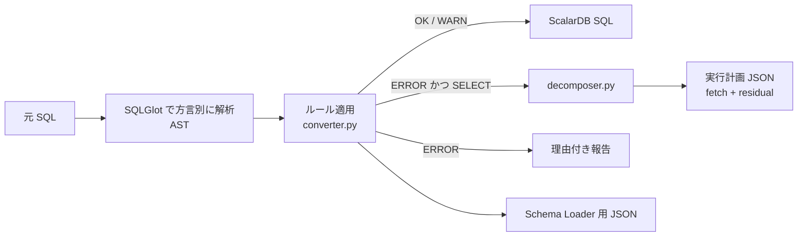
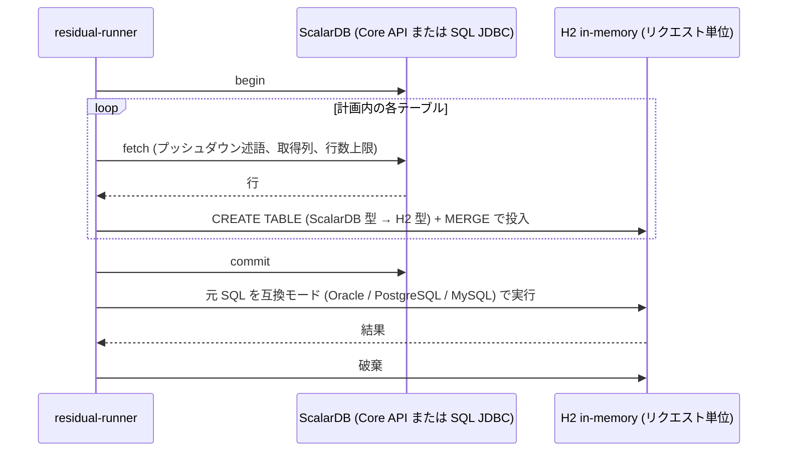

# SQL → ScalarDB 移行の仕組みとテスト報告

作成日: 2026-09-10
対象リポジトリ: `/Users/wfukatsu/work/sql-migration/`
関連文書: `docs/app-side-processing-plan.md` (実装計画 v2)、`docs/oracle-sql-report.md` (Oracle 固有 SQL の検証)、`docs/bench-report.md` (Oracle 直接実行との互換性・性能比較)、`README.md` (使い方)

## 1. 仕組みの概要

図: `docs/diagrams/architecture.png` (アーキテクチャ)、`docs/diagrams/flow.png` (1 文の処理フロー)。編集可能な元データは `docs/diagrams/architecture.drawio`。

既存の Oracle / PostgreSQL / MySQL 向け SQL を ScalarDB に移行するための仕組みで、次の 3 層からなる。

| 層 | 役割 | 実装 | 実行時期 |
|---|---|---|---|
| 変換ツール | SQL を解析し、ScalarDB SQL に変換できる文は変換、できない文は理由付きで報告。読み取り系の変換不能文は「実行計画」に分解 | `scalardb_migrate/` (Python、SQLGlot) | ビルド時 |
| 残余処理ランタイム | 実行計画に従い、ScalarDB から行を取得し、インメモリの H2 で元の SQL を実行 | `runtime-java/` (Java、H2、ScalarDB Core / SQL JDBC) | 実行時 |
| 差分テスト環境 | 移行元 DB と ScalarDB で同じ SQL を実行し、結果集合を比較 | `difftest/` (Docker Compose、Python ハーネス) | 検証時 |

全体の制約として、**アプリケーションからのデータアクセスは必ず ScalarDB を経由する**。ScalarDB のバックエンド DB に直接接続するのはScalarDB 自身だけで、ハーネスも接続しない (ハーネスが直接接続するのは「移行元 DB」のみで、期待値の算出に使う)。

### 1.1 変換ツール (`scalardb_migrate`)



1. **解析**: SQLGlot で方言 (oracle / postgres / mysql) を指定して AST 化する。文の分割はトークナイザで行い、コメントや文字列中の `;` を誤認しない。
2. **変換ルール** (`converter.py`): ScalarDB SQL の文法 (射影は列と集約のみ、WHERE の右辺はリテラルのみ、DNF/CNF 必須、JOIN の述語制約など) を AST に対して検査し、機械的に直せるものは書き換える。代表例は `IN` の OR 展開、`NOT` の押し下げ、DNF/CNF 正規化と括弧付与、`ROWNUM`/`FETCH FIRST` → `LIMIT`、暗黙結合 → `JOIN ON`、`ON CONFLICT`/`ON DUPLICATE KEY`/`REPLACE`/定数ソース `MERGE` → `UPSERT`、型対応 (`NUMBER(p,s)` → INT/BIGINT/DOUBLE) と制約の除去。
3. **出力側の厳格な方言** (`dialect.py`): SQLGlot の `Dialect` サブクラス `ScalarDB` の Generator は、文法に無い構文 (サブクエリ、CASE、関数、OFFSET、CAST など) を例外にする。変換漏れが誤った SQL として出力されない。
4. **アクセスパス分析**: DDL または Schema Loader JSON からテーブル定義が分かる場合、各文を GET / パーティション SCAN / インデックス SCAN / クロスパーティション SCAN に判定し、JOIN 条件が相手テーブルのキーを覆うかを検査する。
5. **分解** (`decomposer.py`): ERROR になった SELECT (UNION、CTE を含む) について、
   - 基底テーブルごとに、WHERE を CNF に正規化して「そのテーブルの `col op literal`」だけからなる連言をプッシュダウン述語として抽出する。外部結合側の `IS NULL` は押し下げない。同じテーブルを複数スコープで参照する場合は 1 つの fetch に統合し、述語が異なれば述語なしで取得する。
   - 文中で使う列 (＋主キー) を取得列にする。
   - 残余 SQL は Java 向けには元の SQL そのまま (H2 に無い関数のみ静的書き換え、例: MySQL `DATE_FORMAT` → `FORMATDATETIME`)、Python 向けには SQLite 方言に変換したもの。
   - ガードレール (クロスパーティション走査の要否、行数上限) と未解決事項を計画に記録する。

ステータスは 4 種類: **OK** (そのまま変換)、**WARN** (意味の差分や性能注意付きで変換)、**PLANNED** (アプリ側実行計画あり)、**ERROR** (変換不能。書き込み系や DDL の非対応機能)。

### 1.2 残余処理ランタイム (`runtime-java`)



- **Fetcher** は 2 実装。`CoreFetcher` は ScalarDB Core の Java API (Apache 2、ライセンス不要) で、パーティションキーが揃えばパーティション走査、そうでなければ条件付きクロスパーティション走査を使う。`JdbcFetcher` は ScalarDB SQL JDBC ドライバで計画の `scalardb_sql` をそのまま実行する (ScalarDB Cluster が必要)。どちらも 1 つの ScalarDB トランザクション内で全テーブルを取得するため、複数テーブルでも一貫したスナップショットになる。
- **Residual** は `jdbc:h2:mem:<uuid>;MODE=<方言>` を開き、投入と実行の後に `SHUTDOWN` で破棄する。永続化しない。
- CLI: `run` (計画実行)、`validate` (DB なしで残余 SQL を H2 でコンパイル検証)、`load` (テスト用データ投入。ScalarDB Core 経由)、`sql` (ScalarDB SQL を 1 文実行。JDBC 経路)。
- ガードレール: fetch 行数が上限 (既定 10,000) を超えると `RowLimitExceededException`。

### 1.3 差分テスト環境 (`difftest`)

| コンポーネント | 役割 | 接続元 |
|---|---|---|
| `source-postgres` | 移行元 DB。期待値の算出専用 | ハーネスのみ |
| `backend-postgres` | ScalarDB のバックエンド | ScalarDB (Core クライアント / Cluster) のみ |
| `schema-loader` | 変換ツールが生成した JSON から ScalarDB のテーブルを作成 | ハーネスが起動 |
| `scalardb-cluster` (任意) | ScalarDB SQL の実行。ライセンスが必要 | JDBC ドライバ |

ハーネス `difftest/run.py` の流れ: ケースファイルを変換 → 移行元 DB に DDL とデータを投入 → Schema Loader でテーブル作成 → ScalarDB Core 経由でデータ投入 → SELECT ごとに「移行元 DB の結果」と「ScalarDB SQL (変換済み文) または計画実行 (PLANNED 文) の結果」を比較。ORDER BY が無い文は順序を無視して比較する。

## 2. テスト内容

### 2.1 単体テスト (pytest、67 件)

| ファイル | 件数 | 内容 |
|---|---|---|
| `tests/test_converter.py` | 48 | 変換ルール単位。DDL (型対応、複合主キー、`--keys`、AUTO_INCREMENT/SERIAL の拒否、主キー必須、インライン INDEX の分離、複合インデックスの拒否、ALTER)、SELECT (GET / パーティション SCAN / クロスパーティションの判定、IN 展開、NOT 押し下げ、DNF 化、IS NOT NULL、リテラル左辺の反転、列同士比較・式射影・DISTINCT・OFFSET・CTE・サブクエリ・UNION・関数述語の拒否、ROWNUM/FETCH → LIMIT、`(+)` → LEFT JOIN、暗黙結合と USING の書き換え、TO_DATE、バインド変数)、DML (主キー欠落 INSERT の拒否、関数値の拒否、UPSERT 変換 3 種、MERGE、RMW の拒否、UPDATE JOIN / DELETE USING の拒否、WHERE なし DELETE の警告、トランザクション文)、Schema Loader JSON 生成 |
| `tests/test_decomposer.py` | 19 | 分解の正しさ。12 件の SELECT (式射影、DISTINCT、OFFSET、IN/EXISTS サブクエリ、CTE、UNION、結合、外部結合、GROUP BY/HAVING、ROWNUM) について「全件を SQLite に置き、計画の fetch SQL で取得した行だけに残余 SQL を適用した結果」が「元 SQL を全件に適用した結果」と一致することを検証。加えてプッシュダウン述語と取得列、アクセスパス判定、外部結合側 `IS NULL` を押し下げないこと、Java 残余 SQL が元 SQL のままであること、書き込み文が計画化されないこと |

### 2.2 サンプル SQL の変換 (`samples/*.sql`)

方言ごとの代表的な DDL / DML を通し、ステータス分布を確認した。

### 2.3 残余エンジンの事前検証 (`spikes/`)

NVL / DECODE / CASE / UPPER / SUBSTR / DATE_FORMAT / TO_DATE、DISTINCT、OFFSET、IN・EXISTS サブクエリ、UNION、GROUP BY + HAVING、COUNT(DISTINCT)、ウィンドウ関数、LEFT JOIN、Oracle `(+)` + ROWNUM の 14 件を、取得済みの行に対して各エンジンで実行した。

### 2.4 差分テスト (`difftest/cases/postgres.sql`, `difftest/cases/oracle.sql`)

PostgreSQL 方言のケースファイル (テーブル 3 つ、インデックス 1 つ、SELECT 15 文、データ 10 行) と、同じデータを Oracle 方言で書いたケースファイル (SELECT 17 文。`NUMBER(p,s)` / `VARCHAR2` の DDL、`NVL` / `DECODE` / `TRUNC` / `ROWNUM` / `FETCH FIRST` / `TO_DATE` / `(+)` 外部結合を含む) を、次の 2 経路で実行した。移行元は PostgreSQL 16 と Oracle Database 23ai Free (Oracle XE の後継の無償版。XE 21c には ARM64 イメージが無い) をそれぞれ Docker で起動した。

- `--fetcher core`: ScalarDB Core API で fetch。ライセンス不要。変換済み文は ScalarDB SQL が使えないため SKIP。
- `--fetcher jdbc`: ScalarDB Cluster 3.19.1 (standalone モード、トライアルライセンス) に ScalarDB SQL JDBC で接続。変換済み文も実行。

## 3. テスト結果

### 3.1 単体テスト

| ファイル | 結果 |
|---|---|
| `tests/test_converter.py` | 48 passed |
| `tests/test_decomposer.py` | 19 passed |

### 3.2 サンプル SQL の変換

| 方言 | 文数 | OK | WARN | PLANNED | ERROR |
|---|---|---|---|---|---|
| Oracle | 21 | 6 | 8 | 4 | 3 |
| PostgreSQL | 22 | 11 | 2 | 3 | 6 |
| MySQL | 18 | 9 | 4 | 3 | 2 |

ERROR に残った 11 件はすべて書き込み系または DDL の非対応機能で、計画 (フェーズ 3) の対象である: `CREATE SEQUENCE` / `NEXTVAL` / `SERIAL` / `AUTO_INCREMENT` (採番)、`SET col = col * 1.1` と `SET balance = balance - 10` (読み書き更新)、`ON CONFLICT DO NOTHING`、`INSERT ... SELECT`、`DELETE ... USING`、`UPDATE ... JOIN`、複合列インデックス。

### 3.3 残余エンジンの事前検証

| エンジン | 追加依存 | 実行時の SQL 変換 | 結果 (14 件中) | 失敗内容 |
|---|---|---|---|---|
| H2 in-memory (Java) | 純 Java の jar 1 つ | 不要 (互換モード) | 12 | Oracle `(+)`、MySQL `DATE_FORMAT` |
| sqlite3 (Python 標準) | なし | SQLGlot で SQLite 方言へ | 12 | Oracle `(+)`/`ROWNUM`、`TO_DATE` |
| DuckDB (比較用) | ネイティブライブラリ | SQLGlot で DuckDB 方言へ | 13 | Oracle `(+)`/`ROWNUM` |
| SQLGlot 同梱 executor (不採用) | なし | 不要 | 誤答あり | `UNION` と `COUNT(DISTINCT)` が誤った結果 |

失敗した項目のうち `(+)` と `ROWNUM` は変換ツールが静的に書き換え、`DATE_FORMAT` は decomposer が `FORMATDATETIME` に書き換える。

### 3.4 差分テスト

#### PostgreSQL 方言 (`difftest/cases/postgres.sql`)

| # | SQL (要約) | 種別 | パターン | fetch 行数 | core | jdbc |
|---|---|---|---|---|---|---|
| 5 | `SELECT ename, sal FROM emp WHERE empno = 2` | ScalarDB SQL (GET) | - | - | SKIP | PASS |
| 6 | `SELECT ename FROM emp WHERE deptno = 30 ORDER BY ename` | ScalarDB SQL (インデックス SCAN) | - | - | SKIP | PASS |
| 7 | `COALESCE(comm, 0)`, `sal * 1.1` の射影 | 計画 | P1 | 2 | PASS | PASS |
| 8 | `SELECT DISTINCT deptno` | 計画 | P3 | 5 | PASS | PASS |
| 9 | `WHERE empno IN (SELECT ... FROM bonus WHERE amount > 150)` | 計画 | P5 | 6 | PASS | PASS |
| 10 | `JOIN ... GROUP BY d.dname HAVING COUNT(*) > 1` | ScalarDB SQL (JOIN + 集約) | - | - | SKIP | PASS |
| 11 | `UPPER`, `CASE WHEN`, `SUBSTR` を含む射影と述語 | 計画 | P1 | 5 | PASS | PASS |
| 12 | `ORDER BY sal DESC LIMIT 2 OFFSET 1` | 計画 | P4 | 5 | PASS | PASS |
| 13 | `UNION` | 計画 | P6 | 5 | PASS | PASS |
| 14 | `COUNT(DISTINCT ename) GROUP BY deptno` | 計画 | P3 | 5 | PASS | PASS |
| 15 | `ROW_NUMBER() OVER (PARTITION BY ...)` | 計画 | P1 | 5 | PASS | PASS |
| 16 | `WHERE EXISTS (相関サブクエリ)` | 計画 | P5 | 7 | PASS | PASS |
| 17 | `LEFT JOIN ... WHERE d.dname LIKE 'S%'` | 計画 | P8 | 6 | PASS | PASS |
| 18 | `TO_CHAR(hiredate, 'YYYY-MM')` | 計画 | P1 | 2 | PASS | PASS |
| 19 | `WITH big AS (...) SELECT COUNT(*)` | 計画 | P6 | 4 | PASS | PASS |
| | **合計** | | | | **12 PASS / 3 SKIP** | **15 PASS** |

fetch 行数は ScalarDB から取得した行の総数で、プッシュダウン述語が効いた文 (7、18) は 2 行、テーブル全件が必要な文は 5 行 (emp) または複数テーブルの合計になっている。

#### Oracle 方言 (`difftest/cases/oracle.sql`)

| # | SQL (要約) | 種別 | パターン | fetch 行数 | core | jdbc |
|---|---|---|---|---|---|---|
| 5 | `WHERE empno = 2` | ScalarDB SQL (GET) | - | - | SKIP | PASS |
| 6 | `WHERE deptno = 30 ORDER BY ename` | ScalarDB SQL (インデックス SCAN) | - | - | SKIP | PASS |
| 7 | `ORDER BY sal DESC FETCH FIRST 2 ROWS ONLY` → `LIMIT 2` | ScalarDB SQL | - | - | SKIP | PASS |
| 8 | `WHERE deptno = 30 AND ROWNUM <= 5` → `LIMIT 5` | ScalarDB SQL | - | - | SKIP | PASS |
| 9 | `hiredate > TO_DATE('2020-06-01','YYYY-MM-DD')` → `'2020-06-01'` | ScalarDB SQL | - | - | SKIP | PASS |
| 10 | `FROM emp e, dept d WHERE e.deptno = d.deptno(+)` → `LEFT JOIN` | ScalarDB SQL (JOIN) | - | - | SKIP | PASS |
| 11 | `GROUP BY deptno HAVING COUNT(*) > 1` | ScalarDB SQL (集約) | - | - | SKIP | PASS |
| 12 | `NVL(comm, 0)`, `sal * 1.1` | 計画 | P1 | 2 | PASS | PASS |
| 13 | `DECODE(...)`, `TRUNC(sal / 1000)` | 計画 | P1 | 5 | PASS | PASS |
| 14 | `SELECT DISTINCT deptno` | 計画 | P3 | 5 | PASS | PASS |
| 15 | `WHERE empno IN (SELECT ... FROM bonus ...)` | 計画 | P5 | 6 | PASS | PASS |
| 16 | `UPPER`, `CASE WHEN`, `SUBSTR` | 計画 | P1 | 5 | PASS | PASS |
| 17 | `ROW_NUMBER() OVER (...)` | 計画 | P1 | 5 | PASS | PASS |
| 18 | `WHERE EXISTS (相関サブクエリ)` | 計画 | P5 | 7 | PASS | PASS |
| 19 | `UNION` | 計画 | P6 | 5 | PASS | PASS |
| 20 | `(+)` 外部結合 + `(d.dname LIKE 'S%' OR d.dname IS NULL)` | 計画 | P8 | 8 | PASS | PASS |
| 21 | `TO_CHAR(hiredate, 'YYYY-MM')` | 計画 | P1 | 2 | PASS | PASS |
| | **合計** | | | | **10 PASS / 7 SKIP** | **17 PASS** |

Oracle 方言の追加で見つけて修正した点は 2 件。`(+)` 外部結合は従来 ERROR にしていたが、SQLGlot の `eliminate_join_marks` で `LEFT JOIN` に書き換えることで変換可能 (文 10) または計画化可能 (文 20) になった。その書き換えが結合の種類を別の属性 (`kind`) に入れるため decomposer が外部結合と認識せず、外部結合側の `IS NULL` を fetch に押し下げてしまう不具合 (文 20 で jdbc 経路のみ検出) を修正した。ScalarDB Core 経路は OR を含む述語を押し下げないため、この不具合は ScalarDB SQL 経路でしか現れなかった。

差分テストの過程で見つけて修正した不具合は次の 4 件。

| 不具合 | 修正 |
|---|---|
| `LEFT JOIN` の相手テーブル列を WHERE で参照する SQL を、ScalarDB は拒否するのに変換ツールが注意止まりで変換していた | JOIN スコープ規則を ERROR に格上げし、計画生成に回すようにした |
| 同じテーブルを複数スコープ (UNION の両側など) で参照する計画が、H2 側で 2 回目の CREATE TABLE に失敗した | テーブルごとに fetch を 1 つに統合 |
| ScalarDB Core の LIKE 条件が汎用の条件ビルダで生成できず `ClassCastException` | `LikeExpression` 専用ビルダに変更 |
| JDBC 経路で名前空間未指定エラー | JDBC クライアント設定にデフォルト名前空間を追加 |
| 残余処理で `ORDER BY` の NULL 位置が Oracle と食い違う (性能比較で検出) | 残余 SQL にソース方言の NULL 順序を明示 (`NULLS FIRST` / `NULLS LAST`)。詳細は `docs/bench-report.md` §2 |
| 取得行の H2 投入が行数の二乗で悪化 (性能比較で検出) | 初回投入を `INSERT` にし、同一テーブルの 2 回目以降だけ `MERGE`。詳細は `docs/bench-report.md` §3.4 |

### 3.5 取り直し（2026-09-19、レビュー #27 の修正後）

レビュー #27 で結果集合の比較を厳しくした（`difftest/rowcompare.py`: 整数は厳密、小数は有効 15 桁、日時はミリ秒まで、真偽値は真偽値とだけ一致）。3.4 の一致件数は古い比較で出した数字なので、修正後の `main` で実 Oracle 23ai / PostgreSQL / ScalarDB Cluster を使って取り直した。環境は JST の macOS、バックエンドは PostgreSQL。

| ケース | 経路 | PASS | FAIL | SKIP | 備考 |
|---|---|---|---|---|---|
| `postgres.sql` | `--fetcher core` | 12 | 0 | 3 | SKIP は ScalarDB SQL に変換できた文（Core 経路では実行しない） |
| `postgres.sql` | `--fetcher jdbc` | 15 | 0 | 0 | |
| `oracle.sql` | `--fetcher core` | 10 | 0 | 7 | 同上 |
| `oracle.sql` | `--fetcher jdbc` | 17 | 0 | 0 | |
| `oracle-features.sql` | `--fetcher core` | 42 | 1 | 19 | |
| `oracle-features.sql` | `--fetcher jdbc` | 51 | 1 | 10 | FAIL は #21（`NUMBER(7,2)` → DOUBLE の型対応、既知）。SKIP のうち 8 は、以前 H2 で落ちていた構文（CONNECT BY・KEEP・ROLLUP / CUBE / GROUPING SETS・PIVOT / UNPIVOT）を計画の時点で `RESIDUAL_H2` として拒否するようになったもの |

一致件数は 3.4 と同じ水準に戻ったが、**そこに至るまでに実 DB でしか見つからない退行が 4 件あった**（いずれも修正済み、回帰テストあり）。

| 見つかったこと | 原因 | 直し方 |
|---|---|---|
| Oracle の DATE を返す式（`ADD_MONTHS`、`hiredate + 30` など 5 文）が 9 時間遅れて返る | H2 のセッションを UTC にした（#27 の 32f）のに、結果を `java.sql.Timestamp`（JVM のゾーンで読む）で受けていた。CI は UTC で動くので見えなかった | 日時は `java.time` の型で読み書きする（`Residual.read`、`Values.toH2`） |
| 再帰 WITH が `Table "h" not found` | H2 2.5 は `RECURSIVE` の語が無いと再帰 CTE を認識しない（Oracle にはその語が無い） | 分解時に `WITH RECURSIVE` と書く |
| `(deptno, job) IN ((10, 'CLERK'), (30, 'SALESMAN'))` が `Data conversion error` | 整数列を NUMERIC にした（#27 の 27）ため、H2 が行値の並び全体に 1 つの型を探して失敗する。OR でつないだ 1 行ずつの IN も H2 が畳み直して同じ結果になる | 分解時に列ごとの比較 `(a = 1 AND b = 'x') OR …` にする |
| TIMESTAMPTZ 列へのリテラルが判定 OK のまま実行時に `could not be parsed` | ScalarDB SQL が受け付けるのは `'YYYY-MM-DD HH:MM[:SS[.FFF]] Z'` だけ（実クラスタで確認）。ゾーンなし・`T` 区切り・`+09:00` はどれも拒否される | ゾーン付きは同じ瞬間の UTC に直して `Z` を付ける。ゾーンなしは UTC として書き、WARN `TZ_ASSUMED_UTC` を出す（移行元はセッションのタイムゾーンで読むが、それはここから見えない） |

同じ表を別の型で作り直した直後は、ScalarDB Cluster から PostgreSQL への接続に残った prepared plan が `cached plan must not change result type` で落ちる（ケースを続けて回すと 1 文だけ FAIL になる）。`run.py --restart-cluster` で、表を作り直したあとにノードを再起動する。

スキルの実行検証（`difftest/transpile_verify.py`、9 ペア 321 文）は見逃し 0。比較を厳しくしたことで MySQL 向けに 2 件の見逃しが出たので、WARN を足した: 真偽値の式の射影が 1 / 0 で返る（`BOOLEAN_RESULT`）、AVG と除算の小数桁が「被演算子の桁 + 4」で丸まる（`DIV_PRECISION`）。

PL/SQL の evidence（`difftest/plsql_capture.py` → `plsql_diff.py --full`）も取り直した。Oracle 側の capture 69 件は、コミット済みの `fixtures/plsql/golden/` と差分なし。ScalarDB 側は両系統とも 69 / 69 シナリオを採取し、scaled は 66 一致・3 相違（3 件とも trigger の REDESIGN: 直接の DML に移行先の trigger は掛からない）、double は 63 一致・6 相違（加えて金額の丸め 2 件 REVIEW、`claim_batch` の行の選ばれ方 REDESIGN）。AUTO の routine に相違は無く、KPI-5 は両系統とも AUTO 19 / 19、`staleEvidence` は空。取り直しの途中で、実行できなかったシナリオが前回の capture ファイルのせいで「一致」と数えられることが分かったので、capture の前にディレクトリを空にし、比較側でも `unrunnable.json` に名前のあるシナリオを比較しないようにした。

## 4. 制約と未実施事項

- ScalarDB SQL は Enterprise Premium 機能で、実行には ScalarDB Cluster とライセンスが必要。今回はドキュメント掲載のトライアルライセンス (2026-10-31 まで、評価目的限定、要インターネット接続、再配布禁止) を使い、キーは git 管理外の `difftest/license.properties` にのみ置いた。
- 差分テストは PostgreSQL 方言 15 文と Oracle 方言 17 文 (データ 10 行) での確認である。MySQL 方言のケースファイルと並行性テストは未実施。データ量を増やした性能・互換性の比較は `docs/bench-report.md` (emp 5,000 / 20,000 / 40,000 行、15 文) で別途実施した。
- 書き込み系パターン (読み書き更新、結合条件付き UPDATE/DELETE、`INSERT ... SELECT`、`DO NOTHING`、採番) は計画のフェーズ 3 で、未着手。
- H2 互換モードの関数対応表は MySQL `DATE_FORMAT` のみ。実案件の SQL で拡充が必要。
- クロスパーティション走査は JDBC バックエンド前提で有効化している。非 JDBC バックエンドでは一貫性上の注意があり、既定では禁止する方針。

## 5. 再現手順

```
# 単体テスト
.venv/bin/python -m pytest -q
# 変換とサンプル統計
for d in oracle postgres mysql; do .venv/bin/python -m scalardb_migrate.cli samples/$d.sql --dialect $d --out-dir out --plan-dir out/plans; done
# 事前検証
.venv/bin/python spikes/residual_sqlite.py
cd spikes/h2 && javac -cp ~/.m2/repository/com/h2database/h2/2.2.224/h2-2.2.224.jar ResidualH2.java && java -cp ~/.m2/repository/com/h2database/h2/2.2.224/h2-2.2.224.jar:. ResidualH2 && cd ../..
# 差分テスト
cd runtime-java && gradle installDist && cd ..
cd difftest && docker compose up -d source-postgres backend-postgres && cd ..
.venv/bin/python difftest/run.py difftest/cases/postgres.sql --dialect postgres --fetcher core
cd difftest && ./make-cluster-conf.sh && docker compose --profile cluster up -d && cd ..
.venv/bin/python difftest/run.py difftest/cases/postgres.sql --dialect postgres --fetcher jdbc --skip-setup
cd difftest && docker compose --profile oracle up -d source-oracle && cd ..
.venv/bin/python difftest/run.py difftest/cases/oracle.sql --dialect oracle --fetcher core
.venv/bin/python difftest/run.py difftest/cases/oracle.sql --dialect oracle --fetcher jdbc --skip-setup
```
