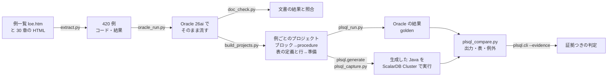

# Oracle PL/SQL 言語リファレンスの例を ScalarDB に移せるかの検証（2026-09-26）

Oracle Database PL/SQL 言語リファレンス 12c リリース 1（日本語、
[例一覧 loe.htm](https://docs.oracle.com/cd/E57425_01/121/LNPLS/loe.htm)）に載っている **420 例すべて** を、
このリポジトリの PL/SQL 変換（`plsql.cli` / `plsql.generate`）に通し、移行元 Oracle 26ai Free と移行先
ScalarDB Cluster 3.19（バックエンド PostgreSQL）で同じ結果になるかを比べた記録。

題材は業務ロジックではなく「PL/SQL の言語機能を 1 つずつ見せる」例なので、変換できる割合は低く出て当然である。
読む価値があるのは、言語機能ごとに「そのまま移る / 生成器が未対応として止まる / 生成物がコンパイルできない /
**黙って結果が変わる**」のどれになったかと、判定（AUTO / REVIEW / REDESIGN）がそれを正しく言い当てたかである。

## 結論

| | 数 | 内訳 |
|---|---:|---|
| 文書の例 | 420 | 実行して比較 282 / ユニットだけ 47 / Oracle が断る 62 / PL/SQL が無い 24 / その他 5 |
| Oracle 26ai が文書どおりの結果を出した | 213 / 260 | 結果の載っている 260 例のうち。差の 47 例は版の差・文書の省略・前提の欠け（第 1 部） |
| **実行した 282 例のうち、両側で同じ結果** | **77** | DBMS_OUTPUT の行・表の状態・例外がすべて同じ |
| 生成コードが「未対応」と言って止まった | 130 | 生成器が訳せない所で `UnsupportedOperationException` を投げる（黙らない失敗） |
| 生成コードがコンパイルできない | 38 | 同じ原因で、実行できない例（ユニットだけ・Oracle が断る）でも 16 |
| **値・例外が違った** | **21** | うち **黙って結果が変わる 10 例**（下）、別の例外 9、Oracle 側の環境 1（8-43）、trigger の設計差 1（9-26） |
| 並びだけ違う / 直接の DML を断る / 流せない | 1 / 6 / 9 | ORDER BY の無いカーソル、trigger の例の素の DML、準備行やハーネスの失敗 |

- **黙って結果が変わった 10 例はすべて、ルールだけの判定では AUTO だった**。`100 IN (a, b)`（a が NULL）が
  NULL でなく FALSE になる、`CHAR(10)` の空白埋めが無い、PLS_INTEGER の桁あふれ・制約付きサブタイプの範囲違反・
  `CHAR(6)` への 12 文字の代入が例外にならない、ネストした表の `=` が順序つきの比較になる、`1/3` の桁が 40 桁でなく 38 桁。
  実 DB の証拠を渡すと 10 例とも REVIEW に落ちる。**証拠つきで AUTO になった 55 例は、すべて一致した例である**
- 生成器が止まる所の最多は **宣言部のローカルなサブプログラム**（48 例。文書の例は `print_boolean` のような
  補助の手続きを宣言部に書く）、次が明示カーソルの `OPEN` / `FETCH` をループ以外の形で使うもの（19）、
  コレクションとレコードの操作（15）、動的 SQL（12）
- コンパイルできない原因の最多は、入れ子のブロックで同じ名前を宣言し直す形（PL/SQL では正しいが Java では
  同じメソッドの中で再宣言できない）、引用識別子 `"HELLO"` がそのまま Java の名前になる形、型の変換
- Oracle 自身がコンパイルで断る例（文書が誤りを見せるための例 18 など）を、変換器は断らずに Java にする（51 例で
  コンパイルも通る）。変換器は「移行元で有効な PL/SQL」を入力の前提にしているので、これは仕様どおりである

## フォルダ

```
samples/oracle-plsql-docs/
  extract.py          例一覧と各章を取り、例ごとのコードと「結果:」を work/examples.json に抜き出す（--fetch で取り直す）
  script.py           SQL*Plus のスクリプトを文（PL/SQL ユニット / 無名ブロック / SQL / SQL*Plus の指示）に分ける
  examples.py         例を読み、前の例への依存（前提）を求める。文書の例の不備 4 件の最小修正（FIXES）
  oracle-user.sh      Oracle にユーザ plsqldoc / plsqldoc_b / plsqldoc_r を作る（SYSTEM で 1 度）
  oracle_run.py       例をそのまま Oracle で流し、文ごとの結果と DBMS_OUTPUT を記録する（work/oracle）
  doc_check.py        Oracle の結果を文書の「結果:」と突き合わせる（work/doc-check.json）
  build_projects.py   実行する例を、例ごとのハーネスのプロジェクトにする（work/projects/ex_<章>_<番号>）。--static で実行できない例
  run_projects.py     プロジェクトごとに Oracle 配備・実行 → ScalarDB スキーマ → 生成・capture → 比較・判定
  static_run.py       実行できない例を解析と生成・コンパイルだけに通す（work/static）
  summarize.py        例ごとの結果をまとめる（work/summary.json、result/summary.json）
  make_tables.py      付録の表（result/tables.md）
  result/             summary.json（例ごとの分類と結果）、tables.md（章ごとの表と例ごとの表）
  work/               文書の HTML、HR スキーマ、抜き出した例、プロジェクト、ログ（git に入れない）
```

**文書の原文は git に入れていない。** 例のコードと結果は Oracle の著作物なので、`extract.py --fetch` で
docs.oracle.com から取り直す形にした。HR スキーマ（db-sample-schemas の v12.1.0.2）も同じく取り直す。

## 手順



1. **抜き出す**: 例一覧の 420 のリンクをたどり、各例の `<pre>` を「コード」と「結果」に分けた（直前の段落が「結果:」なら結果）
2. **Oracle でそのまま流す**: 例ごとにスキーマを空にして HR（12.1 版、107 人）を作り直し、文を SQL*Plus と同じ順に流して、
   文ごとの成否・エラー・DBMS_OUTPUT・問合せの行を記録した。例ごとに接続を作り直す（7-18 が `ALTER SESSION` で変えた
   `NLS_DATE_FORMAT` が後の例に漏れ、12-17 などの日付の表示が化けたため）。前の例が作った表や手続きを使う例（90 例）には、
   それを作った文を先に流す
3. **変換用のプロジェクトにする**: 無名ブロックは引数なしの `PROCEDURE ex_<章>_<番号>` に包み（本文は原文のまま。
   複数のブロックは `_b1`、`_b2`…）、trigger を作る例では、その後の素の DML を「PL/SQL の外から表へ書く」シナリオにした。
   呼び出しごとに、Oracle でその直前まで流した状態から、例が参照する表の定義（辞書から）と行（INSERT 文）を読み、
   `schema.sql`・ScalarDB のスキーマ・シナリオの準備行にした。シナリオは `output: true`（DBMS_OUTPUT の行を比べる）
4. **実 DB で比べる**: 既存のハーネス（`difftest/plsql_run.py` → `plsql_capture.py --variant double` → `plsql_compare.py`
   → `plsql.cli --evidence`）を例ごとに回した。**例ごとに 1 プロジェクト**にしたのは、Gradle が生成物を木ごと
   コンパイルするので、1 つの例の javac エラーが同じプロジェクトの全部を止めるからである

### 決めたこと（この検証の既定。移行責任者の決定ではない）

| 既定 | 理由 |
|---|---|
| `limits.yaml` を置かない（行ロック・トランザクション境界・走査行数などは誰も決めていない） | 言語機能の移り方を、人の決定を足さない状態で測る。決定が要る所は REVIEW / REDESIGN と「未対応」で出る |
| HR スキーマは 12.1 版（db-sample-schemas v12.1.0.2）。外部キーと HR の trigger（`update_job_history`、`secure_employees`）は持ち込まない | 文書の結果はこの版のデータ。外部キーは ScalarDB に無く、ハーネスの表の空け方（子から消す）と循環参照がぶつかる |
| 主キーの無い表（例が CTAS などで作る表）は、先頭の列を partition key にする | ScalarDB にはキーが要る。同じ値の行が 2 つある表（B-2〜B-4）は準備行が入らず「流せない」に出る |
| Oracle の `DATE` は ScalarDB では `TIMESTAMP`、金額は DOUBLE（`--variant double`） | samples/oracle-samples と同じ |
| SYSDATE は両側で `2026-09-26 09:30:00` に固定 | 既存のハーネスと同じ |
| 文書の例の不備 4 件は最小限に直して流す（`examples.py` の `FIXES`） | 下の「文書の例について分かったこと」 |

## 第 1 部: 文書の例を Oracle 26ai で流す

結果の載っている 260 例のうち **213 例**で、Oracle 26ai の DBMS_OUTPUT とエラー番号が文書の「結果:」と一致した
（照合は近似: SQL*Plus の決まり文句とエラー位置の表示を落とし、文書が「...」で省いている所は順に現れるかで見る。
問合せの表示は値の並びで見る）。差のあった 47 例を目で確かめた内訳:

| 差の理由 | 例 |
|---|---|
| 版の差（12.1 と 26ai） | 2-55（`PLSQL_WARNINGS` の既定）、2-58（`DBMS_DB_VERSION` が 23）、2-4 / 4-30（構文エラーの「期待した記号」の一覧）、11-9（ORA-03302 が増える）、12-5 / 12-9（時間の測定値）、14-11（権限） |
| 文書の表示が省略・書式つき | 5-5、5-53、6-36、6-46、7-11（`DBMS_SQL.RETURN_RESULT` の暗黙の結果はハーネスが読まない）、7-17〜7-21、8-3、9-3、9-4、9-14、9-15、9-18、10-8、11-11、11-13、12-11〜12-15、12-22、2-23（メッセージの文言） |
| データや順序の差 | 6-10、6-15 / 6-16 / 6-21（ORDER BY の無い問合せの読み順）、10-9（sequence の値）、7-21（日付）|
| 前提が無い | 9-2（OE スキーマ）、6-47、B-7（型の前提）、2-54（SQL*Plus の画面の写しで流せない）、A-2 / A-5（OS の `wrap` コマンド） |

## 第 2 部: 変換して実 DB で比べる

### 2.1 分類

| 分類 | 数 | 扱い |
|---|---:|---|
| 実行して比較 | 282 | ブロック（または trigger の後の DML）がある例。両側で流して比べる |
| ユニットだけ | 47 | procedure / package / trigger を作るだけで呼び出しが無い。解析と生成・コンパイルまで |
| Oracle が断る | 62 | Oracle がコンパイルで断る。文書が誤りを見せる例 18、前提が無い例 44（SCOTT / OE スキーマ、権限、リファレンスの断片、結果キャッシュの設定表）。解析と生成・コンパイルまで |
| PL/SQL が無い | 24 | SQL 文・構文の図・ALTER / DROP だけ |
| その他 | 5 | SQL*Plus のバインド変数 2、表にオブジェクト型の値があり準備行にできない 2、外部プロシージャ（CREATE LIBRARY）1 |

章ごとの数は付録の [表 1](result/tables.md#表-1-章ごとの分類)。

### 2.2 実行した 282 例の結果

| 結果 | 例 | 意味 |
|---|---:|---|
| 一致 | 77 | DBMS_OUTPUT の行・表の状態・例外がすべて同じ（出力の無い 19 例は表の状態で比べた） |
| 値が違う | 5 | 例外は同じで、出力か表の値が違う |
| 例外が出ない | 7 | Oracle は例外で止まり、Java は止まらない |
| 別の例外 | 9 | 両側で違う例外（ScalarDB のエラー、Java の例外） |
| 並びだけ違う | 1 | 6-20。同じ行が別の順（ORDER BY の無いカーソル）。どちらも正しい |
| 直接の DML を断る | 6 | trigger の例の `UPDATE … SET salary = salary * 1.05` など。ScalarDB SQL にできない（RMW・主キーの更新）。移行先に trigger は無い |
| 未対応で止まる | 130 | 生成器が訳せない文で `UnsupportedOperationException` を投げた（2.4） |
| javac エラー | 38 | 生成物がコンパイルできない（2.5） |
| 流せない | 7 | 準備行が ScalarDB に入らない（主キーの無い表で同じ値 3）、生成器が落ちる（5-36）、ほか |
| ハーネスの失敗 | 2 | 5-42 / 5-43（準備行の変換で `schema.sql` を sqlglot が読めない） |

章ごとの数は付録の [表 2](result/tables.md#表-2-実行した例の結果章ごと)。

### 2.3 値・例外が違った例（1 例ずつ）

**黙って結果が変わる 10 例**（どれもルールだけの判定は AUTO。証拠を渡すと REVIEW）:

| 例 | 構文 | Oracle | 生成した Java | 原因の場所 |
|---|---|---|---|---|
| 2-48 | `100 IN (a, b)`（a は NULL、b は 10） | NULL | FALSE | IN の 3 値論理（一致が無く NULL を含むなら NULL） |
| 3-1 | `first_name CHAR(10 CHAR) := 'John '` | `*John      *`（10 文字に埋める） | `*John *` | CHAR 変数の空白埋め |
| 3-4 | `PLS_INTEGER` の `2147483647 + 1` | ORA-01426 | 例外なし | PLS_INTEGER の桁あふれの検査 |
| 3-6 | `SIMPLE_INTEGER` に NULL を代入 | ORA-06502 | 例外なし | SIMPLE_INTEGER の NOT NULL |
| 3-8 | `SUBTYPE Balance IS NUMBER(8,2)` に 1000000.00 | ORA-06502 | 例外なし | 制約付きサブタイプの精度 |
| 3-9 | `SUBTYPE Double_digit IS PLS_INTEGER RANGE 10..99` に 4 | ORA-06502 | 例外なし | サブタイプの RANGE |
| 3-10 | `SUBTYPE Word IS CHAR(6)` に 12 文字 | ORA-06502 | 例外なし | サブタイプの長さ |
| 5-15 | ネストした表の `=`（同じ要素・別の順） | 等しい | 等しくない | ネストした表の比較は順序を見ない（多重集合） |
| 11-21 / 11-22 | `1/3` の印字 | 40 桁 | 38 桁 | NUMBER の割り算の精度（`OracleNumbers.divide`） |

3-8〜3-10 は、変数の宣言に直接書いた `NUMBER(8,2)` / `VARCHAR2(3)` なら生成器は `Plsql.fit` で検査している
（samples/oracle-samples）。**`SUBTYPE` を通すと制約が落ちる**のが穴である。

**別の例外になる 9 例と、その他の差**:

| 例 | 何が起きたか | 性質 |
|---|---|---|
| 2-6、11-3 | `USER_OBJECTS` / `USER_TAB_COLS`（データ辞書）を読む SQL を、そのまま ScalarDB に送って「表が無い」 | 解析の穴。辞書ビューを「移せない」と判定していない（ルールは AUTO） |
| 4-31 | `IF done THEN`（done は NULL の BOOLEAN）で NullPointerException | 生成器の不具合。NULL の条件は偽として扱う |
| 6-22 | FROM 句の副問合せの列の別名（`staff`）を ScalarDB が「列が無い」 | 変換器の不具合 |
| 6-27、12-23 | カーソル変数からコレクション（レコードの表）への BULK COLLECT で ClassCastException | 生成器の不具合 |
| 12-21 | `BULK COLLECT … WHERE ROWNUM <= 50` が 1 行の SELECT INTO として TOO_MANY_ROWS | 生成器の不具合 |
| 6-37 | 同じキーの INSERT を Oracle は文で断り（handler で ROLLBACK）、ScalarDB は commit で衝突 | 既知の差（EXC-001）。判定は REDESIGN |
| 9-26 | trigger の変更表エラー（ORA-04091）が出ない | 移行先に trigger は無い。判定は REDESIGN |
| 8-43 | Java ストアド・プロシージャ（`LANGUAGE JAVA`）。Oracle 26ai Free に JVM が無く ORA-29538 | 移行元の環境。ただし変換器は `LANGUAGE JAVA` の呼び出し仕様を AUTO にしている（穴） |
| B-9 | オブジェクト表（`CREATE TABLE ot1 OF t1`）を普通の表として作ったので Oracle 側がコンパイルで断る | ハーネスの限界 |

### 2.4 生成器が「未対応」と言って止まる構文（130 例）

生成器は訳せない文の所に `throw new UnsupportedOperationException(...)` を置き、元の文をコメントで残す。
黙って違う結果を返すより安全な失敗であり、判定はどれも REVIEW 以上になる。例の数（1 例は最初に止まった理由で数える）:

| 構文 | 例 | 代表 |
|---:|---:|---|
| **宣言部のローカルなサブプログラム**（`DECLARE PROCEDURE p IS … BEGIN … END;`） | 48 | 2-19、2-35〜2-37、4-1〜4-3。文書は `print_boolean` などの補助をこの形で書く |
| 明示カーソルの `OPEN` / `FETCH` をループ以外で使う、`%ISOPEN` / `%NOTFOUND` | 19 | 4-25〜4-27、6-7〜6-9、6-14〜6-17 |
| コレクションとレコード（要素への代入、入れ子のフィールド、`LIMIT`、package のコレクション、型の宣言） | 15 | 5-3、5-12、5-28、5-35、5-45、7-4〜7-6 |
| 動的 SQL・動的な PL/SQL ブロック・`DBMS_SQL` | 12 | 7-1、7-2、7-10、7-16〜7-21 |
| SELECT INTO が実行計画（ScalarDB から取ってアプリで計算）になり、結果を変数に受け取れない | 9 | 2-25、3-3（WHERE に PL/SQL 関数）、12-18〜12-20 |
| 組み込み関数と問合せディレクティブ（`RPAD`、書式つき `TO_DATE`、`SQRT`、`**`、`$$PLSCOPE_SETTINGS`、`DBMS_DB_VERSION`） | 7 | 2-7、2-55、2-58、6-6 |
| FORALL / INSERT … SELECT / RETURNING | 6 | 12-8、12-10、12-14、12-15 |
| RMW（`SET salary = salary * 1.1`）と、VALUES の式 | 5 | 4-24、6-38、6-45 |
| COMMIT / SAVEPOINT（トランザクション境界を誰も決めていない） | 4 | 6-39、11-26、12-12 |
| その他（再帰呼び出し 8-5 / 8-35、ScalarDB で走れないカーソル FOR ループ 6-42 など） | 5 | |

### 2.5 生成物がコンパイルできない（実行した例 38 + 実行できない例 16）

| 原因 | 例 |
|---|---|
| 型の変換（int → BigDecimal、BINARY_FLOAT → Float、Object → LocalDateTime、record 同士） | 13（2-13、4-23、5-33、8-14、8-15 など） |
| シンボルが無い（レコードのフィールド、入れ子の関数、package の要素） | 14（5-48、6-10、6-21、8-16、8-18、12-5 など） |
| **入れ子のブロックで同じ名前を宣言し直す**（Java では同じメソッドの中で再宣言できない） | 10（2-17、2-18、2-22、2-23、4-20〜4-22、5-52 など） |
| **引用識別子 `"HELLO"` がそのまま Java の変数名になる** | 7（2-1〜2-5、5-11、5-13） |
| 到達不能な文（`throw` の後の文。PIPELINED と ref cursor の関数） | 5（8-7、12-30〜12-34） |
| 構文（式の開始、括弧） | 3（2-43、7-20、11-13） |
| コレクションのメソッドの引数（`DELETE(m, n)`、`EXTEND(n, i)`） | 2（5-17、5-20） |

ほかに生成器そのものが例外で落ちた例が 5 つある（5-36: レコード型のフィールドの既定値が訳せず `Untranslatable` が
外へ出る、9-6 / 9-7 / 9-11: 定義の無い表（SCOTT の `emp` / `dept`）に掛かる trigger の検査の生成で `IndexError`、14-26: 型の属性を読む SELECT（`c.col.a1`）で落ちる）。samples/oracle-samples で直した「宣言部の初期化式が
訳せないと生成全体が落ちる」と同じ種類の漏れである。

### 2.6 実行できない例の変換

- **ユニットだけの 47 例**: 解析は 44 例で 100% 読め、38 例で生成物がコンパイルできた
- **Oracle が断る 62 例**: 55 例は解析が 100% 読み、51 例で生成物がコンパイルでき、17 例はルールでは AUTO だった
  （4-18 のループ変数への代入 PLS-00363、4-19 の範囲外の参照 PLS-00201、8-38 など存在しない表）。
  変換器は名前解決や型の検査を Oracle ほど厳しくはしない。移行の入力は「移行元でコンパイルが通っているもの」に限る
  （`USER_OBJECTS.STATUS = 'VALID'`）という前提を、手順に明記しておく必要がある

### 2.7 判定と証拠

| ルールだけの判定 | 一致 | 違う・止まる | javac エラー | 流せない |
|---|---:|---:|---:|---:|
| AUTO | 67 | 32 | 23 | 2 |
| REVIEW | 8 | 98 | 11 | 3 |
| REDESIGN | 2 | 28 | 4 | 2 |

ルールだけで AUTO の 124 例のうち 57 例は、実際には一致しない（そのうち 10 例は黙って結果が変わる）。
比べた証拠を渡すと AUTO は 55 例になり、**すべて一致した例**である。一致しても AUTO にならなかった 22 例は、例の中の
補助の手続き（`print_nt` など）にそれ自身の比較が無い、走査行数の上限を誰も決めていない（CUR-002）、移行先では起きない
例外の handler（EXC-001）、GOTO・`AUTHID CURRENT_USER`（REDESIGN）による。「証拠の無い AUTO は候補にすぎない」という設計が、この題材でも効いている。

## ハーネスに足したこと・直したこと

| 変更 | 場所 | 理由 |
|---|---|---|
| シナリオの `output: true` で、DBMS_OUTPUT の行を両側で取り、行ごとに比べる | `difftest/plsql_run.py`（`DBMS_OUTPUT.ENABLE` / `GET_LINE`）、`ScalarDbRunner.capture`（`Plsql.output()`）、`Scenario.output`、`plsql_compare._compare_output` | 文書の例は結果を印字で見せる。これまでのハーネスは表・戻り値・例外しか比べていなかった |
| ランタイムの定義済み例外（`Plsql.ZeroDivide` / `Plsql.ValueError`）が routine の外へ出たら、メッセージの `ORA-nnnnn` を番号として記録する | `ScalarDbRunner.errorCode` | 未処理の ZERO_DIVIDE（11-18 など）が「別の例外」に数えられていた。Oracle のクライアントが見るのと同じ結末である |
| `src/type_bodies.sql`（`CREATE TYPE BODY`、`/` 区切り）を配備する | `difftest/plsql_run.py deploy` | オブジェクト型のメソッドの本体。型と同じく Oracle 側だけ |

テスト: `tests/test_plsql_compare.py` に出力の比較 4 件、`ScenarioTest` に `output` の読み取り 1 件。

## 文書の例について分かったこと

1. **そのままでは Oracle でも通らない例が 4 つある**（`examples.py` の `FIXES` で最小限に直した）
   - 2-25: `DBMS_OUTPUT.PUT_LINE` がブロックの `END;` の外にある（PLS-00103）
   - 5-39: 宣言されていない `print(t1_row.c2);` が紛れている（PLS-00201）
   - 6-30: パッケージ仕様部の後の `/` が抜けていて、続く無名ブロックが仕様部の一部になる（PLS-00103）
   - 9-4: `DBMS_LOCK.SLEEP` は SYS からの権限付与が要る。26ai では `DBMS_SESSION.SLEEP` にした
2. リファレンスの章（CREATE TYPE など）の例は、`/` の無い断片が続くので SQL*Plus のスクリプトとしては流せない（14-23〜14-27 など）
3. 9 章の trigger の例の多くは SCOTT スキーマ（`emp` / `dept`）、9-2 は OE スキーマ、8-38〜8-42 は例に無い設定表を前提にしている

## 残る穴と次にやること（提案）

黙って結果が変わる穴を先に塞ぐのがよい。どれも 1 つの関数か 1 つの生成規則に閉じている:

1. サブタイプの制約（`SUBTYPE … IS NUMBER(8,2)` / `RANGE` / `CHAR(6)`）を宣言の制約として引き継ぐ（3-8〜3-10）
2. PLS_INTEGER / SIMPLE_INTEGER の桁あふれと NOT NULL（3-4、3-6）
3. IN / NOT IN の 3 値論理（2-48）
4. CHAR 変数の空白埋め（3-1）
5. ネストした表の `=` / `!=` を多重集合の比較に（5-15）
6. NUMBER の割り算の精度を 40 桁に（11-21、11-22）

その次が、止まる・コンパイルできない例の多い順: 宣言部のローカルなサブプログラム（48）、入れ子のブロックの
同名の再宣言と引用識別子（17）、明示カーソルの OPEN / FETCH の一般形（19）。辞書ビュー（2-6、11-3）と
`LANGUAGE JAVA`（8-43）は、生成ではなく解析の判定（「移せない」）で拾うのがよい。

### 登録した Issue（2026-09-26、#59〜#89）

| 種類 | Issue |
|---|---|
| 黙って結果が変わる（Priority High） | #59 SUBTYPE の制約、#60 PLS_INTEGER / SIMPLE_INTEGER、#61 IN の 3 値論理、#62 CHAR の空白埋め、#63 ネストした表の =、#64 割り算の桁 |
| 例外になる・判定の穴 | #65 NULL の BOOLEAN、#66 ROWNUM 付き BULK COLLECT、#67 カーソル変数からの BULK COLLECT、#68 導出表の列の別名、#69 辞書ビューと LANGUAGE JAVA が AUTO |
| 生成器が落ちる | #70 |
| javac エラー | #71 同名の再宣言、#72 引用識別子、#73 Row クラスが無い、#74 レコード型が Object、#75 型の変換、#76 式の翻訳の崩れ、#77 到達不能な文、#78 DELETE(m,n) / EXTEND(n,i)、#79 trigger の検査の名前の重複 |
| 未対応で止まる | #80 ローカルなサブプログラム、#81 明示カーソルの一般形、#82 コレクションとレコード、#83 実行計画の結果の受け取り、#84 組み込み関数・演算子、#85 VALUES の変数、#86 スタンドアロンの再帰関数、#87 動的 PL/SQL ブロック |
| ハーネス | #88 SYSTIMESTAMP の後の Cluster の INTERNAL、#89 ハーネスが落ちる 2 経路 |

Issue にしていないもの: 人の決定で進む所（COMMIT / SAVEPOINT の境界、RMW、FORALL、表名が実行時に決まる動的 SQL）、
移行先に trigger が無いことによる差（直接の DML、変更表エラー 9-26）、この検証の既定による限界（主キーの無い表で同じ値の行 B-2〜B-4、
オブジェクト表 B-9）、ORDER BY の無い問合せの並び（6-20）。

## 再現

```bash
python3 samples/oracle-plsql-docs/extract.py --fetch                  # 文書と HR スキーマを取る -> work/
samples/oracle-plsql-docs/oracle-user.sh                              # Oracle のユーザ（1 度だけ）
.venv/bin/python samples/oracle-plsql-docs/oracle_run.py              # 第 1 部（15 分ほど）
python3 samples/oracle-plsql-docs/doc_check.py
SRC_ORACLE_USER=plsqldoc_b SRC_ORACLE_PASSWORD=plsqldoc_b .venv/bin/python samples/oracle-plsql-docs/build_projects.py
SRC_ORACLE_USER=plsqldoc_b SRC_ORACLE_PASSWORD=plsqldoc_b .venv/bin/python samples/oracle-plsql-docs/build_projects.py --static
.venv/bin/python samples/oracle-plsql-docs/run_projects.py            # 第 2 部（282 例、1 例 20 秒ほど）
.venv/bin/python samples/oracle-plsql-docs/static_run.py
python3 samples/oracle-plsql-docs/summarize.py
python3 samples/oracle-plsql-docs/make_tables.py > samples/oracle-plsql-docs/result/tables.md
```

Docker の検証環境（`difftest/`）と ScalarDB Cluster のライセンスが要る（[検証環境](../../docs/guide/verification.md)）。
9-4 は、生成コードが `SYSTIMESTAMP` を TIMESTAMP 列に書いた後、次のシナリオの表を空ける段で ScalarDB Cluster が
`INTERNAL: Text '2026-09-26T11:56:08' could not be parsed at index 10` で落ちる（namespace を作り直しても再現する。
原因は調べていない）。

## 付録

- [result/tables.md](result/tables.md): 章ごとの分類（表 1）、実行した例の結果（表 2）、**例ごとの結果（表 3、420 行）**
- [result/summary.json](result/summary.json): 例ごとの分類・文書との照合・結果・判定
