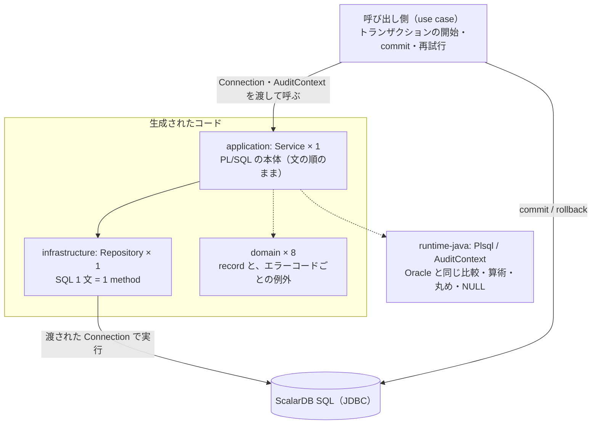
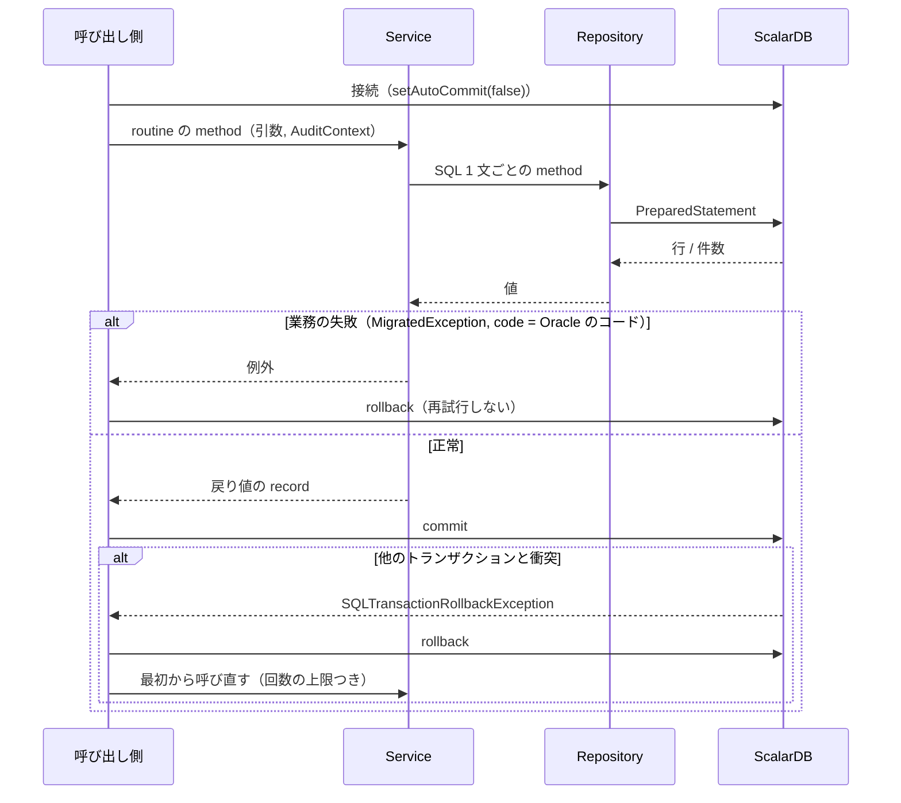

# 変換後のコード

## アーキテクチャ

<!-- facts:begin architecture -->
**事実**（生成物から機械的に出した。手で書き換えない）

全体の形



層

| 層 | ファイル数 | 役割 |
|---|---|---|
| `application` | 1 | routine の本体（Service）と、分割した routine の部品、trigger の照合。トランザクションは開始も commit もしない |
| `infrastructure` | 1 | SQL（Repository）。渡された `Connection` の上で実行する |
| `domain` | 8 | 行と戻り値の record、エラーコードごとの例外 |

Java 以外の生成物

- `decision-items.md`

module と class

| 元の module | Service | Repository | 文書 |
|---|---|---|---|
| `pkg_points`（package） | `PkgPointsService` | `PkgPointsRepository` | [pkg_points.md](pkg_points.md) |

constructor（呼び出し側が渡すもの）

| class | 引数 |
|---|---|
| `PkgPointsService` | `PkgPointsRepository repository` |
| `PkgPointsRepository` | `Connection connection` |

使っている実行時ライブラリ（`runtime-java`）

- `com.scalar.migrate.plsql.Plsql`
- `com.scalar.migrate.runtime.Residual`
<!-- facts:end architecture -->

Service（`PkgPointsService`）→ Repository（`PkgPointsRepository`）→ ScalarDB SQL の JDBC 接続、の一方向に依存する。domain には例外の class だけがある。

- **Service は PL/SQL の本体を、文の順のまま Java に写したもの**である。各文の前に原文の位置（`// pkg_points.pkb:42`）がコメントで残る。
  比較と算術は `Plsql.le` / `Plsql.add` / `Plsql.fitLong` などの実行時ヘルパ（`com.scalar.migrate.plsql.Plsql`）を通る。NULL を含む 3 値の比較と、
  `NUMBER(10)` の桁あふれを Oracle と同じに振る舞わせるためである
- **Repository は SQL 1 文 = 1 method**（`addPointsStmt9` など）。SQL は変換後の ScalarDB SQL で、値はすべて bind で渡す。`use_points` の
  `-p_points` と `v_balance - p_points` は SQL に書けないので、method の中で計算してから bind する（`:expr6`）
- **トランザクションの境界は生成コードの外にある。** どの method も開始・commit・rollback をしない。元の PL/SQL にも COMMIT は無く、境界は呼び出し側にあった
- package の中だけの関数 `rank_of` は、Service の private method `rankOf` になる

## 使い方

<!-- facts:begin usage -->
**事実**（生成物から機械的に出した。手で書き換えない）

入口（public な routine の method）

| 元の routine | Java | 戻り値 | 引数 |
|---|---|---|---|
| `pkg_points.get_balance` | `PkgPointsService.getBalance` | `BigDecimal` | `Long pMemberId` |
| `pkg_points.add_points` | `PkgPointsService.addPoints` | `void` | `Long pMemberId, BigDecimal pPoints, String pReason` |
| `pkg_points.use_points` | `PkgPointsService.usePoints` | `void` | `Long pMemberId, BigDecimal pPoints, String pReason` |

- 採番（`Sequences` に登録が要る sequence）: なし
- `AuditContext`（誰が・いつ）を受け取る Service: なし
- トランザクション: 生成コードは開始も commit もしない。`Connection` は呼び出し側が `setAutoCommit(false)` で渡す

1 回の呼び出し


<!-- facts:end usage -->

呼び出し側が用意するものは 1 つだけである: ScalarDB SQL の JDBC 接続（`jdbc:scalardb:<properties のパス>`）。`setAutoCommit(false)` にする。
この package は採番（sequence）も `USER` / `SYSTIMESTAMP` も使わないので、`Sequences` と `AuditContext` は要らない。

```java
int attempt = 0;
while (true) {
  try (Connection connection = DriverManager.getConnection(url)) {
    connection.setAutoCommit(false);
    var service = new PkgPointsService(new PkgPointsRepository(connection));
    try {
      service.usePoints(memberId, new BigDecimal("300"), "coupon");
      connection.commit();                         // 衝突はここで分かる
      return;
    } catch (MigratedException e) {                // -20102 / -20103: 業務の失敗。再試行しても変わらない
      connection.rollback();
      throw e;
    } catch (NoDataFoundException e) {             // 会員がいない（use_points は -20101 に言い換えない。現行どおり）
      connection.rollback();
      throw e;
    } catch (SQLTransactionRollbackException e) {  // 同じ会員の利用と衝突した
      connection.rollback();
      if (++attempt >= 3) throw e;                 // CALL-5: 最大 3 回
      Thread.sleep(50L << (attempt - 1));          //          50 ms から倍々
    }
  }
}
```

- **衝突の再試行は呼び出し側の仕事である。** やり直すときは `usePoints` を最初から呼び直す（残高と履歴の最終番号を読み直すため）。
  回数と間隔は CALL-5 の決定（最大 3 回、50 ms から倍々。移行責任者、2026-09-20）
- エラーコードは `e.code()` で見る。`PkgPointsError20103Exception` などの class も生成されるが、Service が投げるのは `MigratedException` そのものなので、subclass を `catch` しても掛からない
- 依存: `runtime-java`（`com.scalar.migrate.plsql`）、ScalarDB SQL JDBC

## 制限

<!-- facts:begin limits -->
**事実**（生成物・決定・比較から機械的に出した。手で書き換えない）

- 判定: REDESIGN 1 / REVIEW 3
- 変換できなかった文 0 / ScalarDB が受け付けない SQL 0 / 実行計画に回した文 0

AUTO でない routine

| routine | 判定 | 理由 |
|---|---|---|
| `pkg_points.rank_of` | REVIEW | confidence factor testEvidence is 0 |
| `pkg_points.get_balance` | REVIEW | confidence factor testEvidence is 0 |
| `pkg_points.add_points` | REVIEW | confidence factor testEvidence is 0 |
| `pkg_points.use_points` | REDESIGN | LOCK-001: 行ロックです。ターゲットで同じ保証を別の方法で与える設計が要ります |

- 実 DB で比べていない routine: `pkg_points.rank_of`
- 生成コードの外で決めること（未決）: なし

生成コードが自分で上げる例外（Oracle では DB が上げていたもの）

| コード | class | Oracle |
|---|---|---|
| -6502 | `ValueErrorException` | VALUE_ERROR |
| -1476 | `ZeroDivideException` | ZERO_DIVIDE |
| -1422 | `TooManyRowsException` | TOO_MANY_ROWS |
| 100 | `NoDataFoundException` | NO_DATA_FOUND |
<!-- facts:end limits -->

- **実 DB で確かめたのは 13 シナリオである**（2026-09-20、金額の規約 double）。実 Oracle と実 ScalarDB Cluster で同じシナリオを流し、戻り値・例外のコード・2 表の状態が 13 本とも一致した。受け入れた差は無い。
  観ているのは **1 回の呼び出しの結果**で、同時実行、途中で止まったとき、PL/SQL の外からの書き込みは観ていない
- **`pkg_points.use_points` は REDESIGN（`LOCK-001`）。** 行ロックは無くなり、同時の利用は commit で片方が弾かれる。呼び出し側に再試行が要る（上のコード例）。
  残高がマイナスにならないことは保たれるが、「後から来たほうが待たされる」は「後から commit したほうが弾かれる」に変わる（BIZ-4 で受け入れ済み。移行責任者、2026-09-20）
- **`add_points` にはもともとロックが無い。** 同じ会員への同時の付与は、Oracle では片方が履歴の主キー重複（`DUP_VAL_ON_INDEX`）で失敗していたはずで、
  移行後は commit 時の衝突（`SQLTransactionRollbackException`）になる。どちらも片方だけが成功する。現行の仕様の「確かめたいこと」に残っている問いで、同時実行は比較が観ていない
- **現在日時の出所が変わる。** `SYSDATE` は DB サーバの時計だったが、移行後はアプリの時計（`Plsql.sysdate()`）である。アプリのサーバの時刻とタイムゾーンをそろえること
- 比較の結果を証拠として渡したあとの判定は AUTO 3（`pkg_points.add_points`・`pkg_points.get_balance`・`pkg_points.rank_of`）/ REDESIGN 1。未決の項目は無い。
  証拠は、原文か生成器が変わると「古い」になり、判定は REVIEW に戻る（`difftest/plsql_capture.py --project` から取り直す）
- 例外で抜けたとき、Oracle の文単位のロールバックは無い。呼び出し側が rollback しなければ、途中までの書き込み（履歴の INSERT）が残る

## どのように移行したか

<!-- facts:begin how -->
**事実**（解析・決定から機械的に出した。手で書き換えない）

routine ごとの決定（`limits.yaml`）

| 決定 | 対象 | 値・理由 |
|---|---|---|
| `rowLocks.optimistic` | `pkg_points.use_points` | 残高は同じトランザクションの中で読んだ値から計算して書く。同時の利用は commit で衝突として弾かれるので、 残高はマイナスにならない。呼び出し側は衝突だけを再試行する（-20103 ポイント不足は再試行しても変わらない） |

当たった判定ルール

| ルール | 判定 | routine 数 |
|---|---|---|
| `LOCK-001` | REDESIGN | 1 |

文ごとの診断（書き換えの種類）

| 診断 | 文の数 |
|---|---|
| `ACCESS` | 5 |
| `LOCK` | 1 |
| `OPTIMISTIC` | 1 |
| `ROW_LOCK` | 1 |

何がどう変わったか（全体）

| 区分 | 変わること | 診断 | routine |
|---|---|---|---|
| **意味が変わる** | FOR UPDATE などのロック句を外した | `LOCK` | `pkg_points.use_points` |
| **意味が変わる** | 楽観制御へ移した。同時の書き込みは commit で弾かれ、呼び出し側の再試行が要る | `OPTIMISTIC` | `pkg_points.use_points` |
| **意味が変わる** | 行ロック（待たせる・即座に断る）が無くなる | `ROW_LOCK` | `pkg_points.use_points` |

生成コードの外で決めたこと

| 項目 | 決定 | 決めた人 | 日付 |
|---|---|---|---|
| `CALL-5` | 衝突だけを最大 3 回、50 ms から倍々の指数バックオフで再試行する。-20103（ポイント不足）と -20102 は再試行しない。use_points に採番も外部通知も無く、履歴の番号は読み直されるので、再試行は二重実行にならない | 移行責任者 | 2026-09-20 |
| `BIZ-4` | 受け入れる。同じ会員の同時利用は、待たされる代わりに、後から commit したほうが弾かれて再試行になる。残高がマイナスにならないことは保たれる。現行は NOWAIT を使っておらず、待たずに諦めることに業務上の意味は無い | 移行責任者 | 2026-09-20 |
| `BIZ-5` | 該当しない。pkg_points に MERGE は無く、この項目は OPTIMISTIC の診断（use_points の楽観制御）と一緒に出ただけである。確かめること無し | 移行責任者 | 2026-09-20 |

- 実 DB の比較（double）: シナリオ 13 本。一致 13
<!-- facts:end how -->

1. **解析**: parse 率・型解決率とも 100%（2 ファイル、routine 4、表 2）。
2. **最初の生成で、ツールが 3 文を断った。** `SET rank = rank_of(v_balance)`（SQL の中で package の関数を呼んでいる）と、`use_points` の 2 文（行ロックの決定が無いあいだは、
   式の持ち上げをしない）。あわせて `SYSDATE` を 2 回読む routine が `SEM-007` で REVIEW になった。原文を、ランクと現在日時を先に変数へ入れる形に直した
   （Oracle 上の結果は変わらない）。承認済みの現行の仕様は「古い」になったので、直した所を示して承認を取り直した
3. **決定**: `use_points` の行ロック（`LOCK-001`）を楽観制御 + 呼び出し側の再試行にした（`limits.yaml` の `rowLocks.optimistic`。移行責任者、2026-09-20）。
   採らなかった案は「決めずに残す」で、その場合 `use_points` は実行時に例外を投げるコードのままになる。生成コードの外で決めることは 3 項目出て、
   CALL-5（最大 3 回・指数バックオフ）、BIZ-4（受け入れる）、BIZ-5（該当しない）と決めた
4. **生成**: AUTO 3 / REDESIGN 1（決定済み）。ScalarDB SQL が断る文 0、`--verify-compile` と `--limits-strict` が通った。途中で生成器の不具合を 1 件直した:
   package 内の関数に、宣言と違う数値型の変数を渡すと（`rank_of(v_balance)`、`v_balance` は `Long`）、コンパイルできない Java が出ていた
5. **実 DB での比較**（2026-09-20）: 承認済みの現行の仕様から 13 シナリオを起こした（正常系、ランクの境界 299 / 300 / 1000、残高ちょうど / 残高 + 1、エラーコードごと）。
   Oracle にユーザ `points`、ScalarDB に namespace `points` を作り、13 本とも一致した。途中でハーネスの不具合を 1 件直した: corpus の外のプロジェクトの capture には、
   どの原文・どの生成器で測ったかの指紋が付かず、証拠として数えられなかった（`plsql_capture.py --project` を足した）
