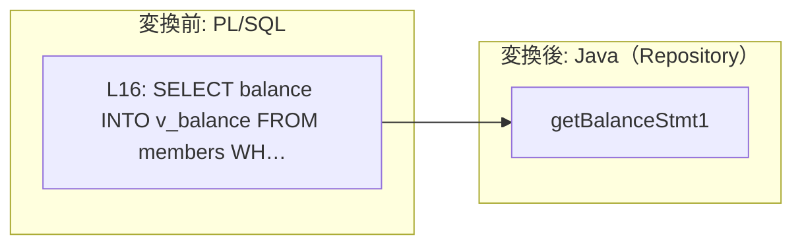
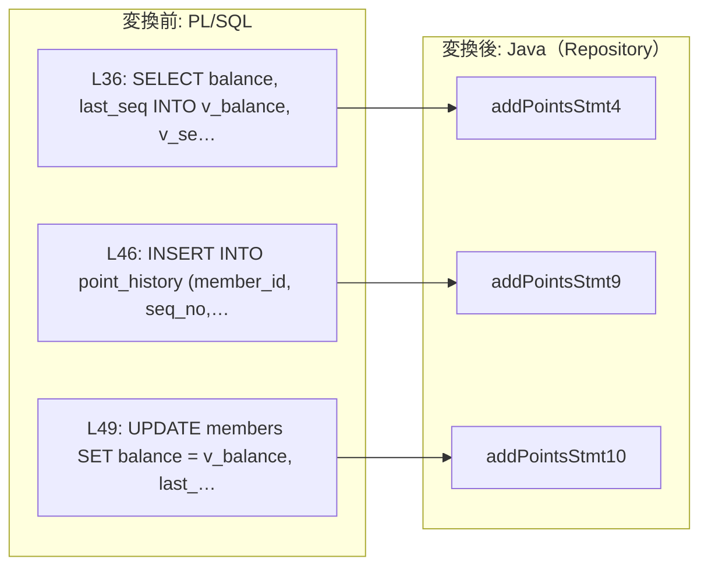
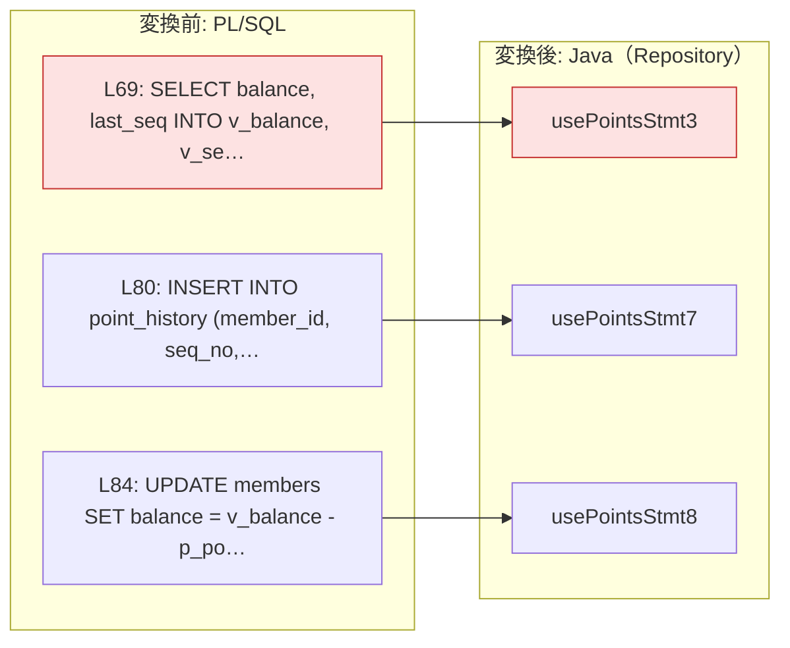

# `pkg_points`（package）の変換

## `pkg_points.rank_of`

<!-- facts:begin pkg_points.rank_of -->
**事実**（生成物・解析・決定・比較から機械的に出した。手で書き換えない。原文: `pkg_points.pkb:3`〜`11`）

- 判定: **REVIEW** — confidence factor testEvidence is 0
- Java: `src/main/java/com/example/migrated/application/PkgPointsService.java` の `String rankOf(BigDecimal pBalance)`（private。外からは呼べない）

**何がどう変わったか**

- 文の書き換えは無い（SQL はそのまま移行先で動く）

引数の対応

| PL/SQL | 方向 | Oracle の型 | Java |
|---|---|---|---|
| `p_balance` | IN | `NUMBER` | 引数 |

- 実 DB の比較: **この routine を通るシナリオは無い**
<!-- facts:end pkg_points.rank_of -->

### 仕様

private method `rankOf(BigDecimal pBalance)`。残高が 1000 以上で `"GOLD"`、300 以上で `"SILVER"`、それ以外（NULL を含む）で `"REGULAR"` を返す。表は読まない。外からは呼べない。現行の仕様は `spec/pkg_points.md` の同名の節にある。

### 移行で変わったこと

なし

### 制限と注意

当たった判定ルールは無い。直接のシナリオは無く、`add_points` の境界のシナリオ（299 / 300 / 1000）を通して確かめた。

## `pkg_points.get_balance`

<!-- facts:begin pkg_points.get_balance -->
**事実**（生成物・解析・決定・比較から機械的に出した。手で書き換えない。原文: `pkg_points.pkb:13`〜`21`）

- 判定: **REVIEW** — confidence factor testEvidence is 0
- Java: `src/main/java/com/example/migrated/application/PkgPointsService.java` の `BigDecimal getBalance(Long pMemberId)`

**何がどう変わったか**

- 文の書き換えは無い（SQL はそのまま移行先で動く）

文の対応（赤 = 意味が変わる、黄 = 形が変わるが結果は同じ、灰 = 未分類、無色 = そのまま）

引数の対応

| PL/SQL | 方向 | Oracle の型 | Java |
|---|---|---|---|
| `p_member_id` | IN | `NUMBER(10)` | 引数 |

例外

| コード | class | Oracle | メッセージ |
|---|---|---|---|
| -20101 | `PkgPointsError20101Exception` | RAISE_APPLICATION_ERROR(-20101) | `'会員が見つかりません'` |
| 100 | `NoDataFoundException` | NO_DATA_FOUND | `SELECT INTO matched no row` |

文の対応（原文の文 → Repository の method → 移行先の SQL）

| 原文 | 文 | Java | 移行先の SQL | 診断 |
|---|---|---|---|---|
| `pkg_points.pkb:16` | SELECT `SELECT balance INTO v_balance FROM members WHERE member_id = p_member…` | `PkgPointsRepository.getBalanceStmt1` | `SELECT balance FROM members WHERE member_id = :p_member_id` | INFO `ACCESS`: SELECT: full primary key specified -> GET (single record) |

実 DB の比較

| 規約 | シナリオ | 結果 | 受け入れた差の理由 |
|---|---|---|---|
| double | `get_balance_no_member` | 一致 | — |
| double | `get_balance_ok` | 一致 | — |
<!-- facts:end pkg_points.get_balance -->

### 仕様

`BigDecimal getBalance(Long pMemberId)`。`members` から会員の残高を読んで返す。会員がいなければ `MigratedException`（コード -20101）。何も書かない。現行の仕様は `spec/pkg_points.md` の同名の節にある。

### 移行で変わったこと

なし。SQL は主キーの 1 行読みで、そのまま ScalarDB SQL になる。

### 制限と注意

当たった判定ルールは無い。2 シナリオ（正常、会員なし）が Oracle と一致した。

## `pkg_points.add_points`

<!-- facts:begin pkg_points.add_points -->
**事実**（生成物・解析・決定・比較から機械的に出した。手で書き換えない。原文: `pkg_points.pkb:23`〜`55`）

- 判定: **REVIEW** — confidence factor testEvidence is 0
- Java: `src/main/java/com/example/migrated/application/PkgPointsService.java` の `void addPoints(Long pMemberId, BigDecimal pPoints, String pReason)`

**何がどう変わったか**

- 文の書き換えは無い（SQL はそのまま移行先で動く）

文の対応（赤 = 意味が変わる、黄 = 形が変わるが結果は同じ、灰 = 未分類、無色 = そのまま）

引数の対応

| PL/SQL | 方向 | Oracle の型 | Java |
|---|---|---|---|
| `p_member_id` | IN | `NUMBER(10)` | 引数 |
| `p_points` | IN | `NUMBER` | 引数 |
| `p_reason` | IN | `VARCHAR2` | 引数 |

例外

| コード | class | Oracle | メッセージ |
|---|---|---|---|
| -20102 | `PkgPointsError20102Exception` | RAISE_APPLICATION_ERROR(-20102) | `'付与するポイントは1以上で指定してください'` |
| -20101 | `PkgPointsError20101Exception` | RAISE_APPLICATION_ERROR(-20101) | `'会員が見つかりません'` |
| 100 | `NoDataFoundException` | NO_DATA_FOUND | `SELECT INTO matched no row` |

文の対応（原文の文 → Repository の method → 移行先の SQL）

| 原文 | 文 | Java | 移行先の SQL | 診断 |
|---|---|---|---|---|
| `pkg_points.pkb:36` | SELECT `SELECT balance, last_seq INTO v_balance, v_seq FROM members WHERE mem…` | `PkgPointsRepository.addPointsStmt4` | `SELECT balance, last_seq FROM members WHERE member_id = :p_member_id` | INFO `ACCESS`: SELECT: full primary key specified -> GET (single record) |
| `pkg_points.pkb:46` | INSERT `INSERT INTO point_history (member_id, seq_no, points, reason, created…` | `PkgPointsRepository.addPointsStmt9` | `INSERT INTO point_history (member_id, seq_no, points, reason, created_at) VALUES (:p_memb…` | — |
| `pkg_points.pkb:49` | UPDATE `UPDATE members SET balance = v_balance, last_seq = v_seq, rank = v_ra…` | `PkgPointsRepository.addPointsStmt10` | `UPDATE members SET balance = :v_balance, last_seq = :v_seq, rank = :v_rank, updated_at = …` | INFO `ACCESS`: UPDATE: full primary key specified -> GET (single record) |

実 DB の比較

| 規約 | シナリオ | 結果 | 受け入れた差の理由 |
|---|---|---|---|
| double | `add_points_just_below_silver` | 一致 | — |
| double | `add_points_no_member` | 一致 | — |
| double | `add_points_ok` | 一致 | — |
| double | `add_points_to_gold` | 一致 | — |
| double | `add_points_to_silver` | 一致 | — |
| double | `add_points_zero` | 一致 | — |
<!-- facts:end pkg_points.add_points -->

### 仕様

`void addPoints(Long pMemberId, BigDecimal pPoints, String pReason)`。`pPoints` が 0 以下なら -20102、会員がいなければ -20101（どちらも `MigratedException`）。通れば `point_history` に 1 行足し、`members` の残高・`last_seq`・`rank`・`updated_at` を書き換える。現行の仕様は `spec/pkg_points.md` の同名の節にある。

### 移行で変わったこと

- 現在日時（`v_now`）は DB サーバの `SYSDATE` ではなく、アプリの時計（`Plsql.sysdate()`）から取る。履歴の `created_at` と会員の `updated_at` が同じ値になることは変わらない
- SQL は 3 文とも、値を bind で渡すだけの形でそのまま移った。ランクは SQL の外（`rankOf`）で求めてから渡す

### 制限と注意

- 当たった判定ルールは無い。6 シナリオ（正常、ランクの境界 3 本、0 ポイント、会員なし）が Oracle と一致した
- もともとロックが無いので、同じ会員への同時の付与は片方が失敗する。Oracle では履歴の主キー重複、移行後は commit 時の衝突になる。呼び出し側が再試行するなら、`addPoints` を最初から呼び直す
- 例外で抜けたら、呼び出し側が rollback する（履歴の INSERT だけが残るのを防ぐ）

## `pkg_points.use_points`

<!-- facts:begin pkg_points.use_points -->
**事実**（生成物・解析・決定・比較から機械的に出した。手で書き換えない。原文: `pkg_points.pkb:57`〜`89`）

- 判定: **REDESIGN** — LOCK-001: 行ロックです。ターゲットで同じ保証を別の方法で与える設計が要ります
- Java: `src/main/java/com/example/migrated/application/PkgPointsService.java` の `void usePoints(Long pMemberId, BigDecimal pPoints, String pReason)`

**何がどう変わったか**

| 原文 | 区分 | 変わること | 診断 |
|---|---|---|---|
| `pkg_points.pkb:69` | **意味が変わる** | 行ロック（待たせる・即座に断る）が無くなる | `ROW_LOCK` |
| `pkg_points.pkb:69` | **意味が変わる** | 楽観制御へ移した。同時の書き込みは commit で弾かれ、呼び出し側の再試行が要る | `OPTIMISTIC` |
| `pkg_points.pkb:69` | **意味が変わる** | FOR UPDATE などのロック句を外した | `LOCK` |

文の対応（赤 = 意味が変わる、黄 = 形が変わるが結果は同じ、灰 = 未分類、無色 = そのまま）

引数の対応

| PL/SQL | 方向 | Oracle の型 | Java |
|---|---|---|---|
| `p_member_id` | IN | `NUMBER(10)` | 引数 |
| `p_points` | IN | `NUMBER` | 引数 |
| `p_reason` | IN | `VARCHAR2` | 引数 |

例外

| コード | class | Oracle | メッセージ |
|---|---|---|---|
| -20103 | `PkgPointsError20103Exception` | RAISE_APPLICATION_ERROR(-20103) | `'ポイントが不足しています'` |
| -20102 | `PkgPointsError20102Exception` | RAISE_APPLICATION_ERROR(-20102) | `'付与するポイントは1以上で指定してください'` |

文の対応（原文の文 → Repository の method → 移行先の SQL）

| 原文 | 文 | Java | 移行先の SQL | 診断 |
|---|---|---|---|---|
| `pkg_points.pkb:69` | SELECT `SELECT balance, last_seq INTO v_balance, v_seq FROM members WHERE mem…` | `PkgPointsRepository.usePointsStmt3` | `SELECT balance, last_seq FROM members WHERE member_id = :p_member_id` | WARN `ROW_LOCK`: FOR UPDATE is row locking; the target has to provide the same guarantee another way WARN `OPTIMISTIC`: 行ロックを落として楽観制御へ移すと決めてある（残高は同じトランザクションの中で読んだ値から計算して書く。同時の利用は commit で衝突として弾かれるので、 残高はマイナスにならない。呼び出し側は衝突だけを再試行する… WARN `LOCK`: FOR UPDATE / locking clause dropped (ScalarDB transactions handle isolation) INFO `ACCESS`: SELECT: full primary key specified -> GET (single record) |
| `pkg_points.pkb:80` | INSERT `INSERT INTO point_history (member_id, seq_no, points, reason, created…` | `PkgPointsRepository.usePointsStmt7` | `INSERT INTO point_history (member_id, seq_no, points, reason, created_at) VALUES (:p_memb…` | — |
| `pkg_points.pkb:84` | UPDATE `UPDATE members SET balance = v_balance - p_points, last_seq = v_seq, …` | `PkgPointsRepository.usePointsStmt8` | `UPDATE members SET balance = :expr6, last_seq = :v_seq, updated_at = :v_now WHERE member_…` | INFO `ACCESS`: UPDATE: full primary key specified -> GET (single record) |

当たった判定ルール

| ルール | 判定 | 意味 |
|---|---|---|
| `LOCK-001` | REDESIGN | 行ロックです。ターゲットで同じ保証を別の方法で与える設計が要ります |

この routine の決定（`limits.yaml`）

| 決定 | 値・理由 |
|---|---|
| `rowLocks.optimistic` | 残高は同じトランザクションの中で読んだ値から計算して書く。同時の利用は commit で衝突として弾かれるので、 残高はマイナスにならない。呼び出し側は衝突だけを再試行する（-20103 ポイント不足は再試行しても変わらない） |

実 DB の比較

| 規約 | シナリオ | 結果 | 受け入れた差の理由 |
|---|---|---|---|
| double | `use_points_exact_balance` | 一致 | — |
| double | `use_points_negative` | 一致 | — |
| double | `use_points_no_member` | 一致 | — |
| double | `use_points_ok` | 一致 | — |
| double | `use_points_short` | 一致 | — |
<!-- facts:end pkg_points.use_points -->

### 仕様

`void usePoints(Long pMemberId, BigDecimal pPoints, String pReason)`。`pPoints` が 0 以下なら -20102、残高 < `pPoints` なら -20103（どちらも `MigratedException`）。**会員がいないときは `NoDataFoundException` がそのまま出る**（現行が -20101 に言い換えていないので、そのまま保った）。通れば `point_history` に負のポイントで 1 行足し、`members` の残高・`last_seq`・`updated_at` を書き換える。`rank` は書かない。現行の仕様は `spec/pkg_points.md` の同名の節にある。

### 移行で変わったこと

- **行ロックが無くなった**（`ROW_LOCK` / `LOCK` / `OPTIMISTIC`）。現行: 同じ会員の利用が重なると、後から来たほうは待たされ、順に処理される（`spec/pkg_points.md` の `use_points` 動作 3）→ 移行後: どちらも待たずに進み、後から commit したほうが衝突（`SQLTransactionRollbackException`）として弾かれる。残高と履歴の番号は同じトランザクションの中で読んだ値から作るので、残高はマイナスにならず、番号も重ならない
- `-p_points` と `v_balance - p_points` は SQL に書けないので、Repository の method の中で計算してから bind する。結果は同じ
- 現在日時はアプリの時計（`Plsql.sysdate()`）から取る

### 制限と注意

- `LOCK-001`（REDESIGN）: `rowLocks.optimistic` の決定により、呼び出し側は衝突だけを再試行する（CALL-5: 最大 3 回、50 ms から倍々）。-20103 と -20102 は再試行しても変わらないので、再試行しない
- 行ロックの待ちが無くなるので、「待ちに上限が無い」という現行の問題（現行の仕様の「確かめたいこと」）は無くなる。代わりに、混んでいると再試行が尽きて失敗しうる
- 5 シナリオ（正常、残高ちょうど、残高 + 1、負の数、会員なし）が Oracle と一致した。同時実行の振る舞いは、比較（1 回の呼び出しの結果を比べる）が観ていない
