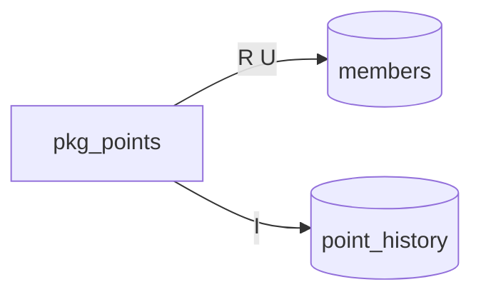
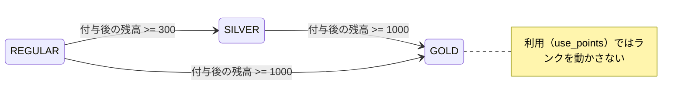

# PL/SQL の仕様

<!-- facts:begin index -->
**事実**（IR から機械的に出した。手で書き換えない）

module

| module | 種類 | routine 数 | 仕様 |
|---|---|---|---|
| `pkg_points` | package | 4 | [pkg_points.md](pkg_points.md) |

module と表（実線 = 書く、点線 = 読むだけ。R = 読む / I・U・D・M = 書く）

表と routine（R = 読む / I・U・D・M = 書く）

| 表 | routine |
|---|---|
| `members` | `pkg_points.get_balance` R、`pkg_points.add_points` R U、`pkg_points.use_points` R U |
| `point_history` | `pkg_points.add_points` I、`pkg_points.use_points` I |

エラーコード

| コード | routine | 位置 | メッセージ（式） |
|---|---|---|---|
| -20101 | `pkg_points.add_points` | `pkg_points.pkb:39` | `'会員が見つかりません'` |
| -20101 | `pkg_points.get_balance` | `pkg_points.pkb:20` | `'会員が見つかりません'` |
| -20102 | `pkg_points.add_points` | `pkg_points.pkb:32` | `'付与するポイントは1以上で指定してください'` |
| -20102 | `pkg_points.use_points` | `pkg_points.pkb:65` | `'使うポイントは1以上で指定してください'` |
| -20103 | `pkg_points.use_points` | `pkg_points.pkb:75` | `'ポイントが不足しています'` |
<!-- facts:end index -->

## 全体の概要

ポイントカードの会員（`members`）の残高と、その増減の履歴（`point_history`）を受け持つ package が 1 つある。
付与（`add_points`）と利用（`use_points`）はどちらも、履歴を 1 行足してから会員の残高・履歴の最終番号（`last_seq`）・更新日時を書き換える。
付与のときだけ、残高に応じて会員のランク（`rank`）を付け直す。残高の照会（`get_balance`）は読むだけである。

COMMIT / ROLLBACK はどの routine にも無い。トランザクションの境界は呼び出し側にある。
