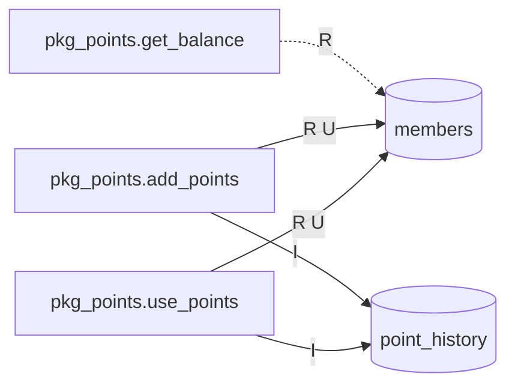
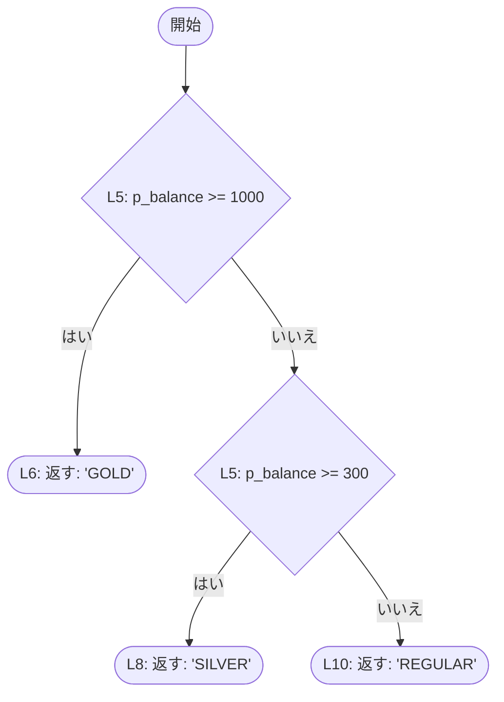
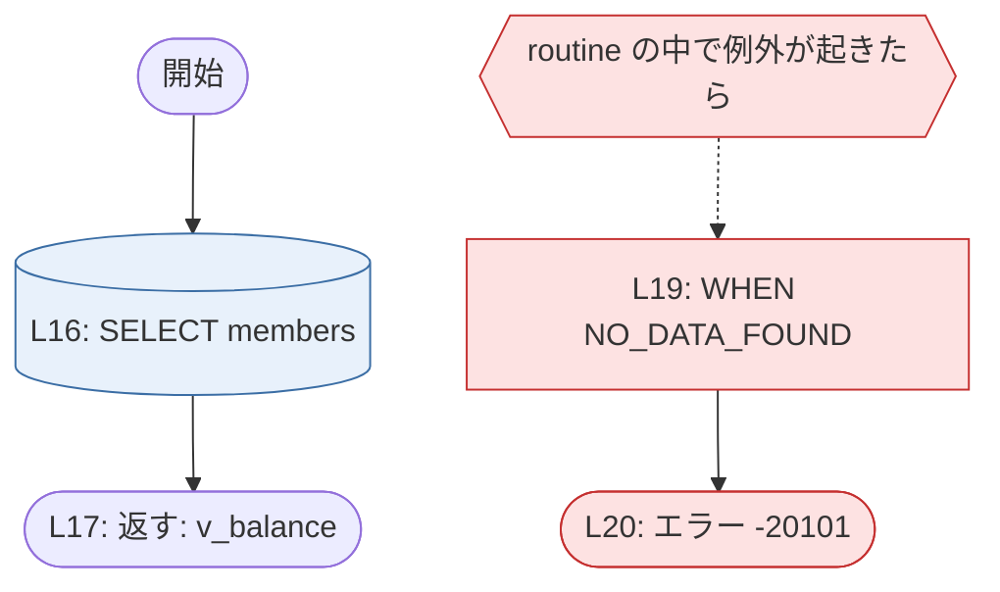
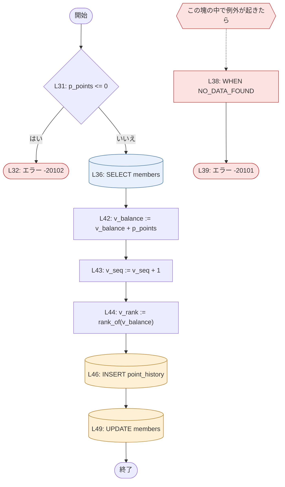
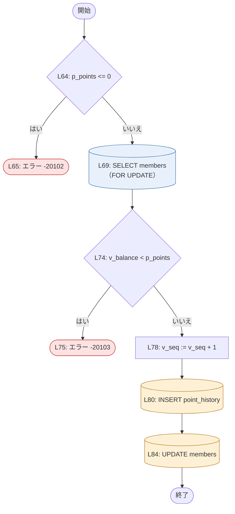

# `pkg_points`（package）

<!-- facts:begin module:pkg_points -->
**事実**（IR から機械的に出した。手で書き換えない）

- 種類: package / 原文: `pkg_points.pkb`

routine と表（実線 = 書く、点線 = 読むだけ。R = 読む / I・U・D・M = 書く）

routine: `pkg_points.rank_of`、`pkg_points.get_balance`、`pkg_points.add_points`、`pkg_points.use_points`
<!-- facts:end module:pkg_points -->

## 概要

会員のポイント残高の照会・付与・利用を受け持つ。残高そのものは `members.balance` に持ち、増減の 1 件ずつを `point_history` に
会員ごとの連番（`seq_no`）で残す。連番は sequence ではなく、会員の行に持つ最終番号（`members.last_seq`）から 1 ずつ進める。
package の変数は無いので、呼び出しの結果は表の状態と引数だけで決まる。

## `pkg_points.rank_of`

<!-- facts:begin pkg_points.rank_of -->
**事実**（IR から機械的に出した。手で書き換えない。原文: `pkg_points.pkb:3`〜`11`）

- 種類: function（private） / 戻り値: `VARCHAR2`

処理の流れ（`L` は原文の行。青 = 読む、橙 = 書く、赤 = エラー、紫 = トランザクション制御）

引数

| 名前 | 方向 | 型 | 既定値 |
|---|---|---|---|
| `p_balance` | IN | `NUMBER` | — |
<!-- facts:end pkg_points.rank_of -->

### 動作

1. 残高（`p_balance`）が 1000 以上なら `'GOLD'` を返す（`pkg_points.pkb:5-6`）。
2. そうでなく 300 以上なら `'SILVER'` を返す（`pkg_points.pkb:7-8`）。
3. どちらでもなければ `'REGULAR'` を返す（`pkg_points.pkb:10`）。表は読まず、書かない。package の外からは呼べない（仕様部に無い）。

### 業務ルール

- ランクのしきい値: 残高 >= 1000 で `'GOLD'`、300 <= 残高 < 1000 で `'SILVER'`、残高 < 300 で `'REGULAR'`。ちょうど 1000 は GOLD、ちょうど 300 は SILVER（`pkg_points.pkb:5-8`）。
- 残高が NULL のときは、どの比較も成り立たないので `'REGULAR'` になる（`pkg_points.pkb:10`）。

### エラーと例外

上げるエラーは無い。例外ハンドラも無い。

### 確かめたいこと

なし

## `pkg_points.get_balance`

<!-- facts:begin pkg_points.get_balance -->
**事実**（IR から機械的に出した。手で書き換えない。原文: `pkg_points.pkb:13`〜`21`）

- 種類: function（public） / 戻り値: `NUMBER`

処理の流れ（`L` は原文の行。青 = 読む、橙 = 書く、赤 = エラー、紫 = トランザクション制御）

引数

| 名前 | 方向 | 型 | 既定値 |
|---|---|---|---|
| `p_member_id` | IN | `members.member_id%TYPE（= NUMBER(10)）` | — |

表（R = 読む / I・U・D・M = 書く）

| 表 | 操作 |
|---|---|
| `members` | R |

SQL

| 位置 | 種類 | 読む | 書く | 条件 | 文 |
|---|---|---|---|---|---|
| `pkg_points.pkb:16` | SELECT | members | — | — | `SELECT balance INTO v_balance FROM members WHERE member_id = p_member_id` |

上げるエラー

| 位置 | コード・例外 | メッセージ（式） | 条件 |
|---|---|---|---|
| `pkg_points.pkb:20` | -20101 | `'会員が見つかりません'` | WHEN NO_DATA_FOUND |

例外ハンドラ

| 位置 | 受ける例外 | 場所 |
|---|---|---|
| `pkg_points.pkb:19` | NO_DATA_FOUND | routine の末尾 |
<!-- facts:end pkg_points.get_balance -->

### 動作

1. `members` から、会員番号（`member_id` = `p_member_id`）の残高（`balance`）を 1 行読む。ロックはしない（`pkg_points.pkb:16`）。
2. 読んだ残高を返す（`pkg_points.pkb:17`）。
3. 会員がいなければ（`NO_DATA_FOUND`）、-20101 に言い換えて上げる（`pkg_points.pkb:19-20`）。

### 業務ルール

- 残高は `members.balance` の値そのままを返す。計算も丸めもしない（`pkg_points.pkb:16-17`）。

### エラーと例外

| コード | いつ | そのときの書き込み |
|---|---|---|
| -20101 | 会員番号の行が `members` に無い（`NO_DATA_FOUND` を言い換える。`pkg_points.pkb:19-20`） | 何も書いていない |

この routine は何も書かず、ROLLBACK もしない。`WHEN OTHERS` は無いので、ハンドラが受けない例外はそのまま呼び出し側に出る。

### 確かめたいこと

なし

## `pkg_points.add_points`

<!-- facts:begin pkg_points.add_points -->
**事実**（IR から機械的に出した。手で書き換えない。原文: `pkg_points.pkb:23`〜`55`）

- 種類: procedure（public）

処理の流れ（`L` は原文の行。青 = 読む、橙 = 書く、赤 = エラー、紫 = トランザクション制御）

引数

| 名前 | 方向 | 型 | 既定値 |
|---|---|---|---|
| `p_member_id` | IN | `members.member_id%TYPE（= NUMBER(10)）` | — |
| `p_points` | IN | `NUMBER` | — |
| `p_reason` | IN | `VARCHAR2` | — |

表（R = 読む / I・U・D・M = 書く）

| 表 | 操作 |
|---|---|
| `members` | R U |
| `point_history` | I |

SQL

| 位置 | 種類 | 読む | 書く | 条件 | 文 |
|---|---|---|---|---|---|
| `pkg_points.pkb:36` | SELECT | members | — | — | `SELECT balance, last_seq INTO v_balance, v_seq FROM members WHERE member_id = p_member_id` |
| `pkg_points.pkb:46` | INSERT | — | point_history | — | `INSERT INTO point_history (member_id, seq_no, points, reason, created_at) VALUES (p_member_id, v_seq, p_point…` |
| `pkg_points.pkb:49` | UPDATE | — | members | — | `UPDATE members SET balance = v_balance, last_seq = v_seq, rank = v_rank, updated_at = v_now WHERE member_id =…` |

上げるエラー

| 位置 | コード・例外 | メッセージ（式） | 条件 |
|---|---|---|---|
| `pkg_points.pkb:32` | -20102 | `'付与するポイントは1以上で指定してください'` | IF p_points <= 0 |
| `pkg_points.pkb:39` | -20101 | `'会員が見つかりません'` | WHEN NO_DATA_FOUND |

例外ハンドラ

| 位置 | 受ける例外 | 場所 |
|---|---|---|
| `pkg_points.pkb:38` | NO_DATA_FOUND | routine の末尾 |
<!-- facts:end pkg_points.add_points -->

### 動作

1. 現在日時（`SYSDATE`）を 1 度だけ読んで控える。以降の書き込みはすべてこの値を使う（`pkg_points.pkb:29`）。
2. 付与するポイント（`p_points`）が 0 以下なら、-20102 を上げて終わる（`pkg_points.pkb:31-33`）。
3. `members` から会員の残高（`balance`）と履歴の最終番号（`last_seq`）を 1 行読む。**ロックはしない**（`pkg_points.pkb:36`）。会員がいなければ -20101 を上げて終わる（`pkg_points.pkb:38-39`）。
4. 新しい残高を 残高 + 付与ポイント、新しい番号を 最終番号 + 1、新しいランクを新しい残高から `rank_of` で求める（`pkg_points.pkb:42-44`）。
5. `point_history` に 1 行足す: 会員番号、新しい番号、付与ポイント（正の数）、理由（`p_reason`。NULL でもよい）、控えた日時（`pkg_points.pkb:46-47`）。
6. `members` の会員の行を書き換える: 残高 = 新しい残高、`last_seq` = 新しい番号、`rank` = 新しいランク、`updated_at` = 控えた日時（`pkg_points.pkb:49-54`）。

### 業務ルール

- 付与ポイントは 1 以上。0 と負の数は断る（`pkg_points.pkb:31`）。小数を断る検査は無い（`p_points` は NUMBER）。
- 付与のたびに、付与後の残高でランクを付け直す（`rank_of`。`pkg_points.pkb:44`）。付与で残高が減ることは無いので、ランクは上がるか、そのままである。
- 履歴の番号は会員ごとに 1 から続く連番で、`members.last_seq` と `point_history.seq_no` の最大が一致する（`pkg_points.pkb:43-51`）。
- 履歴の `created_at` と会員の `updated_at` は同じ日時になる（1 度だけ読んだ値を両方に書く。`pkg_points.pkb:29`）。

### エラーと例外

| コード | いつ | そのときの書き込み |
|---|---|---|
| -20102 | `p_points` <= 0（`pkg_points.pkb:31-32`） | 何も書いていない |
| -20101 | 会員番号の行が `members` に無い（内側のブロックが `NO_DATA_FOUND` を言い換える。`pkg_points.pkb:37-39`） | 何も書いていない |

この routine は ROLLBACK も SAVEPOINT もしない。`point_history` への INSERT のあとで `members` の UPDATE が失敗すると、INSERT の始末は呼び出し側にある。
`WHEN OTHERS` は無い。ハンドラが受けない例外（たとえば、同じ番号の履歴が既にあるときの `DUP_VAL_ON_INDEX`）は、そのまま呼び出し側に出る。

### 確かめたいこと

- 同じ会員への付与が同時に 2 つ走ると、どちらも同じ残高と最終番号を読む（ロックしていない。`pkg_points.pkb:36`）。片方は履歴の主キーの重複で失敗するはずだが、それは意図した動きか。`use_points` は同じ行をロックしている（その節の動作 3）のに、こちらはしていない。**答える人: 業務担当と、この package の保守担当**
- 付与ポイントの上限は無い。`balance` は NUMBER(10) なので、桁を超えると Oracle のエラーがそのまま出る。上限は呼び出し側で見ているか。**答える人: 呼び出し側の開発者**
## `pkg_points.use_points`

<!-- facts:begin pkg_points.use_points -->
**事実**（IR から機械的に出した。手で書き換えない。原文: `pkg_points.pkb:57`〜`89`）

- 種類: procedure（public）

処理の流れ（`L` は原文の行。青 = 読む、橙 = 書く、赤 = エラー、紫 = トランザクション制御）

引数

| 名前 | 方向 | 型 | 既定値 |
|---|---|---|---|
| `p_member_id` | IN | `members.member_id%TYPE（= NUMBER(10)）` | — |
| `p_points` | IN | `NUMBER` | — |
| `p_reason` | IN | `VARCHAR2` | — |

表（R = 読む / I・U・D・M = 書く）

| 表 | 操作 |
|---|---|
| `members` | R U |
| `point_history` | I |

SQL

| 位置 | 種類 | 読む | 書く | 条件 | 文 |
|---|---|---|---|---|---|
| `pkg_points.pkb:69` | SELECT（FOR UPDATE） | members | — | — | `SELECT balance, last_seq INTO v_balance, v_seq FROM members WHERE member_id = p_member_id FOR UPDATE` |
| `pkg_points.pkb:80` | INSERT | — | point_history | — | `INSERT INTO point_history (member_id, seq_no, points, reason, created_at) VALUES (p_member_id, v_seq, -p_poin…` |
| `pkg_points.pkb:84` | UPDATE | — | members | — | `UPDATE members SET balance = v_balance - p_points, last_seq = v_seq, updated_at = v_now WHERE member_id = p_m…` |

上げるエラー

| 位置 | コード・例外 | メッセージ（式） | 条件 |
|---|---|---|---|
| `pkg_points.pkb:65` | -20102 | `'使うポイントは1以上で指定してください'` | IF p_points <= 0 |
| `pkg_points.pkb:75` | -20103 | `'ポイントが不足しています'` | IF v_balance < p_points |
<!-- facts:end pkg_points.use_points -->

### 動作

1. 現在日時（`SYSDATE`）を 1 度だけ読んで控える（`pkg_points.pkb:62`）。
2. 使うポイント（`p_points`）が 0 以下なら、-20102 を上げて終わる（`pkg_points.pkb:64-66`）。
3. `members` から会員の残高（`balance`）と履歴の最終番号（`last_seq`）を 1 行読み、**その行をロックする**（`FOR UPDATE`。`NOWAIT` も `WAIT` も無いので、ほかのトランザクションがロックしていれば無期限に待つ。`pkg_points.pkb:69-72`）。コメントには「同時に使われても残高がマイナスにならないよう、会員の行をロックする」とある（`pkg_points.pkb:68`）。
4. 残高 < 使うポイントなら、-20103 を上げて終わる。等しいときは通る（残高が 0 になる。`pkg_points.pkb:74-76`）。
5. 新しい番号を 最終番号 + 1 で求める（`pkg_points.pkb:78`）。
6. `point_history` に 1 行足す: 会員番号、新しい番号、**使うポイントの符号を反転した値**（負の数）、理由（`p_reason`）、控えた日時（`pkg_points.pkb:80-81`）。
7. `members` の会員の行を書き換える: 残高 = 残高 − 使うポイント、`last_seq` = 新しい番号、`updated_at` = 控えた日時。**`rank` は書かない**（`pkg_points.pkb:84-88`）。

### 業務ルール

- 使うポイントは 1 以上。0 と負の数は断る（`pkg_points.pkb:64`）。
- 残高を超えては使えない。残高ちょうどまでは使える（`pkg_points.pkb:74`）。
- 履歴には、利用を負のポイントとして残す（`pkg_points.pkb:81`）。
- 利用ではランクを下げない。コメントに「使ってもランクは下げない（業務ルール）」とあり、UPDATE は `rank` に触れない（`pkg_points.pkb:83-88`）。

### エラーと例外

| コード | いつ | そのときの書き込み |
|---|---|---|
| -20102 | `p_points` <= 0（`pkg_points.pkb:64-65`） | 何も書いていない |
| -20103 | 残高 < `p_points`（`pkg_points.pkb:74-75`） | 何も書いていない。会員の行のロックは、呼び出し側が COMMIT / ROLLBACK するまで残る |

**会員がいないときの言い換えは無い。** `get_balance` と `add_points` は `NO_DATA_FOUND` を -20101 に変えるが、この routine にはハンドラが無いので、
`NO_DATA_FOUND`（ORA-01403）がそのまま呼び出し側に出る（`pkg_points.pkb:69-72`）。ROLLBACK も SAVEPOINT も `WHEN OTHERS` も無い。

### 確かめたいこと

- 会員がいないとき、ほかの 2 つは -20101 を返すのに、この routine は `NO_DATA_FOUND` をそのまま出す（`pkg_points.pkb:69-72`）。意図した違いか、書き漏れか。移行ではいまの動き（そのまま出す）を保つ。**答える人: この package の保守担当**
- 行ロックの待ちに上限が無い（`pkg_points.pkb:72`）。呼び出し側に、待ちを打ち切る仕組みはあるか。**答える人: 呼び出し側の開発者**
