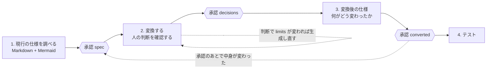

# migrate-flow — 仕様の調査からテストまで、承認をはさんで進める



## Important

- **作業ディレクトリは sql-migration リポジトリのルート**。1 つの移行につき作業ディレクトリ `<out>`
  （既定 `out/migrate/<名前>/`）を 1 つ持ち、状態は `<out>/flow.yaml` にある
- **Claude Code 以外（Codex など）で動かすとき**: `allowed-tools` と `when_to_use`（sql-transpile では `model` / `effort` も）は Claude Code 用で、ほかでは無視される。Read / Grep / Bash などの道具の名前は、その環境の同じ働きの道具に読み替える。AskUserQuestion が無ければ、同じ内容（推奨を先頭に、選択肢ごとの影響つき）を本文で聞き、答えを待つ
- **順番を飛ばさない。** 現行の仕様が承認される前に変換の判断を問わない（何が正しい動作かが決まっていない）。
  3 つの承認がそろう前にテストしない（`flow.py gate` が 0 を返してから）。利用者が「先にテストして」と
  言ったら、「判断を求めるときの形」で、飛ばすと何が起きるかを示して確かめる
- **承認するのは利用者であって、あなたではない。** `flow.py approve` を打つのは、利用者がその段階の成果物を
  見て「承認する」と言ってからである。`--by` には承認した人の役割を書く。分からなければ聞く。
  「よさそう」「次へ」は承認である。「あとで見る」は承認ではない
- **承認は中身に付く。** 承認のあとで原文・仕様書・決定・文書を書き換えると、その承認は「古い」になる。直したら、
  何を変えたかを利用者に示して、承認を取り直す。黙って取り直さない
- **各段階の中身は、その段階のスキルの手順に従う。** このスキルに書いてあるのは、つなぎ方と、置き場所と、
  承認の取り方だけである。段階に入るときに、そのスキルの SKILL.md を読む（Skill ツールで呼んでもよい）
- **途中から再開できる。** 会話が変わっても、`flow.py status` が段階ごとの状態と次にすることを返す。
  依頼を受けたら、まず `<out>/flow.yaml` があるかを見る

  | 資料 | 読むとき |
  |---|---|
  | `skills/plsql-spec/SKILL.md` | 段階 1（PL/SQL） |
  | `skills/plsql-migrate/SKILL.md` | 段階 2・3（PL/SQL） |
  | `skills/sql-transpile/SKILL.md` と `references/sql.md` | SQL 文だけの移行（段階 1〜3 の書き方が PL/SQL と違う） |
  | `references/approval.md` | 承認を求めるとき。**求める前に必ず読む**（何を見せ、どう聞くか） |

## 判断を求めるときの形

承認も、変換の途中の判断も、選択肢だけを並べて選ばせない。**何を決めるか / 推奨 / 理由 / 選択肢ごとの影響 /
決めないとどうなるか / 誰が答える問いか**を本文で示してから聞く（plsql-migrate の同名の節と同じ決まり）。
AskUserQuestion を使うときは、推奨を先頭に置いて「（推奨）」を付け、各選択肢の `description` に影響を書く。

## 置き場所

| 場所 | 中身 | 作る段階 |
|---|---|---|
| `<out>/flow.yaml` | 入力、承認（承認した人・日付・指紋・対象）、テストの結果 | 0 |
| `<out>/spec-analysis/`、`<out>/spec/` | 現行の解析と、現行の仕様（Markdown + Mermaid） | 1 |
| `<out>/generated/`（SQL は `<out>/converted/`） | 変換の結果。`generated/analysis/` に、決定を適用した解析 | 2 |
| `<out>/docs/` | 変換後の仕様と、何がどう変わったか | 3 |

`limits.yaml` と記録（`decisions-outside-generator.yaml`）は、PL/SQL の原文のそば（`<src>/../`）に置く。
作業ディレクトリは消してよいものだが、決定は消してはならないからである。

## Workflow

### Step 0: 始める（または再開する）

```bash
.venv/bin/python skills/migrate-flow/scripts/flow.py status --out <out>
```

`flow.yaml が無い` と出たら、入力を確かめて始める。PL/SQL か SQL かは拡張子と中身で決める
（`CREATE … PROCEDURE / FUNCTION / PACKAGE / TRIGGER` があれば PL/SQL）。会話に貼られたものは
`fixtures/plsql-external/<名前>/src/` に置く。

```bash
.venv/bin/python skills/migrate-flow/scripts/flow.py init --out <out> --kind plsql --src <src> --scalardb-schema <scalardb-schema.json> --limits <limits.yaml> --record <record.yaml>
```

まだ無いファイル（`limits.yaml`、記録）も、作る予定の場所を渡しておく。SQL は
`--kind sql --src <入力.sql> --source-dialect oracle --target-dialect scalardb`。

`status` の標準エラーの最終行 `STAGE=` が、いまの段階である。その Step から続ける。

### Step 1: 現行の仕様を調べる → 承認 `spec`

plsql-spec の手順（Step 1〜4）に従う。置き場所だけが違う:

```bash
.venv/bin/python -m plsql.cli <src> --out-dir <out>/spec-analysis --quiet
.venv/bin/python skills/plsql-spec/scripts/spec_facts.py facts --analysis <out>/spec-analysis --out-dir <out>/spec
.venv/bin/python skills/plsql-spec/scripts/spec_facts.py check --analysis <out>/spec-analysis --out-dir <out>/spec
```

図は事実の欄に入っている（routine ごとの処理の流れ、routine と表、呼び出しと trigger）。文章の側にも、
状態の遷移や、複数の routine にまたがる業務の流れのように**図のほうが伝わるもの**は Mermaid で描く
（`skills/plsql-spec/references/writing.md` の「図」）。描いた図は `mmdc` で確かめる（Step 5 の表）。

`check` が 0 になったら、`references/approval.md` の形で承認を求める。見せるのは: 全体の概要、図の場所、
**「確かめたいこと」の一覧**（ここが承認の中心である——答えが返ってくれば仕様書に反映してから承認に出す）。

```bash
.venv/bin/python skills/migrate-flow/scripts/flow.py approve spec --out <out> --by <役割> --date <YYYY-MM-DD>
```

### Step 2: 変換し、人の判断を確認する → 承認 `decisions`

plsql-migrate の Step 1〜6 に従う。出力先は `<out>/generated`:

```bash
.venv/bin/python -m plsql.generate <src> --scalardb-schema <scalardb-schema.json> --limits <limits.yaml> --out-dir <out>/generated --verify-compile --limits-strict
.venv/bin/python -m plsql.cli <src> --scalardb-schema <scalardb-schema.json> --limits <limits.yaml> --out-dir <out>/generated/analysis --quiet
.venv/bin/python skills/plsql-migrate/scripts/decision_items.py scan --generated <out>/generated --limits <limits.yaml> --scalardb-schema <scalardb-schema.json> --record <record.yaml> --write --out <out>/generated/decision-items.md
```

2 行目（決定を適用した解析）は、**REDESIGN の routine が決まったかどうか**を `flow.py` が読むために要る。判定は決定の
あとも REDESIGN のままで、`limits.yaml` に答えの無いルールが残っているかは、この解析の `decisions.json` にしか無い。
`limits.yaml` を変えたら、生成と一緒にこれも回し直す（古いと「決めたかどうかが分からない」と出る）。

判断を問うときは、**承認済みの現行の仕様を根拠に使う**: 「現行は在庫の行をロックして待たせています
（`spec/create_order.md` の動作 2）。移行先では…」。判断で `limits.yaml` が変わったら生成し直す。

判断が出そろったら、決まったこと（誰が・いつ・何を）と、**決まっていないこと**（未決の項目、REVIEW のままの
routine、`limits.yaml` に答えの無い REDESIGN）を並べて、承認を求める。未決を残したまま進めるかどうかは利用者が決める。残すなら理由を控える:

```bash
.venv/bin/python skills/migrate-flow/scripts/flow.py approve decisions --out <out> --by <役割> --date <YYYY-MM-DD> --with-open "<残したまま進める理由>"
```

未決が無ければ `--with-open` は付けない（付けずに未決があると、承認は断られる）。

### Step 3: 変換後の仕様と、何がどう変わったか → 承認 `converted`

plsql-migrate の Step 7 に従う。出力先は `<out>/docs`。解析（`<out>/generated/analysis`）は Step 2 で作ったものを使う:

```bash
.venv/bin/python skills/plsql-migrate/scripts/migration_doc.py facts --src <src> --generated <out>/generated --analysis <out>/generated/analysis --limits <limits.yaml> --record <record.yaml> --out-dir <out>/docs
.venv/bin/python skills/plsql-migrate/scripts/migration_doc.py check --src <src> --generated <out>/generated --analysis <out>/generated/analysis --limits <limits.yaml> --record <record.yaml> --out-dir <out>/docs
```

この時点ではまだテストしていないので `--evidence` は渡さない。文書の「制限」には「Oracle と同じ結果を返すかは、
まだ確かめていない」と書くことになる（`check` が見る）。routine ごとの「何がどう変わったか」の表と、変換前後の
文の対応の図は事実の欄に出る。「移行で変わったこと」の文章では、**現行の仕様のどの記述が、どう変わるか**を
対にして書く（「現行: 同じ商品への受注は待たされる（`spec/create_order.md` 動作 2）→ 移行後: 待たずに進み、
commit で片方が弾かれる」）。

承認を求めるときに見せるのは: 「意味が変わる」に分類された変化の一覧（`docs/README.md` の
「何がどう変わったか（全体）」）、呼び出し側に増える仕事、制限。

```bash
.venv/bin/python skills/migrate-flow/scripts/flow.py approve converted --out <out> --by <役割> --date <YYYY-MM-DD>
```

### Step 4: テストする

```bash
.venv/bin/python skills/migrate-flow/scripts/flow.py gate --out <out>
```

標準エラーの最終行が `GATE=open`（終了コード 0）なら進む。`closed` なら、出た段階へ戻る。

テストは 2 つある。**コンテナ（Oracle と ScalarDB Cluster）が要り、DB に書き込む**ので、始める前に利用者に
確かめる（何を配備し、どの namespace / ユーザーに書くか）。手順は `skills/plsql-migrate/references/operations.md`
と `fixtures/plsql-external/README.md` にある。

1. **コンパイル**: Step 2 の `--verify-compile` が通っていること
2. **実 DB での比較**: シナリオ（`<src>/../scenarios/*.yaml`）を Oracle と ScalarDB の両側で流して比べる。
   シナリオが無ければ、**承認済みの現行の仕様から起こす**——「業務ルール」と「エラーと例外」の 1 行が
   1 シナリオになる（境界の両側、エラーコードごとに 1 本）。起こしたシナリオは利用者に見せてから流す

結果を読む: 一致 / 受け入れた差 / **差**。差が出たら、生成物の誤りか、移行で意味が変わる既知の差かを分ける。
既知の差を受け入れるかどうかは利用者が決める（「判断を求めるときの形」で問う。比較のほうを緩めない）。

```bash
.venv/bin/python skills/migrate-flow/scripts/flow.py tested --out <out> --result pass --report <plsql-diff.json>
```

`tested` は `--report` のファイルを `flow.yaml` の `inputs.evidence` に控える（`converted` の検査が、文書と同じ比較を
見るようになる）。テストのあと、比較の結果を文書に入れる: Step 3 の `facts` と `check` に**同じファイルを**
`--evidence <plsql-diff.json>` で足して回し直し、「制限」と「どのように移行したか」を実際の結果に書き直す。
**文書が変わるので `converted` の承認は古くなる**。変えたところ（比較の結果が入った）を示して、承認を取り直す。
`converted` だけを取り直すかぎり、テストの結果は残る（`spec` か `decisions` を取り直すと、テストは消える——
確かめた相手が変わったからである。テストからやり直す）。

### Step 5: 報告する

1. `flow.py status` の表（段階・状態・承認した人と日付）
2. 成果物の場所: `<out>/spec/README.md`、`<out>/docs/README.md`、生成物、`limits.yaml`、記録
3. 残っていること: 未決の判断（誰に聞くか）、受け入れた差、比較が観ていない振る舞い

| 図を確かめる | |
|---|---|
| 自分で描いた Mermaid | `mmdc -i <file.md> -o <scratch>/check.md -q` が終了コード 0 で終わること。事実の欄の図は生成時に確かめてあるので、確かめるのは文章に足した図だけでよい |
| `mmdc` が無い | 図を確かめていないと報告に書く。描くのをやめない |

## Error Handling

| 状況 | 対処 |
|---|---|
| `approve` が「承認に出せない」 | 出た理由（未記入、古い事実、図が無い、変換できなかった文）を直す。承認を先に取らない |
| `approve` が「順に承認する」 | 前の段階が承認されていないか、承認のあとで変わった。`status` で確かめ、前の段階から |
| 状態が「承認が古い」 | 承認のあとで中身が変わった。差分を利用者に示し、承認を取り直す。前の内容に戻すのが正しいこともある |
| 利用者が承認しない | 何が足りないかを聞いて直す。承認されないまま次の段階の判断を問わない |
| 前の段階に戻る変更（現行の仕様の誤りが変換のあとで見つかった、など） | 仕様書を直す → `spec` が古くなる → 以降の承認も、その変更が効くなら取り直す。何が効くかを利用者に説明する |

## Output

| ファイル | 内容 |
|---|---|
| `<out>/flow.yaml` | 入力、3 つの承認（承認した人・日付・指紋・対象・未決のまま進めた項目と理由）、テストの結果 |
| `<out>/spec/` | 現行の仕様（plsql-spec） |
| `<out>/generated/` | 変換の結果と確認一覧（plsql-migrate） |
| `<out>/docs/` | 変換後の仕様と、何がどう変わったか（plsql-migrate Step 7） |
