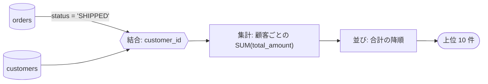

# SQL 文だけの移行（`--kind sql`）

PL/SQL と違い、SQL 文の変換には仕様書の骨組みを作るスクリプトが無い。段階は同じで、書くものはあなたが
`sql-transpile` の出力と原文から起こす。`flow.py` が見るのは、**未記入が無いこと、Mermaid の図が入っていること、
変換できなかった文の扱いが記録されていること**である。

## 段階 1: 現行の仕様（`<out>/spec/README.md`）

文ごとに節を立てる（`## 文 3: 月次の売上集計`）。

| 書くこと | 中身 |
|---|---|
| 目的 | この文が業務で何を出す・何を変えるのか。分からなければ「確かめたいこと」へ |
| 入力と出力 | 読む表と条件、結合、絞り込み、集計、並び、出す列。書き込みなら、どの行の何をどう変えるか |
| 方言に頼っている所 | `ROWNUM`、`(+)`、`CONNECT BY`、`NVL`、日付の引き算、空文字列 = NULL、暗黙の型変換、照合順序 |
| 確かめたいこと | 行数の見込み、実行の頻度、並びが業務上意味を持つか、NULL が来うるか |

図は、データの流れを `flowchart LR` で描く（表 → 絞り込み → 結合 → 集計 → 並び → 結果）。表どうしの関係が
要るなら `erDiagram`。全体で 1 つ、表と文の対応（どの文がどの表を読み書きするか）も描く。

## 段階 2: 変換と判断（`<out>/converted/`）

`sql-transpile` の手順に従い、`--out-dir <out>/converted`（ScalarDB なら `--plan-dir <out>/converted/plans` も）で
回す。人の判断が要るのは:

- **ERROR の文**: 書き直す / アプリ側へ移す / 対象から外す
- **WARN の文**: 意味の差（整数除算、照合順序、タイムゾーン、`ROWNUM` と `ORDER BY`）を受け入れるか
- ScalarDB なら、キー設計（`--keys`）、バックエンド、クロスパーティション走査を使うか、実行計画に回す文を受け入れるか

どれも「判断を求めるときの形」で問い、答えを `<record.yaml>` に残す（形は plsql-migrate の記録と同じ:
`items: {SQL-3: {状態: 決定, 決定: …, 決めた人: …, 日付: …}}`。未決は `状態: 未決`）。項目 ID の数字は、レポートの
文の番号（`results[].index`）である。**ERROR の文の 1 つずつに `SQL-<番号>` の項目が無いと、`decisions` は承認に
出せない**（記録のファイルを `init --record` に渡してあるだけでは通らない）。未決のまま進めるなら `状態: 未決` で
項目を置き、`approve --with-open` に理由を書く。

## 段階 3: 変換後の仕様（`<out>/docs/README.md`）

文ごとに、**変換前と変換後を並べ、何がどう変わったか**を書く。区分は PL/SQL と同じ 3 つ:
**意味が変わる / 形が変わる（結果は同じ）/ そのまま**。

| 文 | 区分 | 変わること | 根拠（レポートの issue） |
|---|---|---|---|
| 3 | 意味が変わる | `ROWNUM <= 10` を `LIMIT 10` にした。`ORDER BY` より前に効いていた絞り込みが、後に効く | `ROWNUM` |

図は、実行のされ方が変わる文について、変換前後を左右に並べる（ScalarDB の実行計画に回った文は、
「ScalarDB から取得 → H2 で元の SQL」の 2 段になる）。全体で 1 つ、区分ごとの文の数も出す。

## テスト

`difftest/transpile_verify.py`（スキルの判定が実際の DB での動作と合うか）と、移行元・移行先の両方で文を流して
結果を比べる `difftest/run.py` がある。どちらもコンテナが要る。手順は README の「検証基盤」にある。
