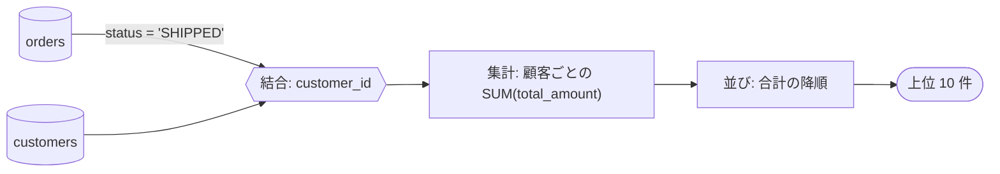
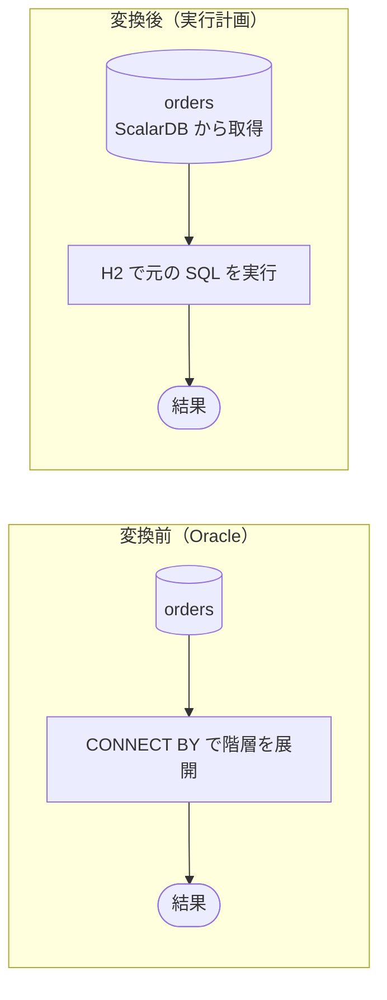

# SQL 文だけの移行（`--kind sql`）

PL/SQL を含まない SQL 文を移行するとき、SKILL.md の Step 1〜4 の PL/SQL のコマンドの代わりに読む。段階と承認の
取り方は PL/SQL と同じだが、SQL には仕様書と変換後の文書の骨組みを作るスクリプトが無い。書くものは、原文と
sql-transpile の出力からあなたが起こす。`flow.py` がそれぞれの段階で確かめることは `references/approval.md` の
「`flow.py` が承認の前に確かめること」にある。SQL で確かめるのは、未記入の印（`（未記入`）が無いこと、Mermaid の図が
入っていること、変換できなかった文（ERROR）のそれぞれに扱いの項目が記録にあること、までである。

## 始める

```bash
.venv/bin/python skills/migrate-flow/scripts/flow.py init --out <out> --kind sql --src <入力.sql> --source-dialect <方言> --target-dialect scalardb --record <record.yaml>
```

- `--src` は SQL のファイル。原文も `spec` の指紋に入るので、承認のあとで原文を変えると `spec` の承認は古くなる
- `--record` は、ERROR の文があれば必要になる。まだ無いファイルでも、作る予定の場所を渡しておく
- `--source-dialect` / `--target-dialect` は `flow.yaml` に控えるだけで、`flow.py` の検査には使われない。変換のときは
  `transpile.py` に `--source` / `--target` で同じ方言を渡す
- `--scalardb-schema` と `--limits` は SQL の検査には使わない（`--limits` を渡すと `decisions` の指紋に入る）
- sql-transpile を単独で先に流してあるなら、その出力のディレクトリ（`*.report.json` のある所）を
  `flow.py adopt --out <out> --converted <dir>` で `<out>/converted` に取り込む

## 段階 1: 現行の仕様（`<out>/spec/`）

`<out>/spec/` の直下に Markdown を置く（入口は `README.md`）。文ごとに節を立てる（`## 文 3: 月次の売上集計`）。
文の番号は、変換の報告の文の番号（段階 2）と合わせる。

| 書くこと | 中身 |
|---|---|
| 目的 | この文が業務で何を出す・何を変えるのか。分からなければ「確かめたいこと」へ |
| 入力と出力 | 読む表と条件、結合、絞り込み、集計、並び、出す列。書き込みなら、どの行の何をどう変えるか |
| 方言に頼っている所 | `ROWNUM`、`(+)`、`CONNECT BY`、`NVL`、日付の引き算、空文字列 = NULL、暗黙の型変換、照合順序 |
| 確かめたいこと | 行数の見込み、実行の頻度、並びが業務上意味を持つか、NULL が来うるか |

まだ書けない所には `（未記入）` と書いておくと、埋め忘れを `flow.py` が見つける（`（未記入` を含む行があると承認に
出せない）。

図は、文ごとのデータの流れを `flowchart LR` で描く（表 → 絞り込み → 結合 → 集計 → 並び → 結果）。表どうしの関係が
要るなら `erDiagram`。全体で 1 つ、表と文の対応（どの文がどの表を読み書きするか）も描く。`flow.py` が求めるのは
図が 1 つ以上あることだけだが、承認する人が文の動きを追えるのは図のほうである。


```mermaid
flowchart LR
  o[("orders")] -->|"status = 'SHIPPED'"| j{{"結合: customer_id"}}
  c[("customers")] --> j
  j --> g["集計: 顧客ごとの SUM(total_amount)"] --> s["並び: 合計の降順"] --> r(["上位 10 件"])
```

## 段階 2: 変換と判断（`<out>/converted/`）

sql-transpile の手順（Step 1〜4）に従い、出力先を `<out>/converted` にする。ScalarDB が Target なら実行計画も同じ下に置く:

```bash
.venv/bin/python skills/sql-transpile/scripts/transpile.py <入力.sql> --source <方言> --target scalardb --out-dir <out>/converted --plan-dir <out>/converted/plans
```

`flow.py` が読むのは `<out>/converted/` の直下の `*.report.json` である（`<stem>.report.json`。`results[]` に文ごとの
`index` と `status` がある）。変換し直すと報告が変わるので、`decisions` の承認は古くなる。

人の判断が要るのは:

- **ERROR の文**: 書き直す / アプリ側へ移す / 対象から外す。`flow.py` が扱いの項目を求めるのはこれだけである
- **WARN の文**: 意味の差（整数除算、照合順序、タイムゾーン、`ROWNUM` と `ORDER BY`）を受け入れるか
- **ScalarDB が Target のとき**: キー設計（`--keys`）、バックエンド（Cassandra なら `--storage cassandra`。クロス
  パーティション走査を使わない前提で判定する）、実行計画に回った文（`status` が `PLANNED`。ScalarDB から取得して
  H2 で元の SQL を実行する）を受け入れるか

どれも SKILL.md の「判断を求めるときの形」で問い、答えを記録（`--record` のファイル）に残す。形は plsql-migrate の
記録と同じである:

```yaml
items:
  SQL-3:
    状態: 決定
    決定: アプリ側へ移す（階層の展開を Java で行う）
    決めた人: 移行責任者
    日付: 2026-09-20
  SQL-7:
    状態: 未決
```

- 項目 ID の数字は、報告の文の番号（`results[].index`）である
- **ERROR の文の 1 つずつに `SQL-<番号>` の項目が無いと、`decisions` は承認に出せない**。記録のファイルを
  `init --record` に渡してあるだけでは通らない
- `状態: 決定` の項目には `決めた人` と `日付` が要る
- 未決のまま進めるなら `状態: 未決` で項目を置き、`approve decisions --with-open` に理由を書く
- WARN と PLANNED の文の判断は `flow.py` の検査に入らない。記録に項目を置けば、未決かどうかは数えられる

## 段階 3: 変換後の仕様（`<out>/docs/`）

`<out>/docs/` の直下に Markdown を置く（入口は `README.md`）。文ごとに、**変換前と変換後を並べ、何がどう変わったか**を
書く。区分は PL/SQL の文書と同じ 3 つ: **意味が変わる / 形が変わる（結果は同じ）/ そのまま**。

| 文 | 区分 | 変わること | 根拠（報告の issue） |
|---|---|---|---|
| 3 | 意味が変わる | `ROWNUM <= 10` を `LIMIT 10` にした。`ORDER BY` より前に効いていた絞り込みが、後に効く | WARN `ROWNUM` |

現行の仕様（段階 1）のどの記述がどう変わるかを対にして書く。未記入の印と図の決まりは段階 1 と同じである。

図は、実行のされ方が変わる文について、変換前後を左右に並べる（実行計画に回った文は、「ScalarDB から取得 → H2 で
元の SQL」の 2 段になる）。全体で 1 つ、区分ごとの文の数も出す。


```mermaid
flowchart LR
  subgraph before["変換前（Oracle）"]
    b1[("orders")] --> b2["CONNECT BY で階層を展開"] --> b3(["結果"])
  end
  subgraph after["変換後（実行計画）"]
    a1[("orders<br/>ScalarDB から取得")] --> a2["H2 で元の SQL を実行"] --> a3(["結果"])
  end
```

## テスト

SQL 文の移行には、`flow.py` の側に比較の道具は無い。`gate` が開いてから、移行元と移行先の両方で同じデータに対して
文を流し、結果を比べる。書き込む文や表の用意があるなら、どのデータベースのどの namespace / ユーザーに書くかを、
始める前に利用者に確かめる。比べ方と結果をファイルにまとめ、記録する:

```bash
.venv/bin/python skills/migrate-flow/scripts/flow.py tested --out <out> --result <pass|fail> --report <結果のファイル>
```

SQL では、`--report` のファイルは `flow.yaml` の `test.報告` に控えるだけで、文書の検査には使われない（PL/SQL と違い、
`inputs.evidence` には入らない）。比較の結果を文書に書き足したら、`converted` の承認は古くなるので取り直す。

## sql-migration のリポジトリで作業するとき

チェックアウトした sql-migration のリポジトリには、コンテナを使う検証の道具が 2 つある（プラグインとして入れたときは
使わない）。手順はリポジトリの `docs/guide/verification.md` にある。

- `difftest/transpile_verify.py`: sql-transpile の判定（OK / WARN / ERROR）が、実際のデータベースでの動作と合うかを見る
- `difftest/run.py`: 表定義とデータを含む入力を、移行元のデータベースと ScalarDB の両方で流し、結果を比べる
