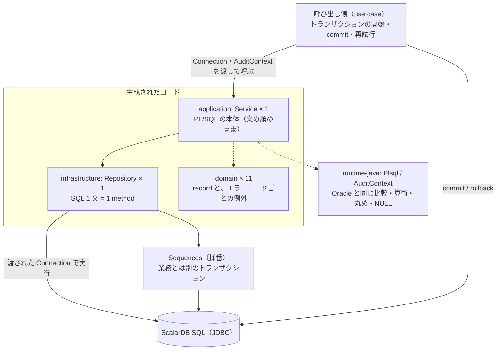
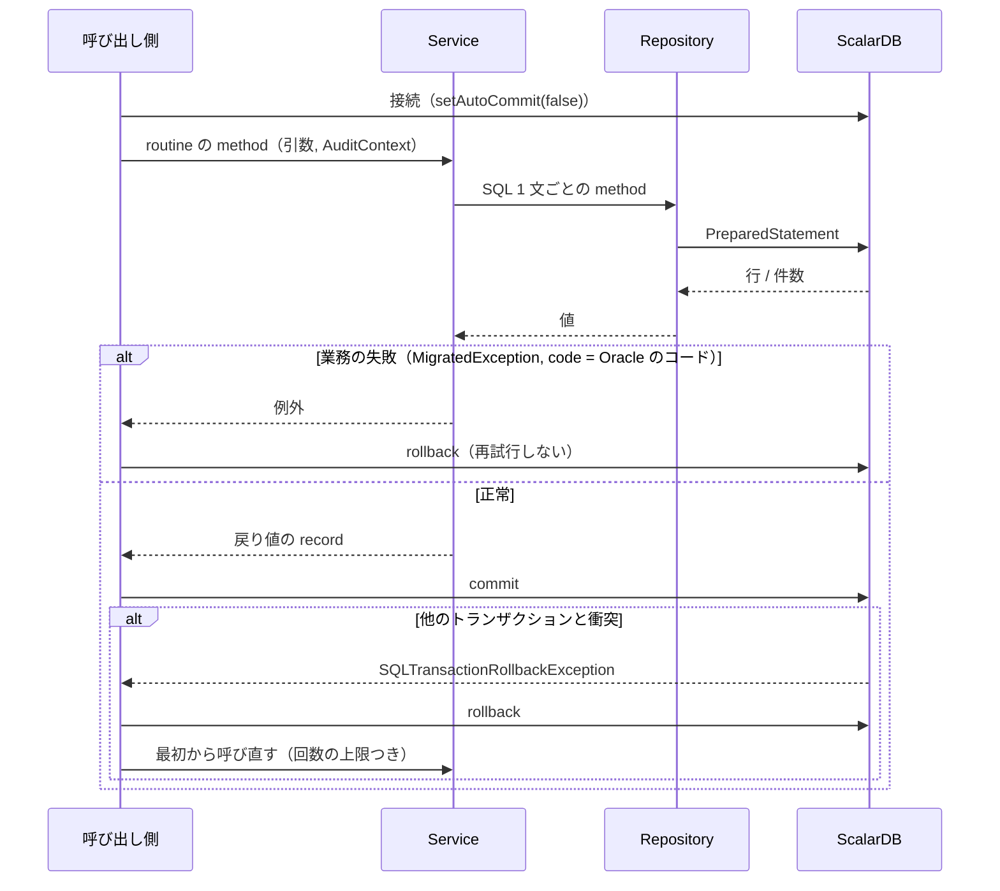

# 変換後のコード

## アーキテクチャ

<!-- facts:begin architecture -->
**事実**（生成物から機械的に出した。手で書き換えない）

全体の形



層

| 層 | ファイル数 | 役割 |
|---|---|---|
| `application` | 1 | routine の本体（Service）と、分割した routine の部品、trigger の照合。トランザクションは開始も commit もしない |
| `infrastructure` | 1 | SQL（Repository）。渡された `Connection` の上で実行する |
| `domain` | 11 | 行と戻り値の record、エラーコードごとの例外 |

module と class

| 元の module | Service | Repository | 文書 |
|---|---|---|---|
| `create_order`（procedure） | `CreateOrderService` | `CreateOrderRepository` | [create_order.md](create_order.md) |

constructor（呼び出し側が渡すもの）

| class | 引数 |
|---|---|
| `CreateOrderService` | `CreateOrderRepository repository` |
| `CreateOrderRepository` | `Connection connection, Sequences sequences` |

使っている実行時ライブラリ（`runtime-java`）

- `com.scalar.migrate.plsql.AuditContext`
- `com.scalar.migrate.plsql.Plsql`
- `com.scalar.migrate.plsql.Sequences`
- `com.scalar.migrate.runtime.Residual`
<!-- facts:end architecture -->

PL/SQL の 1 module が、Service（手続きの本体）と Repository（SQL）の 1 組になる。依存は
`application` → `infrastructure` → JDBC の一方向で、`domain` はどこからも参照されるだけである。

- **Service は PL/SQL の本体を文の順のまま写したもの**である（`CreateOrderService.java`）。各文の上に原文の位置
  （`// create_order.prc:16`）が残っているので、原文と 1 行ずつ読み合わせられる。比較・算術・丸めは Java の演算子
  ではなく `Plsql`（`Plsql.le`、`Plsql.mul`、`Plsql.round`、`Plsql.fit`）を通る。NULL を含む比較が真にも偽にも
  ならないこと、`NUMBER(18,2)` への代入が丸めと桁あふれの検査を伴うことを、Oracle と同じにするためである
- **Repository は SQL 1 文 = 1 method**（`CreateOrderRepository.java`）。ScalarDB SQL の JDBC 接続の上で
  `PreparedStatement` を実行する。値は `Plsql.bind` を通して渡す——ここで `''` を NULL に直し、金額を列の桁に丸める
- **トランザクションの境界は生成コードの外にある。** Service も Repository も開始・commit・rollback をしない。
  `Connection` は呼び出し側が作って渡し、1 回の業務処理をどこで確定するかも呼び出し側が決める。PL/SQL の
  `create_order` も自分では COMMIT していなかったので、ここは元と同じである
- **採番は `Sequences` の口を通る。** ScalarDB に順序オブジェクトは無い。どのトランザクションで番号を取るかは
  実装が決める（既定の `CountersSequences` は、業務とは別の接続で取る）
- **例外は Oracle のエラーコードを持ち運ぶ。** `MigratedException.code()` が -20001 などを返す。呼び出し側が
  コードで分岐していたなら、そのまま分岐できる
- OUT 引数は戻り値の record（`CreateOrderResult`）になる。例外で抜けたら record は返らないので、Oracle と同じく
  「失敗したら OUT の値は見えない」

## 使い方

<!-- facts:begin usage -->
**事実**（生成物から機械的に出した。手で書き換えない）

入口（public な routine の method）

| 元の routine | Java | 戻り値 | 引数 |
|---|---|---|---|
| `create_order` | `CreateOrderService.createOrder` | `CreateOrderResult` | `Long pCustomerId, Long pProductId, BigDecimal pQuantity, AuditContext audit` |

- 採番（`Sequences` に登録が要る sequence）: `order_seq`
- `AuditContext`（誰が・いつ）を受け取る Service: `CreateOrderService`
- トランザクション: 生成コードは開始も commit もしない。`Connection` は呼び出し側が `setAutoCommit(false)` で渡す

1 回の呼び出し


<!-- facts:end usage -->

呼び出し側が用意するものは 3 つある。

| 用意するもの | 中身 |
|---|---|
| `Connection` | ScalarDB SQL の JDBC 接続（`jdbc:scalardb:<properties のパス>`）。`setAutoCommit(false)` にする |
| `Sequences` | `order_seq` を引ける採番。既定の実装は `CountersSequences`（counters 表。移行元が `NOCACHE` なので 1 個ずつ = block 1） |
| `AuditContext` | 「誰が・いつ」。`products.updated_at`（元は `SYSTIMESTAMP`）には、ここで渡した時刻が入る |

```java
Sequences sequences = new CountersSequences(
    () -> DriverManager.getConnection(url),      // 採番専用。呼ばれるたびに新しい接続を返す
    "counters", Map.of("order_seq", 1));

try (Connection connection = DriverManager.getConnection(url)) {
  connection.setAutoCommit(false);
  var service = new CreateOrderService(new CreateOrderRepository(connection, sequences));
  try {
    CreateOrderResult result = service.createOrder(
        customerId, productId, quantity, AuditContext.of(userName, OffsetDateTime.now()));
    connection.commit();                         // 衝突はここで分かる
    return result.pOrderId();
  } catch (MigratedException e) {                // -20001 / -20002 / -20003: 業務の失敗。再試行しても変わらない
    connection.rollback();
    throw e;
  } catch (SQLTransactionRollbackException e) {  // 他の受注と衝突した。rollback して、最初からやり直す
    connection.rollback();
    throw e;
  }
}
```

- **衝突の再試行は呼び出し側の仕事である。** やり直すときは `createOrder` を最初から呼び直す（在庫を読み直すため）。
  回数の上限と間隔は呼び出し側で決める（「生成コードの外で決めること」の CALL-5）
- エラーコードは `e.code()` で見る。`CreateOrderError20001Exception` などの class も生成されるが、Service が投げるのは
  `MigratedException` そのものなので、**subclass を `catch` しても掛からない**
- 依存: `runtime-java`（`com.scalar.migrate.plsql` と `com.scalar.migrate.runtime`）、ScalarDB SQL JDBC 3.19.1

## 制限

<!-- facts:begin limits -->
**事実**（生成物・決定・比較から機械的に出した。手で書き換えない）

- 判定: REDESIGN 1
- 変換できなかった文 0 / ScalarDB が受け付けない SQL 0 / 実行計画に回した文 0

AUTO でない routine

| routine | 判定 | 理由 |
|---|---|---|
| `create_order` | REDESIGN | LOCK-001: 行ロックです。ターゲットで同じ保証を別の方法で与える設計が要ります |

受け入れた差（実 DB の比較で Oracle と違い、理由つきで受け入れたもの）

| routine | シナリオ | 差 | 理由 | 決めた日 |
|---|---|---|---|---|
| `create_order` | `create_order_duplicate_id` | exception code: expected=-20004 actual=java.sql.SQLTransactionRollbackException (Transaction conflict (FAILED… | 移行先は重複 INSERT をその文では弾かず、commit 時の衝突（DB-CORE-20013）として返すので、DUP_VAL_ON_INDEX の handler（-20004）は走らない（EXC-001）。受注番号は採番で取るので、採番が一意であるかぎり実運用では起きない。どちらも何も書かない。-20004 を再現するには INSERT の前に存在を読む必要があり、受注のたびに読みが 1 回増えるので採らない。呼び出し側はこの衝突を無条件に再試行しないこと（同じ番号なら解消しない） | 2026-09-20 |

- 実 DB で比べていない routine: なし

生成コードが自分で上げる例外（Oracle では DB が上げていたもの）

| コード | class | Oracle |
|---|---|---|
| -6502 | `ValueErrorException` | VALUE_ERROR |
| -1476 | `ZeroDivideException` | ZERO_DIVIDE |
| -1422 | `TooManyRowsException` | TOO_MANY_ROWS |
| 100 | `NoDataFoundException` | NO_DATA_FOUND |
<!-- facts:end limits -->

- **`create_order` の判定は REDESIGN（LOCK-001）で、AUTO にはならない。** `FOR UPDATE` の行ロックは移行先に無く、
  楽観制御に置き換えた。同じ商品への同時の受注は、待たされる代わりに、片方が commit で弾かれる。呼び出し側に
  再試行が無いと、Oracle では通っていた受注が失敗として返る
- **受け入れた差が 1 つある**（シナリオ `create_order_duplicate_id`）。同じ受注番号を 2 度 INSERT すると、Oracle は
  -20004 を返すが、移行先は commit 時の衝突（`SQLTransactionRollbackException`、DB-CORE-20013）を返す。どちらも
  何も書かない。受注番号は採番で取るので、採番が一意であるかぎり起きない。**この衝突を無条件に再試行しては
  ならない**（同じ番号なら解消しない）——同時実行の衝突と例外の型が同じなので、再試行には回数の上限が要る
- **比較が観ていないこと。** 実 DB の比較は 1 回の呼び出しを順に流すだけである。同時に 2 つの受注が走ったときの
  振る舞い（上の 1 点目）は、7 本のシナリオのどれも観ていない
- **時刻は突き合わせていない。** `products.updated_at` は呼び出し側が渡す時刻、`orders.order_date` はアプリの
  プロセスの時計（`Plsql.sysdate()`）で、どちらも DB サーバの時計ではない。アプリのサーバが複数あり時計がずれて
  いれば、受注日の前後が入れ替わりうる
- 金額の列は ScalarDB では DOUBLE である。書くときに列の桁（小数第 2 位）に丸めているが、読み戻した値の表記は
  `300` ではなく `300.0` になる（シナリオ `create_order_exact_stock` の「桁の表記だけが違う」）
- 表の定義は、原文と一緒に渡されたものではなく、手続きから推し量ったものである。実物の DDL が来たら、解析から
  やり直す

## どのように移行したか

<!-- facts:begin how -->
**事実**（解析・決定から機械的に出した。手で書き換えない）

routine ごとの決定（`limits.yaml`）

| 決定 | 対象 | 値・理由 |
|---|---|---|
| `rowLocks.optimistic` | `create_order` | 在庫は同じトランザクションの中で読んだ値から計算して書く。同時の受注は commit で衝突として弾かれるので、 呼び出し側は衝突だけを再試行する（-20002 在庫不足は再試行しても変わらない） |

当たった判定ルール

| ルール | 判定 | routine 数 |
|---|---|---|
| `EXC-001` | REVIEW | 1 |
| `LOCK-001` | REDESIGN | 1 |
| `SEM-007` | REVIEW | 1 |
| `SEM-010` | REVIEW | 1 |

文ごとの診断（書き換えの種類）

| 診断 | 文の数 |
|---|---|
| `ACCESS` | 2 |
| `LOCK` | 1 |
| `OPTIMISTIC` | 1 |
| `RMW_SPLIT` | 1 |
| `ROW_LOCK` | 1 |

何がどう変わったか（全体）

| 区分 | 変わること | 診断 | routine |
|---|---|---|---|
| **意味が変わる** | FOR UPDATE などのロック句を外した | `LOCK` | `create_order` |
| **意味が変わる** | 楽観制御へ移した。同時の書き込みは commit で弾かれ、呼び出し側の再試行が要る | `OPTIMISTIC` | `create_order` |
| **意味が変わる** | 行ロック（待たせる・即座に断る）が無くなる | `ROW_LOCK` | `create_order` |
| 形が変わる（結果は同じ） | SET col = col ± x を、読んでからアプリで計算して書く 2 文に割った | `RMW_SPLIT` | `create_order` |

- 実 DB の比較（double）: シナリオ 7 本。受け入れた差 1 / 一致（桁の表記だけが違う） 1 / 一致 5
<!-- facts:end how -->

1. **解析**（`plsql.cli`）。`create_order.prc` を IR にし、`%TYPE` を `schema.sql` で解いた（7 個すべて解決）。
   DDL は受け取っていなかったので、手続きの使い方から起こした
2. **判定**。ルールが 4 つ当たった: `LOCK-001`（行ロック → REDESIGN）、`EXC-001`（`DUP_VAL_ON_INDEX` の handler が
   移行先では走らない）、`SEM-010`（`SYSTIMESTAMP` を列に書く）、`SEM-007`（時計を 2 回読む）
3. **決定**（`limits.yaml` の `rowLocks.optimistic`）。行ロックを落として楽観制御へ移すと利用者が決めた。
   根拠は、在庫を「同じトランザクションの中で読んだ値から計算して書く」形に割れること——読んでから書くまでに
   他の受注が割り込めば、commit で衝突になる
4. **生成**（`plsql.generate`）。変換できなかった文は 0。書き換えは 2 つ: `FOR UPDATE` を外した GET と、
   `SET stock_quantity = stock_quantity - :p_quantity` を「読む → アプリで引く → 書く」の 2 文に割ったもの
   （ScalarDB SQL は列を読む式を SET に書けない）。このとき生成器の不具合が 1 つ見つかり、直した
   （`v := seq.NEXTVAL` が SQL の外にあるとコンパイルできなかった）
5. **実 DB での比較**（Oracle 23ai と ScalarDB 3.19.1）。7 本のシナリオを両側で流し、6 本が一致、1 本
   （`create_order_duplicate_id`）が例外の種類の差で、利用者が 2026-09-20 に受け入れた。-20004 を再現するには
   INSERT の前に存在を読む必要があり、受注のたびに読みが 1 回増えるので採らなかった

確かめていないのは、同時実行と、アプリ側の時計の扱いである（「制限」）。
