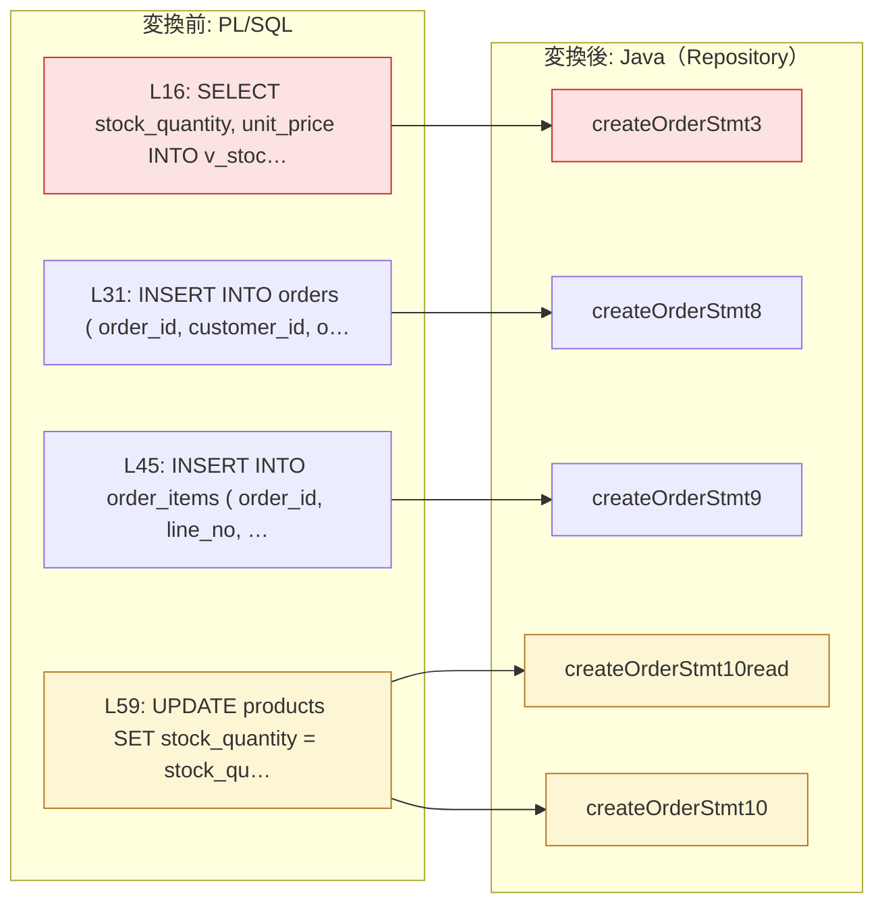

# `create_order`（procedure）の変換

## `create_order`

<!-- facts:begin create_order -->
**事実**（生成物・解析・決定・比較から機械的に出した。手で書き換えない。原文: `create_order.prc:1`〜`69`）

- 判定: **REDESIGN** — LOCK-001: 行ロックです。ターゲットで同じ保証を別の方法で与える設計が要ります
- Java: `src/main/java/com/example/migrated/application/CreateOrderService.java` の `CreateOrderResult createOrder(Long pCustomerId, Long pProductId, BigDecimal pQuantity, AuditContext audit)`

**何がどう変わったか**

| 原文 | 区分 | 変わること | 診断 |
|---|---|---|---|
| `create_order.prc:16` | **意味が変わる** | 行ロック（待たせる・即座に断る）が無くなる | `ROW_LOCK` |
| `create_order.prc:16` | **意味が変わる** | 楽観制御へ移した。同時の書き込みは commit で弾かれ、呼び出し側の再試行が要る | `OPTIMISTIC` |
| `create_order.prc:16` | **意味が変わる** | FOR UPDATE などのロック句を外した | `LOCK` |
| `create_order.prc:59` | 形が変わる（結果は同じ） | SET col = col ± x を、読んでからアプリで計算して書く 2 文に割った | `RMW_SPLIT` |

文の対応（赤 = 意味が変わる、黄 = 形が変わるが結果は同じ、灰 = 未分類、無色 = そのまま）

引数の対応

| PL/SQL | 方向 | Oracle の型 | Java |
|---|---|---|---|
| `p_customer_id` | IN | `NUMBER(10)` | 引数 |
| `p_product_id` | IN | `NUMBER(10)` | 引数 |
| `p_quantity` | IN | `NUMBER` | 引数 |
| `p_order_id` | OUT | `NUMBER(12)` | 戻り値の record に入る |

例外

| コード | class | Oracle | メッセージ |
|---|---|---|---|
| -20004 | `CreateOrderError20004Exception` | RAISE_APPLICATION_ERROR(-20004) | `'受注番号が重複しました'` |
| -20003 | `CreateOrderError20003Exception` | RAISE_APPLICATION_ERROR(-20003) | `'商品が見つかりません'` |
| -20002 | `CreateOrderError20002Exception` | RAISE_APPLICATION_ERROR(-20002) | `'在庫が不足しています'` |
| -20001 | `CreateOrderError20001Exception` | RAISE_APPLICATION_ERROR(-20001) | `'数量は1以上で指定してください'` |
| -1 | `DuplicateValueException` | DUP_VAL_ON_INDEX | `a unique constraint was violated` |
| 100 | `NoDataFoundException` | NO_DATA_FOUND | `SELECT INTO matched no row` |

文の対応（原文の文 → Repository の method → 移行先の SQL）

| 原文 | 文 | Java | 移行先の SQL | 診断 |
|---|---|---|---|---|
| `create_order.prc:16` | SELECT `SELECT stock_quantity, unit_price INTO v_stock_quantity, v_unit_price…` | `CreateOrderRepository.createOrderStmt3` | `SELECT stock_quantity, unit_price FROM products WHERE product_id = :p_product_id` | WARN `ROW_LOCK`: FOR UPDATE is row locking; the target has to provide the same guarantee another way WARN `OPTIMISTIC`: 行ロックを落として楽観制御へ移すと決めてある（在庫は同じトランザクションの中で読んだ値から計算して書く。同時の受注は commit で衝突として弾かれるので、 呼び出し側は衝突だけを再試行する（-20002 在庫不足は… WARN `LOCK`: FOR UPDATE / locking clause dropped (ScalarDB transactions handle isolation) INFO `ACCESS`: SELECT: full primary key specified -> GET (single record) |
| `create_order.prc:31` | INSERT `INSERT INTO orders ( order_id, customer_id, order_date, status, total…` | `CreateOrderRepository.createOrderStmt8` | `INSERT INTO orders (order_id, customer_id, order_date, status, total_amount) VALUES (:p_o…` | — |
| `create_order.prc:45` | INSERT `INSERT INTO order_items ( order_id, line_no, product_id, quantity, un…` | `CreateOrderRepository.createOrderStmt9` | `INSERT INTO order_items (order_id, line_no, product_id, quantity, unit_price) VALUES (:p_…` | — |
| `create_order.prc:59` | UPDATE `UPDATE products SET stock_quantity = stock_quantity - p_quantity, upd…` | `CreateOrderRepository.createOrderStmt10read` `CreateOrderRepository.createOrderStmt10` | `UPDATE products SET stock_quantity = :expr4, updated_at = :expr5 WHERE product_id = :p_pr…` | INFO `RMW_SPLIT`: products.stock_quantity を読んでから書く 2 文に割った。ScalarDB SQL は列を読む式を受け付けないので、値はアプリで計算する。**同じトランザクションの中で読んで書く**ので、衝突は… INFO `ACCESS`: UPDATE: full primary key specified -> GET (single record) |

当たった判定ルール

| ルール | 判定 | 意味 |
|---|---|---|
| `SEM-010` | REVIEW | SYSTIMESTAMP を列へ書いています。書かれた時刻の値は Oracle と突き合わせられません（移行元の時計を固定できないため。同じ行のほかの列は比較されます） |
| `SEM-007` | REVIEW | 1 つの routine が時計を 2 回以上読みます。2 回の読みは違う値を返しうるので、比較では区別できません |
| `EXC-001` | REVIEW | 移行先では自然には起こらない例外の handler があります。Oracle では DB 自身の誤りでも走っていた処理が、移行先では走りません |
| `LOCK-001` | REDESIGN | 行ロックです。ターゲットで同じ保証を別の方法で与える設計が要ります |

この routine の決定（`limits.yaml`）

| 決定 | 値・理由 |
|---|---|
| `rowLocks.optimistic` | 在庫は同じトランザクションの中で読んだ値から計算して書く。同時の受注は commit で衝突として弾かれるので、 呼び出し側は衝突だけを再試行する（-20002 在庫不足は再試行しても変わらない） |

実 DB の比較

| 規約 | シナリオ | 結果 | 受け入れた差の理由 |
|---|---|---|---|
| double | `create_order_duplicate_id` | 受け入れた差 | 移行先は重複 INSERT をその文では弾かず、commit 時の衝突（DB-CORE-20013）として返すので、DUP_VAL_ON_INDEX の handler（-20004）は走らない（EXC-001）。受注番号は採番で取るので、採番が一意であるかぎり実運用では起きない。どちらも何も書かない。-20004 を再現するには INSERT の前に存在を読む必要があり、受注のたびに読みが 1 回増えるので採らない。呼び出し側はこの衝突を無条件に再試行しないこと（同じ番号なら解消しない） |
| double | `create_order_exact_stock` | 一致（桁の表記だけが違う） | — |
| double | `create_order_fractional_quantity` | 一致 | — |
| double | `create_order_no_product` | 一致 | — |
| double | `create_order_ok` | 一致 | — |
| double | `create_order_short_stock` | 一致 | — |
| double | `create_order_zero_quantity` | 一致 | — |
<!-- facts:end create_order -->

### 仕様

`CreateOrderService.createOrder(pCustomerId, pProductId, pQuantity, audit)` は、受注を 1 件（1 商品・1 明細）作り、
その商品の在庫を引く。動作の順序と業務ルールは元の PL/SQL と同じである
（[現行の仕様](../../../plsql-spec/examples/create_order/create_order.md)）。Java から見て違うのは次のとおり。

- 受注番号は OUT 引数ではなく、戻り値 `CreateOrderResult.pOrderId()` で返る
- 失敗は `MigratedException` で、`code()` が Oracle のコードを返す: -20001（数量が 0 以下）、-20002（在庫数 < 数量）、
  -20003（商品が無い）。-20004 は下の「制限と注意」を見ること
- `audit` は元の PL/SQL に無い引数である。`audit.now()` が `products.updated_at` に入る
- 書く表: `orders`（1 行）、`order_items`（1 行、行番号 1）、`products`（在庫数と `updated_at`）。確定は呼び出し側の commit

### 移行で変わったこと

- **行ロックが楽観制御になった**（`rowLocks.optimistic`）。元は商品の行を `FOR UPDATE` で押さえ、同じ商品への
  次の受注を待たせていた。移行後は誰も待たず、在庫を読んで（`createOrderStmt3`）、もう一度読んで引いた値を書く
  （`createOrderStmt10read` → `createOrderStmt10`）。そのあいだに他の受注が同じ商品を書いていれば、commit が
  衝突で失敗する。在庫が負にならないという保証は保たれるが、保ち方が「待たせる」から「弾く」に変わった
- **在庫の減算をアプリで計算する。** `SET stock_quantity = stock_quantity - p_quantity` は、読んだ値から引いた数を
  そのまま書く形になった。読みと書きが同じトランザクションの中にあるので、結果は変わらない
- **現在時刻の出所が DB からアプリに移った。** `order_date` はアプリの時計、`updated_at` は呼び出し側が渡す時刻
- **例外で抜けたときの書き込みの始末は、元と同じく呼び出し側にある。** ただし Oracle には「誰も受けなければ
  その呼び出しの変更だけを取り消す」文単位のロールバックがあったが、移行先には無い。呼び出し側が rollback
  しなければ、途中までの書き込みが次の commit で確定する

### 制限と注意

- `LOCK-001`: 同時の受注は commit で `SQLTransactionRollbackException` になる。呼び出し側は rollback して、
  `createOrder` を最初から呼び直す。-20002（在庫不足）は再試行しても変わらないので、再試行の対象にしない
- `EXC-001`: `DUP_VAL_ON_INDEX` の handler は移行先では走らない。受注番号の重複は -20004 ではなく commit 時の衝突に
  なる（受け入れた差、シナリオ `create_order_duplicate_id`）。上の同時実行の衝突と例外の型が同じで区別できないので、
  再試行には回数の上限を置く
- `SEM-010` / `SEM-007`: `updated_at` と `order_date` の値は Oracle と突き合わせていない（元の時計を固定できない）。
  2 つの時刻は別々に読むので、同じ瞬間ではない。元の PL/SQL も `SYSDATE` と `SYSTIMESTAMP` を別々に読んでいた
- 数量に小数を渡すと、元と同じく通る（シナリオ `create_order_fractional_quantity` で一致）。意図どおりかは、
  現行の仕様の「確かめたいこと」に挙げてある
