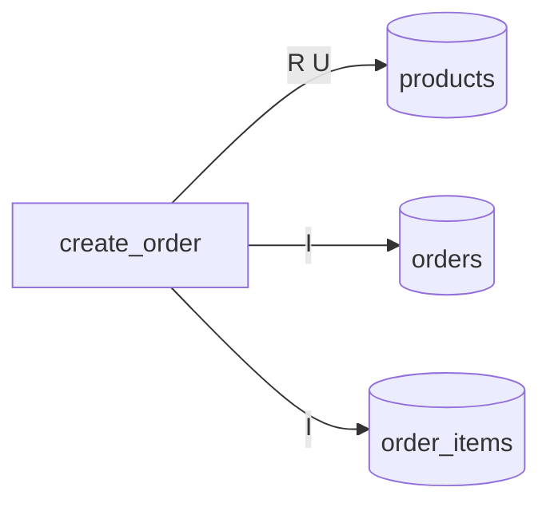

# PL/SQL の仕様

<!-- facts:begin index -->
**事実**（IR から機械的に出した。手で書き換えない）

module

| module | 種類 | routine 数 | 仕様 |
|---|---|---|---|
| `create_order` | procedure | 1 | [create_order.md](create_order.md) |

module と表（実線 = 書く、点線 = 読むだけ。R = 読む / I・U・D・M = 書く）

表と routine（R = 読む / I・U・D・M = 書く）

| 表 | routine |
|---|---|
| `order_items` | `create_order` I |
| `orders` | `create_order` I |
| `products` | `create_order` R U |

エラーコード

| コード | routine | 位置 | メッセージ（式） |
|---|---|---|---|
| -20001 | `create_order` | `create_order.prc:12` | `'数量は1以上で指定してください'` |
| -20002 | `create_order` | `create_order.prc:25` | `'在庫が不足しています'` |
| -20003 | `create_order` | `create_order.prc:66` | `'商品が見つかりません'` |
| -20004 | `create_order` | `create_order.prc:68` | `'受注番号が重複しました'` |
<!-- facts:end index -->

## 全体の概要

受注を 1 件登録する手続きが 1 本だけある。顧客・商品・数量を受け取り、在庫を確かめて受注と明細を作り、
在庫を減らす（[create_order.md](create_order.md)）。ほかの routine も trigger も、この範囲には無い。

原文は `fixtures/plsql-external/create_order/src/create_order.prc`。表の定義（`schema.sql`）は原文と一緒に
渡されたものではなく、手続きから推し量って起こしたものである。列の型と制約に頼る記述は、そのつもりで読む。
