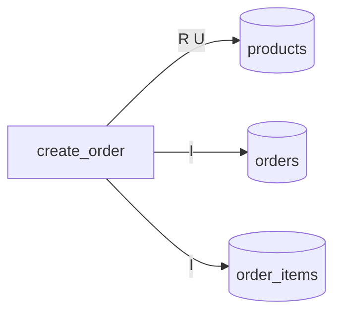
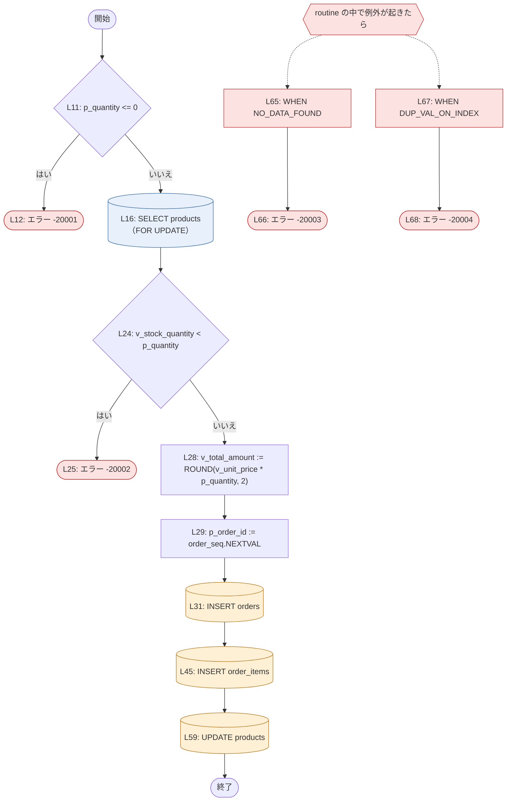

# `create_order`（procedure）

<!-- facts:begin module:create_order -->
**事実**（IR から機械的に出した。手で書き換えない）

- 種類: procedure / 原文: `create_order.prc`

routine と表（実線 = 書く、点線 = 読むだけ。R = 読む / I・U・D・M = 書く）

routine: `create_order`
<!-- facts:end module:create_order -->

## 概要

受注登録の入口。1 回の呼び出しで 1 商品・1 明細の受注を作り、その商品の在庫を引き当てる。
COMMIT も ROLLBACK もしないので、確定するかどうかは呼び出し側が決める。

## `create_order`

<!-- facts:begin create_order -->
**事実**（IR から機械的に出した。手で書き換えない。原文: `create_order.prc:1`〜`69`）

- 種類: procedure（public）

処理の流れ（`L` は原文の行。青 = 読む、橙 = 書く、赤 = エラー、紫 = トランザクション制御）

引数

| 名前 | 方向 | 型 | 既定値 |
|---|---|---|---|
| `p_customer_id` | IN | `customers.customer_id%TYPE（= NUMBER(10)）` | — |
| `p_product_id` | IN | `products.product_id%TYPE（= NUMBER(10)）` | — |
| `p_quantity` | IN | `NUMBER` | — |
| `p_order_id` | OUT | `orders.order_id%TYPE（= NUMBER(12)）` | — |

表（R = 読む / I・U・D・M = 書く）

| 表 | 操作 |
|---|---|
| `order_items` | I |
| `orders` | I |
| `products` | R U |

SQL

| 位置 | 種類 | 読む | 書く | 条件 | 文 |
|---|---|---|---|---|---|
| `create_order.prc:16` | SELECT（FOR UPDATE） | products | — | — | `SELECT stock_quantity, unit_price INTO v_stock_quantity, v_unit_price FROM products WHERE product_id = p_prod…` |
| `create_order.prc:31` | INSERT | — | orders | — | `INSERT INTO orders ( order_id, customer_id, order_date, status, total_amount ) VALUES ( p_order_id, p_custome…` |
| `create_order.prc:45` | INSERT | — | order_items | — | `INSERT INTO order_items ( order_id, line_no, product_id, quantity, unit_price ) VALUES ( p_order_id, 1, p_pro…` |
| `create_order.prc:59` | UPDATE | — | products | — | `UPDATE products SET stock_quantity = stock_quantity - p_quantity, updated_at = SYSTIMESTAMP WHERE product_id …` |

上げるエラー

| 位置 | コード・例外 | メッセージ（式） | 条件 |
|---|---|---|---|
| `create_order.prc:12` | -20001 | `'数量は1以上で指定してください'` | IF p_quantity <= 0 |
| `create_order.prc:25` | -20002 | `'在庫が不足しています'` | IF v_stock_quantity < p_quantity |
| `create_order.prc:66` | -20003 | `'商品が見つかりません'` | WHEN NO_DATA_FOUND |
| `create_order.prc:68` | -20004 | `'受注番号が重複しました'` | WHEN DUP_VAL_ON_INDEX |

例外ハンドラ

| 位置 | 受ける例外 | 場所 |
|---|---|---|
| `create_order.prc:65` | NO_DATA_FOUND | routine の末尾 |
| `create_order.prc:67` | DUP_VAL_ON_INDEX | routine の末尾 |

引数と表の中身だけでは決まらないもの（採番・現在時刻・実行者）

| 位置 | 使うもの |
|---|---|
| `create_order.prc:29` | `ORDER_SEQ.NEXTVAL` |
| `create_order.prc:31` | `SYSDATE` |
| `create_order.prc:59` | `SYSTIMESTAMP` |
<!-- facts:end create_order -->

### 動作

1. 数量が 0 以下なら、何も読まずに -20001 で断る（`create_order.prc:11`）。
2. 商品の在庫数と単価を `products` から読み、その行をロックする（`FOR UPDATE`、`create_order.prc:16`）。
   ロックはトランザクションが終わるまで続くので、同じ商品への受注は、先の受注が確定するか取り消されるまで
   ここで待つ。待ち時間の上限は無い（`NOWAIT` / `WAIT n` が付いていない）。
3. 在庫数が数量より少なければ -20002 で断る（`create_order.prc:24`）。在庫数と数量が等しいときは通る。
4. 金額を「単価 × 数量」を小数第 2 位に丸めて求める（`create_order.prc:28`）。
5. 受注番号を順序 `order_seq` から取り、OUT 引数 `p_order_id` に入れる（`create_order.prc:29`）。
6. `orders` に 1 行足す。受注日は呼び出し時点の `SYSDATE`、状態は `'RECEIVED'`、金額は 4. の値
   （`create_order.prc:31`）。
7. `order_items` に明細を 1 行足す。行番号は常に 1、単価は 2. で読んだ値（`create_order.prc:45`）。
8. `products` の在庫数から数量を引き、`updated_at` を `SYSTIMESTAMP` にする（`create_order.prc:59`）。

### 業務ルール

- 数量は 1 以上（`create_order.prc:11`）。上限の検査は無い。
- 在庫は負にしない: 在庫数 ≥ 数量のときだけ受ける（`create_order.prc:24`）。検査と減算のあいだに他の受注が
  割り込まないことは、2. の行ロックが保証している。
- 金額 = ROUND(単価 × 数量, 2)。単価は受注時点の `products.unit_price` で、明細にも同じ値を控える
  （`create_order.prc:28`、`create_order.prc:45`）。あとで商品の単価が変わっても、受注の金額は変わらない。
- 1 回の呼び出しで作る明細は 1 行だけ（行番号 1 固定、`create_order.prc:45`）。複数商品の受注は作れない。
- 受注の初期状態は `'RECEIVED'`（`create_order.prc:31`）。
- 顧客 `p_customer_id` が実在するかは、この手続きでは確かめていない。`orders` の外部キーがあれば INSERT が
  失敗するが、その例外を受けるハンドラは無い（`create_order.prc:64`）。

### エラーと例外

| コード | いつ | そのときの書き込み |
|---|---|---|
| -20001 | 数量が 0 以下（`create_order.prc:12`） | 何も書いていない。ロックも取っていない |
| -20002 | 在庫数 < 数量（`create_order.prc:25`） | 何も書いていない。`products` の行ロックは取ったあと |
| -20003 | 商品が無い（`SELECT INTO` の `NO_DATA_FOUND` を受けて言い換える、`create_order.prc:66`） | 何も書いていない |
| -20004 | 一意制約の違反（`DUP_VAL_ON_INDEX`）を受けて「受注番号が重複しました」と言い換える（`create_order.prc:68`） | 違反した INSERT は入らない。それより前の INSERT は下のとおり |

- どのエラーでも、この手続きは自分では ROLLBACK しない（`create_order.prc:64`）。途中までの書き込み
  （-20004 が `order_items` の INSERT で起きたときの `orders` の行）がどうなるかは、呼び出し方で変わる:
  - PL/SQL の呼び出し元が例外を受けて続けるなら、書き込みは残る。取り消すのは呼び出し元の仕事である
  - 例外が誰にも受けられずクライアントまで出たなら、Oracle がその呼び出しの変更を取り消す（文単位の
    ロールバック）。トランザクションそのものは開いたままで、それより前の作業は残る
- `p_order_id` は OUT 引数なので、エラーで抜けたとき、呼び出し側の変数には値が戻らない
  （5. のあとで失敗しても、取った受注番号は呼び出し側に見えない。順序の番号は 1 つ飛ぶ）。
- 上の 4 つ以外の例外（外部キー違反、数値の桁あふれ、ロック待ちの中断など）は、そのまま呼び出し側に出る。

### 確かめたいこと

- -20004 のメッセージは「受注番号が重複しました」だが、ハンドラは `DUP_VAL_ON_INDEX` をすべて受ける
  （`create_order.prc:67`）。`order_items` の主キーの重複でも同じメッセージになる。意図どおりか。
- 顧客の存在を確かめていない（`create_order.prc:31`）。外部キーに任せているのか、呼び出し側が確かめているのか。
- `p_quantity` は桁数の無い `NUMBER` で、小数も受ける（`create_order.prc:4`）。1.5 個の受注は通ってよいか。
- 表の定義は推し量ったものである（README）。`total_amount` の桁、外部キーの有無は、実物の DDL で確かめる。
